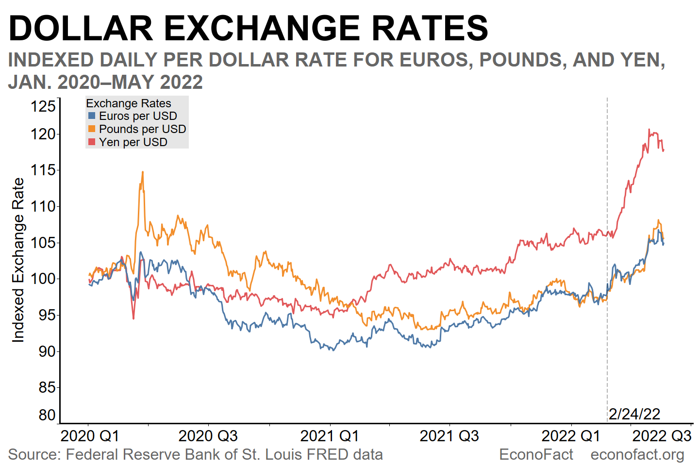

## Table of Contents

## What is the dollar exchange rate?

The dollar exchange rate is how much one U.S. dollar is worth in another country's currency. It changes every day because of many things like how well the economy is doing, what people think will happen in the future, and what the government does. You can find the current exchange rate on websites, in banks, or on financial news.

For example, if you want to know how many Euros you get for one U.S. dollar, you might see that 1 USD equals about 0.85 EUR. This means if you have 100 dollars, you would get around 85 Euros. The rate can go up or down, so it's a good idea to check it before you travel or do any money exchanges.

## How is the dollar exchange rate determined?

The dollar exchange rate is determined by supply and demand in the foreign exchange market. When more people want to buy U.S. dollars, the value of the dollar goes up compared to other currencies. This can happen if the U.S. economy is doing well, or if people think it will do well in the future. On the other hand, if more people want to sell U.S. dollars, the value goes down. This can happen if the U.S. economy is not doing well, or if there are problems like high inflation.

Governments and central banks also play a big role in setting the exchange rate. They can change interest rates or buy and sell large amounts of currency to make their own currency stronger or weaker. For example, if the U.S. Federal Reserve raises interest rates, it can make the U.S. dollar more attractive to investors, which can increase its value. Also, things like political stability, trade policies, and global events can affect how people see the U.S. dollar and change its exchange rate.

## Why does the dollar exchange rate fluctuate?

The dollar exchange rate goes up and down because of how much people want to buy or sell U.S. dollars. When more people want to buy dollars, its value goes up. This can happen if the U.S. economy is doing well or if people think it will do well soon. On the other hand, if more people want to sell dollars, its value goes down. This might happen if the U.S. economy is not doing well or if there are problems like high inflation.

Governments and central banks also affect the dollar's value. They can change interest rates or buy and sell lots of currency to make their own currency stronger or weaker. For example, if the U.S. Federal Reserve raises interest rates, it can make the U.S. dollar more attractive to investors, which can increase its value. Other things like political stability, trade policies, and big events around the world can also change how people see the U.S. dollar and make its exchange rate go up or down.

## What are the most common factors affecting the dollar exchange rate?

The dollar exchange rate changes because of how much people want to buy or sell U.S. dollars. When more people want to buy dollars, its value goes up. This can happen if the U.S. economy is doing well or if people think it will do well soon. On the other hand, if more people want to sell dollars, its value goes down. This might happen if the U.S. economy is not doing well or if there are problems like high inflation.

Governments and central banks also play a big role in changing the dollar's value. They can adjust interest rates or buy and sell large amounts of currency to make their own currency stronger or weaker. For example, if the U.S. Federal Reserve raises interest rates, it can make the U.S. dollar more attractive to investors, which can increase its value. 

Other things like political stability, trade policies, and big events around the world can also affect the dollar exchange rate. If there is political unrest or if trade policies change, it can make people feel differently about the U.S. dollar and cause its value to go up or down.

## How can I check the current dollar exchange rate?

You can check the current dollar exchange rate on many websites that focus on money and finance. Websites like XE.com, Google, and Yahoo Finance show you the latest rates for the U.S. dollar against other currencies. You can also use apps on your phone, like the XE Currency app or the Currency Converter app, to see the rates anytime you need them.

Another way to check the dollar exchange rate is by going to a bank or a money exchange service. Banks usually have the current exchange rates listed on their websites or in their branches. Money exchange services at airports or tourist areas also show the rates they are using. These places can be helpful if you need to exchange money and want to know the rate before you do it.

You can also watch financial news channels or read financial news websites. Channels like CNBC or Bloomberg often talk about currency rates and how they are changing. News websites like Reuters or The Wall Street Journal also have up-to-date information on exchange rates. This can be useful if you want to understand why the rates are changing as well as what the current rates are.

## What is the difference between nominal and real exchange rates?

The nominal exchange rate is the rate at which you can exchange one currency for another at the current moment. It's the number you see when you check how many Euros you get for one U.S. dollar, for example. This rate changes every day because of supply and demand in the market. If you're traveling and need to change your money, the nominal exchange rate is what you'll use.

The real exchange rate, on the other hand, takes into account the price levels of goods and services in different countries. It adjusts the nominal rate to show how much you can actually buy with the money after considering inflation and other economic factors. If the price of things in the U.S. goes up a lot compared to another country, the real exchange rate will show that your dollars don't buy as much in that other country, even if the nominal rate stays the same. This helps economists understand the true value of money across borders.

## How does the dollar exchange rate impact international trade?

The dollar exchange rate can make a big difference in international trade. When the U.S. dollar is strong, it means that goods from the U.S. cost more for people in other countries to buy. This can make it harder for U.S. companies to sell their products abroad because they become more expensive. On the other hand, a strong dollar makes it cheaper for people in the U.S. to buy things from other countries. This can be good for U.S. consumers but might hurt U.S. businesses that make things at home.

When the dollar is weak, it's the opposite. U.S. goods become cheaper for people in other countries, which can help U.S. companies sell more abroad. But a weak dollar makes it more expensive for people in the U.S. to buy things from other countries. This can be tough on U.S. consumers but good for U.S. businesses that export goods. So, the exchange rate can affect how much countries trade with each other and can influence the economy in big ways.

## What are the effects of a strong vs. a weak dollar on the economy?

When the dollar is strong, it means that one U.S. dollar can buy more of another country's currency. This makes things from the U.S. more expensive for people in other countries. So, it can be harder for U.S. companies to sell their products abroad because they cost more. But, a strong dollar is good for people in the U.S. who want to buy things from other countries because those things become cheaper. This can help keep prices down in the U.S. and make people feel richer because their money goes further when they travel or buy imports.

On the other hand, when the dollar is weak, it means that one U.S. dollar can buy less of another country's currency. This makes U.S. goods cheaper for people in other countries, which can help U.S. companies sell more abroad. But, a weak dollar makes things from other countries more expensive for people in the U.S. This can make prices go up at home and make people feel poorer because their money doesn't go as far when they buy imports or travel. So, a weak dollar can help U.S. businesses that export goods but can hurt U.S. consumers and businesses that rely on imports.

## How do central banks influence the dollar exchange rate?

Central banks, like the U.S. Federal Reserve, can change the dollar exchange rate by adjusting interest rates. When they raise interest rates, it makes the U.S. dollar more attractive to investors because they can earn more money from U.S. investments. This can cause the value of the dollar to go up because more people want to buy it. On the other hand, if the central bank lowers interest rates, the U.S. dollar becomes less attractive, and its value can go down because fewer people want to buy it.

Central banks can also directly buy or sell dollars in the foreign exchange market to influence its value. If they want to make the dollar stronger, they can sell other currencies and buy dollars, which increases the demand for the dollar and raises its value. If they want to weaken the dollar, they can sell dollars and buy other currencies, which increases the supply of dollars and lowers its value. These actions help central banks manage the economy by making exports cheaper or more expensive and affecting inflation.

## What are currency pairs and how do they relate to the dollar exchange rate?

Currency pairs are how we show the value of one currency compared to another. When you see a currency pair like USD/EUR, it means you're looking at how many Euros you can get for one U.S. dollar. The first currency in the pair, the USD, is called the base currency, and the second, the EUR, is the quote currency. So if the USD/EUR rate is 0.85, it means 1 U.S. dollar can be exchanged for 0.85 Euros.

These currency pairs are important for understanding the dollar exchange rate because they show how the dollar's value changes against other currencies. If the USD/EUR rate goes up, it means the dollar is getting stronger compared to the Euro. If it goes down, the dollar is getting weaker. By watching different currency pairs, like USD/JPY for the dollar against the Japanese Yen, or USD/GBP for the dollar against the British Pound, you can see how the dollar is doing in the global market and make decisions about buying or selling dollars.

## How can businesses hedge against fluctuations in the dollar exchange rate?

Businesses can protect themselves from changes in the dollar exchange rate by using something called hedging. One way they can do this is by using forward contracts. A forward contract lets a business agree on a price today to buy or sell dollars at a future date. This means they know exactly how much they will pay or get, even if the exchange rate changes later. For example, if a U.S. company knows it will need to pay for goods in Euros in six months, it can use a forward contract to lock in the current exchange rate and avoid surprises if the dollar gets weaker.

Another way businesses can hedge is by using options. Options give a business the right, but not the obligation, to buy or sell dollars at a certain rate in the future. This can be useful because it lets the business take advantage of a good exchange rate if it happens, but also protects them if the rate goes the wrong way. For example, if a business thinks the dollar might get stronger but wants to be safe, it can buy an option to sell dollars at today's rate. If the dollar does get stronger, they don't have to use the option, but if it gets weaker, they can use it to sell at the better rate they locked in.

## What advanced tools and models are used to predict future movements in the dollar exchange rate?

To predict future movements in the dollar exchange rate, people use advanced tools and models. One of these is called technical analysis. This involves looking at past price movements and patterns on charts to guess where the exchange rate might go next. Traders use things like moving averages, which show the average price over time, and other indicators to help them make decisions. Another tool is [fundamental analysis](/wiki/fundamental-analysis), which looks at economic data like interest rates, inflation, and employment numbers to understand what might happen to the dollar's value. By studying these factors, experts can make predictions about whether the dollar will get stronger or weaker.

Another important model is the purchasing power parity (PPP) model. This model tries to predict exchange rates by comparing the price levels of goods in different countries. If things are cheaper in one country, the currency of that country might be undervalued, and the model suggests it will get stronger over time. There are also more complex models like the [interest rate](/wiki/interest-rate-trading-strategies) parity (IRP) model, which looks at the differences in interest rates between countries to predict exchange rate movements. These models and tools help businesses and investors make better guesses about where the dollar exchange rate might be headed, but they are not perfect and can't predict the future with certainty.

## What is the relationship between dollar value and exchange rates?

The dollar rate is fundamentally the comparison of a currency's exchange value to the U.S. dollar, often serving as a benchmark for gauging the relative strength of global currencies. Exchange rates are dynamic and influenced by a multitude of factors, including supply and demand dynamics, international investor activities, and government policies.

Supply and demand for a currency are crucial determinants of exchange rates. When a currency is in high demand, its value increases relative to other currencies. Conversely, if there is an oversupply, its value decreases. This relationship is dictated by the economic principle of scarcity, where the limited availability of a currency relative to its demand enhances its value.

International investors play a significant role in currency fluctuations. Large-scale cross-border investments or divestments can lead to significant shifts in the exchange rate. For instance, if foreign investors buy significant quantities of U.S. dollars to purchase U.S. assets, the demand for dollars increases, potentially increasing its value.

Government policies, particularly monetary policies enacted by central banks, can have profound impacts on the exchange rate. Central banks may adjust the supply of their currency in the market through various mechanisms, such as open market operations or changing interest rates. For example, by increasing interest rates, a central bank can attract foreign capital, thereby increasing demand for its currency and potentially enhancing its exchange rate. Conversely, lowering interest rates may lead to a depreciation of the currency due to reduced investor interest.

A formula often used to express the exchange rate can be denoted as:

$$
E = \frac{D}{S}
$$

where $E$ represents the exchange rate, $D$ is the demand for the currency, and $S$ is the supply of the currency.

The interplay of these factors makes exchange rate prediction a complex task, often requiring sophisticated models and tools in financial practices such as [algorithmic trading](/wiki/algorithmic-trading). Understanding these dynamics is essential for policymakers and traders alike in managing economic stability and optimizing trading strategies.

## References & Further Reading

[1]: Bergstra, J., Bardenet, R., Bengio, Y., & Kégl, B. (2011). ["Algorithms for Hyper-Parameter Optimization."](https://dl.acm.org/doi/10.5555/2986459.2986743) Advances in Neural Information Processing Systems 24.

[2]: ["Advances in Financial Machine Learning"](https://www.amazon.com/Advances-Financial-Machine-Learning-Marcos/dp/1119482089) by Marcos Lopez de Prado

[3]: ["Evidence-Based Technical Analysis: Applying the Scientific Method and Statistical Inference to Trading Signals"](https://www.amazon.com/Evidence-Based-Technical-Analysis-Scientific-Statistical/dp/0470008741) by David Aronson

[4]: ["Machine Learning for Algorithmic Trading"](https://github.com/stefan-jansen/machine-learning-for-trading) by Stefan Jansen

[5]: ["Quantitative Trading: How to Build Your Own Algorithmic Trading Business"](https://www.amazon.com/Quantitative-Trading-Build-Algorithmic-Business/dp/1119800064) by Ernest P. Chan