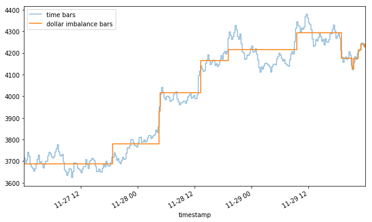

Algorithmic trading has undergone substantial transformation over recent years, marked by the rapid development of new techniques aimed at enhancing trading efficiency. These innovations have led to significant improvements in how market data is analyzed and utilized for strategic decision-making. Among these advancements, Dollar Imbalance Bars (DIBs) have gained prominence as a potent tool in financial analysis and trading strategies. DIBs represent a sophisticated approach to data sampling, differing considerably from traditional methods like time, tick, and volume bars. This article will explore the concept of DIBs, their application in algorithmic trading, and provide a comparison with other bar types. This discussion will shed light on the unique advantages of DIBs and their potential applications within trading algorithms. By the conclusion of this article, readers will gain a comprehensive understanding of DIBs and their relevance in enhancing trading strategies, particularly in scenarios that require timely and information-rich market insights.

## Table of Contents



## Understanding Dollar Imbalance Bars

Dollar Imbalance Bars (DIBs) are an innovative approach in the domain of algorithmic trading, focusing on the flow of information characterized by market activity rather than fixed time intervals. Traditional bars, such as time-based bars, often sample data at regular time intervals. This method can lead to oversampling when market activity is low and undersampling during periods of high market fluctuations, potentially resulting in key market signals being missed. DIBs address these limitations by dynamically adjusting the sampling rate based on market activity, hence offering a more insightful view into market dynamics.

The fundamental principle of DIBs is the measurement of imbalances in trading volumes expressed in terms of dollar value. By focusing on the dollar value rather than the sheer number of trades or contracts, DIBs provide a deeper understanding of the market’s capital flow. This is particularly valuable because it allows traders to identify significant market movements and changes in sentiment that might not be apparent when relying solely on time-interval data sampling.

In constructing a DIB, the process accumulates and analyzes the signed dollar flow. This flow is determined by both the direction of the trades (whether they are buying or selling) and their corresponding volumes expressed in dollars. Thus, DIBs are more sensitive to trades of larger monetary value, which may suggest the actions of larger, potentially informed market participants. 

A mathematical representation of this can be expressed as the cumulative sum of signed values, where each trade contributes to the bar depending on its dollar impact:

$$
\text{DIB Value} = \sum_{i=1}^{n} (\text{Volume}_i \times \text{Price}_i \times \text{Direction}_i)
$$

Here:
- $\text{Volume}_i$ is the volume of the trade,
- $\text{Price}_i$ is the price at which the trade was executed, and
- $\text{Direction}_i$ is either +1 or -1 depending on whether the trade was a buy or a sell.

By observing these accumulated imbalances, the system triggers the sampling of a new bar when the total exceeds a certain predefined threshold, which signifies a significant change or imbalance in trading activity. This threshold is not static; it adapts over time and is typically determined based on the exponential moving average (EMA) of previous imbalances. This adaptive nature allows DIBs to remain responsive to current market conditions, maintaining their relevancy across varying market environments.

Consequently, DIBs contribute significantly to the trader’s ability to capture crucial market signals that may forecast future price movements. By structuring data in terms of economically meaningful imbalances, traders gain an enhanced capability to respond to and anticipate shifts in market conditions effectively, rendering DIBs an invaluable resource for advancing [algorithmic trading](/wiki/algorithmic-trading) strategies.

## The Mechanics of Dollar Imbalance Bars

Dollar Imbalance Bars (DIBs) are designed to capture market data based on the significance of dollar volumes being exchanged, offering a deeper understanding of market behavior. Unlike traditional time-based or tick-based sampling methods, DIBs focus on the movement of dollar values, which allows for a more nuanced analysis of market activity.

The mechanism of DIBs involves accumulating signed flows, where the sign indicates the direction of the trade (e.g., buyer-initiated or seller-initiated), and the magnitude reflects the trade [volume](/wiki/volume-trading-strategy) in dollar terms. This process helps in determining when to sample market data. When these accumulated flows surpass a predefined imbalance threshold, a new bar is generated. Mathematically, this can be represented as:

$$
\text{Imbalance} = \sum_{i=1}^{N} (\text{sign}_i \times \text{volume}_i \times \text{price}_i)
$$

where $\text{sign}_i$ represents the trade direction, $\text{volume}_i$ is the volume of the trade, and $\text{price}_i$ is the price at which the trade was executed.

The imbalance threshold is dynamic and adjusts based on market conditions. This is achieved through the use of an exponential moving average (EMA) of past imbalances, which ensures that the threshold remains sensitive to recent market changes. The EMA can be calculated as:

$$
\text{EMA} = \alpha \times \text{Current Imbalance} + (1 - \alpha) \times \text{Previous EMA}
$$

where $\alpha$ is the smoothing factor that determines the weight of the current imbalance in the overall calculation.

Implementing DIBs in a trading context requires careful calibration of several hyperparameters. Key parameters include the expected number of ticks per bar and the imbalance per tick, both of which need to be tailored to specific market conditions. These parameters help in defining the trade-offs between sensitivity to market movements and the granularity of the data sampled.

Fine-tuning these parameters is essential for optimizing the performance of DIBs. This involves [backtesting](/wiki/backtesting) with historical data to ensure that the chosen settings align well with the intended trading strategies, allowing for accurate reflection of market dynamics and improved decision-making capabilities. By focusing on significant dollar exchanges, DIBs provide a robust framework for analyzing market trends and participant behavior.

## Comparing DIBs with Other Bar Types

In algorithmic trading, data sampling methods play a crucial role in accurately capturing market dynamics and developing robust trading strategies. Different bar types, such as time, tick, and volume bars, each have distinct characteristics, impacting the representation of market information.

**Time Bars** are the most traditional form of data sampling, where data is aggregated at regular intervals, such as every minute or hour. While this approach provides consistent time-series data, it can be inefficient during periods of varying market activity. In low-activity periods, time bars may produce excess data without significant movements, whereas, in high-activity periods, they risk missing essential market changes due to undersampling.

**Tick Bars** address some of these issues by focusing on a fixed number of trades rather than time intervals. A tick in this context represents a single completed trade. While this ensures that each bar reflects the same amount of trading activity, tick bars can overlook the financial significance of trades since they do not consider trade size or value. For instance, a series of small trades can produce the same number of tick bars as fewer, larger trades, even though their market impact may differ.

**Volume Bars** attempt to capture market activity more effectively by batching data based on the total number of shares or contracts traded. This method improves upon time and tick bars by accounting for trading volume, thereby providing a more balanced view of market activity. However, volume bars still do not fully consider price changes, meaning they can sometimes miss the nuances of market volatility and the associated financial implications.

**Dollar Imbalance Bars (DIBs)** present a more nuanced approach by incorporating the dollar value of trades to detect market significance. Unlike the previously mentioned bars, DIBs adjust their frequency based on the financial weight of transactions. This method samples market data when notable dollar volumes are traded, capturing critical moments of market activity that are often linked to significant price movements or informed trading. By focusing on imbalances in dollar terms, DIBs offer a comprehensive view that aligns better with market significance, enhancing the detection of meaningful trends and potential shifts in market conditions. 

In conclusion, while traditional methods like time, tick, and volume bars each have their applications, Dollar Imbalance Bars provide a sophisticated alternative by integrating trade value, thus facilitating a deeper analysis of significant market events and enhancing algorithmic trading strategies.

## Implementing DIBs in Algorithmic Trading

Implementing Dollar Imbalance Bars (DIBs) within algorithmic trading systems requires meticulous attention to backtesting and parameter optimization. The process begins with utilizing historical trading data to adjust the parameters of DIBs, ensuring they are aligned with the dynamic nature of financial markets. Historical data provides the foundation for backtesting, allowing traders to simulate and assess the performance of DIB-based strategies under various market conditions.

Python emerges as a popular tool for developing DIBs due to its extensive libraries like Pandas, which facilitate efficient data manipulation and statistical analysis. Pandas, in particular, offers functionalities to handle large datasets and perform complex operations needed for constructing DIBs. For instance, users can leverage Pandas to group trading data into bars based on dollar imbalance criteria, which can be defined through custom functions that track cumulative volume imbalances and trigger a new bar when certain thresholds are met.

```python
import pandas as pd

def generate_dib(data, imbalance_threshold):
    data['dollar_flow'] = data['price'] * data['volume']
    data['cumulative_imbalance'] = (data['buy_sell_flag'] * data['dollar_flow']).cumsum()

    bars = []
    last_imbalance = 0
    for index, row in data.iterrows():
        imbalance = row['cumulative_imbalance'] - last_imbalance
        if abs(imbalance) >= imbalance_threshold:
            bars.append(row)
            last_imbalance = row['cumulative_imbalance']

    return pd.DataFrame(bars)

# Example usage
# trade_data = pd.read_csv('historical_trades.csv')
# debit_bars = generate_dib(trade_data, imbalance_threshold=10000)
```

In addition to Python, platforms like BitMex provide valuable access to real-time and historical trade data via their APIs, which is essential for retrieving trade [books](/wiki/algo-trading-books) necessary to build DIBs. These trade books include details about individual trades such as timestamp, price, and volume, enabling the construction of bars that reflect true market activity.

Integrating DIBs into trading strategies offers strategic advantages by enhancing decision-making processes. They provide a detailed view of market conditions by concentrating on periods of elevated trading volume denominated in dollar terms, thus enabling traders to capture significant market shifts. By focusing on these periods, DIBs can minimize noise and improve the fidelity of trading signals, potentially increasing the profitability of trades. This makes them an attractive choice for traders seeking to capitalize on informed trading or sizeable market events through precise and data-driven strategies.

## Advantages of Using Dollar Imbalance Bars

Dollar Imbalance Bars (DIBs) offer several advantages over traditional bar types by emphasizing the importance of dollar-weighted market movements. These bars prioritize significant financial transactions, enabling traders to gain insights into market dynamics that may not be apparent using conventional methods.

Firstly, DIBs capture market trends by focusing on the dollar value of trades rather than just the quantity or timing of trades. This method highlights instances of informed trading, where substantial shifts in market sentiment occur due to large financial transactions. By concentrating on these movements, DIBs can reveal upcoming shifts in the market that time-based or volume-based bars might overlook.

Moreover, DIBs help traders achieve a more nuanced understanding of market conditions by dynamically adjusting to reflect periods of elevated trading activity. During times of high [volatility](/wiki/volatility-trading-strategies) or significant price actions, DIBs adapt by increasing the frequency of data sampling, thus providing a more detailed and timely representation of market behavior. This ability to adjust ensures that traders are better equipped to respond to market events as they unfold.

In terms of technical advantages, DIBs serve as an effective tool for reducing market noise, which is a common challenge with traditional methods. The noise reduction is achieved by filtering out irrelevant or low-impact trades that do not contribute to meaningful market insights. As a result, signal detection in trading algorithms becomes more accurate, potentially leading to improved decision-making and more profitable trades. The following Python snippet demonstrates a simplified approach to implementing DIBs:

```python
import pandas as pd
import numpy as np

def calculate_dib(trades, imbalance_threshold):
    trades['dollar_volume'] = trades['price'] * trades['volume']
    trades['signed_flow'] = np.where(trades['side'] == 'buy', trades['dollar_volume'], -trades['dollar_volume'])

    trades['cumulative_flow'] = trades['signed_flow'].cumsum()
    observed_bars = trades[trades['cumulative_flow'].abs() >= imbalance_threshold]

    return observed_bars

# Example data
trade_data = pd.DataFrame({
    'price': [100, 102, 101, 99],
    'volume': [50, 70, 60, 40],
    'side': ['buy', 'sell', 'buy', 'sell']
})

# Calculate DIBs
dib_bars = calculate_dib(trade_data, imbalance_threshold=5000)
```

In conclusion, DIBs furnish traders with vital tools for capitalizing on market shifts that are signified by dollar-weighted transactions, improving both trend detection and noise reduction in trading strategies. These attributes make DIBs an invaluable resource for traders seeking to optimize their algorithmic trading models.

## Conclusion

Dollar Imbalance Bars (DIBs) represent a significant advancement in algorithmic trading by providing a nuanced and detailed view of market dynamics. Unlike traditional bar types, DIBs incorporate the dollar value of trades, enabling traders to better align their strategies with real-time market conditions. This method of sampling proves particularly beneficial during periods of significant market movements, where timing and precision play critical roles in decision-making processes.

The adaptability of DIBs to various market conditions enhances their utility in trading strategies. By focusing on dollar movements, DIBs can reveal insights into informed trading activities and potentially predict significant market events that conventional bar types might miss. This increased sensitivity to market signals can lead to improved signal detection, reduced noise, and potentially more profitable trading outcomes.

As algorithmic trading evolves, the incorporation of innovative techniques like DIBs becomes increasingly necessary to maintain a competitive edge. For financial analysts and algorithm developers, further exploration of DIBs can lead to new strategies that leverage their information-rich nature. This exploration may unearth enhanced methods for identifying and capitalizing on market trends, underscoring the valuable role of DIBs in crafting robust algorithmic trading models.

## References & Further Reading

[1]: ["Advances in Financial Machine Learning"](https://www.amazon.com/Advances-Financial-Machine-Learning-Marcos/dp/1119482089) by Marcos Lopez de Prado

[2]: Almgren, R., & Chriss, N. (2000). ["Optimal execution of portfolio transactions."](https://smallake.kr/wp-content/uploads/2016/03/optliq.pdf) Journal of Risk, 3(2), 5-39.

[3]: Dacorogna, M. M., Gençay, R., Müller, U. A., Pictet, O. V., & Olsen, R. B. (2001). ["An Introduction to High-Frequency Finance."](https://www.sciencedirect.com/science/article/abs/pii/S1059056003000467) Academic Press.

[4]: ["Machine Learning for Algorithmic Trading"](https://github.com/stefan-jansen/machine-learning-for-trading) by Stefan Jansen

[5]: Cont, R. (2001). ["Empirical properties of asset returns: stylized facts and statistical issues."](https://www.tandfonline.com/doi/abs/10.1080/713665670) Quantitative Finance, 1(2), 223-236.