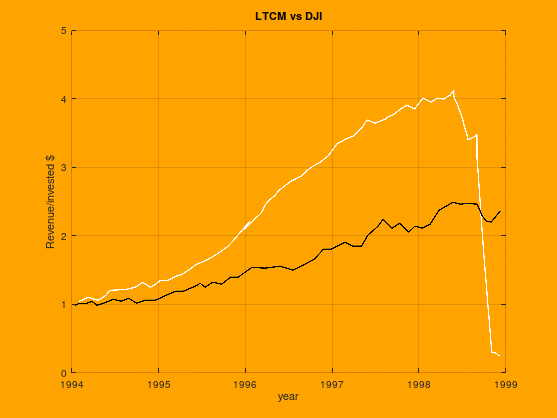

## Table of Contents

## What is a dollar-neutral portfolio?

A dollar-neutral portfolio is a type of investment strategy where the total value of the long positions (the stocks you buy) equals the total value of the short positions (the stocks you sell). This means that if you spend $100 to buy stocks, you also sell $100 worth of other stocks. The goal is to make the portfolio's performance independent of the overall market movements, focusing instead on the relative performance between the stocks you buy and those you sell.

This strategy is often used by hedge funds and other professional investors to reduce market risk. By balancing the dollar amounts of long and short positions, investors aim to profit from the difference in performance between the two sets of stocks, rather than from the general direction of the market. For example, if the stocks you bought go up more than the stocks you sold go down, you could make a profit even if the market as a whole doesn't move much.

## How does a dollar-neutral portfolio differ from other investment strategies?

A dollar-neutral portfolio is different from other investment strategies because it focuses on balancing the amount of money spent on buying stocks with the amount of money made from selling stocks short. In simpler terms, if you buy $100 worth of stocks, you also sell $100 worth of other stocks. This balance is meant to protect the portfolio from big swings in the overall market. Unlike a traditional investment strategy where you might just buy stocks hoping they go up, a dollar-neutral approach doesn't care if the market goes up or down; it cares about how the stocks you picked perform compared to the ones you sold short.

Other investment strategies might include things like growth investing, where you pick stocks that you think will grow faster than others, or value investing, where you look for stocks that seem to be priced lower than they should be. These strategies focus on the potential of individual stocks or the market as a whole. In contrast, a dollar-neutral portfolio is less about picking winners and more about making money from the difference between your long and short positions. This makes it a unique approach that can be useful for investors who want to minimize their exposure to market risk while still trying to make a profit.

## What are the main benefits of using a dollar-neutral portfolio?

One of the main benefits of using a dollar-neutral portfolio is that it can help reduce the risk from overall market movements. When you balance the money you spend on buying stocks with the money you get from selling stocks short, you don't have to worry as much about whether the market goes up or down. This can be a big relief for investors who want to protect their money from big market swings. Instead of betting on the whole market, you're focusing on how the stocks you picked will do compared to the ones you sold short.

Another benefit is that a dollar-neutral portfolio can offer a chance to make money even when the market is not doing well. If the stocks you bought go up more than the stocks you sold short go down, you could still make a profit. This strategy can be especially useful in times when the market is unpredictable or going through a downturn. It gives investors a way to keep making money without having to guess which way the market will go next.

## Can you explain the concept of market neutrality in relation to dollar-neutral portfolios?

Market neutrality is a key idea behind dollar-neutral portfolios. It means trying to make your investments not depend on whether the whole stock market goes up or down. In a dollar-neutral portfolio, you do this by spending the same amount of money on stocks you buy as you make from stocks you sell short. This way, if the market goes up, the money you lose on the stocks you sold short might be balanced out by the money you make on the stocks you bought. And if the market goes down, the money you lose on the stocks you bought might be balanced out by the money you make on the stocks you sold short.

The goal of market neutrality in a dollar-neutral portfolio is to focus on the difference between how the stocks you picked do compared to the ones you sold short. It's like betting that the stocks you bought will do better than the ones you sold, no matter what the market does. This can be a good strategy if you want to make money without worrying too much about big changes in the market. It's a way to try to keep your investments safe from big market swings while still trying to make a profit.

## What types of securities are typically included in a dollar-neutral portfolio?

In a dollar-neutral portfolio, you usually see a mix of stocks that you buy and stocks that you sell short. The stocks you buy are called long positions, and the ones you sell short are called short positions. These are often common stocks from different companies, chosen because the investor thinks the ones they buy will do better than the ones they sell short. The idea is to pick stocks that will perform differently from each other, so you can make money from their relative performance.

Sometimes, a dollar-neutral portfolio might also include other types of securities like exchange-traded funds (ETFs) or even bonds. ETFs can be useful because they represent a basket of stocks, making it easier to balance the dollar amounts of your long and short positions. Bonds might be used to add a bit of stability to the portfolio, but they're not as common as stocks in this strategy. The key is to keep the total value of what you buy equal to the total value of what you sell short, no matter what types of securities you use.

## How do you construct a dollar-neutral portfolio?

To construct a dollar-neutral portfolio, you start by picking stocks that you think will do well and others that you think will not do as well. You then buy the stocks you believe will go up in value, which is called taking a long position. At the same time, you sell short the stocks you believe will go down in value. The key is to make sure that the total amount of money you spend on the stocks you buy is exactly the same as the total amount of money you get from selling the stocks short. For example, if you spend $1000 to buy stocks, you also need to sell $1000 worth of other stocks.

Once you have balanced your long and short positions, you need to keep an eye on your portfolio. You might need to adjust your positions if the value of the stocks changes, to keep the dollar amounts equal. This means you might have to buy more stocks or sell more short to maintain the balance. The goal is to make money from the difference in performance between the stocks you bought and the stocks you sold short, without being affected by overall market movements. By doing this, you create a portfolio that is designed to be neutral to market changes, focusing instead on the relative performance of the selected stocks.

## What are the key performance metrics to monitor in a dollar-neutral portfolio?

In a dollar-neutral portfolio, one of the main things to keep an eye on is the difference in how well the stocks you bought are doing compared to the stocks you sold short. This is called the spread. If the stocks you bought are going up more than the ones you sold short are going down, you're making money. If it's the other way around, you're losing money. So, watching this spread helps you see if your picks are working out.

Another important thing to watch is the balance between your long and short positions. You want to make sure the total value of the stocks you bought stays the same as the total value of the stocks you sold short. If the market moves a lot, you might need to buy or sell more to keep them equal. Keeping this balance helps make sure your portfolio stays dollar-neutral and isn't affected too much by the overall market.

Lastly, you should also look at the overall performance of your portfolio. This means checking if you're making or losing money after all your trades. It's good to compare your portfolio's performance to a benchmark, like a stock market index, to see if your dollar-neutral strategy is doing better or worse than the market. This helps you understand if your strategy is working the way you hoped.

## How does leverage impact a dollar-neutral portfolio?

Leverage can make a dollar-neutral portfolio more risky but also more rewarding. When you use leverage, you borrow money to buy more stocks or sell more short than you could with just your own money. This means you can make bigger bets on the stocks you think will do well or badly. If your picks are right, you can make more money because you're controlling a bigger amount of stocks. But if your picks are wrong, you can lose more money too, because you owe the money you borrowed.

Using leverage in a dollar-neutral portfolio can also make it harder to keep the balance between your long and short positions. Since you're using borrowed money, any small change in the stock prices can have a bigger effect on your portfolio. You might need to adjust your positions more often to keep the dollar amounts equal. This can be tricky and might lead to more trading costs and more work to keep everything in line.

## What are the common risks associated with dollar-neutral portfolios?

One common risk with dollar-neutral portfolios is that they can be hard to keep balanced. You need to make sure the money you spend on buying stocks is always the same as the money you get from selling stocks short. If the stock prices change a lot, you might have to buy or sell more to keep them equal. This can be a lot of work and might lead to more trading costs. Also, if you're not careful, a big move in the market could throw off your balance and make your portfolio not dollar-neutral anymore.

Another risk is that even though dollar-neutral portfolios are meant to be safe from big market swings, they can still lose money if your picks are wrong. If the stocks you bought go down more than the ones you sold short go up, you could lose money. This means you need to be good at picking stocks that will do better or worse than each other. It's not just about balancing the money; it's also about making the right guesses about which stocks will do well and which won't.

Using leverage can make these risks even bigger. When you borrow money to make bigger bets, any mistake can cost you more. If the stocks you picked don't do what you expected, the losses can be bigger because you're controlling more stocks with borrowed money. So, while leverage can help you make more money if you're right, it can also lead to bigger losses if you're wrong.

## How can one adjust a dollar-neutral portfolio in response to market changes?

When the market changes, you might need to adjust your dollar-neutral portfolio to keep it balanced. This means checking if the total value of the stocks you bought is still the same as the total value of the stocks you sold short. If the market goes up or down a lot, the values might change, so you'll need to buy more stocks or sell more short to make them equal again. This can be a bit tricky, but it's important to keep the balance to make sure your portfolio stays dollar-neutral and doesn't get affected too much by the market.

Another way to adjust your portfolio is by changing which stocks you have in it. If you think some of the stocks you bought aren't doing as well as you hoped, or if you think some of the stocks you sold short are doing better than expected, you might want to switch them out for other stocks. This can help you keep making money from the difference between the stocks you bought and the ones you sold short. It's all about picking the right stocks and keeping an eye on how they're doing compared to each other, so you can make changes when you need to.

## What advanced strategies can enhance the performance of a dollar-neutral portfolio?

One advanced strategy to enhance the performance of a dollar-neutral portfolio is to use pairs trading. This means you pick two stocks that usually move together but you think one will do better than the other for a while. You buy the one you think will do better and sell short the other one. This can help you make money from small differences in how these two stocks move, even if the market stays the same. It's a bit like betting that one stock will beat the other, no matter what the market does.

Another strategy is to use statistical arbitrage. This sounds fancy, but it's about using math and computers to find small differences in stock prices that you can take advantage of. You might use a computer program to quickly buy and sell stocks based on these small differences. This can help you make a little bit of money many times, which can add up. It's a way to try to make money from tiny changes in the market that most people might not even notice.

## How do regulatory considerations affect the management of dollar-neutral portfolios?

Regulatory considerations can have a big impact on how you manage a dollar-neutral portfolio. One thing to think about is the rules around short selling. Some countries have strict rules about how you can sell stocks short, which might limit what you can do in your portfolio. You might need to follow special rules about how much you can short sell or what kinds of stocks you can short. This means you need to keep up with these rules and make sure your portfolio follows them, or you could get in trouble.

Another thing to consider is the reporting requirements. Depending on where you are, you might need to report your trades to a regulator. This can add more work because you need to keep good records of all your buying and selling. Also, some regulators might have rules about how much leverage you can use. If you're borrowing money to make bigger bets, you need to know these rules to make sure you're not breaking them. Keeping up with all these regulations can be tricky, but it's important to make sure your dollar-neutral portfolio stays legal and works well.

## How can one implement a Dollar-Neutral Strategy in Algo Trading?

Implementing a dollar-neutral strategy in algorithmic trading involves the use of sophisticated algorithms to manage the dynamic nature of long and short positions, ensuring that the total market value of long positions equals that of short positions. This balance aims to neutralize the portfolio's exposure to broad market movements, thereby isolating alpha—the excess return relative to a benchmark.

### Balancing Long and Short Positions

The core process in maintaining a dollar-neutral strategy is the careful selection and adjustment of long and short positions to ensure that their aggregate investments are equal. This requires continuous monitoring and rebalancing due to changes in market prices. The following steps outline the basic mechanism:

1. **Selection of Securities**: Initially, securities for both long and short positions are selected based on a predetermined strategy. This could involve quantitative metrics such as momentum, value factors, or other proprietary signals.

2. **Calculation of Dollar Value**: Once the securities are selected, the dollar amount for long positions is calculated. This is often expressed as:
$$
   \text{Total Long Value} = \sum (\text{Quantity}_i \times \text{Price}_i)

$$

   Similarly, a matching dollar value is allocated for short positions.

3. **Rebalancing**: As market prices fluctuate, the total dollar values of the long and short positions will deviate from neutrality. Algorithms continuously adjust the positions by either selling off over-performing longs or buying back under-performing shorts to maintain this neutrality:
$$
   \text{Rebalance}\ if\ | \text{Total Long Value} - \text{Total Short Value} | > \epsilon

$$

   where $\epsilon$ is a threshold value that triggers rebalancing.

### Technical Considerations

Implementing these strategies in a trading platform requires careful consideration of various technical factors to ensure the efficacy and reliability of the system:

- **Algorithm Design**: The algorithm must be optimally designed to efficiently process real-time market data, execute trades instantaneously, and handle large datasets—all while minimizing latency. It requires high-frequency data processing capabilities and robust statistical models.

- **Risk Management**: The algorithm should incorporate mechanisms for managing risks such as incorrect model assumptions, transaction costs, and slippage. This often involves setting stop-loss limits and employing hedging techniques.

- **Backtesting and Simulation**: Before live deployment, rigorous backtesting and simulation under various market conditions are crucial. This helps in validating the performance of the strategy and understanding potential drawdowns.

- **Platform Integration**: The strategy must be compatible with the trading platform's API, offering seamless integration for execution. Programmatically, Python is frequently used for such implementations due to its rich library ecosystem (e.g., NumPy, pandas, and TA-Lib for technical analysis).

```python
# Example: Basic Skeleton for Backtesting a Dollar-Neutral Strategy in Python

import pandas as pd
import numpy as np

# Load historical data
historical_data = pd.read_csv('historical_prices.csv')

# Define strategy parameters and signals
def generate_signals(data):
    # Placeholder for strategy logic
    data['Signal'] = np.where(data['Momentum'] > 0, 1, -1)
    return data

# Calculate position size
def calculate_positions(data):
    data['Long'] = data['Signal'] > 0
    data['Short'] = data['Signal'] < 0
    data['Long Value'] = data['Long'] * data['Price']
    data['Short Value'] = data['Short'] * data['Price']
    return data

# Execute and rebalance
def execute_strategy(data):
    data = generate_signals(data)
    data = calculate_positions(data)
    # Placeholder for rebalancing logic
    return data

# Running the backtest
backtest_results = execute_strategy(historical_data)
```

Effective implementation of a dollar-neutral strategy requires a synthesis of financial theory, algorithmic acumen, and technological infrastructure. When executed efficiently, these strategies can be robust tools for traders seeking to mitigate market risk and focus on security-specific returns.

## References & Further Reading

[1]: ["Advances in Financial Machine Learning"](https://www.amazon.com/Advances-Financial-Machine-Learning-Marcos/dp/1119482089) by Marcos Lopez de Prado

[2]: ["Quantitative Trading: How to Build Your Own Algorithmic Trading Business"](https://books.google.com/books/about/Quantitative_Trading.html?id=j70yEAAAQBAJ) by Ernest P. Chan

[3]: ["Evidence-Based Technical Analysis: Applying the Scientific Method and Statistical Inference to Trading Signals"](https://www.amazon.com/Evidence-Based-Technical-Analysis-Scientific-Statistical/dp/0470008741) by David Aronson

[4]: ["Machine Learning for Algorithmic Trading"](https://github.com/stefan-jansen/machine-learning-for-trading) by Stefan Jansen

[5]: Bergstra, J., Bardenet, R., Bengio, Y., & Kégl, B. (2011). ["Algorithms for Hyper-Parameter Optimization."](https://dl.acm.org/doi/10.5555/2986459.2986743) Advances in Neural Information Processing Systems 24.