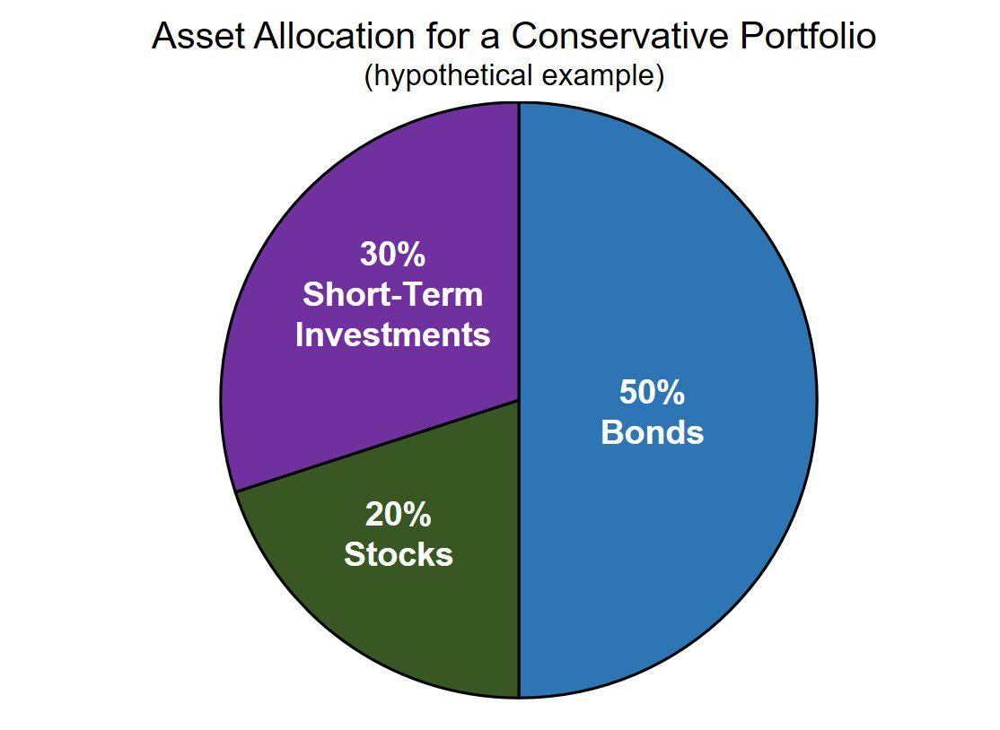

A dollar-neutral strategy in algorithmic trading refers to a market-neutral approach where an investor maintains a portfolio balanced in such a way that the value of long positions equals the value of short positions. The primary objective is to eliminate the influence of broader market movements on portfolio returns. These strategies are increasingly significant as they focus on isolating alpha, or returns attributable to the investor's specific skill in selecting investments, independent of the market's overall direction.

The essence of the dollar-neutral strategy lies in its risk management capability. By strategically pairing long and short positions of equal dollar amounts, these strategies aim to provide a cushion against market volatility, as gains and losses from market movements can offset each other. This feature can be particularly attractive in times of economic uncertainty or major market shifts, highlighting why the approach is gaining traction among algorithmic traders. 



The popularity of dollar-neutral strategies among algorithmic traders is due to their ability to efficiently process vast amounts of data and execute trades swiftly in today's fast-paced markets. By deploying algorithms, traders can systematically identify suitable investment pairs and adjust their portfolios with precision, maintaining the delicate balance required by the strategy. This blend of technology and strategy equips investors to potentially achieve consistent returns notwithstanding market conditions, emphasizing its growing relevance in contemporary trading landscapes. Additionally, as markets become more sophisticated, algorithms that implement such neutral strategies provide an edge in leveraging complex financial models to execute trades without emotional biases.

In summary, the dollar-neutral strategy's significance in algorithmic trading is in its capacity to optimize returns by focusing on an investor's skill in selecting investments while mitigating the adverse effects of broader market movements. This advantage, along with the ever-increasing capability of trading algorithms to execute such strategies, underlines their rising prominence among modern traders seeking to navigate volatile market environments.

## Table of Contents

## Understanding Dollar-Neutral Portfolio

A dollar-neutral portfolio is a type of investment strategy where an investor maintains equal dollar amounts in long and short positions within a portfolio. This approach seeks to neutralize the impact of overall market movements on the portfolio's performance, allowing the gains and losses of long and short positions to offset each other. The primary focus is on generating returns through the relative performance of individual securities rather than broad market trends.

The underlying principle of a dollar-neutral strategy is its ability to mitigate systematic market risk, often referred to as market beta. By balancing long and short positions, the strategy aims to create a portfolio with a net market exposure of zero, or as close to zero as possible. This is achieved by selecting securities that are expected to outperform the market (long positions) and securities likely to underperform (short positions), based on rigorous quantitative or qualitative analysis. The objective is to profit from the price discrepancies between individual stocks, irrespective of the market's direction.

Several types of dollar-neutral strategies are employed by traders and fund managers, one of the most prevalent being the long-short equity strategy. In a long-short equity strategy, investors go long on stocks they believe will increase in value and short sell those they anticipate will decline. For instance, consider a portfolio with $1 million invested in long positions and $1 million in short positions — the portfolio is considered dollar-neutral as its total exposure to market movements is theoretically zero.

Other variations include statistical [arbitrage](/wiki/arbitrage), where traders exploit statistical patterns across different securities, and [pair trading](/wiki/pair-trading), which involves matching long and short positions in pairs of stocks with high historical correlation. The idea is to capitalize on relative discrepancies while maintaining a market-neutral stance.

Effective execution of dollar-neutral strategies requires careful stock selection, risk management, and continuous monitoring to adjust positions as market conditions change. The success lies in the ability to identify and act on opportunities where the long positions outperform the short ones, thereby generating positive returns regardless of the market's movement.

## Benefits of Dollar-Neutral Strategies

Dollar-neutral strategies are designed to minimize market exposure by balancing long and short positions in such a way that the portfolio’s net dollar value equals zero. This neutrality seeks to ensure that gains or losses are primarily determined by the performance of individual securities or relative movements, rather than broader market trends.

### Reduced Volatility and Risk

One of the primary advantages of dollar-neutral strategies is their potential to reduce [volatility](/wiki/volatility-trading-strategies). By hedging market exposure, these strategies aim to isolate the securities' performance from market movements. This is particularly beneficial during periods of high volatility, as the strategy targets to mitigate the impact of market-wide fluctuations. For instance, by holding equal dollar amounts in both long and short positions, the portfolio becomes less sensitive to systemic market risks, potentially resulting in more stable returns.

### Comparison with Other Strategies

When compared to traditional long-only strategies, dollar-neutral portfolios offer a distinctive advantage in terms of risk management. Traditional strategies tend to be fully exposed to market risks. Conversely, dollar-neutral strategies minimize such exposure, allowing traders to focus on security-specific attributes or relative price movements. This allows for strategies like [statistical arbitrage](/wiki/statistical-arbitrage), where the intention is to exploit pricing inefficiencies between long and short positions without worrying about market direction.

Furthermore, unlike market-neutral or beta-neutral strategies that also aim to minimize market risk, dollar-neutral strategies provide a straightforward approach to hedging by maintaining equal invested amounts in both long and short positions, thereby simplifying accounting and risk assessment processes. Such strategies are highly suitable for [algorithmic trading](/wiki/algorithmic-trading), where high-frequency decisions can yield substantial profits by capitalizing on small discrepancies.

Overall, the systematic approach of dollar-neutral strategies aligns well with algorithmic trading, as these strategies can be consistently executed using predefined rules to maintain the desired neutrality, offering a pragmatic solution to managing market risk. This makes them particularly appealing to algorithmic traders seeking both stability and precision in truly chaotic markets.

## Implementing a Dollar-Neutral Strategy in Algo Trading

Implementing a dollar-neutral strategy in algorithmic trading involves the use of sophisticated algorithms to manage the dynamic nature of long and short positions, ensuring that the total market value of long positions equals that of short positions. This balance aims to neutralize the portfolio's exposure to broad market movements, thereby isolating alpha—the excess return relative to a benchmark.

### Balancing Long and Short Positions

The core process in maintaining a dollar-neutral strategy is the careful selection and adjustment of long and short positions to ensure that their aggregate investments are equal. This requires continuous monitoring and rebalancing due to changes in market prices. The following steps outline the basic mechanism:

1. **Selection of Securities**: Initially, securities for both long and short positions are selected based on a predetermined strategy. This could involve quantitative metrics such as momentum, value factors, or other proprietary signals.

2. **Calculation of Dollar Value**: Once the securities are selected, the dollar amount for long positions is calculated. This is often expressed as:
$$
   \text{Total Long Value} = \sum (\text{Quantity}_i \times \text{Price}_i)

$$

   Similarly, a matching dollar value is allocated for short positions.

3. **Rebalancing**: As market prices fluctuate, the total dollar values of the long and short positions will deviate from neutrality. Algorithms continuously adjust the positions by either selling off over-performing longs or buying back under-performing shorts to maintain this neutrality:
$$
   \text{Rebalance}\ if\ | \text{Total Long Value} - \text{Total Short Value} | > \epsilon

$$

   where $\epsilon$ is a threshold value that triggers rebalancing.

### Technical Considerations

Implementing these strategies in a trading platform requires careful consideration of various technical factors to ensure the efficacy and reliability of the system:

- **Algorithm Design**: The algorithm must be optimally designed to efficiently process real-time market data, execute trades instantaneously, and handle large datasets—all while minimizing latency. It requires high-frequency data processing capabilities and robust statistical models.

- **Risk Management**: The algorithm should incorporate mechanisms for managing risks such as incorrect model assumptions, transaction costs, and slippage. This often involves setting stop-loss limits and employing hedging techniques.

- **Backtesting and Simulation**: Before live deployment, rigorous backtesting and simulation under various market conditions are crucial. This helps in validating the performance of the strategy and understanding potential drawdowns.

- **Platform Integration**: The strategy must be compatible with the trading platform's API, offering seamless integration for execution. Programmatically, Python is frequently used for such implementations due to its rich library ecosystem (e.g., NumPy, pandas, and TA-Lib for technical analysis).

```python
# Example: Basic Skeleton for Backtesting a Dollar-Neutral Strategy in Python

import pandas as pd
import numpy as np

# Load historical data
historical_data = pd.read_csv('historical_prices.csv')

# Define strategy parameters and signals
def generate_signals(data):
    # Placeholder for strategy logic
    data['Signal'] = np.where(data['Momentum'] > 0, 1, -1)
    return data

# Calculate position size
def calculate_positions(data):
    data['Long'] = data['Signal'] > 0
    data['Short'] = data['Signal'] < 0
    data['Long Value'] = data['Long'] * data['Price']
    data['Short Value'] = data['Short'] * data['Price']
    return data

# Execute and rebalance
def execute_strategy(data):
    data = generate_signals(data)
    data = calculate_positions(data)
    # Placeholder for rebalancing logic
    return data

# Running the backtest
backtest_results = execute_strategy(historical_data)
```

Effective implementation of a dollar-neutral strategy requires a synthesis of financial theory, algorithmic acumen, and technological infrastructure. When executed efficiently, these strategies can be robust tools for traders seeking to mitigate market risk and focus on security-specific returns.

## Challenges and Risks

Maintaining a dollar-neutral portfolio presents several potential pitfalls and challenges. A key difficulty lies in consistently achieving neutrality, especially in volatile markets where asset prices can fluctuate rapidly. This involves accurately balancing long and short positions such that their dollar values offset each other as market conditions change. Errors in this balancing act can result in unintended market exposures, undermining the strategy's core objective of minimizing market risk.

Algorithmic trading, while offering efficiency and precision, introduces specific risks to dollar-neutral strategies. One such risk is the reliance on historical data to predict future market movements. Algorithms developed using past performance may not always adapt well to atypical or irregular market events, leading to potential losses. Moreover, these algorithms require constant monitoring and updating to remain effective, which can be resource-intensive.

Another significant challenge is the presence of idiosyncratic risk, which refers to the risk inherent to a particular asset rather than the market as a whole. Even if a portfolio is dollar-neutral, it may still be exposed to idiosyncratic factors such as company-specific news, earnings reports, or other events affecting the individual stocks held within the portfolio. These events can cause significant deviations from the expected performance of the overall strategy.

To illustrate, consider a simple numerical example: if a portfolio is composed of a long position of $50,000 in Stock A and a short position of $50,000 in Stock B, the portfolio is initially dollar-neutral. However, if Stock A experiences a positive company-specific event and its price surges by 20%, while Stock B remains unchanged, the portfolio would no longer be neutral, resulting in gains or losses that reflect its exposure to Stock A's idiosyncratic risk.

Ultimately, the complexity of maintaining a dollar-neutral portfolio is compounded by the dynamic nature of financial markets and the limitations of predictive algorithms. Effective risk management and continuous assessment are crucial to mitigating these challenges and ensuring the long-term success of dollar-neutral strategies in algorithmic trading.

## Conclusion

Dollar-neutral strategies have been highlighted as a compelling approach in algorithmic trading due to their ability to systematically manage and mitigate market risk. By balancing long and short positions, traders aim to create a portfolio that is neutral concerning the directional movements of the market, thus minimizing potential losses from adverse price swings. This method allows traders to focus on exploiting relative pricing inefficiencies between paired financial instruments rather than relying on broader market trends, which can often be unpredictable.

The importance of these strategies cannot be overstated in a trading environment where controlling risk exposure is crucial. Dollar-neutral strategies are particularly useful in reducing portfolio volatility, as they inherently act to absorb market shocks. This aspect makes them invaluable tools for traders looking to achieve more consistent returns over time while minimizing the exposure to systemic risk factors, as their success is less contingent on general market conditions.

Looking ahead, the future of dollar-neutral strategies in algorithmic trading appears promising. The increasing sophistication of algorithmic models and the availability of high-frequency data are poised to enhance the efficacy of these strategies. Moreover, advancements in [machine learning](/wiki/machine-learning) and [artificial intelligence](/wiki/ai-artificial-intelligence) could further refine the identification and exploitation of arbitrage opportunities, making dollar-neutral strategies more accessible and effective for a broader range of traders. As these technologies continue to evolve, so too will the ability of dollar-neutral portfolios to deliver value, emphasizing their ongoing relevance as a fundamental risk management tool in the ever-changing landscape of financial markets.

## Frequently Asked Questions (FAQs)

### Common Questions Answered About Dollar-Neutral Portfolios

#### What is a Dollar-Neutral Portfolio?
A dollar-neutral portfolio is a type of investment strategy designed to be market-neutral by maintaining equal dollar amounts in both long and short positions. This balance aims to minimize the portfolio's exposure to overall market movements, allowing investors to potentially profit from security-specific performance rather than broad market trends.

#### How Do These Strategies Reduce Market Risk?
By balancing long and short positions, dollar-neutral portfolios reduce market risk, which is the risk of loss due to movements in the overall market. Since the value of long positions typically rises when the market increases and short positions rise when the market declines, maintaining a balance helps to hedge against market volatility.

#### What are Some Common Misconceptions About Dollar-Neutral Strategies?
One common misconception is that dollar-neutral portfolios completely eliminate risk. While they reduce exposure to market risk, they do not eliminate other types of risks, such as idiosyncratic risk, which is specific to individual securities. Additionally, these strategies require constant monitoring and rebalancing, and incorrect implementation can lead to unexpected losses.

#### Are There Any Specific Tools or Technologies to Aid in Implementing These Strategies?
Algorithmic trading platforms often provide the necessary tools to execute dollar-neutral strategies effectively. These platforms use advanced algorithms and can automate the process of maintaining dollar balance by dynamically adjusting long and short positions in response to market conditions. Python, for instance, is commonly used for developing such algorithms due to its robust libraries, such as `numpy` and `pandas`, which facilitate financial calculations and data manipulation.

Example Python snippet for calculating portfolio balance:
```python
import numpy as np

# Example data: long and short positions
long_positions = np.array([1000, 1500, 2000])
short_positions = np.array([1200, 1300, 1800])

# Calculate total long and total short
total_long = np.sum(long_positions)
total_short = np.sum(short_positions)

# Check if the portfolio is dollar-neutral
is_dollar_neutral = total_long == total_short
```

#### What Practical Tips Should Traders Consider?
1. **Thorough Research:** Understand the fundamentals and technical aspects of the securities you are trading.
2. **Regular Rebalancing:** Continuously monitor and rebalance the portfolio to maintain neutrality, as the value of securities changes over time.
3. **Diversification:** Include a mix of securities to diversify idiosyncratic risk.
4. **Risk Management:** Implement stop-loss orders and other risk management techniques to protect against unforeseen losses.
5. **Stay Informed:** Keep abreast of market trends and economic indicators that might impact the performance of individual securities.

By addressing these common questions and clearing misconceptions, traders can more effectively leverage dollar-neutral portfolios as part of their broader investment strategies.

## References & Further Reading

[1]: ["Advances in Financial Machine Learning"](https://www.amazon.com/Advances-Financial-Machine-Learning-Marcos/dp/1119482089) by Marcos Lopez de Prado

[2]: ["Quantitative Trading: How to Build Your Own Algorithmic Trading Business"](https://books.google.com/books/about/Quantitative_Trading.html?id=j70yEAAAQBAJ) by Ernest P. Chan

[3]: ["Evidence-Based Technical Analysis: Applying the Scientific Method and Statistical Inference to Trading Signals"](https://www.amazon.com/Evidence-Based-Technical-Analysis-Scientific-Statistical/dp/0470008741) by David Aronson

[4]: ["Machine Learning for Algorithmic Trading"](https://github.com/stefan-jansen/machine-learning-for-trading) by Stefan Jansen

[5]: Bergstra, J., Bardenet, R., Bengio, Y., & Kégl, B. (2011). ["Algorithms for Hyper-Parameter Optimization."](https://dl.acm.org/doi/10.5555/2986459.2986743) Advances in Neural Information Processing Systems 24.