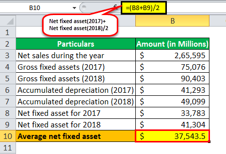

## Table of Contents

## What is meant by 'dollar performance per turnover'?

Dollar performance per turnover is a way to measure how well a business is doing by looking at how much money it makes from each time it sells something. It's calculated by dividing the total sales dollars by the number of times inventory is sold and replaced, known as turnover. This helps businesses see if they are making enough money from their sales, or if they need to make changes to their pricing or inventory management.

This measure is important because it shows the efficiency of a business in turning its inventory into profit. A higher dollar performance per turnover means that the business is getting more money for each item it sells, which is good. If the number is low, it might mean the business needs to look at its pricing strategy or find ways to reduce costs to improve its profitability.

## How is dollar performance per turnover calculated?

To calculate dollar performance per turnover, you need to know two things: your total sales in dollars and your inventory turnover. First, find out your total sales. This is just the total amount of money you made from selling things. Then, figure out your inventory turnover. This is how many times you sold and replaced your inventory in a certain time, like a year. You can find this by dividing the cost of goods sold by the average inventory value.

Once you have these numbers, you can find the dollar performance per turnover by dividing your total sales by your inventory turnover. For example, if your total sales were $100,000 and your inventory turned over 5 times, your dollar performance per turnover would be $100,000 divided by 5, which equals $20,000. This number tells you how much money you make each time your inventory turns over. It's a useful way to see if you're making enough money from your sales or if you need to make changes.

## Why is it important to track dollar performance per turnover in business?

Tracking dollar performance per turnover is important because it helps business owners see how well they are doing at making money from their sales. It tells them how much money they make each time they sell and replace their inventory. This is a good way to check if the business is healthy and making enough profit. If the number is high, it means the business is doing well and making good money from each sale. If it's low, it might mean the business needs to change something, like how much they charge for their products or how they manage their inventory.

It's also useful for making decisions about the future of the business. By looking at dollar performance per turnover over time, owners can see if their business is getting better or worse at making money. This can help them decide if they should try new things, like selling different products or changing their prices. Keeping an eye on this number helps business owners stay on top of their finances and make smart choices to keep their business strong and profitable.

## Can you provide an example of how dollar performance per turnover is used in a real business scenario?

Let's say there's a small shop that sells handmade crafts. The owner wants to know if the shop is doing well, so they look at the dollar performance per turnover. Last year, the shop made $50,000 in total sales. The owner figured out that the inventory turned over 2.5 times during the year. So, they divided the total sales ($50,000) by the inventory turnover (2.5) and got $20,000. This means that each time the shop sold and replaced its inventory, it made $20,000.

The owner was happy with this number because it showed that the shop was making good money from each sale. But they wanted to make even more, so they decided to try selling some new types of crafts that might be more popular. After a few months, they checked the dollar performance per turnover again. This time, the total sales were $60,000, and the inventory turned over 3 times. The new dollar performance per turnover was $20,000 again ($60,000 divided by 3). Even though the total sales went up, the dollar performance per turnover stayed the same. This told the owner that they needed to think about other ways to make more money, like maybe raising prices or finding cheaper materials to make the crafts.

## What are the common benchmarks for dollar performance per turnover in different industries?

Benchmarks for dollar performance per turnover can vary a lot depending on the industry. In retail, a good dollar performance per turnover might be around $10,000 to $20,000. This means that each time a retail store sells and replaces its inventory, it makes between $10,000 and $20,000. For grocery stores, the number might be lower, around $5,000 to $10,000, because they sell a lot of low-cost items that turn over quickly.

In the manufacturing industry, the dollar performance per turnover can be much higher, often between $50,000 and $100,000. This is because manufacturing companies usually make big, expensive products that don't turn over as often as retail items. These benchmarks help businesses see how they are doing compared to others in their industry and can guide them in making decisions to improve their performance.

## How does dollar performance per turnover relate to inventory management?

Dollar performance per turnover is closely tied to inventory management because it shows how much money a business makes each time it sells and replaces its inventory. Good inventory management means having the right amount of stock to meet customer demand without having too much sitting around. If a business manages its inventory well, it can sell its products quickly and often, which can lead to a higher dollar performance per turnover. This means the business is making more money from each sale and replacement of inventory.

On the other hand, if inventory management is poor, the business might have too much stock that doesn't sell quickly. This can lead to a lower dollar performance per turnover because the inventory isn't turning over as often. By keeping an eye on dollar performance per turnover, a business can see if it needs to change how it manages its inventory. For example, it might need to order less stock or find ways to sell what it has more quickly to improve its performance and make more money.

## What factors can influence dollar performance per turnover?

Several things can affect how much money a business makes each time it sells and replaces its inventory, which is called dollar performance per turnover. One big [factor](/wiki/factor-investing) is how fast the inventory sells. If products sell quickly, the inventory turns over more often, and this can lead to a higher dollar performance per turnover. Another factor is the price of the products. If a business can charge more for its items without losing customers, it can make more money from each sale, which also boosts the dollar performance per turnover. The cost of the inventory also matters. If a business can buy its stock at a lower price, it can make more profit from each sale, which helps improve the dollar performance per turnover.

Another important thing that can influence dollar performance per turnover is how well the business manages its inventory. If a business keeps too much stock that doesn't sell, the inventory won't turn over as often, and this can lower the dollar performance per turnover. On the other hand, if the business has just the right amount of stock to meet demand, it can sell and replace its inventory more often, which can lead to a higher dollar performance per turnover. Finally, changes in the market, like new competitors or shifts in what customers want, can also affect how quickly inventory sells and how much money the business makes from each sale.

## How can a business improve its dollar performance per turnover?

To improve dollar performance per turnover, a business can focus on selling its products faster. This means making sure there's always enough stock to meet customer demand but not so much that it sits around for a long time. One way to do this is by keeping a close eye on what's selling and what's not, and then adjusting the inventory accordingly. Another way is to use sales and promotions to move products that aren't selling quickly. By getting the inventory to turn over more often, the business can make more money from each sale and replacement of stock.

Another important thing a business can do is to look at its pricing. If a business can charge more for its products without losing customers, it can make more money from each sale. This can help improve the dollar performance per turnover. Also, the business should try to buy its stock at a lower price. If the cost of the inventory goes down, the profit from each sale goes up, which can also boost the dollar performance per turnover. By focusing on these things, a business can make more money each time it sells and replaces its inventory.

## What are the potential pitfalls of focusing too much on dollar performance per turnover?

Focusing too much on dollar performance per turnover can make a business forget about other important things. If a business only thinks about how much money it makes each time it sells and replaces its inventory, it might not pay attention to how happy its customers are. If customers are not happy, they might stop coming back, and this can hurt the business in the long run. Also, if a business tries to sell its products too quickly just to improve the dollar performance per turnover, it might end up with too little stock. This can lead to missing out on sales because there's not enough to sell when customers want to buy.

Another problem with focusing too much on dollar performance per turnover is that it might make a business take risks that are not good for it. For example, a business might try to buy cheaper materials to lower the cost of its inventory and make more profit from each sale. But if the quality of the products goes down because of the cheaper materials, customers might not want to buy them anymore. This can hurt the business's reputation and sales. So, while it's good to keep an eye on dollar performance per turnover, it's also important to think about other things like customer satisfaction and product quality.

## How does dollar performance per turnover vary across different sectors such as retail, manufacturing, and services?

Dollar performance per turnover can be very different in different sectors like retail, manufacturing, and services. In retail, where things like clothes or electronics are sold, the dollar performance per turnover might be around $10,000 to $20,000. Retail stores often have a lot of different items that they sell and replace quickly, so they need to make sure they're making enough money from each sale. Grocery stores, which are also in the retail sector but sell food and other things people need every day, might have a lower dollar performance per turnover, around $5,000 to $10,000, because their items are cheaper and turn over very quickly.

In manufacturing, where big things like cars or machines are made, the dollar performance per turnover is usually much higher, often between $50,000 and $100,000. This is because manufacturing companies make expensive products that don't sell and get replaced as often as retail items. They need to make a lot of money from each sale to cover the high costs of making the products. In the services sector, like restaurants or consulting firms, the idea of dollar performance per turnover can be a bit different. Instead of selling physical items, they sell services, so they might look at how much money they make from each customer or project instead of how often they sell and replace inventory.

## What advanced analytical techniques can be used to enhance the understanding of dollar performance per turnover?

To better understand dollar performance per turnover, businesses can use advanced analytical techniques like regression analysis. This helps them see how different things, like the price of their products or how fast they sell, affect how much money they make each time they sell and replace their inventory. By looking at this data, businesses can find out what they need to change to make more money. For example, if they see that lowering the price of a product makes it sell faster and increases the dollar performance per turnover, they might decide to do that.

Another useful technique is time series analysis, which looks at how the dollar performance per turnover changes over time. This can help businesses see if their performance is getting better or worse and what might be causing these changes. They can use this information to plan for the future and make smart decisions about things like how much stock to keep or when to run sales. By using these advanced techniques, businesses can get a clearer picture of their performance and find ways to make more money from each sale and replacement of their inventory.

## How can predictive modeling help in forecasting future dollar performance per turnover?

Predictive modeling can help businesses guess how much money they will make each time they sell and replace their inventory in the future. By looking at past data, like how fast their products sold and how much they made from each sale, businesses can use special math formulas to predict what might happen next. For example, if a business sees that selling more of a certain product in the past led to a higher dollar performance per turnover, they can use this information to plan for the future. They might decide to stock up on that product to try and make more money.

Using predictive modeling can also help businesses see what might affect their future sales and profits. They can look at things like changes in what customers want, new competitors, or even the time of year to see how these might change how much money they make from each sale. By understanding these patterns, businesses can make better decisions about things like how much to charge for their products or how much stock to keep. This can help them improve their dollar performance per turnover and make more money in the long run.

## What is Turnover in Algo Trading?

Turnover in [algorithmic trading](/wiki/algorithmic-trading) refers to the rate at which a portfolio's holdings are bought and sold over a specific period. It is a crucial metric for assessing the trading activity within a given strategy and is instrumental in understanding and optimizing strategy performance. Turnover is typically expressed as a percentage, representing the proportion of a portfolio that is replaced within a particular timeframe, often annually.

To calculate turnover, one must sum the total value of securities bought and sold during a period and divide by the average value of the portfolio over the same period. The formula can be represented as:

$$
\text{Turnover} = \frac{\text{Total Purchases} + \text{Total Sales}}{2 \times \text{Average Portfolio Value}}
$$

Turnover is indicative of a strategy's trading frequency and can have several implications for performance. High turnover strategies incur higher transaction costs due to frequent buying and selling, which can erode profits. Additionally, high turnover may also result in increased exposure to market [volatility](/wiki/volatility-trading-strategies) and tax liabilities, as short-term gains are often taxed at higher rates.

Comparatively, [liquidity](/wiki/liquidity-risk-premium) refers to how easily an asset can be bought or sold in the market without affecting its price. While turnover and liquidity are related, they are not synonymous; turnover measures the frequency of trades, while liquidity pertains to the ability to execute trades with minimal price impact. High liquidity typically facilitates higher turnover by allowing for quick repositioning without significant cost implications.

Trading frequency, akin to turnover, describes how often trades occur within a strategy. However, turnover provides a more holistic view by considering the [volume](/wiki/volume-trading-strategy) and value of trades, rather than simply the count. For instance, two strategies with equal trading frequencies may have vastly different turnovers if one involves high-value trades while the other focuses on smaller transactions.

The implications of turnover extend to strategy design and execution. A strategy with low turnover may suggest a long-term investment approach focusing on stable, less frequent trades. Conversely, high turnover might indicate an active strategy exploiting short-term market movements, necessitating robust execution capabilities to manage costs and slippage. For example, in a [momentum](/wiki/momentum) trading strategy, high turnover might be essential to capitalize on fleeting market trends. However, executing such a strategy effectively would require careful consideration of transaction costs and the potential impact on returns.

Ultimately, understanding turnover is vital for algorithmic traders in selecting or designing strategies that align with their performance objectives, risk tolerance, and market conditions.

## How do you calculate dollar performance per turnover?

Calculating dollar performance per turnover in algorithmic trading involves a precise mathematical approach to assess the efficiency of a trading strategy. This metric helps traders understand how effectively the capital is employed relative to the trading activity, which involves both the revenues generated and the volume of trades executed.

**Step-by-Step Guide:**

1. **Clarifying the Concepts:**
   - **Dollar Performance (DP):** This is the net profit or loss realized from a trading strategy, typically represented in monetary terms.
   - **Turnover:** In the context of trading, turnover represents the total value of all executed trades within a specific period. It can be calculated as the sum of the absolute values of all trades.

2. **Mathematical Formula for Calculation:**

   The basic formula to calculate dollar performance per turnover is:
$$
   \text{Dollar Performance per Turnover} = \frac{\text{Net Profit}}{\text{Total Turnover}}

$$

   Here, net profit is the total dollar profit realized by the strategy after accounting for trading fees, taxes, and other expenses.

3. **Importance of Data Quality:**

   Accurate computation of dollar performance per turnover demands high-quality data. The data set should be comprehensive, including all relevant transactions, fees, and timestamps to avoid discrepancies. Precision in data is crucial because even minor errors can significantly impact the results, leading to misinterpretation of a strategy's effectiveness.

4. **Case Studies with Real-World Data:**

   Consider a simplified example where an algorithmic trading strategy generates a net profit of $10,000 over a month, and the total turnover for the same period is $500,000. Using the formula:
$$
   \text{Dollar Performance per Turnover} = \frac{10,000}{500,000} = 0.02

$$

   This result implies that each dollar of turnover generates two cents in profit, providing a quantitative measure of efficiency.

   In more sophisticated setups, real-world case studies often utilize Python scripts to automate the calculation process. Below is an example of a basic script that could be used to calculate this metric from a dataset of trades:

   ```python
   import pandas as pd

   # Sample data
   data = {'trade_value': [2000, 3500, 500, 1200, 4800]}
   df = pd.DataFrame(data)

   # Net profit
   net_profit = 10000  # Example profit

   # Calculate total turnover
   total_turnover = df['trade_value'].abs().sum()

   # Calculate Dollar Performance per Turnover
   dollar_performance_per_turnover = net_profit / total_turnover
   print(f'Dollar Performance per Turnover: {dollar_performance_per_turnover:.4f}')
   ```

   In professional trading environments, this calculation can be expanded to account for various factors such as leverage, currency conversions, and more. 

Understanding dollar performance per turnover as a metric allows traders and analysts to effectively gauge the efficiency of their capital deployment in algorithmic trading strategies, paving the way for strategic enhancements and optimizations.

## How can we interpret performance metrics?

Interpreting the results of dollar performance per turnover in algorithmic trading is crucial for refining trading strategies and enhancing decision-making processes. Dollar performance per turnover provides insights into the efficiency and profitability of a trading strategy by measuring how much financial gain or loss is achieved per unit of trading activity. 

### Understanding the Calculations
Dollar performance per turnover is determined by taking the dollar profit or loss of a trading strategy over a specific period and dividing it by the turnover, which is the total volume of trading activity during that period. This metric can be represented by the formula:

$$
\text{Dollar Performance per Turnover} = \frac{\text{Total Dollar Profit (or Loss)}}{\text{Turnover}}
$$

The outcome of this calculation helps traders assess how effectively a strategy utilizes its trading volume to generate profits.

### Linking Metrics to Strategy Improvement
By analyzing dollar performance per turnover, traders can identify which strategies are most effective in terms of return on trading activity. Strategies that yield a high dollar performance per turnover are usually more efficient, as they generate greater returns for each unit of trading volume. This information can guide traders in optimizing their strategies to enhance performance. For example, a strategy with high turnover but low dollar performance per turnover might need adjustments in trading frequency or capital allocation to improve efficiency.

### Common Pitfalls and Challenges
When interpreting these metrics, traders may encounter challenges such as skewed performance results due to outliers or extreme market events. It is important to consider the impact of transaction costs, market impact, and slippage, which can distort the true performance of a strategy. Using robust statistical techniques to adjust for these factors can provide a more accurate reflection of a strategy’s performance. Additionally, strategies that perform well in backtests may not translate to real-world success due to overfitting or market changes that invalidate historical data assumptions.

### Tools and Software for Analysis
Numerous tools and software platforms can assist traders in analyzing and visualizing dollar performance per turnover metrics. Platforms like QuantConnect and TradeStation provide integrated environments for [backtesting](/wiki/backtesting) strategies and visualizing performance data. Python libraries such as Pandas and NumPy can be utilized for data manipulation and analysis, while Matplotlib and Seaborn aid in creating detailed performance visualizations. These tools can facilitate a deeper understanding of trading strategy dynamics, enabling traders to make informed adjustments and refinements.

In conclusion, comprehensively interpreting dollar performance per turnover not only aids in improving trading strategies but also empowers effective decision-making in algorithmic trading.

## References & Further Reading

[1]: Jansen, S. (2020). ["Machine Learning for Algorithmic Trading."](https://github.com/stefan-jansen/machine-learning-for-trading) Packt Publishing.

[2]: Lopez de Prado, M. (2018). ["Advances in Financial Machine Learning."](https://books.google.com/books/about/Advances_in_Financial_Machine_Learning.html?id=oU9KDwAAQBAJ) Wiley.

[3]: Chan, E. P. (2009). ["Quantitative Trading: How to Build Your Own Algorithmic Trading Business."](https://github.com/ftvision/quant_trading_echan_book) Wiley.

[4]: Aronson, D. R. (2007). ["Evidence-Based Technical Analysis: Applying the Scientific Method and Statistical Inference to Trading Signals."](https://onlinelibrary.wiley.com/doi/book/10.1002/9781118268315) Wiley.