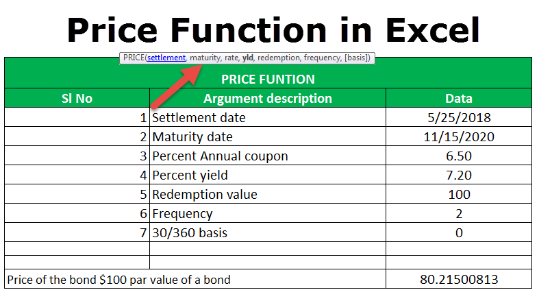

In today's dynamic financial markets, understanding currency exchange rates is crucial for traders, investors, and policymakers. Exchange rates influence the cost of imports and exports, affecting national economies and individual portfolios. An exchange rate reflects the relative value between two currencies, determined by factors such as interest rates, inflation, geopolitical stability, and market speculation.

The U.S. dollar, often regarded as the world’s primary reserve currency, plays a pivotal role in global finance. Its value can significantly impact international trade and investment decisions. A change in the dollar's value affects the competitiveness of U.S. exports, the price of imports, and the overall trade balance. For instance, a strengthening dollar might benefit American consumers by reducing the cost of imported goods but could harm exporters by making their products more expensive abroad.



Algorithmic trading has revolutionized the approach to currency markets. It involves using computer programs and mathematical models to execute trades at speeds and complexities beyond human capabilities. This method enhances trading efficiency, providing liquidity and contributing to market stability. Algorithms can process and analyze vast datasets rapidly, factoring in crucial variables that drive currency valuation, such as interest rate differentials and economic indicators.

The integration of algorithmic trading in currency markets influences pricing strategies by determining entry and exit points with precision. As algorithms execute large volumes of trades based on predefined criteria, they can influence supply and demand dynamics. This interaction requires market participants to remain astute and adaptable, especially given the speed and complexity of modern trading platforms. Understanding these nuances provides an edge in leveraging market opportunities while mitigating risks associated with currency fluctuations.

## Table of Contents

## Currency Exchange Rates and Their Importance

Currency exchange rates are a pivotal element in the framework of international trade, directly impacting the pricing of imports and exports. These rates determine how much of one currency is needed to purchase a unit of another currency, effectively influencing the cost of goods and services across borders. Thus, businesses engaged in international trade must closely monitor these rates to assess profitability and competitiveness in foreign markets.

Exchange rates are influenced by a wide array of factors, making them dynamic and sometimes unpredictable. Economic indicators such as interest rates, inflation rates, and gross domestic product (GDP) growth are fundamental. For example, if a country's GDP grows at a faster rate than its trading partners, its currency may appreciate due to increased demand. Similarly, higher interest rates offer lenders in an economy a higher return relative to other countries, potentially increasing currency value.

Geopolitical events also play a significant role in shaping currency exchange rates. Events such as political instability, trade agreements, or conflicts can lead to fluctuations in currency value. An example is the impact of Brexit on the British pound, where uncertainties surrounding the United Kingdom's [exit](/wiki/exit-strategy) from the European Union led to significant [volatility](/wiki/volatility-trading-strategies) in its exchange rate.

Moreover, market sentiment, which reflects the collective perception of traders and investors, can influence exchange rates. This sentiment is often driven by news releases, economic forecasts, and global financial trends. Markets may react to the perception of a strong economy, bolstering currency value, or conversely, react negatively to perceived economic weaknesses.

Understanding how these factors lead to fluctuations in exchange rates is critical for traders and investors. For instance, a trader using technical analysis may use historical exchange rate data to identify patterns and predict future movements. Similarly, fundamental analysts might evaluate economic news and indicators to ascertain currency trends.

For practical applications, one might use Python to analyze exchange rate data. Libraries such as `pandas` and `numpy` facilitate data manipulation and analysis, while `matplotlib` or `seaborn` can be employed for visualizing trends and patterns. Here is a simple example of how Python can be used to analyze historical exchange rate data:

```python
import pandas as pd
import matplotlib.pyplot as plt

# Load exchange rate data
data = pd.read_csv('exchange_rate_data.csv')

# Convert date column to datetime
data['Date'] = pd.to_datetime(data['Date'])

# Plot exchange rate over time
plt.figure(figsize=(10, 5))
plt.plot(data['Date'], data['ExchangeRate'], label='Exchange Rate')
plt.xlabel('Date')
plt.ylabel('Exchange Rate')
plt.title('Historical Exchange Rate')
plt.legend()
plt.show()
```

By processing and visualizing exchange rate data, traders and investors can gain insights into past trends and potential future movements, aiding in making informed decisions. As global markets continue to integrate, understanding the intricacies of currency exchange rates becomes increasingly essential for stakeholders involved in cross-border economic activities.

## The Dollar Price: Understanding Its Impact

The U.S. dollar, recognized as the preeminent global reserve currency, exerts substantial influence on international economic dynamics and trade strategies. Its centrality in global finance is rooted in several historical and contemporary factors, including the strength and stability of the U.S. economy, widespread global acceptance, and the backing of a robust financial market infrastructure.

Changes in the dollar's value can have a domino effect on global economic conditions. When the dollar appreciates relative to other currencies, imports into the U.S. become less expensive, reducing costs for U.S. consumers and businesses purchasing foreign goods. Conversely, this appreciation can make U.S. exports more expensive for foreign buyers, potentially reducing demand for U.S. products in international markets. This dual effect highlights the intrinsic balance in trade dynamics driven by currency valuation.

In quantitative terms, exchange rate movements affect price levels and trade balances. For instance, if $E_{USD/EUR}$ represents the exchange rate between the U.S. dollar and the euro, and it increases, the dollar is strengthening relative to the euro. Economically, this is expressed as:
$$
\text{New Price}_{USD} = \text{Old Price}_{EUR} \times E_{USD/EUR}
$$

This formula calculates the new price in dollars for goods priced in euros, indicating that as $E_{USD/EUR}$ increases, the dollar's purchasing power improves.

Furthermore, the dollar's status as a reserve currency means that central banks around the world hold significant dollar reserves. Shifts in the valuation of the dollar can therefore result in realignment of global capital flows. A stronger dollar often leads to capital outflows from emerging markets, as investors seek the safety and potential return of U.S. dollar-denominated assets. This can affect exchange rates and economic conditions in these markets.

In addition to these economic impacts, a strong dollar influences trading strategies. Traders may adjust their positions based on expectations of dollar movements, influencing currency markets. Hedging strategies often focus on mitigating the risks associated with dollar volatility, which can have amplified effects on companies operating internationally.

In conclusion, understanding the mechanics of dollar valuation is pivotal for market participants. Changes in the dollar's strength can manifest in broad economic impacts and influence strategic financial decisions across the globe.

## Algorithmic Trading: Enhancing Efficiency

Algorithmic trading leverages mathematical models and sophisticated computer algorithms to execute financial transactions at exceptional speeds, revolutionizing the trading landscape. By harnessing the power of technology, [algorithmic trading](/wiki/algorithmic-trading) systems enhance market efficiency and [liquidity](/wiki/liquidity-risk-premium). These systems are designed to process substantial volumes of data at high velocity, identify patterns, and execute pre-defined trading strategies, often in fractions of a second.

The core functionality of algorithmic trading lies in its ability to rapidly analyze market conditions and predict price movements. Traditional trading might rely on human decision-making, which is slower and prone to emotional biases, whereas algorithmic systems use quantitative analysis to make data-driven decisions. This process often involves statistical techniques, [artificial intelligence](/wiki/ai-artificial-intelligence) (AI), and [machine learning](/wiki/machine-learning) (ML) to model and forecast market trends. For example, regression analysis might be employed to determine the relationship between various market indicators and a particular security's price.

A basic representation of an algorithmic trading model could involve:
- **Price-based signals:** Algorithms determine buy or sell signals when the current price crosses a moving average. The moving average filter can be applied using Python's `pandas` library:
  ```python
  import pandas as pd

  # Sample code for calculating a simple moving average (SMA)
  historical_data = pd.Series([10, 20, 30, 40, 50, 60])
  short_window = 2
  historical_data_sma = historical_data.rolling(window=short_window).mean()
  ```
- **Statistical arbitrage:** Algorithms profit from price inefficiencies between related financial instruments, using time-series analysis and cointegration tests.

Algorithmic trading also supports liquidity in financial markets by providing constant bid and ask offers, thus narrowing the spread. This increase in liquidity can help reduce transaction costs for all market participants. Furthermore, the high-speed execution reduces the time traditional traders might spend waiting for order fulfillment, benefiting both buyers and sellers.

However, while algorithmic trading increases efficiency, it is crucial to acknowledge its potential drawbacks, such as contributing to market volatility during periods of high-frequency trading activity. Despite these challenges, the continued evolution of algorithmic trading, driven by advancements in computing technology and AI, promises to further refine trading strategies and market dynamics. As more sophisticated models are developed, they will further bolster the predictive accuracy and operational efficiency of trading platforms.

## Interplay Between Algo Trading and Currency Pricing

Algorithmic trading has become a pivotal force in the currency markets, significantly influencing currency pricing through the execution of large volumes of trades based on precise algorithms. These algorithmic activities can impact the supply and demand dynamics within the foreign exchange (Forex) market, consequently affecting exchange rates.

To understand the influence of algorithmic trading on currency pricing, consider a simplified model where algorithmic traders detect an [arbitrage](/wiki/arbitrage) opportunity between two currencies. The algorithm may buy a currency at a lower price in one market and simultaneously sell it at a higher price in another market. This operation adjusts the prices as it increases demand on the buy side and supply on the sell side, thereby narrowing the price difference and stabilizing the market.

The stabilization function of algorithmic trading is crucial, as it adds liquidity to the markets, facilitating smoother transactions and reducing bid-ask spreads. By doing so, algorithmic trading can contribute to more efficient market conditions, allowing traders to execute large [volume](/wiki/volume-trading-strategy) trades with minimal price impact.

However, while algorithmic trading often stabilizes the market, it can also lead to increased volatility under certain circumstances. For example, during times of market stress or when there are errors in the trading algorithms, there can be abrupt and significant price movements, often described as "flash crashes." These occur when algorithms execute a large number of trades in response to market signals, magnifying price swings.

Moreover, the interaction between multiple algorithmic trading strategies can create complex feedback loops, further influencing volatility. When multiple strategies rapidly react to price changes without human intervention, it can lead to cascading price movements, amplifying short-term volatility.

Mathematically, the influence of algorithmic trading on currency pricing can be modeled through supply and demand equations. Let $S$ denote supply and $D$ denote demand for a currency. Algorithmic trading can be considered as a [factor](/wiki/factor-investing) adjusting both $S$ and $D$:

$$
P = \frac{D - S}{S + D + K}
$$

where $P$ represents the price level and $K$ is a stabilizing constant provided by the liquidity added by algorithmic trading.

In conclusion, the interplay between algorithmic trading and currency pricing is complex, marked by both market stabilization and potential for increased volatility. The challenge lies in balancing these effects to harness the benefits of algorithmic trading while mitigating its risks.

## Case Study: Impact on the U.S. Dollar

In recent years, the U.S. dollar has experienced significant fluctuations, influenced predominantly by algorithmic trading activities. Algorithmic trading, which leverages automated and complex financial models for trading decisions, has amplified these currency movements. This has reshaped both short-term and long-term dynamics within exchange rates and global trade.

### Short-term Effects on Exchange Rates and Global Trade

Algorithmic trading significantly impacts short-term exchange rate volatility. The rapid execution speed of algorithms enables market participants to respond almost instantaneously to economic data releases and geopolitical events. For example, during a policy announcement by the Federal Reserve, algorithmic systems can process and act on information faster than human traders, creating immediate fluctuations in the value of the U.S. dollar.

The increased volume and velocity of trades can cause sharp but often short-lived spikes or drops in currency prices. This can lead to opportunities as well as challenges for traders who must adapt to fast-changing market conditions. Short-term volatility driven by algorithmic trading can also affect global trade, as businesses must navigate these rapid changes in currency valuation when planning imports and exports.

### Long-term Effects on Exchange Rates and Global Trade

Over the longer term, algorithmic trading contributes to more efficient market price discovery by ensuring that new information is quickly integrated into currency prices. This helps maintain equilibrium in the foreign exchange market, albeit with occasional disruptions. The U.S. dollar's status as a global reserve currency means that its fluctuations, driving largely by algorithmic trading, can have pronounced effects on global trade balances and capital flows.

A sustained increase in the value of the U.S. dollar, influenced by long-term algorithmic trading trends, tends to make U.S. exports more expensive and imports cheaper. This dynamic can lead to trade imbalances, affecting economic growth patterns in different countries. Conversely, a weaker dollar can bolster U.S. export competitiveness, impacting global supply chains.

### Regulatory Changes and Market Events

Regulatory changes and significant market events can further influence the impact of algorithmic trading on the U.S. dollar. Regulations aimed at increasing transparency and reducing risk, such as the Dodd-Frank Act, have sought to mitigate potential negative impacts of high-frequency trading practices. However, regulatory measures can also constrain algorithmic practices, leading to shifts in trading strategies and subsequent effects on currency pricing.

Market events, including geopolitical tensions and financial crises, can exacerbate the influence of algorithmic trading on the dollar. Algorithms programmed to manage risk might execute large volumes of trades during these periods, intensifying market movements and contributing to volatility.

In conclusion, the interplay between algorithmic trading and the U.S. dollar has profoundly influenced both short-term exchange rate fluctuations and long-term global trade patterns. While algorithmic trading brings efficiency and speed to the market, it also requires careful management and regulation to ensure stability. As a result, traders and policymakers alike must remain attentive to these dynamics, adapting strategies to navigate the evolving foreign exchange landscape.

## Challenges and Future of Algo Trading in Forex

Algorithmic trading in the foreign exchange (Forex) market has revolutionized the way trades are executed, offering unprecedented efficiency and speed. However, it is not without its challenges. One significant concern is the risk of market manipulation. The use of algorithmic strategies can amplify price movements if not properly regulated or if they exploit weaknesses in the market structure. For example, certain algorithms might engage in "quote stuffing," where a large number of rapid trades are placed to create false signals, leading to distortion of market prices.

Another prominent challenge is the possibility of flash crashes, which are sudden, deep, and rapid drops in stock prices that can recover almost as quickly. These events are often triggered by automated trading systems reacting to erroneous data or unforeseen algorithmic interactions. For instance, on May 6, 2010, a flash crash saw the Dow Jones Industrial Average plunge about 1,000 points within minutes before bouncing back, with algorithmic trading cited as a major factor (Kirilenko et al., 2017).

Looking forward, advancements in artificial intelligence (AI) and machine learning hold the potential to further transform algorithmic trading. These technologies enable the development of more sophisticated algorithms capable of learning from data patterns and making more autonomous trading decisions. AI can improve risk management by identifying potential market anomalies and adapting trading strategies accordingly. Machine learning models, such as neural networks, can analyze vast datasets to predict currency price movements with greater accuracy. For instance, a [long short](/wiki/equity-long-short)-term memory (LSTM) network can be used to model sequential data and improve the prediction of time-series-based currency fluctuations.

Python code for a simple LSTM model could look like this:

```python
from keras.models import Sequential
from keras.layers import LSTM, Dense
import numpy as np

# Sample data preparation
X_train = np.random.rand(100, 10, 1)  # 100 samples, 10 timesteps, 1 feature
y_train = np.random.rand(100, 1)

# Define the LSTM model
model = Sequential()
model.add(LSTM(50, activation='relu', input_shape=(10, 1)))
model.add(Dense(1))
model.compile(optimizer='adam', loss='mse')

# Fit the model
model.fit(X_train, y_train, epochs=200, verbose=0)
```

Regulatory frameworks will play a critical role in shaping the landscape of algorithmic trading in Forex. International regulatory bodies are increasingly focused on setting rules that prevent market abuse while ensuring transparency and stability. For example, the Markets in Financial Instruments Directive II (MiFID II) in the European Union imposes strict regulations on high-frequency trading, requiring algorithms to be tested for safety and reliability before deployment. 

As digital platforms continue to evolve and integrate technologies like AI, the regulation must also progress to address new challenges. Balancing innovation and regulation will be key to the sustainable development of algorithmic trading in Forex, ensuring that these technologies enhance market functions without undermining market integrity. As the market continues to adapt, the role of AI and continuous advancements in machine learning will likely bring further enhancements to trading algorithms, potentially leading to more stable and efficient currency markets.

## Conclusion

The intersection of currency pricing, exchange rates, and algorithmic trading represents a multifaceted and dynamic arena, crucial for financial market participants aiming to leverage opportunities. The constant evolution of these elements demands a vigilant approach from traders and investors who must remain informed about current trends and technological advancements. Staying updated allows them to optimize trading strategies and investment decisions effectively. Algorithmic trading, enhanced by advances in technology such as artificial intelligence and machine learning, continues to play an instrumental role in the currency markets. This integration is expected to grow, influencing market liquidity, efficiency, and pricing dynamics.

As algorithmic systems become more sophisticated, they provide unparalleled capabilities in processing complex datasets, allowing for rapid analysis and execution. This advancement positions traders to anticipate and react to market shifts more effectively, thus better managing risks and exploiting potential gains. However, while these technological enhancements offer significant advantages, they also introduce challenges, such as increased market volatility and regulatory scrutiny aimed at preventing manipulative practices.

Overall, the intricate relationship between currency pricing, exchange rates, and algorithmic trading underscores the critical need for continuous learning and adaptation. Market participants must not only master existing tools and methodologies but also anticipate future technological innovations that will shape the [forex](/wiki/forex-system) landscape. Such preparedness ensures they remain at the forefront of the rapidly evolving financial ecosystem, poised to capitalize on market opportunities as they arise.

## References & Further Reading

[1]: Chaboud, A. P., Chiquoine, B., Hjalmarsson, E., & Vega, C. (2014). ["Rise of the Machines: Algorithmic Trading in the Foreign Exchange Market."](https://www.jstor.org/stable/43612951) The Journal of Finance, 69(5), 2045-2084.

[2]: Kirilenko, A. A., Kyle, A. S., Samadi, M., & Tuzun, T. (2017). ["The Flash Crash: High‐Frequency Trading in an Electronic Market."](https://www.jstor.org/stable/26652722) The Journal of Finance, 72(3), 1303-1341.

[3]: Lopez de Prado, M. (2018). ["Advances in Financial Machine Learning."](https://www.amazon.com/Advances-Financial-Machine-Learning-Marcos/dp/1119482089) Wiley.

[4]: Chan, E. P. (2008). ["Quantitative Trading: How to Build Your Own Algorithmic Trading Business."](https://github.com/egorpe/EPChan-QuantitativeTrading/blob/master/example7_6.m) Wiley.

[5]: Jansen, S. (2018). ["Machine Learning for Algorithmic Trading."](https://github.com/stefan-jansen/machine-learning-for-trading) Packt Publishing.

[6]: Aronson, D. R. (2006). ["Evidence-Based Technical Analysis: Applying the Scientific Method and Statistical Inference to Trading Signals."](https://www.amazon.com/Evidence-Based-Technical-Analysis-Scientific-Statistical/dp/0470008741) Wiley.