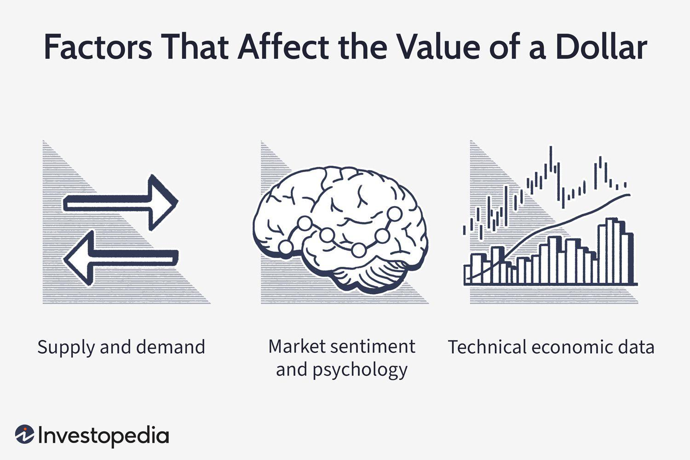

## Table of Contents

## What is dollar pricing?

Dollar pricing is a way of setting prices for products or services using the US dollar as the standard currency. It's common in international trade and business because the US dollar is widely accepted and trusted around the world. When a company uses dollar pricing, it means they set the price of their goods or services in US dollars, no matter where the buyer is located. This can help make pricing clear and easy to understand for everyone, especially in countries where the local currency might change a lot in value.

Using dollar pricing can have some benefits and challenges. One benefit is that it can protect companies from changes in exchange rates. If a company prices its products in dollars, it doesn't have to worry as much about the value of other currencies going up or down. However, it can also be a challenge for customers in other countries. If their local currency is weak compared to the US dollar, the products might seem very expensive to them. This can make it harder for the company to sell its products in those markets.

## Why is dollar pricing important in the economy?

Dollar pricing is important in the economy because it helps make trade easier between different countries. When businesses use the US dollar to set prices, it gives everyone a common way to understand how much things cost. This is really helpful because not all countries use the same money, and the value of money can change from one day to the next. By using dollar pricing, businesses can avoid some of the confusion and risk that comes with dealing with different currencies.

Another reason dollar pricing is important is that it can make the world economy more stable. The US dollar is seen as a strong and reliable currency, so when businesses use it for pricing, it can help keep prices steady even if other currencies are going up and down a lot. This stability can make businesses and customers feel more confident about buying and selling things across borders. However, it's also important to remember that dollar pricing can sometimes make things more expensive for people in countries with weaker currencies, which can affect how much they can buy.

## How does dollar pricing affect consumer behavior?

Dollar pricing can change how people buy things. When prices are in US dollars, it can make things seem more expensive for people who don't use dollars. If their own money is weak compared to the dollar, they might think twice before buying something because it will cost them more. This can make them buy less or look for cheaper options.

On the other hand, dollar pricing can also make people feel more sure about what they're buying. Because the US dollar is used a lot around the world, people might trust it more than their own money. This can make them feel more comfortable spending money on things priced in dollars, especially if they think the price will stay the same over time. So, dollar pricing can make people spend more if they feel safe about it.

## What are the advantages of using dollar pricing for businesses?

Using dollar pricing can help businesses in many ways. One big advantage is that it makes things simpler when selling to different countries. The US dollar is used a lot around the world, so when businesses use it to set prices, it's easier for everyone to understand how much things cost. This can save time and money because businesses don't have to change prices all the time if other currencies go up or down. It also helps businesses plan better because they know how much money they will get for their products.

Another advantage is that dollar pricing can protect businesses from changes in the value of money. If a business prices its products in dollars, it doesn't have to worry as much if the money in other countries gets weaker. This can make it easier for the business to make money and feel more sure about selling things in different places. When businesses feel more sure, they might be more willing to sell to new markets and grow their business.

## Can you explain the psychological impact of dollar pricing on customers?

When businesses use dollar pricing, it can make customers feel different ways. For some people, seeing prices in US dollars can make them feel more sure about what they're buying. The US dollar is used a lot around the world, so people might trust it more than their own money. This can make them feel safe and comfortable spending money on things priced in dollars, especially if they think the price will stay the same over time.

On the other hand, dollar pricing can also make customers feel worried if their own money is weak compared to the US dollar. If things seem too expensive, they might decide not to buy them or look for cheaper options. This can make them feel like they can't afford what they want, which can change how much they spend and what they choose to buy.

## How does dollar pricing differ from other pricing strategies?

Dollar pricing is when businesses set the price of their products or services in US dollars, no matter where the buyer is from. This is different from other pricing strategies like local currency pricing, where businesses set prices in the buyer's own money. With dollar pricing, businesses don't have to change prices if the value of other currencies goes up or down. This can make things simpler and help businesses plan better because they know how much money they will get for their products.

Another common pricing strategy is dynamic pricing, where prices can change based on things like how much people want the product, the time of day, or even who is buying it. Dollar pricing doesn't change like this. It stays the same in US dollars, which can make customers feel more sure about what they're buying. But it can also make things seem more expensive for people in countries with weaker currencies, which is different from other strategies that might try to make prices seem fair to everyone no matter where they live.

## What are the historical origins of dollar pricing?

Dollar pricing started to become important after World War II. At that time, many countries agreed to use the US dollar as a way to set the value of their own money. This was called the Bretton Woods system. It helped make trade easier between countries because everyone had a common way to understand how much things cost. The US dollar was seen as a strong and reliable currency, so it made sense for businesses to use it when selling things to other countries.

Over time, more and more businesses started using dollar pricing, especially as international trade grew. By the 1970s, the Bretton Woods system ended, but the US dollar stayed important in the world economy. Businesses kept using dollar pricing because it helped them deal with the ups and downs of different currencies. Today, dollar pricing is used a lot in industries like oil, technology, and finance, where it helps make things simpler and more stable for everyone involved.

## How do companies implement dollar pricing in their sales strategies?

Companies use dollar pricing by setting the price of their products or services in US dollars, no matter where their customers are. This means they don't have to change the price if the value of other countries' money goes up or down. To do this, they often have to check how much the US dollar is worth compared to other currencies. They might use special tools or work with banks to make sure they know the right exchange rates. This helps them keep their prices the same in dollars, which can make things simpler for them and their customers.

When companies decide to use dollar pricing, they often tell their customers about it on their websites, in their stores, or in their marketing materials. They make sure everyone knows that the prices they see are in US dollars. This can help customers feel more sure about what they're buying, especially if they trust the US dollar. But companies also have to think about how this might affect customers in countries with weaker money. They might need to explain why they use dollar pricing and how it can help keep prices steady, even if it makes things seem more expensive for some people.

## What are the potential drawbacks or challenges of using dollar pricing?

Using dollar pricing can make things harder for some customers. If their own money is weak compared to the US dollar, things can seem very expensive. This might make them buy less or look for cheaper options. It can also make customers feel unsure about spending money because they might not know how much the price will change when they convert it to their own money. This can be a big problem for businesses trying to sell to people in countries with weaker currencies.

Another challenge is that businesses have to keep an eye on exchange rates all the time. If the value of the US dollar changes a lot, it can affect how much money they make. They might need special tools or help from banks to know the right exchange rates. This can take time and money, which can be hard for smaller businesses. Even though dollar pricing can make things simpler in some ways, it can also add new problems that businesses have to deal with.

## How does dollar pricing integrate with dynamic pricing models?

Dollar pricing and dynamic pricing are two different ways businesses can set prices, but they can work together. Dollar pricing means setting the price of products or services in US dollars, no matter where the buyer is from. This helps businesses keep prices the same even if the value of other currencies changes. Dynamic pricing, on the other hand, means changing prices based on things like how much people want the product, the time of day, or who is buying it. When businesses use both strategies together, they set the base price in US dollars but then change it a little bit based on what's happening in the market.

For example, a company might sell its products in US dollars but use dynamic pricing to adjust the price a bit higher during peak times or lower during slow periods. This way, the company keeps the stability and simplicity of dollar pricing but also takes advantage of the flexibility that dynamic pricing offers. It can be a bit tricky to do this because the company has to keep an eye on both the exchange rates and the market conditions. But when done right, it can help the company make more money and meet the needs of different customers better.

## What role does dollar pricing play in international markets?

Dollar pricing helps make trade easier between countries. When businesses set prices in US dollars, it gives everyone a common way to know how much things cost. This is good because not all countries use the same money, and the value of money can change a lot. By using dollar pricing, businesses can avoid some of the confusion and risk that comes with different currencies. This can make it simpler for businesses to sell things in different countries and help them plan better because they know how much money they will get for their products.

In international markets, dollar pricing can make the economy more stable. The US dollar is seen as a strong and reliable currency, so when businesses use it for pricing, it can help keep prices steady even if other currencies are changing a lot. This stability can make businesses and customers feel more confident about buying and selling things across borders. But, dollar pricing can also make things more expensive for people in countries with weaker currencies, which can affect how much they can buy and how they feel about spending money.

## How can advanced analytics improve the effectiveness of dollar pricing strategies?

Advanced analytics can help businesses make dollar pricing work better. By looking at a lot of data, businesses can see how the value of the US dollar changes compared to other money. They can also see how much people want to buy their products in different countries. With this information, businesses can set prices that make sense for everyone. They can make sure their prices are not too high for people with weaker money and not too low for people with stronger money. This can help them sell more and make more money.

Analytics can also help businesses change their prices quickly if they need to. If the value of the US dollar goes up or down a lot, businesses can use analytics to see what's happening and change their prices to match. This can keep their prices fair and help them stay competitive in different markets. By using advanced analytics, businesses can make dollar pricing work better and help them grow in international markets.

## What is the interplay between algo trading and currency pricing?

Algorithmic trading has become a pivotal force in the currency markets, significantly influencing currency pricing through the execution of large volumes of trades based on precise algorithms. These algorithmic activities can impact the supply and demand dynamics within the foreign exchange (Forex) market, consequently affecting exchange rates.

To understand the influence of algorithmic trading on currency pricing, consider a simplified model where algorithmic traders detect an [arbitrage](/wiki/arbitrage) opportunity between two currencies. The algorithm may buy a currency at a lower price in one market and simultaneously sell it at a higher price in another market. This operation adjusts the prices as it increases demand on the buy side and supply on the sell side, thereby narrowing the price difference and stabilizing the market.

The stabilization function of algorithmic trading is crucial, as it adds liquidity to the markets, facilitating smoother transactions and reducing bid-ask spreads. By doing so, algorithmic trading can contribute to more efficient market conditions, allowing traders to execute large [volume](/wiki/volume-trading-strategy) trades with minimal price impact.

However, while algorithmic trading often stabilizes the market, it can also lead to increased volatility under certain circumstances. For example, during times of market stress or when there are errors in the trading algorithms, there can be abrupt and significant price movements, often described as "flash crashes." These occur when algorithms execute a large number of trades in response to market signals, magnifying price swings.

Moreover, the interaction between multiple algorithmic trading strategies can create complex feedback loops, further influencing volatility. When multiple strategies rapidly react to price changes without human intervention, it can lead to cascading price movements, amplifying short-term volatility.

Mathematically, the influence of algorithmic trading on currency pricing can be modeled through supply and demand equations. Let $S$ denote supply and $D$ denote demand for a currency. Algorithmic trading can be considered as a [factor](/wiki/factor-investing) adjusting both $S$ and $D$:

$$
P = \frac{D - S}{S + D + K}
$$

where $P$ represents the price level and $K$ is a stabilizing constant provided by the liquidity added by algorithmic trading.

In conclusion, the interplay between algorithmic trading and currency pricing is complex, marked by both market stabilization and potential for increased volatility. The challenge lies in balancing these effects to harness the benefits of algorithmic trading while mitigating its risks.

## References & Further Reading

[1]: Chaboud, A. P., Chiquoine, B., Hjalmarsson, E., & Vega, C. (2014). ["Rise of the Machines: Algorithmic Trading in the Foreign Exchange Market."](https://www.jstor.org/stable/43612951) The Journal of Finance, 69(5), 2045-2084.

[2]: Kirilenko, A. A., Kyle, A. S., Samadi, M., & Tuzun, T. (2017). ["The Flash Crash: High‐Frequency Trading in an Electronic Market."](https://www.jstor.org/stable/26652722) The Journal of Finance, 72(3), 1303-1341.

[3]: Lopez de Prado, M. (2018). ["Advances in Financial Machine Learning."](https://www.amazon.com/Advances-Financial-Machine-Learning-Marcos/dp/1119482089) Wiley.

[4]: Chan, E. P. (2008). ["Quantitative Trading: How to Build Your Own Algorithmic Trading Business."](https://github.com/egorpe/EPChan-QuantitativeTrading/blob/master/example7_6.m) Wiley.

[5]: Jansen, S. (2018). ["Machine Learning for Algorithmic Trading."](https://github.com/stefan-jansen/machine-learning-for-trading) Packt Publishing.

[6]: Aronson, D. R. (2006). ["Evidence-Based Technical Analysis: Applying the Scientific Method and Statistical Inference to Trading Signals."](https://www.amazon.com/Evidence-Based-Technical-Analysis-Scientific-Statistical/dp/0470008741) Wiley.