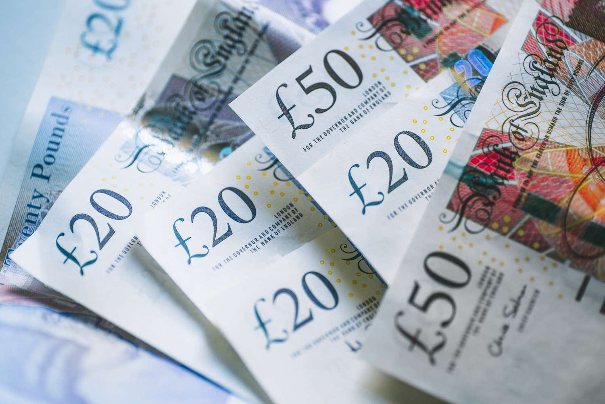

## Table of Contents

## What is a dollar roll?

A dollar roll is a type of financial transaction that involves trading mortgage-backed securities (MBS) for cash. In this deal, one party sells MBS to another party and agrees to buy them back later at a higher price. This is similar to a loan where the MBS act as collateral. The difference between the selling and buying price is like the interest on the loan.

People use dollar rolls to manage their money better. For example, someone who needs cash now can sell their MBS and get it back later. On the other hand, someone who has extra cash can buy MBS and earn a profit when they sell them back. It's a way for both parties to meet their short-term financial needs while dealing with mortgage-backed securities.

## How does a dollar roll work?

A dollar roll is a deal where someone sells mortgage-backed securities (MBS) to another person and promises to buy them back later for a higher price. It's like borrowing money, but instead of using cash as collateral, you use MBS. The difference between the price you sell the MBS for and the price you buy them back at is like the interest you pay on the loan. 

People use dollar rolls when they need cash quickly or want to invest extra money for a short time. If you need money now, you can sell your MBS and agree to buy them back later. This gives you the cash you need right away. On the other hand, if you have extra money, you can buy MBS from someone else and earn a profit when they buy them back from you. It's a way to help both people meet their short-term money needs while dealing with mortgage-backed securities.

## What are the key components of a dollar roll transaction?

A dollar roll transaction has a few main parts. First, there's the mortgage-backed securities (MBS) that get traded. These are bundles of home loans that are sold to investors. In a dollar roll, one person sells these MBS to another person. Second, there's the cash part of the deal. The person buying the MBS gives cash to the seller, which is like a short-term loan.

The other important parts are the agreement to buy back the MBS and the price difference. The seller agrees to buy the MBS back from the buyer at a later date. The price they agree to buy them back at is higher than the price they sold them for. This difference in price is like the interest on the loan. So, a dollar roll is a way for people to use MBS to borrow or lend money for a short time.

## Who typically uses dollar rolls and why?

Dollar rolls are often used by banks, mortgage lenders, and investors who deal with mortgage-backed securities (MBS). These groups use dollar rolls to manage their money better. For example, a bank might need quick cash to meet its short-term needs. By selling its MBS in a dollar roll, the bank gets the money it needs right away and agrees to buy the MBS back later. This helps the bank keep running smoothly without having to sell off its MBS permanently.

Investors also use dollar rolls to make money. If an investor has extra cash, they can buy MBS from someone else in a dollar roll. When the original owner buys the MBS back at a higher price, the investor makes a profit. This is a good way for investors to earn money on their cash for a short time. So, dollar rolls help both people who need quick cash and those who want to invest their money for a little while.

## What are the benefits of engaging in dollar roll transactions?

Dollar rolls can help people who need quick cash. If you have mortgage-backed securities (MBS) and you need money right away, you can sell your MBS in a dollar roll. You get the cash you need now and agree to buy the MBS back later. This way, you don't have to sell your MBS forever, and you can still use them to get money when you need it. It's like borrowing money, but instead of using cash as collateral, you use MBS.

For people who have extra money, dollar rolls can be a good way to make a profit. If you have cash to spare, you can buy MBS from someone else in a dollar roll. When the person who sold you the MBS buys them back at a higher price, you make money on the deal. It's a short-term way to earn money on your cash. So, dollar rolls help both people who need cash quickly and those who want to invest their money for a short time.

## What are the risks associated with dollar rolls?

Dollar rolls can be risky. One big risk is that the price of mortgage-backed securities (MBS) might change. If the price of MBS goes down, the person who agreed to buy them back later might have to pay more than they're worth. This could lead to a loss. Also, if the person who sold the MBS can't buy them back, the buyer might be stuck with MBS they didn't want to keep long-term.

Another risk is [interest rate](/wiki/interest-rate-trading-strategies) changes. If interest rates go up, the value of MBS usually goes down. This can make the dollar roll less profitable or even cause a loss. Plus, there's always the chance that the other person in the deal might not be able to keep their promise. If they can't pay back the money or buy back the MBS, it can cause problems. So, it's important to think about these risks before getting into a dollar roll.

## How do dollar rolls impact the mortgage-backed securities market?

Dollar rolls can affect the mortgage-backed securities (MBS) market in a few ways. When people use dollar rolls, they are buying and selling MBS more often. This can make the MBS market more active and liquid. More trading means it's easier for people to buy and sell MBS when they need to. This can help keep the market running smoothly and make it easier for people to use MBS as a way to borrow or invest money.

But dollar rolls can also add some risk to the MBS market. If a lot of people are using dollar rolls and the price of MBS goes down, it can cause problems. People who agreed to buy back MBS might lose money if the price drops too much. Also, if someone can't buy back the MBS they sold, it can make the market less stable. So, while dollar rolls can help keep the MBS market active, they can also make it riskier if not managed carefully.

## What is the difference between a dollar roll and a repurchase agreement?

A dollar roll and a repurchase agreement, or repo, are both ways to borrow money using securities as collateral, but they work a bit differently. In a dollar roll, someone sells mortgage-backed securities (MBS) and agrees to buy them back later at a higher price. The difference between the selling and buying price is like the interest on the loan. Dollar rolls are mostly used with MBS and help people manage their money better by using these securities.

On the other hand, a repurchase agreement, or repo, is a deal where someone sells any type of security, not just MBS, to another person and agrees to buy it back later. Like a dollar roll, the price to buy back the security is higher, and this difference is the interest. Repos are often used for short-term borrowing and can involve different kinds of securities, making them more flexible than dollar rolls. So, while both are ways to borrow money using securities, dollar rolls focus on MBS, and repos can use any security.

## How are dollar rolls priced and what factors influence their pricing?

Dollar rolls are priced based on the difference between the price at which the mortgage-backed securities (MBS) are sold and the price at which they are bought back. This difference, known as the "drop," acts like the interest on the loan. The price of the MBS at the time of the sale, the expected price when they are bought back, and the length of time until the buyback all play a role in setting the drop. If the MBS are expected to be worth more when they are bought back, the drop will be smaller. If they are expected to be worth less, the drop will be bigger to cover the risk.

Several factors can influence the pricing of dollar rolls. The most important is the overall market conditions for MBS. If the market is strong and MBS prices are expected to go up, the drop will be smaller because the risk is lower. Interest rates also affect pricing. If interest rates are expected to rise, the value of MBS might go down, leading to a bigger drop to account for this risk. Lastly, the creditworthiness of the people involved in the deal can impact pricing. If there's a risk that one party might not be able to buy back the MBS, the drop might be larger to cover this risk.

## What role do dollar rolls play in financial strategy and portfolio management?

Dollar rolls can be a useful tool for people who manage money. They help banks and investors handle their cash better. For example, if a bank needs money quickly, it can sell its mortgage-backed securities (MBS) in a dollar roll and get the cash it needs right away. The bank agrees to buy the MBS back later, so it doesn't have to sell them forever. This way, the bank can keep its MBS and still get the money it needs to run smoothly. Investors can also use dollar rolls to make money on their extra cash. They can buy MBS from someone else and earn a profit when the original owner buys them back at a higher price.

But dollar rolls can also be risky, so people need to think carefully about how they use them. If the price of MBS goes down, the person who agreed to buy them back might lose money. Changes in interest rates can also affect the value of MBS, making dollar rolls less profitable or even causing losses. People who use dollar rolls need to watch the market closely and make sure they can handle these risks. By using dollar rolls wisely, banks and investors can manage their money better and take advantage of short-term opportunities in the MBS market.

## How have regulatory changes affected the use of dollar rolls?

Regulatory changes have made banks and investors more careful about using dollar rolls. After the financial crisis in 2008, rules got stricter to make sure banks and investors don't take too many risks. These rules, like the Dodd-Frank Act, made banks hold more money in reserve and be more open about their deals. This means banks think twice before using dollar rolls because they need to make sure they have enough cash to cover any risks.

Even with these changes, dollar rolls are still used but in different ways. Banks and investors now use dollar rolls more for short-term needs and are more careful about the risks. They watch the market closely and make sure they can handle any changes in MBS prices or interest rates. So, while regulatory changes have made dollar rolls more complicated, they haven't stopped people from using them altogether.

## Can you provide a case study or example of a dollar roll transaction in practice?

Imagine a bank called ABC Bank that has a lot of mortgage-backed securities (MBS) but needs some quick cash to cover its short-term costs. ABC Bank decides to do a dollar roll with an investor named John. ABC Bank sells $1 million worth of MBS to John and agrees to buy them back in 30 days for $1.01 million. This gives ABC Bank the $1 million it needs right away, and John gets to earn a profit of $10,000 in a month.

After 30 days, ABC Bank buys back the MBS from John for $1.01 million, just as they agreed. During this time, the value of the MBS stayed the same, so ABC Bank doesn't lose any money on the MBS itself. John is happy because he made a $10,000 profit on his investment. ABC Bank is also happy because it got the cash it needed and now has its MBS back. This dollar roll helped both ABC Bank and John meet their short-term financial needs.

## What is Framing Dollar Roll Transactions?

Mortgage-backed securities (MBS) represent a critical component of the global financial market, and among the mechanisms involved in trading them, dollar roll transactions hold notable significance.

### Concept of Dollar Roll Transactions

A dollar roll transaction involves the sale of a mortgage-backed security by an investor with an agreement to repurchase a substantially similar security at a later date. Essentially, the investor sells a mortgage pool with the right to buy back a similar one in the future. The repurchase price is pre-determined, allowing traders to leverage this difference to potentially earn gains.

### Mechanics and Profit Mechanisms

The process begins with an investor selling a MBS for delivery in the current month while simultaneously agreeing to purchase a substantially similar MBS in a future month. The difference between the sale price and the repurchase price creates an opportunity for profit, often termed the "drop." The "drop" is influenced by various factors, including interest rates, [liquidity](/wiki/liquidity-risk-premium) premiums, and market demand for MBS. The expectation is that the repurchase price will be lower, allowing the investor to profit from the transaction.

For example, the mathematical profit from a dollar roll can be represented as:

$$
\text{Profit} = (\text{Sell Price} - \text{Buy Price} + \text{Interest Earned}) - \text{Transaction Costs}
$$

### Dollar Roll vs. Short Selling

While dollar roll transactions and short selling both involve agreements to buy back securities at a future date, the two strategies differ fundamentally. In short selling, an investor borrows a security to sell it with the aim of repurchasing it later at a lower price, hoping to profit from a decline in value. Dollar rolls, however, are not dependent on price depreciation but rather market conditions that favor a beneficial difference or "drop" in prices between the initial sale and repurchase of MBS.

### Benefits for Traders and Financial Institutions

Traders and financial institutions find dollar rolls attractive due to multiple advantages:

1. **Liquidity Enhancement**: Dollar rolls provide liquidity to the MBS market by facilitating the buying and selling of MBS without actually transferring ownership, thus contributing to market fluidity.

2. **Cost Efficiency**: By engaging in dollar rolls, institutions can manage their balance sheets more effectively, reducing the need for outright cash payments immediately while managing their inventory of securities.

3. **Interest Rate Management**: Dollar rolls allow institutions to manage interest rate exposures effectively. By staggering transactions over time, institutions can hedge against interest rate volatility, benefiting from periods of favorable rate movements.

Dollar roll transactions provide essential operational efficiency, giving investors flexibility in portfolio management and enabling them to adapt to changing market circumstances.

## References & Further Reading

[1]: Fabozzi, F. J. (2006). ["The Handbook of Mortgage-Backed Securities"](https://academic.oup.com/book/7943). McGraw-Hill Education.

[2]: Vink, D., & Thibeault, A. (2008). ["ABS, MBS and CDO Compared"](https://repository.vlerick.com/bitstream/handle/20.500.12127/2806/Vink_D_WP_ABSMBSandCDOCompared.pdf?sequence=1). Tilburg University. 

[3]: Narang, R. K. (2013). ["Inside the Black Box: A Simple Guide to Quantitative and High Frequency Trading"](https://onlinelibrary.wiley.com/doi/book/10.1002/9781118662717). Wiley.

[4]: Duhigg, C. (2008). ["The Reckoning: Pressured to Take More Risk, Fannie Reached Tipping Point"](https://www.nytimes.com/2008/10/05/business/05fannie.html). The New York Times.

[5]: Vayanos, D., & Wang, J. (2012). ["Theoretical Foundations of Financial Intermediation and the Real Economy"](https://www.scirp.org/reference/referencespapers?referenceid=2336730). The Review of Financial Studies.

[6]: Jarrow, R. A. (2018). ["Mortgage-Backed Securities: Markets, Costs, and Risks"](https://www.semanticscholar.org/paper/Commercial-Mortgage-Backed-Securities-(CMBS)-and-to-Christopoulos-Jarrow/7f89d41e805d8f370c81987b7e4ede4cf7f2e3d8). Johnson School Research Paper Series.

[7]: Aldridge, I. (2013). ["High-Frequency Trading: A Practical Guide to Algorithmic Strategies and Trading Systems"](https://www.amazon.com/High-Frequency-Trading-Practical-Algorithmic-Strategies/dp/1118343506). Wiley.

[8]: Chacko, G., & Sjöman, A. (2005). ["Neural Networks for High Frequency Trading"](https://books.google.com/books/about/Credit_Derivatives.html?id=nCyDSVcd_G8C). Harvard Business School Working Paper. 

[9]: Black, F., Miller, M., & Posner, S. (2023). ["Interest Rate Risk in the Mortgage-Backed Securities and Dollar Roll Market"](https://papers.ssrn.com/sol3/papers.cfm?abstract_id=908569). Financial Analysts Journal.