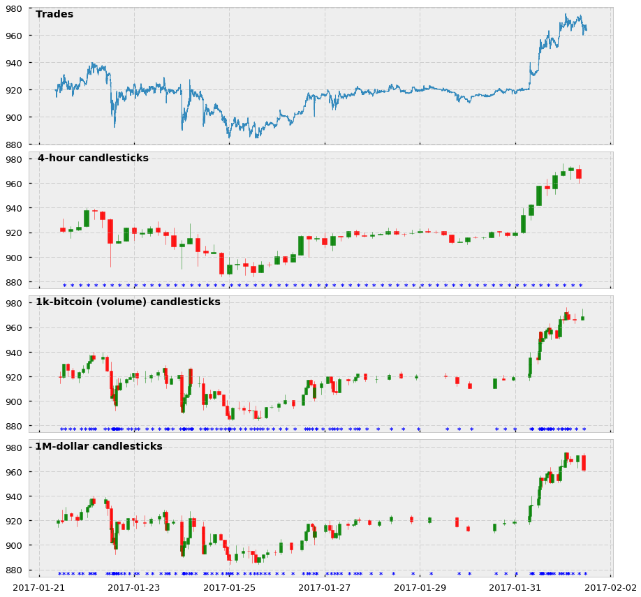

## Table of Contents

## What are Dollar Runs Bars (DRBs)?

Dollar Runs Bars (DRBs) are a type of financial product that helps people invest their money. They are called "Dollar Runs Bars" because they are measured in dollars and they "run" or change in value over time. People buy DRBs hoping that their value will go up so they can sell them later for more money than they paid.

DRBs are often used by investors who want to spread their money across different types of investments. This can help lower the risk of losing money. For example, someone might buy DRBs along with stocks and bonds. By doing this, they hope to balance out any losses in one area with gains in another.

## How do DRBs differ from traditional bars?

DRBs are different from traditional bars because they are a type of financial product, not a physical item you can touch. Traditional bars are usually made of materials like gold or silver, and people buy them to own something valuable. On the other hand, DRBs are measured in dollars and their value can go up or down over time, depending on the market.

Another way DRBs differ from traditional bars is that they are used for investing. People buy DRBs to try to make money over time, hoping their value will increase so they can sell them for a profit. Traditional bars, like gold bars, are often seen as a safe way to store wealth, but they don't change in value as quickly as DRBs do. This makes DRBs a more active investment choice compared to holding onto traditional bars.

## What is the history behind the concept of DRBs?

The concept of Dollar Runs Bars (DRBs) started a few years ago when people wanted new ways to invest their money. They saw that the value of the dollar could change a lot, so they thought it would be a good idea to create a product that used these changes to help people make money. This is how DRBs were born. They were designed to be easy to understand and buy, so more people could start investing.

At first, DRBs were not very popular because people did not know much about them. But as more people learned about how they worked, they started to see the benefits. DRBs became more common as a way to spread out investment risks. Now, many people use DRBs along with other investments like stocks and bonds to try to make more money and keep their savings safe.

## How does the pricing model work in DRBs?

The pricing model for Dollar Runs Bars (DRBs) is based on how the value of the dollar changes over time. When you buy a DRB, its price is set in dollars. If the dollar becomes more valuable, the price of your DRB goes up. If the dollar becomes less valuable, the price of your DRB goes down. This means that the price of DRBs can change every day, depending on what's happening with the dollar.

People who invest in DRBs are hoping that the dollar will become more valuable over time. If that happens, they can sell their DRBs for more money than they paid for them. But it's also a risk because if the dollar loses value, they might have to sell their DRBs for less than they paid. That's why it's important for people to keep an eye on what's happening with the dollar when they invest in DRBs.

## What are the typical offerings at a DRB?

When you buy a Dollar Runs Bar (DRB), you are getting a chance to invest in the value of the dollar. The main thing you get is the DRB itself, which is measured in dollars. The price of your DRB can go up or down depending on what happens with the dollar. If the dollar gets more valuable, your DRB will be worth more. If the dollar loses value, your DRB will be worth less.

Besides the DRB, you might also get some help from the company that sells them. They can give you advice on when to buy or sell your DRBs, and they might have tools to help you keep track of how your DRBs are doing. This can make it easier for you to decide what to do with your investment.

## Who is the target audience for DRBs?

The target audience for Dollar Runs Bars (DRBs) is people who want to try new ways to invest their money. These are often people who already have some experience with investing and want to add something different to their mix of investments. They might be looking for ways to spread out their risks and hope to make more money by betting on changes in the value of the dollar.

DRBs can also be good for people who like to keep a close eye on their investments. These people enjoy watching the market and making decisions about when to buy or sell. They are willing to take on some risk because they think they can make good choices about their DRBs.

## What are the operational challenges of running a DRB?

Running a Dollar Runs Bars (DRB) business can be tricky because the value of the dollar changes all the time. This means the people who run the DRB business need to watch the market closely every day. They have to make sure they set the right prices for the DRBs so that people will want to buy them. If they get the prices wrong, they might lose money or make their customers unhappy.

Another challenge is helping people understand how DRBs work. Many people might not know about DRBs and might be scared to try them. The people running the DRB business need to explain everything clearly and make sure their customers feel safe investing their money. They also need to offer good advice and tools to help people make smart choices about when to buy or sell their DRBs.

## How can a DRB be marketed effectively?

To market Dollar Runs Bars (DRBs) effectively, it's important to explain them in a simple way that people can understand. Many people might not know what DRBs are, so using clear language and examples can help. You can show how DRBs work by telling stories about people who have used them to make money. It's also a good idea to use ads on the internet and social media to reach a lot of people. These ads should show how easy it is to start investing in DRBs and how they can help people reach their money goals.

Another way to market DRBs is to offer help and advice to people who are thinking about buying them. This can make people feel more confident about trying DRBs. You can have experts talk to people about how DRBs work and answer their questions. Hosting webinars or workshops can be a good way to do this. It's also helpful to have a website with tools that let people see how DRBs might help them make money. By doing these things, you can show people that DRBs are a good choice for their investments.

## What are the legal considerations when operating a DRB?

When you run a Dollar Runs Bars (DRB) business, you have to follow a lot of rules to make sure you are doing things the right way. One important rule is that you need to be honest with people about what they are buying. You have to tell them all about the risks of investing in DRBs and not hide anything that could affect their decision. This is called being transparent. You also need to make sure you have the right licenses and permissions to sell DRBs. Different places might have different rules, so you need to check what you need in your area.

Another big thing to think about is protecting the money people invest in DRBs. You need to keep their money safe and separate from your own money. This helps make sure that if something goes wrong with your business, their money is still safe. You also need to follow rules about how you can use the money people invest. There are laws that say you can't use it for things that are not allowed. It's a good idea to work with lawyers who know about these rules to make sure you are doing everything right.

## How do DRBs impact local economies?

Dollar Runs Bars (DRBs) can help local economies by bringing in more money from people who want to invest. When people buy DRBs, they are putting their money into the local economy. This can help businesses grow and create more jobs. If the value of the dollar goes up, people might feel richer and spend more money, which is good for shops and restaurants in the area.

On the other hand, DRBs can also be risky for local economies. If the value of the dollar goes down, people who invested in DRBs might lose money. This can make them feel less confident about spending money, which can hurt local businesses. It's important for people running DRBs to explain the risks clearly so that everyone understands what could happen.

## What innovations have been introduced in DRBs to enhance customer experience?

To make the experience better for people who use Dollar Runs Bars (DRBs), new tools have been added to help them understand and manage their investments. One big change is the use of easy-to-use apps and websites. These tools let people see how their DRBs are doing at any time and get advice on when to buy or sell. They also have simple charts and graphs that show how the value of the dollar is changing, which helps people make smart choices about their money.

Another innovation is better customer support. Now, people can talk to experts who know a lot about DRBs and get help with any questions they have. This can be through live chats, phone calls, or even video calls. By offering this kind of help, people feel more confident about investing in DRBs. It also makes them more likely to keep using the service and tell their friends about it.

## What are the future trends and potential developments for DRBs?

In the future, Dollar Runs Bars (DRBs) might become even easier to use. People could see new apps and tools that help them buy and sell DRBs with just a few clicks on their phone. These tools might use smart technology, like artificial intelligence, to give better advice on when to invest. This could make more people want to try DRBs because they will feel safer and more in control of their money.

Another trend could be that DRBs start to work with other types of investments, like stocks and bonds, in new ways. This could help people spread out their risks even more. Companies might also find new ways to explain DRBs better, so more people understand them. This could make DRBs more popular and help local economies grow by bringing in more investment money.

## What are the concept and benefits of Dollar Runs Bars?

Dollar runs bars (DRBs) represent a novel method of aggregating market data based on the financial value exchanged rather than the passage of time or the number of trades. Unlike traditional time-based bars, which can suffer from inefficiency by capturing unnecessary data during inactive periods or missing crucial information during peak trading activity, DRBs focus on the volume of capital moving through the market. This ensures that the data captured is directly relevant to the trading interest and not merely reflective of an arbitrary timeline.

The fundamental concept behind dollar runs bars is to use the monetary value as the primary determinant for forming a new bar. This approach means that a new DRB is created only once a predetermined amount of money has changed hands in the marketplace. Such a methodology aligns data sampling with genuine market interest and activity, providing traders with a more accurate representation of price action.

One mathematical representation of DRBs involves setting a threshold $V$ in dollars, and aggregating trades until their cumulative value reaches or exceeds $V$. Suppose trades $T_1, T_2, ..., T_n$ occur sequentially, each with respective values $v_1, v_2, ..., v_n$. A new dollar runs bar is formed when:

$$
\sum_{i=1}^{m} v_i \geq V
$$

where $m$ is the minimal number of trades required to reach or exceed the threshold $V$. This method offers superior adaptability compared to static structures like time or tick bars, which may misrepresent true market dynamics due to fixed interval sampling.

The benefits of implementing DRBs in trading strategies are manifold. Firstly, they alleviate the risk of oversampling during low-activity periods and undersampling during high-[volatility](/wiki/volatility-trading-strategies) phases. By dynamically adjusting to market conditions, DRBs can offer more granular insights, which are particularly beneficial for high-frequency trading strategies. Moreover, securities with significant price volatility benefit greatly from DRBs, as they ensure that major financial decisions are made based on meaningful data reflective of substantial market movements. As a result, DRBs enable traders to detect and exploit price patterns that time-based bars might overlook, potentially leading to improved trading performance and profitability.

## References & Further Reading

[1]: Bergstra, J., Bardenet, R., Bengio, Y., & Kégl, B. (2011). ["Algorithms for Hyper-Parameter Optimization."](https://papers.nips.cc/paper/4443-algorithms-for-hyper-parameter-optimization) Advances in Neural Information Processing Systems 24.

[2]: ["Advances in Financial Machine Learning"](https://www.amazon.com/Advances-Financial-Machine-Learning-Marcos/dp/1119482089) by Marcos Lopez de Prado

[3]: ["Evidence-Based Technical Analysis: Applying the Scientific Method and Statistical Inference to Trading Signals"](https://www.amazon.com/Evidence-Based-Technical-Analysis-Scientific-Statistical/dp/0470008741) by David Aronson

[4]: ["Machine Learning for Algorithmic Trading"](https://github.com/stefan-jansen/machine-learning-for-trading) by Stefan Jansen

[5]: ["Quantitative Trading: How to Build Your Own Algorithmic Trading Business"](https://books.google.com/books/about/Quantitative_Trading.html?id=j70yEAAAQBAJ) by Ernest P. Chan