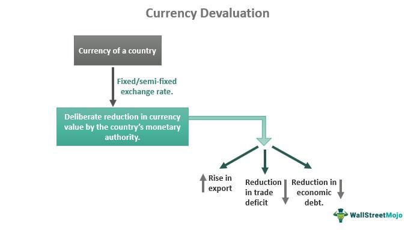

In today's interconnected global economy, the significance of the U.S. dollar extends far beyond national borders, exerting considerable influence on international trade, finance, and economic stability. As the world's primary reserve currency, the value and availability of the U.S. dollar are pivotal for global transactions. This profound role makes economies vulnerable to currency crises, events often marked by severe devaluations that disrupt financial systems both locally and internationally.

Currency crises can trigger economic instability through mechanisms such as hyperinflation, reduced capital flows, and diminished investor confidence. These disruptions frequently present challenges, impacting trade balances, interest rates, and government policies. Factors contributing to currency crises include economic mismanagement, political turmoil, and external shocks, making them complex phenomena with wide-ranging implications.



In navigating these turbulent economic landscapes, algorithmic trading has emerged as a crucial instrument. This technologically advanced approach involves the automatic execution of trades based on pre-established criteria, enabling rapid responses to volatile market conditions. Through the use of sophisticated algorithms and real-time data analysis, algorithmic trading allows market participants to mitigate risks and capitalize on swift price movements, thus providing a degree of stability amidst uncertainty.

This article examines the intricate relationship between currency crises, the dominant role of the U.S. dollar, and the strategic advantages offered by algorithmic trading. By exploring these topics, we aim to provide a comprehensive understanding of how nations and investors can adapt to and manage the complexities associated with currency crises.

## Table of Contents

## Understanding Currency Crises and Dollar Shortages

A dollar shortage manifests when a country lacks sufficient U.S. dollar reserves to fulfill its international trade obligations. This scenario typically arises when a nation’s demand for imports surpasses the revenue generated from its exports. The U.S. dollar (USD) plays a crucial role as the global reserve currency, which is predominantly used in international trade transactions. This status amplifies the repercussions of a dollar shortage, affecting not only the nation in question but also other global economies due to the interconnected nature of trade and finance.

Historically, currency crises often emerge during times of economic uncertainty, political instability, or as a result of flawed economic policies. Notable examples include the Latin American debt crisis in the 1980s, which was precipitated by excessive borrowing and eventual inability to service debt, leading to a devaluation of local currencies. Similarly, the 1997 Asian Financial Crisis highlighted vulnerabilities in economies with fixed exchange rate systems and large short-term private foreign debts.

Dollar shortages can also occur when countries face economic sanctions. Such sanctions restrict access to international markets and financial systems, compelling nations to find alternative trade and currency solutions. A recent example is Iran, which encountered severe dollar shortages due to U.S. sanctions, impacting its ability to participate in global trade.

Global economic events, such as the COVID-19 pandemic, can also trigger dollar shortages. The pandemic led to an abrupt decline in international trade and a subsequent scramble for dollar [liquidity](/wiki/liquidity-risk-premium) as countries sought to stabilize their economies. This sudden demand exposed the vulnerability of countries heavily reliant on USD, as businesses and governments worldwide required more dollars to service foreign debts and pay for essential imports.

Understanding the intricate dynamics behind dollar shortages and currency crises is pivotal for policymakers and financial institutions. By addressing the underlying causes—whether they be trade imbalances, reliance on foreign capital, or external shocks—countries can better prepare to mitigate the economic instability these situations cause.

## Economic Impact and Case Studies of Dollar Shortages

Currency shortages have profound implications for national economies, often exacerbating economic contractions through a cascade of adverse effects including hyperinflation, capital flight, reduced GDP growth, and increased unemployment rates. These phenomena result from a severe imbalance between the demand for and supply of foreign currency, particularly the U.S. dollar, which serves as a cornerstone of international trade and finance.

Numerous case studies provide empirical evidence of these effects. Nigeria, for instance, has repeatedly faced economic challenges precipitated by dollar shortages. A notable consequence of this scarcity is the increased cost of imports, particularly evident in the pharmaceutical sector where reliance on imported goods is substantial. The dollar shortage has therefore led to higher operational costs for businesses and inflated prices for consumers, thereby intensifying economic strain. This supply bottleneck further contributes to the depreciation of the Naira, Nigeria's national currency, compounding economic vulnerabilities and creating a cycle of devaluation and inflation.

In Qatar, dollar shortages have similarly disrupted economic stability. The blockade in 2017, imposed by neighboring countries, underscored the vulnerability of Qatar’s economic landscape to currency shortages. The resulting pressure on foreign exchange reserves led to inflationary pressures domestically, as the cost of living rose due to increased prices for imported goods. Although Qatar managed to stabilize its economy through strategic financial management and diversification, the incident exemplifies the crucial role of maintaining robust foreign currency reserves.

Sudan’s experience further illustrates the economic impact of dollar shortages. Political instability, coupled with long-standing economic sanctions, has constrained Sudanese access to the global financial system, leading to chronic shortages of foreign currency. This scarcity has stoked hyperinflation, depreciated the national currency, and pushed inflation rates to some of the highest levels globally. Economic measures such as subsidy removals and currency devaluations, while necessary, have also contributed to the socio-economic distress experienced by the population.

These case studies underline the multi-faceted effects of dollar shortages. They highlight the critical importance for countries to maintain strong international dollar reserves and to develop resilient economic policies capable of withstanding external shocks. The ability to navigate the complex terrain of international finance is indispensable for economic stability, particularly for emerging and frontier markets vulnerable to global currency dynamics.

## Role of Foreign Exchange Markets During Crises

Foreign exchange ([forex](/wiki/forex-system)) markets are pivotal in determining the value and liquidity of currencies worldwide. They play a fundamental role in international trade and financial stability by facilitating the conversion of one currency into another. Forex markets are sensitive to a wide array of economic indicators, such as interest rates, inflation, and political stability, which influence currency values. During periods of economic stability, these markets typically exhibit relatively predictable patterns. However, during crises, they face significant [volatility](/wiki/volatility-trading-strategies), which can have both negative and positive consequences on economies globally.

**Volatility During Crises**

Forex market volatility increases substantially during crises due to sudden shifts in economic indicators and investor sentiment. This heightened volatility can exacerbate economic disruptions by causing abrupt currency devaluations or appreciations, leading to imbalances in trade and prompting capital flight or inflows. Despite these challenges, heightened volatility also presents opportunities for traders who can effectively manage risk and capitalize on swift market movements.

For instance, during the 1997 Asian Financial Crisis, rapid devaluation of regional currencies occurred as investor confidence waned. The Thai baht, Malaysian ringgit, and Indonesian rupiah experienced sharp declines due to a combination of speculative attacks and weaknesses in financial structures. This currency depreciation resulted in increased debt burdens for these countries, as much of their liabilities were denominated in foreign currencies.

**Intervention by Central Banks**

Central banks and governments sometimes intervene in forex markets to stabilize their currencies. Such interventions might involve direct buying or selling of currencies to influence supply and demand dynamics or adjusting interest rates to deter capital outflows. While interventions can be effective in the short term, they come with risks, such as depletion of foreign reserves and potential ineffectiveness if market pressures are too strong.

The 1992 European Exchange Rate Mechanism (ERM) crisis exemplifies the complexities of such interventions. The pound sterling faced intense speculative pressure, and despite efforts by the Bank of England to defend its value, including raising interest rates and purchasing sterling, it was ultimately forced to [exit](/wiki/exit-strategy) the ERM. This event, commonly referred to as "Black Wednesday," highlighted the limitations central banks encounter when confronting market forces.

**Trade Opportunities Amidst Volatility**

The volatile nature of forex markets during crises can be advantageous for traders using sophisticated strategies to exploit price fluctuations. Traders equipped with robust risk management systems and advanced algorithms can benefit from the swift movements in currency values. These trading activities, while profit-driven, also contribute to market liquidity, which is crucial during turbulent periods.

In summary, forex markets are indispensable in the global economy, especially during crises, shaping currency values and economic outcomes. Although central bank interventions aim to stabilize these markets, their success is variable and context-dependent. Significant historical events, such as the 1997 Asian Financial Crisis and the 1992 ERM crisis, underscore the impactful role of forex markets and the importance of strategic navigation during periods of economic turbulence.

## Algorithmic Trading and Its Advantages in Crisis Scenarios

Algorithmic trading, often referred to as algo trading, has transformed financial markets by allowing for the automatic execution of trades using advanced mathematical models and pre-set rules. Its capacity for rapid market adaptation makes it particularly advantageous during currency crises, where market volatility is high and swift decision-making is crucial.

During currency crises, market conditions can change rapidly, leading to swift price fluctuations and heightened risk. Algorithmic trading systems can process vast amounts of data in real-time, enabling traders to mitigate these risks and seize opportunities. These systems utilize algorithms that can instantly execute complex trading strategies based on real-time data inputs, thereby reducing the impact of human error and emotional bias in high-pressure environments.

Machine learning and predictive models significantly enhance the adaptability of trading strategies. For example, during the 2015 Swiss Franc crisis, [algorithmic trading](/wiki/algorithmic-trading) systems were able to recalibrate their models in response to unexpected currency de-pegging, thereby minimizing losses and adapting to the new market equilibrium. Similarly, during the 2019 Turkish Lira episode, predictive models allowed traders to anticipate market movements and adjust their trading strategies accordingly, capitalizing on the volatility while managing downside risks.

Python, with its extensive libraries and tools, plays a crucial role in developing and implementing these advanced trading algorithms. Libraries like NumPy and pandas facilitate data handling and analysis, while [machine learning](/wiki/machine-learning) frameworks such as TensorFlow and scikit-learn allow for the creation of sophisticated predictive models. Below is a simple example of how algorithmic trading can be implemented in Python to execute trades based on pre-defined conditions:

```python
import pandas as pd
import numpy as np
from sklearn.linear_model import LinearRegression

# Example market data
data = pd.DataFrame({
    'price': np.random.rand(100),  # Simulated price data
    'volume': np.random.rand(100)  # Simulated volume data
})

# Define a simple trading strategy using linear regression
def trading_strategy(data):
    X = data['[volume](/wiki/volume-trading-strategy)'].values.reshape(-1, 1)
    y = data['price'].values
    model = LinearRegression().fit(X, y)
    predictions = model.predict(X)

    # Execute trade if current price is lower than predicted
    trades = data['price'] < predictions
    return trades

# Execute strategy
trades_to_execute = trading_strategy(data)
print(trades_to_execute)
```

In this example, a basic linear regression model is used to predict future price changes based on current market data. The algorithm generates trade signals based on the comparison between the predicted and actual prices, highlighting how algorithmic trading can rapidly analyze and respond to market conditions.

Overall, algorithmic trading stands as a powerful tool in managing currency crises by offering quick, data-driven responses that can adapt to sudden market changes. By leveraging machine learning and modern programming tools, traders can effectively navigate the complexities of volatile market scenarios.

## Lessons and Strategies for Managing Future Crises

Past financial crises have underscored critical lessons and strategies necessary for managing future economic shocks effectively. Key among these lessons is the importance of implementing sound economic policies. Governments must prioritize sustainable fiscal policies that include prudent budgeting, debt management, and efforts to foster economic resilience. Fiscal sustainability is vital to maintaining economic stability; implementing fiscal rules can help manage public debt levels and budget deficits, reducing vulnerability to external shocks.

A robust financial system is another crucial element in crisis management. Regulated banking sectors can prevent the kind of excessive risk-taking that precedes crises. Regulatory frameworks should ensure that banks maintain adequate capital buffers and liquidity ratios, reducing the likelihood of bank runs during turbulent times. Transparent governance in banking and financial institutions fosters trust and can prevent systemic risks. Furthermore, maintaining investor confidence is paramount; transparent and consistent communication from authorities can mitigate panic and stabilize financial markets.

International cooperation plays a significant role in managing crises. The International Monetary Fund (IMF) and other multilateral institutions can offer critical financial assistance and policy advice during economic downturns. Their involvement often provides a stabilizing effect, by injecting liquidity into struggling economies or helping orchestrate debt restructuring processes. For instance, during the 2008 global financial crisis, coordinated efforts among G20 countries and institutions like the IMF and World Bank were instrumental in mitigating the crisis’s impact.

Investments in technology and data analytics have become increasingly important for predicting and mitigating crises. Advanced analytical tools and machine learning algorithms enhance the accuracy of economic forecasts and financial models. For example, predictive modeling can enable better risk assessment and management by identifying potential vulnerabilities in financial systems early. Python, a versatile programming language, is widely used in developing such analytical tools due to its robust libraries like NumPy and pandas that handle complex data manipulation and analysis.

```python
import numpy as np
import pandas as pd

# Example of using pandas to analyze economic data for crisis prediction
data = pd.read_csv("economic_data.csv")

# Calculate moving averages to identify trends
data['Moving_Avg'] = data['Indicator'].rolling(window=3).mean()

# Detect anomalies, which might indicate early signs of economic downturns
anomalies = data[data['Indicator'] > data['Moving_Avg'] + 2 * data['Indicator'].std()]
```

By learning from past mishaps and leveraging technological advances, countries and investors can create more resilient economic environments that are better equipped to handle future disruptions. Implementing these strategies can play a significant role in mitigating the adverse effects of potential crises and ensuring long-term economic stability.

## Conclusion

Currency crises pose significant threats to global markets, manifesting through disruptions in trade, destabilization of economies, and heightened financial volatility. These crises demand a comprehensive understanding and strategic initiatives for mitigation. Recognizing the factors driving currency crises, such as economic mismanagement, geopolitical tensions, and external shocks, helps in anticipating potential risks and preparing appropriate responses.

Algorithmic trading emerges as an effective tool in navigating the challenges of currency crises. By offering rapid and data-driven responses to volatile market conditions, algorithmic systems enable traders to adapt quickly and effectively manage risks. These systems utilize advanced computational techniques and real-time data processing, enhancing the capacity to respond to sudden price fluctuations and market anomalies. Such capabilities are indispensable during crises, where swift action is often required to prevent significant losses or capitalize on fleeting opportunities.

Moreover, historical lessons from past crises underline the importance of building robust economic infrastructures and employing advanced analytical tools. By learning from previous incidents, countries and investors can develop more resilient financial systems and strategic frameworks. This proactive approach, combined with investments in technology and data analytics, fortifies the ability to predict and mitigate future economic shocks.

In conclusion, while currency crises pose challenging obstacles, a deep understanding of their dynamics, strategic initiatives, and technological advancements like algorithmic trading can significantly alleviate their adverse impacts. Through a persistent focus on these areas, both national economies and global investors can enhance their preparedness and resilience against the unpredictable nature of currency disruptions.

## References & Further Reading

[1]: Bergstra, J., Bardenet, R., Bengio, Y., & Kégl, B. (2011). ["Algorithms for Hyper-Parameter Optimization."](https://dl.acm.org/doi/10.5555/2986459.2986743) Advances in Neural Information Processing Systems 24.

[2]: ["Advances in Financial Machine Learning"](https://www.amazon.com/Advances-Financial-Machine-Learning-Marcos/dp/1119482089) by Marcos Lopez de Prado

[3]: ["Evidence-Based Technical Analysis: Applying the Scientific Method and Statistical Inference to Trading Signals"](https://www.amazon.com/Evidence-Based-Technical-Analysis-Scientific-Statistical/dp/0470008741) by David Aronson

[4]: ["Machine Learning for Algorithmic Trading"](https://github.com/stefan-jansen/machine-learning-for-trading) by Stefan Jansen

[5]: ["Quantitative Trading: How to Build Your Own Algorithmic Trading Business"](https://www.amazon.com/Quantitative-Trading-Build-Algorithmic-Business/dp/1119800064) by Ernest P. Chan