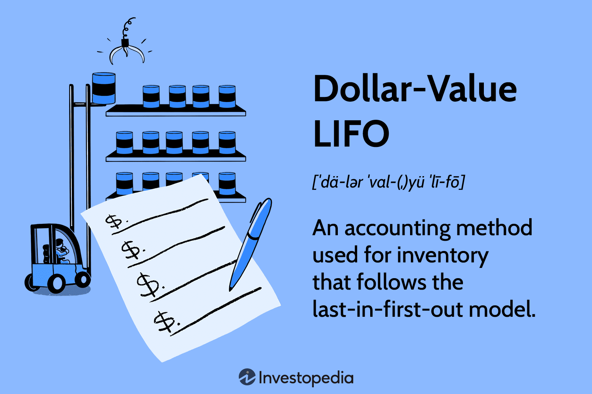

The LIFO (Last-In, First-Out) method is an established accounting strategy utilized for inventory valuation, gaining popularity due to its specific applicability in inflationary settings. Among its various forms, the Dollar-Value LIFO method is recognized as a more refined approach, designed to address the challenges of cost fluctuations and inventory categorization, which are prevalent in modern financial landscapes. This method assigns a dollar value to inventory pools rather than individual physical units, allowing for more streamlined financial analysis and reporting.

In this article, we examine the relationship between the Dollar-Value LIFO method and algorithmic trading, emphasizing how inventory valuation can significantly influence trading decisions. As a core aspect of financial data, accurate inventory valuation directly impacts investment strategies and trading algorithms’ performance. Consequently, this intersection between accounting methodologies and trading practices demands careful consideration from analysts, accountants, and trading strategists striving to refine their financial outcomes.



By exploring the principles, advantages, and applications of the Dollar-Value LIFO method, we highlight its relevance in trading and finance. This understanding becomes particularly crucial for professionals focused on optimizing their strategic and financial reporting capabilities. Dollar-Value LIFO not only offers a pragmatic approach to handling the complexities of inventory management but also plays a crucial role in effective tax planning and financial assessments during periods of inflation.

Through this exploration, we aim to uncover insights that demonstrate the impact of Dollar-Value LIFO on inventory management and financial reporting, encouraging its integration into comprehensive financial strategies. Join us in understanding how this method serves as a strategic tool for navigating the volatile world of trading and finance, providing essential benefits for businesses aiming to streamline their operations and achieve financial accuracy.

## Table of Contents

## Understanding the Dollar-Value LIFO Method

Dollar-Value LIFO (Last-In, First-Out) is an inventory valuation method in accounting that focuses on costing inventory in monetary terms rather than counting physical units. This method is particularly relevant in environments experiencing inflation, as it helps match the current costs of inventory with current revenues. By accounting for inflationary changes, Dollar-Value LIFO can significantly influence both the tax liabilities of a company and its reported income, providing a more realistic view of financial health.

Unlike other inventory costing methods, Dollar-Value LIFO simplifies inventory management through the creation of inventory pools. These pools group heterogeneous inventory items based on their dollar value, rather than their physical characteristics. This grouping reduces the complexity associated with tracking individual item costs, thereby facilitating easier financial planning and reporting. It is an advantageous approach for companies that handle multiple product lines or experience frequent changes in inventory, as it minimizes the administrative effort required to manage each product individually.

The calculation of Dollar-Value LIFO involves using a conversion price index, which adjusts the inventory's cost to account for inflation between the base year and the current year. The process begins by determining the base-year cost of inventories. Then, a price index, which reflects the inflation rate over time, is used to convert these costs into current year terms. The difference between the base-year cost and the inflated cost represents the LIFO reserve, which can impact the Cost of Goods Sold (COGS).

The formula to calculate the Dollar-Value LIFO inventory value is as follows:

$$
\text{LIFO Inventory Value} = \text{Base-Year Cost} \times \text{Conversion Price Index}
$$

In practice, companies calculate LIFO layers based on annual changes in the inventory levels and adjust those layers according to the price index. This approach ensures that inventory costing keeps pace with economic changes, thus reflecting an accurate measure of inventory consumption compared to current revenues. Consequently, the financial statements more accurately represent a company's economic situation, particularly during periods of inflation or significant price variability.

Overall, Dollar-Value LIFO's ability to match current costs with current revenues by pooling items and adjusting for inflation makes it a valuable tool for companies aiming for precise financial tracking and reporting.

## Algorithmic Trading and Inventory Accounting

Algorithmic trading, commonly known as algo trading, is a trading strategy that employs complex algorithms to execute trades at high speeds and frequencies. These algorithms leverage market data and financial indicators to make real-time trading decisions, aiming to capitalize on small price discrepancies in the market. The success of algo trading heavily relies on the precision and timeliness of financial information—hence, the accuracy of inventory accounting methods like Dollar-Value Last-In, First-Out (LIFO) can play a critical role.

Dollar-Value LIFO is an inventory valuation method that can significantly influence financial statements by affecting the valuation of inventory and, consequently, the cost of goods sold (COGS). These financial statements form an essential part of the dataset used by [algorithmic trading](/wiki/algorithmic-trading) systems. In the context of trading companies, inventory accounting methods directly impact reported earnings, taxes, and other financial metrics, which are integral components of the economic indicators used by algorithms.

With Dollar-Value LIFO, companies adjust their inventory values to account for inflation, aligning inventory costs with current revenue levels. This approach influences the financial forecasts and valuations that trading algorithms might use. Adjustments in inventory valuation can result in variances in key financial ratios and metrics such as earnings per share (EPS), price-to-earnings ratio (P/E), and debt coverage ratios. These indicators guide algorithmic models in assessing the financial health and market position of the entities they intend to invest in or trade.

To illustrate, consider an algorithm designed to optimize a trading strategy based on EPS growth trends. In an inflationary environment, a company using Dollar-Value LIFO might report a different EPS compared to one using another method like FIFO (First-In, First-Out). Therefore, understanding and accurately interpreting these accounting methods are crucial for traders to ensure their algorithms reflect genuine company performance and market conditions.

Here is a basic Python pseudocode that demonstrates how an algorithm might [factor](/wiki/factor-investing) in inventory valuation:

```python
def calculate_adjusted_eps(inventory, cogs, net_income, shares_outstanding):
    # Adjust the cost of goods sold based on Dollar-Value LIFO
    adjusted_cogs = adjust_cogs_for_inflation(cogs, inventory)

    # Re-calculate net income based on the adjusted COGS
    adjusted_net_income = net_income - (adjusted_cogs - cogs)

    # Calculate the adjusted earnings per share
    adjusted_eps = adjusted_net_income / shares_outstanding
    return adjusted_eps

def adjust_cogs_for_inflation(cogs, inventory):
    # Dummy function to represent COGS adjustment based on Dollar-Value LIFO
    inflation_factor = inflate_index(inventory)
    return cogs * inflation_factor

# Hypothetical function to calculate an inflation factor
def inflate_index(inventory):
    # This would be replaced by the actual calculation based on a price index
    return 1.05  # Represents a 5% inflation rate
```

This illustrative example shows how understanding inventory valuation adjustments is essential for developing robust trading algorithms. By properly integrating these accounting methods, traders can enhance decision-making processes, potentially gaining strategic advantages in fast-paced trading environments. Such insights into inventory accounting can lead to improved alignment of algorithmic predictions with market realities, resulting in better trading outcomes and enhanced financial performance for firms.

## Why Use Dollar-Value LIFO in Trading Businesses?

Trading businesses operate in environments characterized by rapid price fluctuations, necessitating an inventory valuation method that accurately reflects these changes. The Dollar-Value LIFO (Last-In, First-Out) method emerges as a powerful tool in this regard, offering a realistic view of inventory costs amid volatile market conditions. 

One primary advantage of using Dollar-Value LIFO in trading businesses is its ability to align current costs with current revenues. This alignment provides a more realistic profit picture because it accounts for inflationary increases in inventory costs. During periods of rising prices, valuing inventory at older, lower costs can result in an inflated view of profitability. By using the most recent costs (last-in), Dollar-Value LIFO ensures that cost of goods sold (COGS) reflects the most recent market conditions, providing a more accurate representation of profit margins.

Moreover, Dollar-Value LIFO offers significant tax advantages. By matching the most recent inventory costs with current sales, businesses can report lower taxable income during periods of inflation. This reduction in taxable income due to higher COGS derived from current prices can lead to substantial tax savings. These savings improve cash flow, which can be reinvested into trading operations or other areas of the business.

For companies dealing with diverse product lines, the Dollar-Value LIFO method simplifies inventory management by reducing the need for detailed tracking of individual items. Instead, items are pooled together, allowing for a streamlined approach to inventory valuation that requires less administrative intervention. This pooling method makes it easier to manage inventories with varying characteristics and price changes.

Real-world scenarios have demonstrated the efficacy of Dollar-Value LIFO in enhancing trading operations. For instance, consider a commodities trading firm that deals with metal imports. Such a firm can face cost volatilities linked to geopolitical events or supply chain disruptions. By applying Dollar-Value LIFO, the firm can ensure that its COGS reflects the latest market prices for metals, maintaining price competitiveness and accurate financial reporting.

In conclusion, the application of Dollar-Value LIFO in trading businesses not only offers a realistic depiction of financial performance but also provides strategic tax benefits and reduces administrative burdens. These attributes make it an attractive choice for businesses navigating the complexities of fluctuating market conditions and diverse product portfolios.

## Pros and Cons of the Dollar-Value LIFO Method

The Dollar-Value LIFO method offers a range of advantages and disadvantages that significantly affect business decisions. Understanding these can provide a clearer perspective on whether this accounting strategy aligns with a company's financial objectives.

**Pros:**

1. **Tax Savings**: One of the primary benefits of the Dollar-Value LIFO method is the potential for tax savings. By matching the cost of the most recently purchased inventory against current revenues, companies can report lower taxable income during inflationary periods. This results from the method's ability to use higher recorded costs to offset revenue, thereby reducing the tax burden.

2. **Alignment of Costs and Revenues**: This method offers improved alignment of current costs with revenues. During inflation, the cost of replacing inventory rises, and matching these increased costs with current revenues can provide a more accurate financial picture. This pertinent alignment allows businesses to present a realistic depiction of financial health and profitability.

3. **Simplified Inventory Tracking Through Pooling**: The Dollar-Value LIFO method allows companies to pool different inventory items. Instead of maintaining records for each item, businesses can track inventory costs in aggregate through dollar-value pools. This simplification reduces the administrative burden and enhances efficiency in inventory management.

**Cons:**

1. **Potential Lower Earnings During Rising Costs**: Despite offering tax advantages, Dollar-Value LIFO can potentially result in lower reported earnings in periods of rising costs. Because higher expense levels are matched with revenues, net income may appear lower, which could adversely affect perceptions of financial performance.

2. **Mismatch with Physical Inventory Flow**: Another drawback is the possibility of a mismatch with the physical flow of inventory. While Dollar-Value LIFO assumes the latest inventory acquired is the first to be sold, it may not reflect the actual physical movement of goods. This discrepancy can lead to challenges in inventory management, especially for businesses heavily reliant on physical stock flows.

3. **Complexity in Financial Comparisons**: Financial comparisons between companies using different inventory valuation methods can be complicated. Dollar-Value LIFO can result in financial statements that are not directly comparable to those using FIFO (First-In, First-Out) or weighted average methods. This complexity can pose challenges in benchmarking and evaluating industry performance.

In conclusion, while the Dollar-Value LIFO method provides notable benefits such as tax savings and simplified inventory tracking, its drawbacks, including potential earnings impact and complexity in cross-company comparisons, must be carefully weighed. Businesses should evaluate these factors to determine the appropriateness of adopting this method in their accounting practices.

## Implementing Dollar-Value LIFO: A Step-by-Step Guide

Implementing the Dollar-Value LIFO method requires a structured approach to ensure accuracy and consistency. The following step-by-step guide outlines the essential procedures for effectively applying this inventory accounting method.

1. **Establish Inventory Pools**: The first step in implementing Dollar-Value LIFO is to group inventory items into pools based on similar characteristics. This pooling is necessary because Dollar-Value LIFO operates on the assumption that inventory consists of a series of layers accrued during different periods. Grouping heterogeneous items simplifies calculations and reflects a more accurate inventory valuation.

2. **Select an Appropriate Base Year**: Choosing a base year is crucial as it serves as the point of comparison to determine changes in inventory value over time. The base year should ideally be a year that does not experience extraordinary fluctuations in pricing. To maintain consistency, businesses must stick with this base year throughout the application of the method.

3. **Calculate the Price Index**: The price index reflects changes in inventory costs over time relative to the base year. It is used to adjust the value of inventory pools to today's dollars. This can be done using an external price index such as the Consumer Price Index (CPI) or by calculating an internal index based on historical company data. The formula for the price index can be expressed as:
$$
   \text{Price Index} = \left(\frac{\text{Ending Inventory at Current-year Prices}}{\text{Ending Inventory at Base-year Prices}}\right) \times 100

$$

4. **Determine the LIFO Layers**: LIFO layers are added each year if the ending inventory in terms of base year dollars exceeds the previous year's levels. To accurately calculate these layers, adjust the current-year ending inventory to base-year dollars using the price index:
$$
   \text{Inventory at Base-Year Dollars} = \frac{\text{Current-Year Ending Inventory}}{\text{Price Index}}

$$

   The increase over the previous year's base-dollar inventory constitutes a new LIFO layer or addition to existing ones.

5. **Maintain Consistency and Record-Keeping**: Precision in record-keeping is paramount in implementing Dollar-Value LIFO. Detailed records of inventory pool compositions, base year selections, and price index calculations must be kept. Consistency in methodology ensures the reliability and integrity of financial reports.

6. **Adjust Financial Statements Accordingly**: Once LIFO layers and price indices are calculated, adjust the cost of goods sold (COGS) and the ending inventory on financial statements. This adjustment guarantees that reported profits reflect current cost levels against revenues. Proper alignment of these figures will help in achieving optimal tax and financial outcomes.

Transitioning to the Dollar-Value LIFO method requires dedication and a robust understanding of both accounting principles and the specific business environment. Implementing this inventory valuation method can offer significant benefits by aligning costs with revenues in inflationary periods and minimizing tax liabilities. By following the guidelines provided in this step-by-step process, businesses can enhance their financial accuracy and operational efficiency.

## Conclusion: Strategic Importance of Dollar-Value LIFO

The Dollar-Value LIFO method is particularly effective for businesses navigating inflationary pressures and frequent changes in inventory costs. Its strategic importance lies primarily in its capacity to offer tax relief; by matching recent higher costs with current revenues, companies can minimize taxable income during periods of rising prices. This alignment not only aids in presenting a realistic financial health narrative but also in enhancing cash flow management, as taxes are a significant financial burden.

For algorithmic trading and finance-focused enterprises, understanding the intricacies of Dollar-Value LIFO is crucial. The method's influence on financial reporting can affect algorithmic strategies, given that accurate and current inventory valuations are vital in making informed trading decisions. The overarching influence of Dollar-Value LIFO on balance sheets means it can have repercussions throughout the decision-making spectrum, impacting both strategic and tactical financial endeavors.

The implementation of Dollar-Value LIFO calls for dedication, as accurate calculation and consistent record-keeping are imperative. Companies need to be well-organized, choosing appropriate base years and inventory pools carefully to maintain the integrity and accuracy of the method. Despite this complexity, the long-term benefits Warrant consideration—accurate cost alignment and tax efficiencies contribute to robust financial positioning.

In summary, the Dollar-Value LIFO method is an advantageous accounting strategy that warrants serious consideration for businesses seeking to enhance their financial resilience and reporting accuracy. Its application can bring substantial benefits, and as such, should be integrated into broader financial strategies, particularly for entities in industries sensitive to inventory cost fluctuations.

## References & Further Reading

[1]: ["Wiley Guide to Fair Value Under IFRS"](https://onlinelibrary.wiley.com/doi/book/10.1002/9781119204008) by James P. Catty

[2]: ["Financial Accounting and Reporting"](https://www.investopedia.com/terms/f/financialaccounting.asp) by Barry Elliott and Jamie Elliott

[3]: ["Advances in Financial Machine Learning"](https://www.amazon.com/Advances-Financial-Machine-Learning-Marcos/dp/1119482089) by Marcos Lopez de Prado

[4]: ["Algorithmic Trading: Winning Strategies and Their Rationale"](https://www.amazon.com/Algorithmic-Trading-Winning-Strategies-Rationale-ebook/dp/B00CY5HC0U) by Ernie Chan

[5]: ["Inventory Accounting: A Comprehensive Guide"](https://www.amazon.com/Inventory-Accounting-Comprehensive-Steven-Bragg/dp/0471356425) by Steven M. Bragg