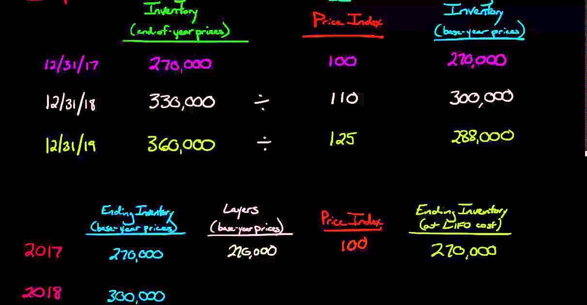

## Table of Contents

## What is Dollar-Value LIFO?

Dollar-Value LIFO is a way to keep track of inventory costs that businesses use. It stands for "Dollar-Value Last-In, First-Out." This method groups inventory items by their total dollar value instead of counting each item separately. It helps businesses figure out the cost of goods sold and the value of their inventory at the end of a period by using the prices of the most recent items bought.

Using Dollar-Value LIFO can be helpful because it adjusts for inflation. When prices go up, the cost of newer inventory is higher. By using the most recent prices, businesses can show a more accurate cost of goods sold on their financial statements. This method can also help reduce taxes because it often results in a higher cost of goods sold, which means lower taxable income.

## How does Dollar-Value LIFO differ from traditional LIFO?

Dollar-Value LIFO and traditional LIFO both work on the principle of using the cost of the most recent inventory to calculate the cost of goods sold. However, they differ in how they group and value the inventory. Traditional LIFO looks at each item individually and uses the cost of the last items purchased to determine the cost of goods sold. This means if a business buys the same type of item at different times and prices, traditional LIFO will track each purchase separately.

On the other hand, Dollar-Value LIFO groups inventory by its total dollar value rather than by individual items. This method simplifies the process by pooling similar items together and adjusting for inflation. Instead of tracking each item's cost, Dollar-Value LIFO looks at the overall change in the dollar value of the inventory. This approach can be more practical for businesses with large and diverse inventories because it reduces the complexity of tracking each item's cost over time.

## Why might a company choose to use Dollar-Value LIFO?

A company might choose to use Dollar-Value LIFO because it makes managing inventory easier, especially when there are lots of different items. Instead of keeping track of the cost of each item separately, Dollar-Value LIFO groups items by their total dollar value. This means the company doesn't have to worry about the price changes of each individual item over time. It's simpler and can save time and effort, which is really helpful for businesses with big and varied inventories.

Another reason a company might use Dollar-Value LIFO is that it helps with inflation. When prices go up, the cost of newer inventory is higher. Dollar-Value LIFO uses these newer, higher costs to figure out the cost of goods sold. This can show a more accurate picture of the company's expenses on financial statements. Plus, using the higher costs can lower the company's taxable income because it increases the cost of goods sold, which means the company might pay less in taxes.

## What are the steps to implement Dollar-Value LIFO?

To start using Dollar-Value LIFO, a company first needs to pick a base year. This is the year they'll use as a starting point to compare the value of their inventory in the future. They need to figure out the total dollar value of their inventory at the end of this base year. Then, at the end of each following year, they'll calculate the total dollar value of their inventory again. They'll use something called a price index to see how much prices have changed since the base year. This index helps them adjust the current year's inventory value to see if it's gone up or down in real terms.

Once they know the adjusted value of their inventory, they can figure out if it's increased or decreased from the last year. If it's increased, they'll add the cost of the newest inventory to the cost of goods sold. If it's decreased, they'll use the cost of the oldest inventory first. This way, they're always using the most recent costs to figure out their expenses. It might sound tricky, but it helps the company keep track of their costs more accurately, especially when prices are going up.

## How does Dollar-Value LIFO affect financial statements?

Dollar-Value LIFO can change the way a company's financial statements look. When prices go up, the cost of the newest inventory is higher. Dollar-Value LIFO uses these higher costs to figure out the cost of goods sold. This means the cost of goods sold on the income statement will be higher, which can make the company's profit look lower. This is because the higher cost of goods sold is subtracted from the sales revenue to find the profit.

On the balance sheet, the inventory value will be lower because Dollar-Value LIFO uses the older, lower costs for the inventory that's left. This can make the company's assets look smaller. But it's not all bad. Using Dollar-Value LIFO can help the company pay less in taxes because the higher cost of goods sold means less taxable income. So, while it might make the profit and inventory value look lower on the financial statements, it can save the company money on taxes.

## What are the tax implications of using Dollar-Value LIFO?

Using Dollar-Value LIFO can help a company pay less in taxes. When prices go up, the cost of the newest inventory is higher. Dollar-Value LIFO uses these higher costs to figure out the cost of goods sold. This makes the cost of goods sold on the income statement higher, which means the company's taxable income is lower. A lower taxable income means the company pays less in taxes.

However, there's something called the LIFO conformity rule that companies need to follow. This rule says that if a company uses LIFO for tax purposes, they have to use it for their financial reporting too. So, if they choose Dollar-Value LIFO to save on taxes, they have to show the same numbers on their financial statements. This can make their profits look lower to investors and lenders, but it's a trade-off they might be willing to make to save on taxes.

## Can you explain the concept of 'pools' in Dollar-Value LIFO?

In Dollar-Value LIFO, 'pools' are groups of similar items that a company puts together to make managing their inventory easier. Instead of keeping track of the cost of each item separately, the company groups items that are alike into a pool. This way, they don't have to worry about the price changes of each individual item over time. It simplifies things a lot, especially for businesses that have lots of different items in their inventory.

When a company uses pools in Dollar-Value LIFO, they look at the total dollar value of each pool at the end of the year. They compare this value to the value of the same pool in the base year, using a price index to adjust for inflation. If the value of the pool has gone up, the company adds the cost of the newest inventory to the cost of goods sold. If it's gone down, they use the cost of the oldest inventory first. This helps the company keep their costs accurate and manage their inventory more easily.

## How do you calculate the LIFO index in Dollar-Value LIFO?

To calculate the LIFO index in Dollar-Value LIFO, you start by figuring out the total dollar value of your inventory at the end of the current year. Then, you compare this value to the total dollar value of your inventory at the end of the base year. The LIFO index is the ratio of the current year's inventory value to the base year's inventory value. If you use a price index, like the Consumer Price Index (CPI) or a specific industry index, you can adjust the current year's inventory value to see how much prices have changed since the base year. This adjusted value helps you find the LIFO index more accurately.

For example, if the total dollar value of your inventory was $100,000 at the end of the base year and $110,000 at the end of the current year, the LIFO index would be $110,000 divided by $100,000, which equals 1.10. This means prices have gone up by 10% since the base year. If you use a price index and it shows that prices have increased by 5% since the base year, you would adjust the current year's inventory value to $104,762 (which is $110,000 divided by 1.05). Then, the LIFO index would be $104,762 divided by $100,000, which equals 1.0476. This adjusted index shows a more accurate change in inventory value, taking inflation into account.

## What are the challenges and complexities of maintaining Dollar-Value LIFO?

Keeping track of inventory using Dollar-Value LIFO can be tricky. One big challenge is figuring out the LIFO index every year. This means a company has to know the total dollar value of their inventory at the end of each year and compare it to the base year. They also need to find a good price index to adjust for inflation, which can be hard to do right. If the index isn't accurate, the whole calculation can be off, which makes their financial statements less reliable.

Another complexity is dealing with pools. Companies have to decide how to group their items into these pools, and if they make a mistake, it can mess up their whole inventory system. Also, if the types of items in the inventory change a lot, the company might need to change the pools, which adds more work. Plus, because of the LIFO conformity rule, if a company uses Dollar-Value LIFO for taxes, they have to use it for their financial reporting too. This can make their profits look lower to investors, which might not be good for the company's image.

## How does Dollar-Value LIFO adapt to inflation?

Dollar-Value LIFO helps businesses deal with inflation by using the newest, higher prices to figure out the cost of goods sold. When prices go up, the cost of the inventory that a company buys later is more expensive. With Dollar-Value LIFO, the company uses these higher costs to calculate their expenses. This means the cost of goods sold on their financial statements will be higher, which can make their profit look lower. But it also means they might pay less in taxes because their taxable income is lower.

To make sure Dollar-Value LIFO works well with inflation, companies use something called a price index. This index shows how much prices have changed since the base year. By using the price index, the company can adjust the current year's inventory value to see if it's really gone up or down when you take inflation into account. This helps them keep their costs accurate and makes their financial statements more reliable, even when prices are going up.

## What are the regulatory requirements for using Dollar-Value LIFO?

Companies that want to use Dollar-Value LIFO have to follow some rules set by the government. One big rule is the LIFO conformity rule. This rule says that if a company uses LIFO for their taxes, they have to use it for their financial reporting too. This means they can't use a different method to make their profits look better to investors. Also, companies need to keep good records of their inventory and how they calculate the LIFO index. They have to be able to show the IRS or other tax authorities how they figured out their costs and why they used the numbers they did.

Another important thing is that companies have to pick a base year and stick with it. They can't change the base year whenever they want. They also need to use a reliable price index to adjust for inflation. This index has to be something that the IRS will accept, like the Consumer Price Index or a specific industry index. If a company doesn't follow these rules, they could get in trouble with the tax authorities and might have to pay more taxes or fines.

## How does Dollar-Value LIFO compare to other inventory valuation methods like FIFO and average cost?

Dollar-Value LIFO, FIFO (First-In, First-Out), and average cost are all ways to figure out how much a company's inventory is worth, but they do it differently. Dollar-Value LIFO groups items by their total dollar value and uses the cost of the newest inventory to calculate the cost of goods sold. This method is good when prices are going up because it can help a company pay less in taxes. FIFO, on the other hand, uses the cost of the oldest inventory first. This means if prices are rising, the cost of goods sold will be lower, which can make the company's profit look higher. The average cost method takes the average cost of all the items in the inventory and uses that to figure out the cost of goods sold. This method smooths out the ups and downs in prices over time.

Each method has its own pros and cons. Dollar-Value LIFO can be more complicated to use because you have to keep track of the total dollar value of your inventory and use a price index to adjust for inflation. But it can save on taxes when prices are going up. FIFO is simpler to use because you just use the cost of the oldest items, but it might not help with taxes as much. The average cost method is also pretty easy to use and can be good if prices are going up and down a lot, but it might not give you the tax benefits that Dollar-Value LIFO can. So, companies need to think about what's most important for them - simplicity, tax savings, or showing a higher profit - when they choose which method to use.

## What is the Dollar-Value LIFO Method and how does it work?

Dollar-Value LIFO (Last-In, First-Out) is an inventory valuation method in accounting that focuses on costing inventory in monetary terms rather than counting physical units. This method is particularly relevant in environments experiencing inflation, as it helps match the current costs of inventory with current revenues. By accounting for inflationary changes, Dollar-Value LIFO can significantly influence both the tax liabilities of a company and its reported income, providing a more realistic view of financial health.

Unlike other inventory costing methods, Dollar-Value LIFO simplifies inventory management through the creation of inventory pools. These pools group heterogeneous inventory items based on their dollar value, rather than their physical characteristics. This grouping reduces the complexity associated with tracking individual item costs, thereby facilitating easier financial planning and reporting. It is an advantageous approach for companies that handle multiple product lines or experience frequent changes in inventory, as it minimizes the administrative effort required to manage each product individually.

The calculation of Dollar-Value LIFO involves using a conversion price index, which adjusts the inventory's cost to account for inflation between the base year and the current year. The process begins by determining the base-year cost of inventories. Then, a price index, which reflects the inflation rate over time, is used to convert these costs into current year terms. The difference between the base-year cost and the inflated cost represents the LIFO reserve, which can impact the Cost of Goods Sold (COGS).

The formula to calculate the Dollar-Value LIFO inventory value is as follows:

$$
\text{LIFO Inventory Value} = \text{Base-Year Cost} \times \text{Conversion Price Index}
$$

In practice, companies calculate LIFO layers based on annual changes in the inventory levels and adjust those layers according to the price index. This approach ensures that inventory costing keeps pace with economic changes, thus reflecting an accurate measure of inventory consumption compared to current revenues. Consequently, the financial statements more accurately represent a company's economic situation, particularly during periods of inflation or significant price variability.

Overall, Dollar-Value LIFO's ability to match current costs with current revenues by pooling items and adjusting for inflation makes it a valuable tool for companies aiming for precise financial tracking and reporting.

## How do you implement Dollar-Value LIFO: A Step-by-Step Guide?

Implementing the Dollar-Value LIFO method requires a structured approach to ensure accuracy and consistency. The following step-by-step guide outlines the essential procedures for effectively applying this inventory accounting method.

1. **Establish Inventory Pools**: The first step in implementing Dollar-Value LIFO is to group inventory items into pools based on similar characteristics. This pooling is necessary because Dollar-Value LIFO operates on the assumption that inventory consists of a series of layers accrued during different periods. Grouping heterogeneous items simplifies calculations and reflects a more accurate inventory valuation.

2. **Select an Appropriate Base Year**: Choosing a base year is crucial as it serves as the point of comparison to determine changes in inventory value over time. The base year should ideally be a year that does not experience extraordinary fluctuations in pricing. To maintain consistency, businesses must stick with this base year throughout the application of the method.

3. **Calculate the Price Index**: The price index reflects changes in inventory costs over time relative to the base year. It is used to adjust the value of inventory pools to today's dollars. This can be done using an external price index such as the Consumer Price Index (CPI) or by calculating an internal index based on historical company data. The formula for the price index can be expressed as:
$$
   \text{Price Index} = \left(\frac{\text{Ending Inventory at Current-year Prices}}{\text{Ending Inventory at Base-year Prices}}\right) \times 100

$$

4. **Determine the LIFO Layers**: LIFO layers are added each year if the ending inventory in terms of base year dollars exceeds the previous year's levels. To accurately calculate these layers, adjust the current-year ending inventory to base-year dollars using the price index:
$$
   \text{Inventory at Base-Year Dollars} = \frac{\text{Current-Year Ending Inventory}}{\text{Price Index}}

$$

   The increase over the previous year's base-dollar inventory constitutes a new LIFO layer or addition to existing ones.

5. **Maintain Consistency and Record-Keeping**: Precision in record-keeping is paramount in implementing Dollar-Value LIFO. Detailed records of inventory pool compositions, base year selections, and price index calculations must be kept. Consistency in methodology ensures the reliability and integrity of financial reports.

6. **Adjust Financial Statements Accordingly**: Once LIFO layers and price indices are calculated, adjust the cost of goods sold (COGS) and the ending inventory on financial statements. This adjustment guarantees that reported profits reflect current cost levels against revenues. Proper alignment of these figures will help in achieving optimal tax and financial outcomes.

Transitioning to the Dollar-Value LIFO method requires dedication and a robust understanding of both accounting principles and the specific business environment. Implementing this inventory valuation method can offer significant benefits by aligning costs with revenues in inflationary periods and minimizing tax liabilities. By following the guidelines provided in this step-by-step process, businesses can enhance their financial accuracy and operational efficiency.

## References & Further Reading

[1]: ["Wiley Guide to Fair Value Under IFRS"](https://onlinelibrary.wiley.com/doi/book/10.1002/9781119204008) by James P. Catty

[2]: ["Financial Accounting and Reporting"](https://www.investopedia.com/terms/f/financialaccounting.asp) by Barry Elliott and Jamie Elliott

[3]: ["Advances in Financial Machine Learning"](https://www.amazon.com/Advances-Financial-Machine-Learning-Marcos/dp/1119482089) by Marcos Lopez de Prado

[4]: ["Algorithmic Trading: Winning Strategies and Their Rationale"](https://www.amazon.com/Algorithmic-Trading-Winning-Strategies-Rationale-ebook/dp/B00CY5HC0U) by Ernie Chan

[5]: ["Inventory Accounting: A Comprehensive Guide"](https://www.amazon.com/Inventory-Accounting-Comprehensive-Steven-Bragg/dp/0471356425) by Steven M. Bragg