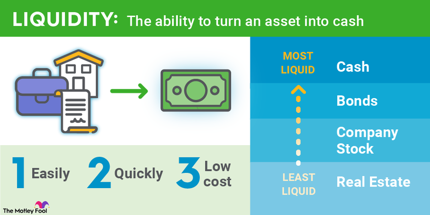

## Table of Contents

## What is dollar volume liquidity?

Dollar volume liquidity refers to how easy it is to buy or sell a stock without affecting its price too much. It is measured by the total dollar amount of shares traded in a day. If a stock has high dollar volume liquidity, it means many shares are traded every day, and it's easier to buy or sell without causing big price changes.

For example, if a stock trades 1 million shares a day at $10 each, its dollar volume liquidity is $10 million. This is important for investors because stocks with higher dollar volume liquidity are generally safer to trade. They can enter or exit positions more easily, which is especially important for big investors who need to trade large amounts of shares.

## Why is dollar volume liquidity important in trading?

Dollar volume liquidity is important in trading because it shows how easy it is to buy or sell a stock without moving its price a lot. When a stock has high dollar volume liquidity, it means a lot of shares are traded every day. This makes it easier for traders to get in and out of their positions quickly. For example, if you want to sell a lot of shares, a stock with high liquidity will let you do that without causing the price to drop too much.

This is especially helpful for big investors who need to trade large amounts of shares. If they try to sell a lot of shares of a stock with low liquidity, it could make the price go down a lot, which would be bad for them. On the other hand, stocks with high liquidity are safer to trade because they can handle big trades without big price changes. So, knowing the dollar volume liquidity helps traders pick stocks that they can trade more easily and with less risk.

## How is dollar volume liquidity calculated?

Dollar volume liquidity is found by taking the number of shares traded in a day and multiplying it by the price of each share. For example, if 1 million shares of a stock are traded in a day and each share costs $10, the dollar volume liquidity is $10 million. This tells you the total value of the shares traded that day.

This number is important because it shows how easy it is to buy or sell the stock without changing its price too much. If a stock has a high dollar volume liquidity, it means a lot of shares are traded every day, so it's easier to trade without affecting the price a lot. This is helpful for traders, especially those who need to buy or sell a lot of shares at once.

## What are the key components of dollar volume liquidity?

Dollar volume liquidity is made up of two main parts: the number of shares traded and the price of each share. To find the dollar volume liquidity, you multiply these two numbers together. For example, if 1 million shares of a stock are traded in a day and each share costs $10, the dollar volume liquidity is $10 million. This shows the total value of all the shares traded that day.

This number is important because it tells you how easy it is to buy or sell the stock without changing its price too much. If a stock has a high dollar volume liquidity, it means a lot of shares are traded every day. This makes it easier for traders to buy or sell without causing big price changes. This is especially helpful for people who need to trade a lot of shares at once, like big investors.

## Can you explain the difference between dollar volume liquidity and other types of liquidity?

Dollar volume liquidity is just one way to measure how easy it is to buy or sell a stock. It's found by multiplying the number of shares traded in a day by the price of each share. This gives you the total value of the shares traded, which is helpful because it shows how much money is moving around. Stocks with high dollar volume liquidity are easier to trade because you can buy or sell a lot of shares without changing the price too much. This is important for big investors who need to trade large amounts of shares.

There are other ways to measure liquidity too. One common way is trading volume, which is just the number of shares traded in a day without considering the price. This can give you an idea of how active the market is for a stock, but it doesn't tell you the total value of the trades. Another type of liquidity is bid-ask spread, which is the difference between the highest price someone is willing to pay for a stock (the bid) and the lowest price someone is willing to sell it for (the ask). A smaller bid-ask spread means it's easier to trade because you can buy and sell at prices that are closer together. Each of these measures gives you a different view of how easy it is to trade a stock.

## What are some common indicators used to assess dollar volume liquidity?

Dollar volume liquidity is often assessed using a few key indicators. The most straightforward one is the dollar volume itself, which is calculated by multiplying the number of shares traded in a day by the price of each share. This gives you the total value of the shares traded, showing how much money is moving around in the market for that stock. A high dollar volume means the stock is easier to trade because you can buy or sell a lot of shares without affecting the price too much.

Another indicator is the average daily dollar volume over a period of time, like 30 or 90 days. This helps traders see if the liquidity is steady or if it changes a lot. A stock with a consistently high average daily dollar volume is usually safer to trade because it shows that there's always a lot of money moving around. This is important for big investors who need to trade large amounts of shares without causing big price changes.

Lastly, traders sometimes look at the turnover ratio, which is the dollar volume divided by the market capitalization of the stock. This tells you how much of the stock's total value is traded each day. A high turnover ratio means the stock is very liquid because a large part of its value is being traded regularly. This can be a sign that the stock is popular and easy to trade, which is good for investors who want to get in and out of their positions quickly.

## How does dollar volume liquidity affect the price movement of a security?

Dollar volume liquidity can have a big impact on how the price of a security moves. When a stock has high dollar volume liquidity, it means a lot of shares are traded every day. This makes it easier for traders to buy or sell the stock without causing the price to change a lot. For example, if you want to sell a lot of shares, a stock with high liquidity will let you do that without making the price drop too much. This is good for big investors who need to trade large amounts of shares because they can get in and out of their positions more easily.

On the other hand, if a stock has low dollar volume liquidity, it can be harder to trade without affecting the price. When you try to buy or sell a lot of shares of a stock with low liquidity, it can cause the price to move a lot. For example, if you try to sell a lot of shares of a stock with low liquidity, the price might drop a lot because there aren't enough buyers to keep the price stable. This can be risky for traders because they might not be able to trade at the price they want. So, understanding the dollar volume liquidity of a stock can help traders make better decisions about when and how to trade.

## What are the implications of high vs. low dollar volume liquidity for investors?

High dollar volume liquidity is good for investors because it means a stock is easy to trade. When a stock has a lot of shares traded every day, you can buy or sell a lot of shares without changing the price too much. This is especially helpful for big investors who need to trade large amounts of shares. They can get in and out of their positions quickly and safely. Stocks with high liquidity are also less risky because they can handle big trades without big price changes. This makes it easier for investors to plan their trades and manage their money.

On the other hand, low dollar volume liquidity can be a problem for investors. When a stock doesn't have many shares traded every day, it can be hard to buy or sell without affecting the price a lot. If you try to sell a lot of shares of a stock with low liquidity, the price might drop a lot because there aren't enough buyers to keep the price stable. This can be risky because you might not be able to trade at the price you want. So, investors need to be careful when trading stocks with low liquidity because it can be harder to manage their investments and might lead to bigger losses.

## How can traders use dollar volume liquidity to make better trading decisions?

Traders can use dollar volume liquidity to make better trading decisions by understanding how easy it is to buy or sell a stock without changing its price too much. When a stock has high dollar volume liquidity, it means a lot of shares are traded every day. This makes it easier for traders to get in and out of their positions quickly and safely. For example, if a trader wants to sell a lot of shares, a stock with high liquidity will let them do that without causing the price to drop too much. This is especially important for big investors who need to trade large amounts of shares because they can plan their trades better and manage their money more effectively.

On the other hand, if a stock has low dollar volume liquidity, it can be harder for traders to trade without affecting the price a lot. When you try to buy or sell a lot of shares of a stock with low liquidity, it can cause the price to move a lot. For example, if you try to sell a lot of shares of a stock with low liquidity, the price might drop a lot because there aren't enough buyers to keep the price stable. This can be risky for traders because they might not be able to trade at the price they want. So, traders need to be careful when trading stocks with low liquidity and might want to avoid them if they need to trade large amounts of shares quickly.

## What are some real-world examples of dollar volume liquidity in different markets?

In the stock market, a good example of high dollar volume liquidity is Apple Inc. (AAPL). On any given day, millions of Apple shares are traded, often with a dollar volume in the billions. This high liquidity means that if an investor wants to buy or sell a large number of Apple shares, they can do so without worrying too much about the price changing a lot. This makes Apple a popular choice for big investors who need to trade large amounts of shares quickly and safely. On the other hand, a smaller company like a new tech startup might have low dollar volume liquidity. If only a few thousand shares are traded each day, trying to sell a lot of shares could make the price drop a lot, making it riskier for investors.

In the cryptocurrency market, Bitcoin (BTC) is a prime example of high dollar volume liquidity. With billions of dollars worth of Bitcoin traded daily, it's easy for investors to buy or sell large amounts without causing big price swings. This makes Bitcoin attractive for big traders who need to move in and out of their positions quickly. In contrast, a lesser-known cryptocurrency like a new altcoin might have very low dollar volume liquidity. If only a small amount of the altcoin is traded each day, trying to buy or sell a lot of it could cause the price to change a lot, which can be risky for investors who want to trade without big price changes.

## How does dollar volume liquidity vary across different asset classes?

Dollar volume liquidity can be very different depending on what kind of asset you're looking at. In the stock market, big companies like Apple or Microsoft usually have high dollar volume liquidity. This means a lot of their shares are traded every day, so it's easy for investors to buy or sell without changing the price too much. On the other hand, smaller companies or new startups might have low dollar volume liquidity. If only a few shares are traded each day, trying to buy or sell a lot of them can make the price move a lot, which can be risky for investors.

In the cryptocurrency market, Bitcoin and Ethereum are examples of assets with high dollar volume liquidity. A lot of money is traded in these cryptocurrencies every day, so it's easier for investors to trade large amounts without causing big price changes. But smaller or newer cryptocurrencies might have low dollar volume liquidity. If not many people are trading them, trying to buy or sell a lot can make the price go up or down a lot, which can be risky. So, dollar volume liquidity can vary a lot depending on the asset class and how popular or well-known the asset is.

## What advanced strategies can be employed to take advantage of fluctuations in dollar volume liquidity?

One advanced strategy to take advantage of fluctuations in dollar volume liquidity is called liquidity arbitrage. This involves buying a stock when its dollar volume liquidity is low and selling it when the liquidity is high. When a stock has low liquidity, it might be harder to buy or sell without changing the price a lot. But if you think the liquidity will go up soon, you can buy the stock at a lower price and then sell it later at a higher price when more people are trading it. This strategy works best if you can predict when the liquidity will change, maybe because of news or events that will make more people want to trade the stock.

Another strategy is called liquidity timing. This means watching the dollar volume liquidity of a stock and making trades based on when it's high or low. For example, if you see that a stock usually has high liquidity at the start of the trading day but low liquidity at the end, you might want to buy or sell at the start when it's easier to trade without changing the price too much. This can help you get better prices and avoid the risks that come with trading when liquidity is low. By understanding how the liquidity changes throughout the day or week, you can time your trades to take advantage of these patterns.

## What is Dollar Volume Liquidity?

Dollar volume liquidity is a significant concept in financial markets, particularly relevant for institutional investors managing substantial transactions. It is defined as the product of a stock's or [ETF](/wiki/etf-trading-strategies)'s share price and its daily trading volume, providing insights into the ease with which these assets can be bought or sold in considerable quantities without meaningfully impacting their market price. Mathematically, it can be expressed as:

$$
\text{Dollar Volume Liquidity} = \text{Share Price} \times \text{Daily Volume}
$$

This metric is essential for large institutional investors who maneuver sizeable positions, as it enables them to assess how smoothly they can enter or exit such positions with minimal price slippage. Higher dollar volume liquidity indicates more substantial market activity, making it easier to conduct large trades efficiently.

A high dollar [volume](/wiki/volume-trading-strategy) [liquidity](/wiki/liquidity-risk-premium) typically means narrower bid-ask spreads, which are the differences between the asking price (the lowest price a seller is willing to accept) and the bid price (the highest price a buyer is willing to pay). A narrower spread suggests that transaction costs are reduced, enabling more cost-effective trading.

To illustrate, consider two hypothetical stocks: Stock A and Stock B. Stock A trades at $100 per share with a daily volume of 1 million shares. Its dollar volume liquidity can be calculated as:

$$
\text{Dollar Volume Liquidity of Stock A} = 100 \times 1,000,000 = 100,000,000 \text{ USD}
$$

Stock B trades at $200 per share with a daily volume of 200,000 shares, yielding:

$$
\text{Dollar Volume Liquidity of Stock B} = 200 \times 200,000 = 40,000,000 \text{ USD}
$$

While Stock B has a higher share price, Stock A possesses greater dollar volume liquidity due to its larger daily trading volume, offering better conditions for institutional investors seeking liquidity.

These considerations highlight the variability in liquidity profiles across different stocks, heavily influenced by their respective share prices and trading volumes. Understanding and leveraging dollar volume liquidity is crucial for effective trading strategies, as it directly impacts transaction costs and the efficiency of executing substantial trades in financial markets.

## References & Further Reading

[1]: Bergstra, J., Bardenet, R., Bengio, Y., & Kégl, B. (2011). ["Algorithms for Hyper-Parameter Optimization."](https://dl.acm.org/doi/10.5555/2986459.2986743) Advances in Neural Information Processing Systems 24.

[2]: ["Advances in Financial Machine Learning"](https://www.amazon.com/Advances-Financial-Machine-Learning-Marcos/dp/1119482089) by Marcos Lopez de Prado

[3]: ["Evidence-Based Technical Analysis: Applying the Scientific Method and Statistical Inference to Trading Signals"](https://www.amazon.com/Evidence-Based-Technical-Analysis-Scientific-Statistical/dp/0470008741) by David Aronson

[4]: ["Machine Learning for Algorithmic Trading"](https://github.com/stefan-jansen/machine-learning-for-trading) by Stefan Jansen

[5]: ["Quantitative Trading: How to Build Your Own Algorithmic Trading Business"](https://www.amazon.com/Quantitative-Trading-Build-Algorithmic-Business/dp/1119800064) by Ernest P. Chan