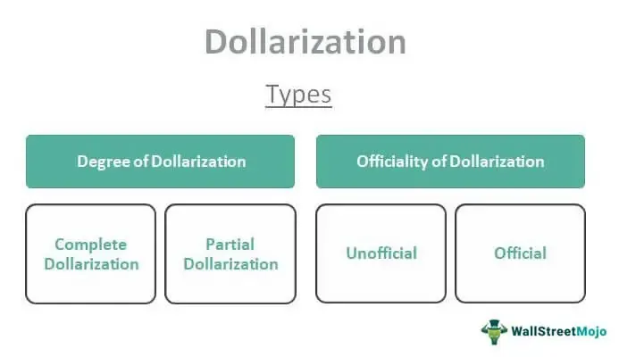

The global financial landscape is in a state of constant evolution, primarily driven by changes in economic policies and rapid technological advancements. Understanding these dynamics is essential for comprehending the broader implications for both local and global markets. This article focuses on two significant components shaping this landscape: dollarization of financial systems and the role of algorithmic trading. 

Dollarization occurs when a country adopts a foreign currency, often the U.S. dollar, instead of its domestic currency. This strategic move is typically aimed at addressing severe economic issues such as hyperinflation and instability. By leveraging the perceived stability of the U.S. dollar, countries aim to stabilize their economies and facilitate smooth day-to-day financial transactions. However, the implications of dollarization extend beyond simple currency substitution, affecting various aspects of a country's economic framework.



Concurrently, technological advancements have spearheaded the rise of algorithmic trading, a method that utilizes computer algorithms to execute trades with efficiency and precision. Algorithmic trading has become a dominant force in financial markets due to its capability to process large volumes of data at unparalleled speeds, enabling optimized trading decisions. This has substantial implications for liquidity, market stability, and the overall efficiency of financial systems.

As global markets continue to integrate and evolve, the interaction between dollarization and algorithmic trading in financial systems becomes increasingly significant. Understanding these interactions is crucial for grasping their cumulative impact on market stability and economic stability. The rise of algorithmic trading raises pressing questions about how dollarization influences financial systems and if these two elements can synergize to bolster economic robustness.

The nexus of dollarization, financial systems, and algorithmic trading offers a fascinating domain to explore. By examining these interactions, we gain insights into how stable foreign currencies can influence market behavior, trader confidence, and potentially attract foreign investments. As we navigate this complex interplay, it becomes clear that the effects of dollarization on financial stability, in the context of advancing trading technologies, warrant thorough analysis and ongoing research.

## Table of Contents

## Understanding Dollarization

Dollarization is a significant monetary phenomenon wherein a country adopts a foreign currency, most commonly the United States dollar, in place of its domestic currency. This transition is not merely a change of banknotes; it encompasses a shift in the entire economic framework of the nation. The rationale behind dollarization is often rooted in the desire to achieve greater economic stability and to mitigate the adverse effects of hyperinflation and other financial instabilities that erode the purchasing power of unreliable domestic currencies.

Countries experiencing severe inflationary pressures are frequently driven to dollarization as an emergency response mechanism. Hyperinflation can render a national currency virtually worthless, spurring a loss of confidence in the monetary system, which can, in turn, disrupt normal economic activities. By adopting a stable foreign currency like the U.S. dollar, these countries aim to curb runaway inflation and restore trust in financial transactions. The predictable nature of the dollar's value helps stabilize day-to-day economic activities, making it an attractive option for countries facing currency crises.

Moreover, dollarization aids in facilitating smoother international trade and investment. When a country adopts the U.S. dollar, it directly links its economy to the global financial network dominated by this currency. This link can lead to increased foreign investment, as investors are usually more comfortable operating in a dollar-based economy due to its stability and familiarity. Additionally, dollarization can eliminate the costs and risks associated with currency exchanges and fluctuations, thereby providing a more predictable economic environment.

However, the decision to dollarize is laden with nuanced considerations. While it offers the advantage of external monetary stability, it simultaneously strips the adopting country of its sovereign monetary policy. This shift means that the nation's central bank no longer has the authority to influence its economy through traditional monetary policy tools, such as adjusting interest rates or controlling the money supply. As a result, the country effectively cedes significant control over its economic strategy to the policymakers of the foreign currency's country of origin—in most cases, the United States Federal Reserve.

Different economies have pursued dollarization for various strategic reasons, with some, like Panama and Ecuador, taking the formal route and adopting the dollar as their official currency. In contrast, others may experience unofficial or partial dollarization, where the dollar is widely used alongside the national currency without official endorsement. Each approach has unique implications for economic management, affecting everything from inflation rates to foreign trade dynamics.

Understanding the mechanisms and motivations for dollarization is essential for assessing its role in a country's economic strategy. It offers a trade-off between achieving monetary stability and relinquishing economic independence, requiring careful evaluation of its long-term impacts on the national economy.

## Economic Impact of Dollarization

Dollarization, or the adoption of the U.S. dollar by another country as its official currency, has significant impacts on the monetary and economic stability of adopting countries. One of the primary benefits of dollarization is the elimination of exchange rate risks. By using a stable foreign currency, countries can reduce the unpredictability associated with fluctuating exchange rates, which often have a direct impact on international trade and investment. This stability attracts foreign investors who are typically wary of currency devaluations that could erode their profits.

Additionally, dollarization reduces inflationary pressures within an economy. In nations struggling with hyperinflation, the introduction of the U.S. dollar stabilizes prices by curbing excessive money supply growth, which is often a leading cause of inflation. The U.S. dollar's robust backing and international acceptance further enhance consumer and investor confidence, contributing to overall economic stability.

Despite these benefits, dollarization has notable downsides, primarily the loss of national monetary policy control. Governments lose the ability to respond independently to economic crises by adjusting interest rates or manipulating currency supply. This loss of economic sovereignty can severely limit a country's ability to craft tailored solutions for local economic issues, leaving it vulnerable to external economic shocks and dependent on the monetary policy of the U.S. Federal Reserve, which may not align with the adopted country's needs.

Zimbabwe's experience provides a case study on the impacts of dollarization. Facing hyperinflation in the late 2000s, Zimbabwe abandoned its local currency in favor of the U.S. dollar. The immediate effect was a stabilization of prices and a revival of basic economic activities. However, in the long term, the lack of monetary policy flexibility created challenges in addressing local economic fluctuations and growth objectives. In essence, while dollarization brought an end to hyperinflation, it also tethered the country’s economic well-being to external monetary stances and limited its government’s policy options.

The economic impact of dollarization thus represents a trade-off: substantial monetary and price stability at the cost of reduced economic autonomy. Countries must weigh these advantages and disadvantages carefully, considering whether the relinquishment of control over national monetary policy is counterbalanced by the stability and investor confidence gained by adopting a stable foreign currency like the U.S. dollar.

## Algorithmic Trading in Dollarized Economies

Algorithmic trading is an avant-garde method that utilizes computer algorithms to execute trades with minimized latency and maximized precision. This approach is highly pertinent in dollarized economies, where a foreign currency like the U.S. dollar underpins financial transactions. Such an environment presents unique opportunities and challenges for [algorithmic trading](/wiki/algorithmic-trading) systems.

In dollarized economies, transparency and currency stability are paramount. The U.S. dollar's global acceptance reduces foreign exchange [volatility](/wiki/volatility-trading-strategies), creating a stable trading environment. This stability enhances [liquidity](/wiki/liquidity-risk-premium), a critical [factor](/wiki/factor-investing) for algorithmic trading strategies that depend on executing large volumes of transactions quickly and at minimal market impact. High liquidity ensures that orders can be filled promptly, reducing slippage — the difference between expected and actual transaction prices — which is a key consideration for algo-traders aiming for cost efficiency.

Moreover, the reduced currency risk in dollarized economies enables algorithmic trading systems to focus more on market microstructures without the burden of exchange rate fluctuations. These systems can capitalize on [arbitrage](/wiki/arbitrage) opportunities with increased predictability compared to volatile, non-dollarized economies. For instance, [statistical arbitrage](/wiki/statistical-arbitrage) strategies that rely on mean reversion — the assumption that the price of assets will return to their historical mean over time — can thrive in such stable environments.

Algorithmic trading in these settings, however, is not without challenges. Regulatory frameworks in dollarized economies might require specific adjustments to accommodate the nuances of automated trading. These economies need regulations that prevent market manipulation and ensure fair practices, which might involve updating existing trading laws to cater to the rapid execution speeds and complexities of algorithmic trades.

Technological barriers also exist, especially in emerging markets where the infrastructure may not be as robust as in developed countries. High-frequency trading ([HFT](/wiki/high-frequency-trading-strategies)), a subset of algorithmic trading, demands state-of-the-art communication networks and low-latency data processing capabilities. In a dollarized economy, ensuring that these technologies can be seamlessly integrated into the financial market infrastructure is crucial.

Python, among other programming languages, is widely favored for developing algorithmic trading models due to its extensive libraries and tools for data analysis and [machine learning](/wiki/machine-learning). Below is a simple illustration of how one could use Python to implement a moving average crossover strategy, a common algorithmic trading strategy:

```python
import numpy as np
import pandas as pd

# Simulated market data
np.random.seed(42)
dates = pd.date_range('2023-01-01', periods=100)
prices = pd.Series(np.random.normal(0.001, 0.02, 100).cumsum(), index=dates) + 100

# Calculate moving averages
short_window = 10
long_window = 30
signals = pd.DataFrame(index=prices.index)
signals['price'] = prices
signals['short_mavg'] = prices.rolling(window=short_window, min_periods=1).mean()
signals['long_mavg'] = prices.rolling(window=long_window, min_periods=1).mean()

# Generate trading signals
signals['signal'] = 0.0
signals['signal'][short_window:] = np.where(signals['short_mavg'][short_window:] > signals['long_mavg'][short_window:], 1.0, 0.0)
signals['positions'] = signals['signal'].diff()

print(signals.head(35))
```

This script calculates short and long-term simple moving averages and generates buy or sell signals when these averages cross, demonstrating the kind of quantitative analysis prevalent in algo-trading.

In conclusion, algorithmic trading in dollarized economies benefits from currency stability and enhanced market liquidity. Yet, it must navigate regulatory and technological challenges to maximize its efficacy. As market infrastructures evolve and regulations adapt, algorithmic trading is poised to become a pivotal component in enhancing the efficiency and depth of financial markets operating under dollarized regimes.

## Synergies between Dollarization and Algo Trading

The integration of algorithmic trading in dollarized systems can significantly enhance market efficiencies by capitalizing on the stability and transparency of a foreign currency like the U.S. dollar. Algorithmic trading, which employs complex mathematical models and high-speed computation to make trading decisions, can operate more effectively in an environment where currency volatility is minimized. The stable valuation of the dollar in dollarized economies provides a predictable set of conditions, reducing the risks inherent in currency fluctuations that could otherwise disrupt trading algorithms.

In exploring these synergies, we gain insights into potential developments in global financial markets. Algorithmic trading algorithms thrive on large volumes of consistent and predictable data, making stable currency environments particularly attractive. The use of a stable foreign currency reduces the exchange rate risk that trading algorithms need to account for, thus simplifying the decision-making processes embedded in these algorithms. This simplification allows for more efficient trading strategies that can execute at higher speeds, leveraging the liquidity provided by the widespread acceptance of the dollar.

A stable dollar environment also bolsters investor confidence, which is crucial for market participation. Investors are often deterred by volatile currency systems, which can lead to unexpected losses. However, in dollarized economies, the reduced currency risk contributes to a more inviting investment climate. This appeal is amplified by the presence of algorithmic trading, which can react rapidly to market data, ensuring competitive pricing and tight bid-ask spreads. It is the reduction in transaction costs and the improved market depth offered by algorithmic trading that can potentially increase foreign investments.

Furthermore, the stable economic backdrop presented by dollarization allows algorithm-driven trades to focus on other critical trading variables like [volume](/wiki/volume-trading-strategy), market [momentum](/wiki/momentum), and interest rates, rather than currency instability. This focus potentially results in more accurate forecasting models and strategic investment moves, enhancing overall market efficiency.

However, while stable foreign currencies can simplify the functioning of trade algorithms, they also necessitate adaptations to the local regulatory and technological frameworks. Financial markets in dollarized countries might require adjustments in regulatory policies to effectively manage algorithmic trading and avoid market manipulations or systemic risks that such automated systems might introduce. Additionally, enhancements in technological infrastructure are essential to support high-frequency trading systems, minimize latency, and handle large data volumes efficiently.

Investor confidence and potential increased foreign investments are further supported by the consistency and reliability of the trading environment in dollarized systems. In summary, the synthesis of algorithmic trading within dollarized economies encourages more efficient trading, attracts foreign investment, and ultimately contributes to a more robust and resilient financial market.

## Conclusion

Dollarization represents a dual-faceted approach for economies, offering stability through the adoption of a more robust foreign currency like the U.S. dollar while simultaneously relinquishing autonomy over domestic monetary policy. This trade-off allows countries to mitigate hyperinflation and exchange rate volatility but also constrains their ability to tailor monetary strategies to specific economic needs.

When algorithmic trading interfaces with these dollarized financial systems, it can significantly enhance market efficiency and investor confidence. The predictable nature of a stable currency environment allows algorithms to function with increased precision and reliability. This is crucial in executing high-frequency and high-volume trades more effectively, thus injecting liquidity and stability into the markets.

Looking ahead, the financial markets are poised to integrate currency stability with cutting-edge trading technologies. A blend of these elements could offer unprecedented opportunities for optimizing market functions. The future landscape may feature improved algorithms tailored to leverage the stability provided by dollarized economies while fostering a global trading environment that prioritizes efficiency and confidence.

The journey towards achieving these benefits requires ongoing research and adaptation. Understanding the inherent drawbacks and continually adapting strategies in both dollarization and algorithmic trading is crucial. This dynamic approach will enable economies to harness the full potential of both practices, ensuring a more robust and efficient global financial system.

## References & Further Reading

[1]: ["Dollarization of the Economy and Its Impacts"](https://www.investopedia.com/terms/d/dollarization.asp) by the International Monetary Fund (IMF)

[2]: Bergstra, J., Bardenet, R., Bengio, Y., & Kégl, B. (2011). ["Algorithms for Hyper-Parameter Optimization."](https://dl.acm.org/doi/10.5555/2986459.2986743) Advances in Neural Information Processing Systems 24.

[3]: ["The Role of the Dollar as an International Currency"](https://www.jstor.org/stable/40325698?ab_segments=0%2Fbasic_search_gsv2%2Fcontrol) by Linda S. Goldberg and Robert Lerman, Federal Reserve Board

[4]: ["Advances in Financial Machine Learning"](https://www.wiley.com/en-us/Advances+in+Financial+Machine+Learning-p-9781119482086) by Marcos Lopez de Prado

[5]: ["The Legitimate and Illegitimate Roles of the Dollar as a World Currency"](https://www.brookings.edu/articles/the-changing-role-of-the-us-dollar/) by Barry Eichengreen, National Bureau of Economic Research

[6]: ["Evidence-Based Technical Analysis: Applying the Scientific Method and Statistical Inference to Trading Signals"](https://www.amazon.com/Evidence-Based-Technical-Analysis-Scientific-Statistical/dp/0470008741) by David Aronson

[7]: ["Machine Learning for Algorithmic Trading"](https://github.com/PacktPublishing/Machine-Learning-for-Algorithmic-Trading-Second-Edition) by Stefan Jansen

[8]: ["Quantitative Trading: How to Build Your Own Algorithmic Trading Business"](https://www.amazon.com/Quantitative-Trading-Build-Algorithmic-Business/dp/0470284889) by Ernest P. Chan