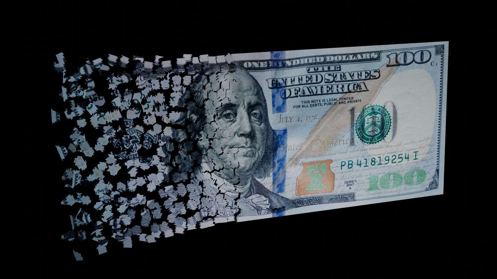

## Table of Contents

## What is dollarization?

Dollarization is when a country decides to use the U.S. dollar instead of its own money. This can happen officially, where the government makes a rule to use the dollar, or unofficially, where people just start using it on their own. Countries might choose dollarization if their own money is not stable or if they want to make trade easier with countries that use the dollar.

When a country uses the U.S. dollar, it can help stop high inflation because the dollar is usually more stable. But it also means the country can't control its own money supply or set its own interest rates. This can make it harder for the government to help the economy grow or deal with problems. So, dollarization has both good and bad points, and countries need to think carefully before deciding to use it.

## What are the different types of dollarization?

There are three main types of dollarization: official, semi-official, and unofficial. Official dollarization happens when a country's government decides to use the U.S. dollar as its official currency. This means that the dollar is the only legal money in that country. For example, Ecuador and El Salvador have officially adopted the U.S. dollar.

Semi-official dollarization is when a country allows the U.S. dollar to be used alongside its own currency. This is often seen in countries where the local currency is not very strong, and people prefer to use dollars for big purchases or savings. For instance, in Cambodia, the U.S. dollar is widely used even though the Cambodian riel is the official currency.

Unofficial dollarization occurs when people in a country start using the U.S. dollar on their own, without any government rule. This usually happens when people don't trust their own money and think the dollar is safer. In places like Zimbabwe, many people use U.S. dollars because their own currency has had big problems with inflation.

## Why do countries choose to dollarize their economy?

Countries choose to dollarize their economy mainly because they want to make their money more stable. When a country's own currency is weak and its value goes up and down a lot, it can cause big problems like high inflation. By using the U.S. dollar, which is usually more stable, a country can help stop these problems. People and businesses can trust that their money will keep its value, which makes it easier to save and plan for the future.

Another reason countries choose dollarization is to make trade easier. Many countries around the world use the U.S. dollar for international trade. When a country uses the dollar, it can trade with other countries more easily without having to change its money into dollars first. This can help the country's economy grow because it can sell more things to other countries. But dollarization also means the country loses control over its own money supply and interest rates, which can be a big downside.

## What are the benefits of dollarization for a country?

Dollarization can help a country make its money more stable. When a country's own money goes up and down a lot, it can cause problems like high prices. By using the U.S. dollar, which doesn't change as much, a country can stop these problems. People and businesses can trust that their money will keep its value. This makes it easier to save money and plan for the future. It also helps lower inflation, which is when prices keep going up.

Another benefit of dollarization is that it can make trade easier. Many countries around the world use the U.S. dollar for buying and selling things with other countries. When a country uses the dollar, it doesn't have to change its money into dollars first. This can help the country's economy grow because it can trade more easily with other countries. More trade can mean more jobs and more money coming into the country.

## What are the potential drawbacks of dollarization?

One big problem with dollarization is that a country loses control over its own money. When a country uses its own money, it can decide how much money to print and what interest rates to set. But with the U.S. dollar, the country can't do these things. This means the country can't use money policies to help its economy grow or to deal with problems like unemployment. If the U.S. changes its money policies, it can affect the dollarized country, but that country can't do anything about it.

Another downside is that dollarization can make a country more dependent on the U.S. economy. If the U.S. economy does well, that's good for the dollarized country. But if the U.S. economy has problems, it can hurt the dollarized country too. Also, using the U.S. dollar might make a country's own money less important. This can be bad for the country's pride and make it harder for the country to feel in control of its own future.

## Can you provide examples of countries that have adopted dollarization?

Some countries have chosen to use the U.S. dollar instead of their own money. Ecuador and El Salvador are two countries that officially use the U.S. dollar. In 2000, Ecuador switched to the dollar because its own money, the sucre, was not doing well. El Salvador followed in 2001, hoping to make its economy more stable.

There are also places where people use the U.S. dollar alongside their own money. In Cambodia, the U.S. dollar is widely used even though the Cambodian riel is the official currency. This is called semi-official dollarization. In Zimbabwe, many people started using the U.S. dollar on their own because their own money had big problems with inflation. This is an example of unofficial dollarization.

These examples show how different countries use dollarization to try to make their economies better. But it's not the same everywhere, and each country has its own reasons for choosing to use the U.S. dollar.

## How does dollarization affect a country's monetary policy?

When a country uses the U.S. dollar instead of its own money, it can't control its own monetary policy anymore. Monetary policy is about deciding how much money to print and what interest rates to set. If a country uses its own money, it can change these things to help its economy grow or to fight problems like high prices. But with the U.S. dollar, the country has to follow whatever the U.S. decides. This means the country can't use money policies to help its own economy when it needs to.

This loss of control over monetary policy can be a big problem. If the U.S. changes its interest rates or how much money it prints, it can affect the dollarized country. But that country can't do anything about it. It has to just go along with what the U.S. does. This can make it harder for the country to deal with its own economic problems. So, while dollarization can make a country's money more stable, it also means giving up the power to control its own money.

## What impact does dollarization have on inflation and economic stability?

Dollarization can help lower inflation and make a country's economy more stable. When a country uses its own money and it's not doing well, prices can go up a lot. This is called high inflation. By using the U.S. dollar, which is usually more stable, a country can stop this from happening. People and businesses can trust that their money will keep its value, so they don't have to worry about prices going up all the time. This makes it easier to save money and plan for the future.

But dollarization can also make it harder for a country to control its own economy. When a country uses the U.S. dollar, it can't decide how much money to print or what interest rates to set. These are important tools for helping the economy grow or fighting problems like high unemployment. If the U.S. changes its money policies, it can affect the dollarized country, but that country can't do anything about it. So, while dollarization can help with inflation and stability, it also means giving up some control over the country's own economic future.

## How does dollarization influence trade and foreign investment?

Dollarization can make trade easier for a country. When a country uses the U.S. dollar, it doesn't have to change its money into dollars to buy or sell things with other countries. This can help the country trade more because it's simpler. More trade can mean more jobs and more money coming into the country. Also, using the U.S. dollar can make people from other countries feel more confident about doing business in the dollarized country. They know the money is stable, so they might be more willing to invest there.

But dollarization can also make a country more dependent on the U.S. economy. If the U.S. economy does well, that's good for the dollarized country. But if the U.S. has problems, it can hurt the dollarized country too. This can be risky because the country can't control what happens to its money. Also, when a country uses the U.S. dollar, it might make its own money less important. This can be bad for the country's pride and make it harder for the country to feel in control of its own future. So, while dollarization can help with trade and foreign investment, it also has some big downsides.

## What are the challenges faced by countries transitioning to a dollarized economy?

When a country decides to switch to using the U.S. dollar instead of its own money, it faces a lot of challenges. One big problem is that the country loses control over its own money. It can't decide how much money to print or what interest rates to set. This means the country can't use money policies to help its economy grow or to fight problems like high unemployment. If the U.S. changes its money policies, it can affect the dollarized country, but that country can't do anything about it. This can make it hard for the country to deal with its own economic problems.

Another challenge is that people and businesses in the country might not like the change. They might be used to using their own money and feel upset about switching to the U.S. dollar. They might worry about losing their country's pride and feeling less in control of their own future. Also, the switch can be hard on the economy at first. Prices might go up or down a lot as everyone gets used to the new money. This can cause confusion and make it hard for people to plan and save. So, while dollarization can help with things like inflation and trade, the transition can be tough.

## How does dollarization affect the role of a country's central bank?

When a country switches to using the U.S. dollar, the job of its central bank changes a lot. Normally, a central bank controls the country's money. It decides how much money to print and sets interest rates to help the economy grow or fight problems like high prices. But when a country uses the U.S. dollar, it can't do these things anymore. The central bank has to follow what the U.S. decides about money, even if it's not good for the country's own economy.

This change can make the central bank's job much harder. The central bank can't use money policies to help the country when it needs it. If the U.S. changes its money policies, it can affect the dollarized country, but that country can't do anything about it. The central bank might still do other things, like making sure banks in the country are safe and helping with payments. But it loses a lot of its power over the country's money.

## What are the long-term economic implications of dollarization for a country?

Over the long term, dollarization can help a country's economy stay more stable. By using the U.S. dollar, the country can keep its money from going up and down too much. This makes it easier for people and businesses to plan and save because they know their money will keep its value. It can also help lower inflation, which is when prices keep going up. More trade can happen because it's easier to buy and sell things with other countries that use the dollar. This can lead to more jobs and more money coming into the country. But dollarization also means the country can't control its own money anymore, which can be a big problem.

In the long run, not being able to control its own money can make it hard for a country to help its economy grow or deal with problems like high unemployment. If the U.S. changes its money policies, it can affect the dollarized country, but that country can't do anything about it. This can make the country more dependent on the U.S. economy. If the U.S. does well, that's good for the dollarized country. But if the U.S. has problems, it can hurt the dollarized country too. Also, using the U.S. dollar might make a country's own money less important. This can be bad for the country's pride and make it harder for the country to feel in control of its own future.

## References & Further Reading

- International Monetary Fund: The Currency Composition of Official Foreign Exchange Reserves report by the International Monetary Fund provides up-to-date and detailed statistics on the currency distribution of global foreign exchange reserves. This data is crucial for analyzing trends in dollarization and its effects on international finance. [IMF Website](https://www.imf.org)

- Bergstra, J., et al.: This paper on Algorithms for Hyper-Parameter Optimization discusses state-of-the-art techniques for optimizing hyper-parameters, a key aspect of developing robust algorithmic trading systems. Proper optimization enhances the efficiency and profitability of algorithmic strategies. The paper is available in various academic databases.

- Federal Reserve Board: The Role of the Dollar as an International Currency is a detailed analysis from the Federal Reserve Board explaining the dollar's dominant position globally. This document helps understand the implications of dollarization on global markets. [Federal Reserve Website](https://www.federalreserve.gov)

- Lopez de Prado, M.: Advances in Financial Machine Learning offers a comprehensive exploration of machine learning techniques applicable to finance, including algorithmic trading. The book provides insights into how technological advancements are transforming financial markets. [Wiley Online Library](https://www.wiley.com)

- Eichengreen, B.: The Legitimate and Illegitimate Roles of the Dollar as a World Currency presents an in-depth examination of the complex dynamics surrounding the U.S. dollar's status. This scholarly work helps contextualize the broader effects of dollarization in global economics. Available through academic publishers and libraries.

