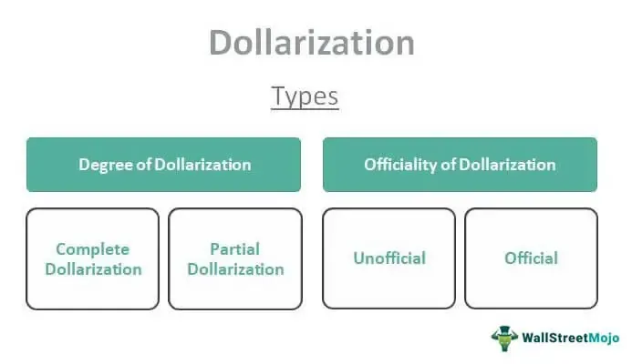

In today's interconnected financial world, understanding the complex interactions between economic policies and technological advancements is crucial. Financial systems are evolving rapidly, driven by globalization and innovation. Two significant phenomena at the intersection of economics and technology are dollarization and algorithmic trading. Dollarization occurs when a country adopts a foreign currency, typically the U.S. dollar, to stabilize its economy and curb hyperinflation. This approach helps in maintaining economic stability by providing credibility and reducing the risk of currency devaluation. However, adopting a foreign currency also means that a nation loses the ability to control its monetary policy independently.

In parallel, technological advancements have paved the way for algorithmic trading, a method where complex computer algorithms are employed to execute trades with high precision and speed. Algorithmic trading enhances market efficiency by utilizing quantitative models to assess data and make trading decisions in fractions of a second. With its ability to process vast amounts of information quickly, algorithmic trading minimizes human error, reduces transaction costs, and increases the liquidity of financial markets. The synergy between stable economic environments, often achieved through dollarization, and high-frequency, precise trading operations found in algorithmic trading, provides deep insights into the functioning of contemporary financial markets. As we continue to navigate through a financially and technologically interconnected era, the integration of these elements will likely play a pivotal role in shaping the future landscape of global finance.



## Table of Contents

## Understanding Dollarization

Dollarization is a financial strategy wherein a country adopts a foreign currency, replacing its domestic currency. This practice is often driven by the need to achieve economic stability and mitigate severe economic challenges, such as hyperinflation. Hyperinflation occurs when a country's inflation rate accelerates uncontrollably, causing a swift erosion of the local currency's value. By adopting a more stable foreign currency, usually the U.S. dollar, countries aim to stabilize their economies.

The process of dollarization typically involves transferring control over important monetary policy instruments to the authority of the foreign currency's issuing country. This means that the country relinquishes its ability to independently set interest rates and manage money supply, which can be critical tools for responding to economic shocks or local financial conditions. The country adopting dollarization effectively aligns its monetary policy with that of the U.S. federal reserve, if the U.S. dollar is chosen as the foreign currency.

Despite this loss of control, dollarization can enhance a country's economic credibility. By adopting a stable foreign currency, the nation may reduce the risk of devaluation and foster greater confidence among international investors. This improved perception can lead to increased foreign investments as investors feel assured of the reduced likelihood of sudden currency devaluations affecting their returns.

Furthermore, dollarization can provide a shield against the economic instability often seen with currency fluctuations. Stability in the currency can reduce the cost of imports and, by diminishing the inflationary pressures associated with volatile exchange rates, can lead to more predictable economic conditions. However, the downside is that these benefits come at the cost of reduced flexibility in national monetary policy. The nation can no longer print money to finance its deficit or adjust monetary policies specifically tailored to address local economic conditions.

In summary, while dollarization can drastically stabilize an economy, particularly one facing hyperinflation, it requires the nation to forfeit control over its monetary policy, which can impact its ability to address future economic issues independently.

## Economic Impact of Dollarization

Dollarization can significantly impact a country's economy by enhancing stability and reducing exchange rate [volatility](/wiki/volatility-trading-strategies). By adopting a stable foreign currency, such as the U.S. dollar, countries can mitigate the risks associated with fluctuating exchange rates. This stability often results in lower inflation rates, as the influence of an unstable domestic currency is minimized. Consequently, a stable financial environment can attract increased foreign and domestic investments, ultimately fostering economic growth.

However, dollarization does come with its own set of challenges. A major drawback is the loss of control over domestic monetary policy. By adopting a foreign currency, a nation effectively cedes its ability to implement independent monetary policies tailored to its economic conditions. This limitation restricts the government's ability to respond to economic shocks and manage [liquidity](/wiki/liquidity-risk-premium) in the economy. Furthermore, countries lose the benefit of seigniorage, which is the profit made by issuing currency, as they no longer have the power to print their own money.

An illustrative example of dollarization's impact can be seen in Zimbabwe, which officially adopted the U.S. dollar in 2009 after a period of hyperinflation. This transition initially stabilized the economy by curbing inflation and restoring confidence in the financial system. However, it also highlighted limitations, such as the reliance on foreign currency inflows and the inability to formulate autonomous monetary policies. These factors contributed to ongoing economic challenges, despite the initial stabilization.

When contemplating dollarization, countries must carefully evaluate the trade-offs between economic stability and the potential loss of monetary autonomy. While dollarization can provide a framework for financial stability, it is essential for policymakers to consider the long-term implications on economic sovereignty and the capacity to react to future economic uncertainties.

## Algorithmic Trading in Dollarized Economies

Algorithmic trading leverages sophisticated computer algorithms to optimize trading decisions, thereby enhancing efficiency and precision in financial markets. In dollarized economies, where countries adopt stable foreign currencies like the U.S. dollar, the trading environment is often less volatile. This stability is advantageous for [algorithmic trading](/wiki/algorithmic-trading) systems as it allows for better liquidity conditions and minimizes slippage— the difference between the expected price of a trade and the actual price.

The reduced volatility of the currency in dollarized economies facilitates more predictable trading patterns. It enables algorithms to perform more accurately, as fewer unforeseen currency fluctuations impact the execution of trades. Consequently, the consistency of a stable currency enhances investor confidence and leads to increased market activity, as trading strategies can operate with a clearer expectation of currency performance.

However, the implementation of algorithmic trading in these contexts is not without challenges. The demand for a robust technological infrastructure becomes apparent, as it needs to support the high-speed data processing and execution capabilities required by algorithmic systems. Furthermore, regulatory frameworks may need to be updated to keep pace with technological advancements and safeguard market integrity. This involves crafting regulations that oversee algorithmic trading activities while promoting transparency and protecting market participants.

Programming languages play a pivotal role in the development of algorithmic trading strategies. Python, in particular, is frequently used due to its extensive libraries and ease of integration with various data sources. Python's versatility allows traders to quickly iterate and test new strategies, analyze large datasets, and deploy [machine learning](/wiki/machine-learning) algorithms to adapt to market changes. A simple example of a trading algorithm in Python using the pandas library to analyze historical data could look like this:

```python
import pandas as pd

# Load historical price data
data = pd.read_csv('price_data.csv')

# Calculate moving averages
data['Short_MA'] = data['Close'].rolling(window=50).mean()
data['Long_MA'] = data['Close'].rolling(window=200).mean()

# Generate signals
data['Signal'] = 0
data['Signal'][50:] = np.where(data['Short_MA'][50:] > data['Long_MA'][50:], 1, 0)
data['Position'] = data['Signal'].diff()

# Display buy/sell markers
print(data[['Close', 'Short_MA', 'Long_MA', 'Signal', 'Position']].tail())
```

This script calculates short and long moving averages of stock prices to generate trading signals, demonstrating a basic strategy. More advanced strategies may involve the use of machine learning models or other complex statistical techniques to refine predictive accuracy and trading outcomes.

The interplay of dollarization and algorithmic trading creates an environment conducive to market efficiency, but it necessitates careful planning and adaptation of both technological and regulatory infrastructures to fully capitalize on the benefits.

## Synergies between Dollarization and Algo Trading

The interaction between dollarization and algorithmic trading provides an opportunity to enhance market efficiencies in various ways. By adopting a stable currency like the U.S. dollar, dollarized economies offer a reduced risk environment for algorithmic trading systems. This stability allows trading algorithms to operate more efficiently, as they do not need to account for the complexities associated with volatile currency fluctuations. Consequently, trades can be executed faster and with increased reliability.

Algorithmic trading can also increase investor confidence by providing rapid and efficient trading capabilities. Algorithms have the ability to execute trades at high speeds and frequencies that are impossible for human traders, ensuring optimal execution strategies are followed. This automation not only facilitates competitive pricing but also enhances market liquidity, both of which are crucial for attracting foreign investment. In a dollarized economy, these benefits are amplified due to the predictable performance of the stable currency.

However, to fully harness the synergies between dollarization and algorithmic trading, adjustments in regulations and infrastructure are necessary. Regulatory frameworks must evolve to address the specific challenges posed by algorithmic trading, including issues related to market manipulation and the potential for systemic risk. Furthermore, robust technological infrastructure is essential to support the high-speed data transmission and computational requirements of algorithmic systems.

Here is an example of a simple Python algorithm for executing trades based on moving averages, a common strategy used in algorithmic trading:

```python
import pandas as pd

def moving_average_strategy(prices, short_window=40, long_window=100):
    signals = pd.DataFrame(index=prices.index)
    signals['signal'] = 0.0

    # Short moving average
    signals['short_mavg'] = prices['close'].rolling(window=short_window, min_periods=1).mean()

    # Long moving average
    signals['long_mavg'] = prices['close'].rolling(window=long_window, min_periods=1).mean()

    # Create buy signals when short MA crosses above long MA
    signals['signal'][short_window:] = np.where(signals['short_mavg'][short_window:] 
                                                 > signals['long_mavg'][short_window:], 1.0, 0.0)  

    # Generate trading orders
    signals['positions'] = signals['signal'].diff()

    return signals
```

This code illustrates a basic strategy that generates buy signals when the short-term moving average crosses above the long-term moving average, indicative of a potential upward trend. For economies that have embraced dollarization, such strategies can be more effective due to the reduced currency risk, allowing traders and investors to focus on market-based signals rather than currency fluctuations.

Ultimately, the synergy between dollarization and algorithmic trading is not just theoretical but practical. To maximize these benefits, financial systems must remain dynamic, adapting both regulatory environments and technological infrastructures to support evolving trading strategies and economic conditions.

## Conclusion

Dollarization provides economic stability by reducing exchange rate volatility and fostering an environment conducive to foreign investment. However, it comes with the significant cost of forfeiting a nation's control over its monetary policy. This trade-off requires careful consideration from policymakers, weighing the immediate benefits of stability against the longer-term limitations of reduced economic sovereignty.

Algorithmic trading, on the other hand, offers substantial improvements in trading efficiency, speed, and precision. These sophisticated systems enable market participants to execute trades at speeds beyond human capability, ensuring competitive pricing and market efficiency. The combination of stable currency environments, such as those provided by dollarization, with advanced trading technologies, highlights the potential for enhanced market operation and increased investor confidence.

As financial markets continue to evolve, the integration of dollarization and algorithmic trading will likely shape future landscapes. The convergence of these elements is poised to leverage currency stability alongside cutting-edge trading technologies, creating a robust framework for global financial activities. As these practices advance, continuous research and adaptation will be essential to unlock their full potential, demanding a dynamic and progressive approach.

Successfully harnessing these synergies requires responsive adjustments in regulatory environments and investments in technological infrastructure. By embracing these changes, governments and financial institutions can ensure more resilient and efficient global financial markets, ready to meet the challenges of an increasingly interconnected world.

## References & Further Reading

- International Monetary Fund: The Currency Composition of Official Foreign Exchange Reserves report by the International Monetary Fund provides up-to-date and detailed statistics on the currency distribution of global foreign exchange reserves. This data is crucial for analyzing trends in dollarization and its effects on international finance. [IMF Website](https://www.imf.org)

- Bergstra, J., et al.: This paper on Algorithms for Hyper-Parameter Optimization discusses state-of-the-art techniques for optimizing hyper-parameters, a key aspect of developing robust algorithmic trading systems. Proper optimization enhances the efficiency and profitability of algorithmic strategies. The paper is available in various academic databases.

- Federal Reserve Board: The Role of the Dollar as an International Currency is a detailed analysis from the Federal Reserve Board explaining the dollar's dominant position globally. This document helps understand the implications of dollarization on global markets. [Federal Reserve Website](https://www.federalreserve.gov)

- Lopez de Prado, M.: Advances in Financial Machine Learning offers a comprehensive exploration of machine learning techniques applicable to finance, including algorithmic trading. The book provides insights into how technological advancements are transforming financial markets. [Wiley Online Library](https://www.wiley.com)

- Eichengreen, B.: The Legitimate and Illegitimate Roles of the Dollar as a World Currency presents an in-depth examination of the complex dynamics surrounding the U.S. dollar's status. This scholarly work helps contextualize the broader effects of dollarization in global economics. Available through academic publishers and libraries.

