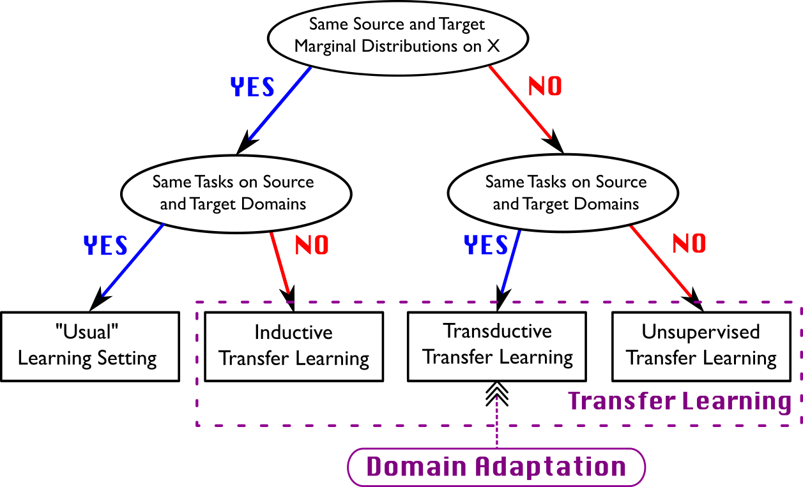

## Table of Contents

## What is Domain Adaptation in the context of Machine Learning?

Domain adaptation in machine learning is a technique used to help models perform well on new, different data than what they were originally trained on. Imagine you trained a model to recognize cats in pictures taken during the day. Now, you want it to recognize cats in pictures taken at night. The model might struggle because the lighting and background are different. Domain adaptation helps by adjusting the model so it can better understand and work with the new type of data, like night-time photos.

To do domain adaptation, you often start with a model that's already good at a task in one setting (the source domain) and then tweak it to work well in a new setting (the target domain). This can involve retraining the model on a small amount of data from the target domain, or using special techniques to align the features of the source and target domains. The goal is to make the model as effective in the new setting as it was in the original one, without starting from scratch.

## Why is Domain Adaptation important for machine learning models?

Domain adaptation is important for machine learning models because it helps them work well in new situations. Imagine you have a model that's great at understanding spoken English in a quiet room. But when you use it in a noisy street, it might not work as well. Domain adaptation helps the model adjust to the new environment, like the noisy street, so it can still understand spoken English well. This means the model can be useful in more places and situations without needing to be completely rebuilt.

Another reason domain adaptation is important is that it saves time and resources. Building a new model from scratch for every new situation can be very expensive and time-consuming. With domain adaptation, you can take a model that's already good at something and make it work in a new setting with less effort. This makes it easier and faster to use machine learning in different areas, like healthcare, where a model trained on one hospital's data might need to work well with another hospital's data.

## What are the main challenges faced in Domain Adaptation?

One main challenge in domain adaptation is the difference between the source and target domains. These differences can be in the data's distribution, the features, or the way the data is collected. For example, if a model is trained on images of cats taken in a studio, it might struggle with images of cats taken outside because of different lighting and backgrounds. This difference can make it hard for the model to adapt, and special techniques are needed to help the model understand the new data.

Another challenge is getting enough data from the target domain. Often, there's plenty of data from the source domain, but not enough from the target domain. This makes it hard to train the model to work well in the new setting. Sometimes, you might need to use tricks like creating fake data that looks like it comes from the target domain, or using a small amount of real data to make big improvements. Both ways need careful work to make sure the model adapts well without losing what it learned from the source domain.

Lastly, measuring how well domain adaptation is working can be tricky. You want to know if the model is getting better at understanding the new data, but it's not always clear how to measure this. Sometimes, you might think the model is doing well, but it's actually just memorizing the new data instead of really learning from it. This can lead to problems when you use the model in the real world. So, it's important to use good ways to check the model's performance and make sure it's really adapting well.

## Can you explain the difference between supervised and unsupervised Domain Adaptation?

Supervised domain adaptation is when you have some labeled data from the target domain. This means you know the correct answers for some of the new data. You can use this labeled data to help the model learn how to work well in the new setting. For example, if you trained a model to recognize cats in daytime photos and now want it to work with nighttime photos, you might show it some nighttime photos of cats with labels saying "cat." The model can use these examples to adjust and get better at recognizing cats at night. The main advantage of supervised domain adaptation is that it can be very accurate because the model has clear examples of what to learn from the new domain.

Unsupervised domain adaptation is different because you don't have any labeled data from the target domain. You only have the new data without knowing the correct answers. This makes it harder because the model has to figure out how to adapt on its own. For example, if you want your cat-recognition model to work at night but don't have any labeled nighttime photos, the model has to learn from the patterns in the new data. Techniques like aligning the features of the source and target domains can help the model adapt. While unsupervised domain adaptation can be trickier, it's useful when labeled data is hard to get, which is often the case in real-world situations.

## What is the CORAL method in Domain Adaptation and how does it work?

The CORAL method, which stands for CORrelation ALignment, is a simple yet effective technique used in unsupervised domain adaptation. It works by aligning the second-order statistics (the covariance) of the source and target domains. The idea is to make the data from both domains look more similar in terms of how their features relate to each other. By doing this, a model trained on the source domain can perform better on the target domain without needing any labeled data from the target domain.

Here's how CORAL works: First, it calculates the covariance matrices of the source and target domains. Then, it finds a linear transformation that makes the covariance matrix of the source domain as close as possible to the covariance matrix of the target domain. This transformation is applied to the source domain data, making it look more like the target domain data. The formula for the transformation can be written as $$A = R \cdot \sqrt{\Sigma_t} \cdot \sqrt{\Sigma_s}^{-1},$$ where $$R$$ is a rotation matrix, $$\Sigma_s$$ is the covariance matrix of the source domain, and $$\Sigma_t$$ is the covariance matrix of the target domain. By using this method, the model can adapt to the new domain more effectively, even without any labeled data from the target domain.

## How does the DANCE approach improve Domain Adaptation?

The DANCE approach, which stands for Domain Adaptation via Neural Calibration and Entropy minimization, helps improve domain adaptation by making the model better at understanding new data. It does this by focusing on two main ideas: neural calibration and entropy minimization. Neural calibration helps the model adjust its confidence in its predictions, making sure it's not too sure or too unsure about what it's seeing. Entropy minimization, on the other hand, helps the model make clearer decisions by reducing the uncertainty in its predictions. By using these two ideas together, DANCE can make the model work better on new data without needing a lot of labeled examples from the new setting.

DANCE works by first training the model on the source domain data. Then, it uses the target domain data to adjust the model. During this adjustment, DANCE applies neural calibration to make the model's confidence levels more accurate for the new data. It also uses entropy minimization to make the model's predictions more certain. This helps the model adapt to the new domain more effectively. For example, if a model was trained to recognize cats in daytime photos and you want it to work with nighttime photos, DANCE can help the model adjust its confidence and make clearer predictions about cats in the new setting. This makes the model more useful in different situations without needing to start from scratch.

## What is Source Hypothesis Transfer and how is it applied in Domain Adaptation?

Source Hypothesis Transfer is a method used in domain adaptation to help a model work well on new data. Imagine you have a model that's good at understanding spoken English in a quiet room. Now, you want it to understand spoken English in a noisy street. Source Hypothesis Transfer helps by taking what the model learned in the quiet room and using it to make better guesses about the noisy street. It does this by figuring out how the model's predictions in the source domain (the quiet room) relate to the target domain (the noisy street), and then adjusting the model to make it work well in the new setting.

In practice, Source Hypothesis Transfer often involves using a small amount of data from the target domain to help the model adapt. For example, if you have a few examples of spoken English from the noisy street, you can use these to fine-tune the model. The model looks at how its predictions on the quiet room data compare to its predictions on the noisy street data, and then adjusts its decision-making process. This way, the model can use what it learned in the source domain to make better predictions in the target domain, even if it doesn't have a lot of labeled data from the new setting.

## Can you describe the PGA method and its significance in Domain Adaptation?

The PGA method, which stands for Progressive Graph Attention, is a way to help machine learning models work better on new data. Imagine you trained a model to recognize cats in pictures taken during the day, and now you want it to recognize cats in pictures taken at night. The PGA method helps by using a special kind of attention mechanism that looks at how different parts of the data are related. It builds a graph where each part of the data is a node, and the connections between nodes show how they relate to each other. By paying attention to these connections, the model can learn how to adapt from the day-time photos to the night-time photos more effectively.

The significance of the PGA method in domain adaptation is that it helps the model understand the new data better by focusing on the relationships between different parts of the data. This is especially useful when the new data is very different from the old data, like going from day to night. By using the graph attention mechanism, the model can see how the features in the new data are connected and use this information to make better predictions. This makes the model more flexible and able to work well in different situations without needing a lot of new labeled data.

## How does MSGAN utilize generative adversarial networks for Domain Adaptation?

MSGAN, which stands for Multi-Source Generative Adversarial Network, is a method that uses generative adversarial networks (GANs) to help machine learning models work well on new data. Imagine you have a model that's good at recognizing cats in pictures from one camera, but now you want it to recognize cats in pictures from many different cameras. MSGAN helps by creating fake pictures that look like they come from the new cameras. It does this using a GAN, where one part of the network (the generator) creates these fake pictures, and another part (the discriminator) tries to tell the difference between real and fake pictures. By doing this back-and-forth, the generator gets better at making pictures that look like they come from the new cameras, helping the model adapt to the new data.

The key idea behind MSGAN is that it can use data from multiple sources to help the model adapt. For example, if you have pictures of cats from several different cameras, MSGAN can use all these pictures to create new, fake pictures that look like they come from any of the cameras. This helps the model learn how to recognize cats no matter which camera took the picture. By using GANs in this way, MSGAN makes it easier for the model to work well with new types of data, even when the new data is very different from what it was trained on originally.

## What are the key features of the SIFA method in Domain Adaptation?

The SIFA method, which stands for Subspace Interpolation and Feature Alignment, is a way to help machine learning models work well on new data. Imagine you trained a model to recognize cats in pictures taken during the day, but now you want it to recognize cats in pictures taken at night. SIFA helps by finding a middle ground between the day-time and night-time pictures. It does this by creating a new space where both types of pictures can be understood better. This new space is called a subspace, and SIFA uses it to make the model's predictions more accurate for the new data.

SIFA works by first looking at the features of the day-time and night-time pictures. It then finds a way to move these features into the new subspace, making them easier for the model to understand. By doing this, the model can see the similarities and differences between the day-time and night-time pictures more clearly. This helps the model adapt to the new setting without needing a lot of labeled night-time pictures. SIFA is useful because it makes the model more flexible and able to work well in different situations, even when the new data is very different from the old data.

## How does SymmNet leverage symmetry for better Domain Adaptation?

SymmNet uses symmetry to help machine learning models work better on new data. Imagine you trained a model to recognize cats in pictures taken during the day, but now you want it to recognize cats in pictures taken at night. SymmNet helps by using the idea that the features in day-time and night-time pictures are related in a symmetrical way. It looks at how the features in the source domain (day-time pictures) and the target domain (night-time pictures) are connected and uses this symmetry to make the model's predictions more accurate for the new data.

By using symmetry, SymmNet can find a way to adjust the model so it understands both types of pictures better. It does this by creating a new space where the features from both domains are aligned in a symmetrical way. This helps the model see the similarities and differences between the day-time and night-time pictures more clearly. As a result, the model can adapt to the new setting without needing a lot of labeled night-time pictures, making it more flexible and able to work well in different situations.

## What advancements does the ALDI++ method bring to Domain Adaptation?

The ALDI++ method brings several improvements to domain adaptation by making it easier for models to work well with new data. Imagine you trained a model to recognize cats in pictures taken during the day, but now you want it to recognize cats in pictures taken at night. ALDI++ helps by using a special way to align the features of the day-time and night-time pictures. It does this by finding a middle ground between the two types of pictures, making it easier for the model to understand both. This method is useful because it helps the model adapt to new settings without needing a lot of labeled night-time pictures.

One key advancement of ALDI++ is its use of a technique called "optimal transport" to align the features of the source and target domains. Optimal transport helps find the best way to move the features from the day-time pictures to the night-time pictures, making them more similar. This makes the model's predictions more accurate for the new data. By using optimal transport, ALDI++ can make the model more flexible and able to work well in different situations, even when the new data is very different from the old data.