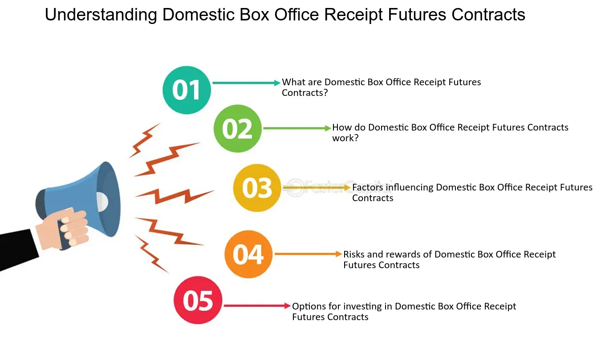

## Table of Contents

## What are Domestic Box Office Receipt Futures Contracts?

Domestic Box Office Receipt Futures Contracts are financial agreements that let people bet on how much money a movie will make in the United States. They work a lot like betting on a sports game, where you can guess if a movie will earn more or less than a certain amount of money at the box office. These contracts are traded on special markets, and they can be used by movie studios, investors, and others who want to manage the financial risks of making movies.

These futures contracts help movie studios protect themselves from losing too much money if a movie doesn't do well. For example, if a studio thinks their movie might not make as much money as expected, they can use these contracts to limit their losses. On the other hand, investors can use these contracts to try to make money by guessing correctly about a movie's success. This way, both studios and investors can handle the ups and downs of the movie business more safely.

## How do Domestic Box Office Receipt Futures Contracts work?

Domestic Box Office Receipt Futures Contracts are like bets on how much money a movie will make in the U.S. When someone buys a contract, they are guessing if the movie will earn more or less than a certain amount of money at the box office. These contracts are traded on special markets, kind of like how you can buy and sell stocks. The price of the contract changes based on what people think the movie will earn. If more people think the movie will do well, the price goes up, and if they think it will do poorly, the price goes down.

Movie studios can use these contracts to protect themselves from losing too much money if their movie doesn't do as well as expected. For example, if a studio thinks their movie might not make a lot of money, they can buy a contract that pays them if the movie earns less than a certain amount. This way, they can limit their losses. On the other hand, investors can buy these contracts to try to make money by guessing correctly about a movie's success. If they think a movie will do better than expected, they can buy a contract that pays them if the movie earns more than a certain amount. This helps both studios and investors manage the risks of the movie business.

## What is the purpose of trading Domestic Box Office Receipt Futures Contracts?

The main purpose of trading Domestic Box Office Receipt Futures Contracts is to help people and companies in the movie industry manage the risk of making movies. Movies can be very expensive to make, and it's hard to predict if they will make a lot of money or not. By trading these contracts, movie studios can protect themselves from losing too much money if a movie doesn't do well at the box office. They can buy contracts that pay them if the movie earns less than expected, which helps them limit their losses.

Investors also use these contracts to try to make money by guessing how well a movie will do. If they think a movie will be a big hit, they can buy a contract that pays them if the movie earns more than expected. This way, they can make money even if they are not directly involved in making the movie. Trading these contracts helps both movie studios and investors handle the ups and downs of the movie business more safely.

## Who can trade Domestic Box Office Receipt Futures Contracts?

Domestic Box Office Receipt Futures Contracts can be traded by a variety of people and organizations involved in the movie industry. This includes movie studios who want to protect themselves from losing money if their movie doesn't do well. They can buy contracts to limit their losses if the movie earns less than expected. Investors also trade these contracts. They try to make money by guessing if a movie will earn more or less than a certain amount. They can buy contracts that pay them if their guess is right.

These contracts are traded on special markets, similar to how stocks are traded. Anyone with access to these markets can buy and sell the contracts. This means that not only movie studios and investors, but also other people who are interested in the movie business can participate. By trading these contracts, all these groups can manage the risks of the movie industry and possibly make money based on their predictions about a movie's success.

## What are the risks associated with trading these contracts?

Trading Domestic Box Office Receipt Futures Contracts can be risky because it's hard to predict how well a movie will do. If you guess wrong about a movie's earnings, you could lose money. For example, if you buy a contract betting that a movie will earn more than expected and it doesn't, you'll lose the money you spent on the contract. The same goes for studios that buy contracts to protect themselves; if the movie does better than they thought, they might miss out on extra profits.

Another risk is that the market for these contracts can be unpredictable. The prices of the contracts can change a lot based on what people think about a movie's chances of success. This means that even if you have a good guess about a movie's earnings, the price of the contract might go up or down quickly, affecting how much money you make or lose. It's important for anyone trading these contracts to understand these risks and be ready for the possibility of losing money.

## How are the prices of Domestic Box Office Receipt Futures Contracts determined?

The prices of Domestic Box Office Receipt Futures Contracts are determined by what people think about a movie's chances of making money. If more people believe that a movie will be a big hit and earn a lot of money, they will want to buy the contracts that pay out if the movie does well. This demand makes the price of those contracts go up. On the other hand, if people think a movie will not do well, they will want to buy contracts that pay out if the movie earns less than expected, which makes the price of those contracts go up.

These prices can change a lot as new information comes out about the movie. For example, if a popular actor joins the movie or if the movie gets good reviews at a film festival, more people might think the movie will do well, and the price of the contracts could go up. But if the movie gets bad reviews or if there's a big competing movie coming out at the same time, people might think the movie will not do as well, and the price of the contracts could go down. It's all about what people think will happen, and those thoughts can change quickly.

## What are the key factors that influence the value of these contracts?

The value of Domestic Box Office Receipt Futures Contracts is mainly influenced by what people think about how well a movie will do at the box office. If a lot of people believe a movie will be a big hit and make a lot of money, they will want to buy contracts that pay out if the movie does well. This demand makes the price of those contracts go up. On the other hand, if people think a movie will not do well, they will want to buy contracts that pay out if the movie earns less than expected, which makes the price of those contracts go up.

These prices can change a lot as new information about the movie comes out. For example, if a popular actor joins the movie or if the movie gets good reviews at a film festival, more people might think the movie will do well, and the price of the contracts could go up. But if the movie gets bad reviews or if there's a big competing movie coming out at the same time, people might think the movie will not do as well, and the price of the contracts could go down. It's all about what people think will happen, and those thoughts can change quickly based on new information.

## How can one hedge using Domestic Box Office Receipt Futures Contracts?

Hedging with Domestic Box Office Receipt Futures Contracts means using these contracts to protect against losing money if a movie doesn't do as well as expected. For example, if a movie studio thinks their movie might not make a lot of money, they can buy a contract that pays them if the movie earns less than a certain amount. This way, even if the movie doesn't do well, the studio can get some money back from the contract, which helps them limit their losses.

Investors can also use these contracts to hedge their bets. If an investor thinks a movie will do better than expected, they can buy a contract that pays them if the movie earns more than a certain amount. This way, they can make money even if they are not directly involved in making the movie. By using these contracts, both movie studios and investors can manage the ups and downs of the movie business more safely, reducing the risk of losing a lot of money.

## What are the historical trends in the trading of these contracts?

Domestic Box Office Receipt Futures Contracts have been around since the early 2000s, when they were introduced as a way for people to bet on how well movies would do at the box office. At first, not many people traded these contracts because they were new and people didn't know much about them. But over time, more movie studios and investors started using them to manage their risks. The trading [volume](/wiki/volume-trading-strategy), or how many contracts were bought and sold, slowly grew as people learned more about how these contracts could help them.

In recent years, the trading of these contracts has become more popular, especially with big movies that a lot of people are excited about. When a new movie from a popular series comes out, like a superhero movie or a sequel to a hit film, there is usually a lot of trading activity. People want to guess if these movies will make a lot of money or not. The rise of online platforms has also made it easier for more people to trade these contracts, leading to even more interest and activity in the market.

## How do Domestic Box Office Receipt Futures Contracts compare to other financial derivatives?

Domestic Box Office Receipt Futures Contracts are a lot like other financial derivatives because they let people bet on future events. Just like how futures contracts for oil or wheat let people guess about future prices, these contracts let people guess about how much money a movie will make. The big difference is that these movie contracts are based on something that's hard to predict, like how well a movie will do, instead of something more predictable like the price of oil or wheat. This makes them riskier because it's harder to guess right about a movie's success.

Another way these contracts are different is that they are mainly used by people in the movie business, like movie studios and investors. Other financial derivatives, like stock options or commodity futures, are used by a wider range of people and businesses. Movie contracts are traded on special markets that focus on entertainment, while other derivatives are traded on bigger markets like the stock exchange. Even though they work in similar ways, the movie contracts are a bit more specialized and can be more unpredictable because they depend on things like movie reviews and audience reactions.

## What regulatory considerations should be taken into account when trading these contracts?

When trading Domestic Box Office Receipt Futures Contracts, it's important to know about the rules that govern them. These contracts are regulated by special agencies, like the Commodity Futures Trading Commission (CFTC) in the United States. The CFTC makes sure that the markets where these contracts are traded are fair and that people don't cheat or do anything wrong. They also set rules about who can trade these contracts and how they should be traded. It's important for anyone trading these contracts to follow these rules to avoid getting into trouble.

Another thing to think about is that different countries might have different rules about trading these contracts. If you're trading in a country other than the U.S., you need to know the local laws and regulations. Some places might not allow these kinds of contracts at all, or they might have different rules about who can trade them and how. It's always a good idea to check with a lawyer or a financial expert to make sure you're following all the right rules wherever you are trading.

## What advanced strategies can be employed to maximize returns from trading Domestic Box Office Receipt Futures Contracts?

To maximize returns from trading Domestic Box Office Receipt Futures Contracts, one strategy is to use market analysis to make better guesses about a movie's success. This means looking at things like how well the movie's director has done in the past, what people are saying about the movie before it comes out, and how much money similar movies have made. If you can find patterns or clues that help you guess better than most people, you can buy contracts that will pay you if your guess is right. Another part of this strategy is to keep an eye on the news and any changes that might affect a movie's success, like if a popular actor joins the cast or if there's a big competing movie coming out at the same time.

Another advanced strategy is to use a mix of contracts to spread out your risk. Instead of betting all your money on one movie doing well or badly, you can buy contracts for different movies or different types of contracts for the same movie. This way, if one of your guesses is wrong, you might still make money from another contract. It's like not putting all your eggs in one basket. This strategy can help you make more money over time by balancing the risks and rewards of different movies and contracts. It takes some practice and understanding of the market, but it can help you do better in the long run.

## References & Further Reading

[1]: Bergstra, J., Bardenet, R., Bengio, Y., & Kégl, B. (2011). ["Algorithms for Hyper-Parameter Optimization."](https://dl.acm.org/doi/10.5555/2986459.2986743) Advances in Neural Information Processing Systems 24.

[2]: ["Advances in Financial Machine Learning"](https://www.amazon.com/Advances-Financial-Machine-Learning-Marcos/dp/1119482089) by Marcos Lopez de Prado

[3]: ["Evidence-Based Technical Analysis: Applying the Scientific Method and Statistical Inference to Trading Signals"](https://www.amazon.com/Evidence-Based-Technical-Analysis-Scientific-Statistical/dp/0470008741) by David Aronson

[4]: ["Machine Learning for Algorithmic Trading"](https://github.com/stefan-jansen/machine-learning-for-trading) by Stefan Jansen

[5]: ["Quantitative Trading: How to Build Your Own Algorithmic Trading Business"](https://www.amazon.com/Quantitative-Trading-Build-Algorithmic-Business/dp/1119800064) by Ernest P. Chan