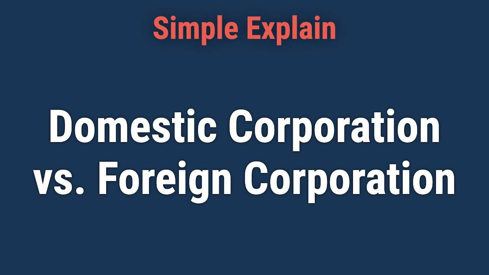

## Table of Contents

## What is a domestic corporation?

A domestic corporation is a company that is formed and operates under the laws of a specific country. In the United States, for example, a domestic corporation is one that is incorporated in one of the states and conducts its business within that country. This type of corporation is different from a foreign corporation, which is a company that is incorporated in another country but does business in the U.S.

Domestic corporations have several advantages. They are usually easier to set up and manage because they follow the local laws and regulations of the country where they are based. This can make things like tax filing and compliance simpler. Additionally, domestic corporations often have an easier time building relationships with local customers and suppliers, which can be important for their success.

## What is a foreign corporation?

A foreign corporation is a company that is set up in one country but does business in another country. For example, if a company is started in Japan but sells things in the United States, it is a foreign corporation in the U.S.

Foreign corporations have to follow the rules of both the country where they are based and the country where they do business. This can make things like taxes and following laws more complicated. But, being a foreign corporation can also help a company reach more customers in different parts of the world.

## How is a domestic corporation different from a foreign corporation?

A domestic corporation is a company that is created and works under the laws of the country where it is based. For example, if a company is started in the United States and does business there, it is a domestic corporation in the U.S. These companies usually find it easier to set up and manage because they only need to follow the rules of their own country. This makes things like paying taxes and following laws simpler. Also, domestic corporations can more easily build good relationships with local customers and suppliers, which helps them do well.

A foreign corporation, on the other hand, is a company that is set up in one country but does business in another country. For instance, if a company is started in Japan but sells products in the United States, it is a foreign corporation in the U.S. These companies have to follow the rules of both the country where they are based and the country where they do business. This can make things like taxes and following laws more complicated. However, being a foreign corporation can help a company reach more customers in different parts of the world, which can be good for business.

## What are the advantages of forming a domestic corporation?

Forming a domestic corporation has several advantages. One big advantage is that it's easier to set up and manage. Since a domestic corporation follows the rules of the country where it's based, things like paying taxes and following laws are simpler. This can save time and money, and make it easier for the company to focus on growing its business.

Another advantage is that domestic corporations can build strong relationships with local customers and suppliers. Because they are based in the same country, it's easier for them to understand and meet the needs of people in their area. This can help them do well and grow their business more easily. Plus, being a domestic corporation can make it easier to get help from local government and business groups, which can be very useful.

## What are the advantages of forming a foreign corporation?

One big advantage of forming a foreign corporation is that it can help a company reach more customers in different parts of the world. By setting up in one country and doing business in another, a foreign corporation can sell its products or services to people in different countries. This can help the company grow and make more money.

Another advantage is that a foreign corporation can take advantage of different rules and costs in different countries. For example, a company might find that taxes are lower or that it's easier to hire workers in another country. By setting up as a foreign corporation, the company can save money and use these advantages to do better in business.

## What are the disadvantages of forming a domestic corporation?

One disadvantage of forming a domestic corporation is that it might not be able to reach as many customers as a foreign corporation. Since a domestic corporation only does business in its own country, it can miss out on selling to people in other countries. This can limit how much the company can grow and make money.

Another disadvantage is that a domestic corporation might not be able to take advantage of different rules and costs in other countries. For example, if taxes are lower or it's easier to hire workers in another country, a domestic corporation can't use these benefits. This can make it harder for the company to save money and do well in business.

## What are the disadvantages of forming a foreign corporation?

One disadvantage of forming a foreign corporation is that it can be hard to follow the rules of two different countries. A foreign corporation has to follow the laws of the country where it is based and the country where it does business. This can make things like paying taxes and following rules more complicated and expensive. It can also take a lot of time and effort to make sure the company is doing everything right in both places.

Another disadvantage is that it can be hard for a foreign corporation to build good relationships with local customers and suppliers. Since the company is based in another country, it might not understand the needs and wants of people in the country where it does business. This can make it harder for the company to sell its products or services and grow its business in that country. Plus, being a foreign corporation can sometimes make it harder to get help from local government and business groups, which can be a problem.

## How does the process of incorporation differ for domestic and foreign corporations?

The process of incorporation for a domestic corporation is usually simpler because it only involves the laws of one country. For example, if a company wants to be a domestic corporation in the United States, it needs to choose a state to incorporate in, file the right paperwork with that state, and pay any required fees. After that, the company can start doing business in the U.S. and follow the rules of the state where it is based. This makes the process easier and quicker because the company only has to deal with one set of rules.

For a foreign corporation, the process is more complicated because it involves the laws of two different countries. If a company wants to be a foreign corporation, it first needs to incorporate in the country where it is based. Then, it has to register to do business in the other country where it wants to operate. This means filing more paperwork and following the rules of both countries. For example, a company from Japan that wants to do business in the U.S. would need to incorporate in Japan and then register as a foreign corporation in the U.S. This can take more time and effort because the company has to make sure it follows the laws of both places.

## What are the tax implications for domestic versus foreign corporations?

Domestic corporations usually have simpler tax situations because they only need to follow the tax rules of the country where they are based. For example, a company that is a domestic corporation in the United States will pay taxes to the U.S. government based on its income. This can make tax filing easier because the company only has to deal with one set of tax laws. However, domestic corporations might miss out on tax benefits that are available in other countries.

Foreign corporations have more complicated tax situations because they have to follow the tax rules of both the country where they are based and the country where they do business. For instance, a company from Japan that does business in the United States will need to pay taxes in both Japan and the U.S. This can make tax filing more difficult and expensive because the company has to understand and follow two different sets of tax laws. On the other hand, foreign corporations might be able to take advantage of lower tax rates or other tax benefits in different countries.

## How do regulations and compliance requirements vary between domestic and foreign corporations?

Domestic corporations have to follow the rules and regulations of the country where they are based. This means they only need to understand and comply with one set of laws, which can make things easier. For example, a company that is a domestic corporation in the United States only has to follow U.S. laws about things like safety, the environment, and how they treat their workers. This can make it simpler for the company to do business and stay in line with the rules.

Foreign corporations have to follow the rules and regulations of two different countries: the country where they are based and the country where they do business. This can make things more complicated and harder to manage. For instance, a company from Japan that does business in the United States has to follow both Japanese and U.S. laws. This means they have to make sure they are doing things right in both places, which can take more time and effort. But, understanding and following these rules can help the company avoid problems and do well in both countries.

## What strategic considerations should a business take into account when deciding between a domestic and a foreign corporation?

When a business is deciding between becoming a domestic or a foreign corporation, one important thing to think about is where they want to grow their business. If a company wants to sell things mainly in their own country, being a domestic corporation can be easier. It's simpler to set up and follow the rules, and it's easier to build good relationships with local customers and suppliers. But if a company wants to reach customers in other countries, becoming a foreign corporation might be a better choice. This way, they can sell their products or services to more people and maybe even take advantage of lower costs or different rules in other countries.

Another thing to consider is how easy or hard it will be to follow the rules and pay taxes. For a domestic corporation, it's usually easier because they only have to follow the rules of one country. This can save time and money, and make it easier to focus on growing the business. But for a foreign corporation, things can get more complicated. They have to follow the rules and pay taxes in two different countries, which can take more time and effort. But if the company can handle these challenges, being a foreign corporation can help them reach more customers and maybe save money in the long run.

## How do international treaties and agreements affect the operations of foreign corporations in different countries?

International treaties and agreements can help foreign corporations do business in different countries by making rules that are the same in many places. For example, trade agreements between countries can lower taxes on things that are bought and sold across borders. This can make it cheaper for a foreign corporation to sell their products in another country. Also, treaties about how to treat foreign companies can make it easier for them to set up and do business in new places. This can help foreign corporations grow and make more money.

But, these treaties and agreements can also make things harder for foreign corporations. Sometimes, the rules in these agreements are different from the rules in the country where the corporation is based. This means the company has to learn and follow two sets of rules, which can be confusing and take a lot of time. Also, if countries don't agree on something, it can cause problems for foreign corporations. For example, if two countries start a trade war and put up new taxes, it can make it harder for a foreign corporation to sell things in one of those countries. So, while international treaties can help, they can also make things more complicated for foreign corporations.

## References & Further Reading

[1]: Bergstra, J., Bardenet, R., Bengio, Y., & Kégl, B. (2011). ["Algorithms for Hyper-Parameter Optimization."](https://papers.nips.cc/paper/4443-algorithms-for-hyper-parameter-optimization) Advances in Neural Information Processing Systems 24.

[2]: ["Advances in Financial Machine Learning"](https://www.amazon.com/Advances-Financial-Machine-Learning-Marcos/dp/1119482089) by Marcos Lopez de Prado

[3]: ["Evidence-Based Technical Analysis: Applying the Scientific Method and Statistical Inference to Trading Signals"](https://www.semanticscholar.org/paper/Evidence-Based-Technical-Analysis%3A-Applying-the-and-Aronson/3b33df8737f1772e9e14d66a08c9696f140a2ee1) by David Aronson

[4]: ["Machine Learning for Algorithmic Trading"](https://github.com/PacktPublishing/Machine-Learning-for-Algorithmic-Trading-Second-Edition) by Stefan Jansen

[5]: ["Quantitative Trading: How to Build Your Own Algorithmic Trading Business"](https://books.google.com/books/about/Quantitative_Trading.html?id=j70yEAAAQBAJ) by Ernest P. Chan