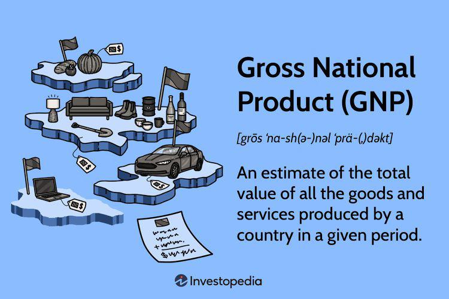

In today's dynamic business taxation environment, companies must grasp the nuances of tax credits and deductions to refine their financial strategies. This article examines the intricate details of manufacturing tax credits and deductions related to domestic production activities while evaluating the potential benefits of algorithmic trading in this context. We will provide insights into the historical and current legislation impacting manufacturers and businesses engaged in domestic production, highlighting the transition from the Domestic Production Activities Deduction (DPAD) to the current qualified business income deduction under Section 199A.

Furthermore, we will explore how algorithmic trading can influence manufacturing businesses from a tax perspective. This analytical approach offers strategic insights for maximizing financial advantages, ensuring that companies harness tax benefits effectively. Understanding these elements is crucial for strategic planning, compliance, and capitalizing on potential tax savings. By aligning financial strategies with eligible tax incentives, businesses can improve their competitive edge and support sustainable growth.



## Table of Contents

## Understanding Manufacturing Tax Credits and Deductions

Manufacturing tax credits are crucial financial instruments designed to incentivize businesses to produce goods within the United States. These incentives are strategically implemented to foster domestic economic growth by reducing the taxable income of companies engaged in qualifying production activities. This strategy not only stimulates local industry but also enhances the competitive edge of American manufacturing on a global scale.

Before 2017, one of the most significant tax incentives for American manufacturers was the Domestic Production Activities Deduction (DPAD), commonly referred to as Section 199. This deduction allowed businesses to subtract a percentage of their taxable income derived from domestic production activities. The intent was to lower the effective tax rate for these businesses, thereby encouraging the retention and expansion of manufacturing activities within the U.S. economy. Companies could apply these deductions to a broad range of internally developed and manufactured goods, and this led to substantial reductions in tax liabilities, effectively incentivizing the increase in domestic production.

The Tax Cuts and Jobs Act of 2017 brought significant changes to the landscape of manufacturing tax incentives by replacing DPAD. Despite its repeal, the legacy of Section 199 continues to influence current tax incentives by providing a framework for benefits that encourage domestic economic activities. The evolution of these deductions maintains the core objective of supporting U.S.-based production while adapting to changes in the legislative and economic environment.

By harnessing these manufacturing tax credits and deductions, businesses effectively lower their operational costs, thereby increasing profit margins and allowing for further reinvestment in their domestic operations. This process plays a pivotal role in ensuring the sustainability and competitiveness of the U.S. manufacturing sector in a rapidly evolving global market.

## The Evolution from DPAD to Section 199A

In 2017, the landscape of business taxation underwent a significant alteration with the passing of the Tax Cuts and Jobs Act (TCJA), leading to the replacement of the Domestic Production Activities Deduction (DPAD) with the Section 199A deduction. While both provisions aim to offer tax reliefs, Section 199A extends its benefits beyond the manufacturing sector to encompass a broader array of business forms, thereby facilitating wider applicability. This deduction permits eligible taxpayers, primarily small business owners and pass-through entities, to deduct up to 20% of their qualified business income (QBI). This twin focus of benefiting both domestic production and a wider range of taxpayer categories marks a pivotal shift towards more inclusive tax policy.

The intricacies of Section 199A necessitate a nuanced understanding of what constitutes qualified business income and its alignment with domestic production. Qualified business income is typically the net amount of qualified items of income, gain, deduction, and loss from any qualified trade or business. The deduction is subject to limitations based on the owner's taxable income, the type of trade or business, and even levels of W-2 wages paid by the business.

For successful navigation through these changes, a strategic adjustment of financial and operational planning is essential to maximize the benefits under the current tax laws. Businesses must evaluate their structures and ensure that their operations meet the criteria set forth by the new provisions. The broadened scope of the 199A deduction particularly advantages those operating pass-through entities, such as sole proprietorships, S corporations, and partnerships, thus incentivizing these forms of business to continue and enhance their domestic production activities.

Moreover, understanding the intersection of new tax reform with business strategy aids in mitigating potential compliance risks and capitalizing on available deductions, thereby optimizing overall tax liabilities. This strategic alignment not only enhances operational efficiency but also ensures sustained economic viability in the evolving tax framework.

## Leveraging Algorithmic Trading in Manufacturing

Algorithmic trading has rapidly become a cornerstone in financial markets, enabling businesses to execute trades with precision and timeliness. For manufacturing companies, the incorporation of [algorithmic trading](/wiki/algorithmic-trading) can significantly enhance financial planning and optimization, particularly from a tax strategy perspective. By leveraging automated systems, companies can achieve better capital allocation and potentially mitigate tax burdens, thereby improving overall financial outcomes.

One of the main advantages of algorithmic trading is its ability to automate investment decisions, allowing businesses to adapt quickly to market fluctuations. This adaptability is crucial for optimizing trading activities and managing capital efficiently. Manufacturers can use algorithmic models to time the purchase and sale of financial instruments accurately, ensuring that financial resources are utilized in the most effective manner.

Algorithmic trading also bears implications for tax efficiencies. For instance, certain algorithms can be designed to execute trades strategically at times that could minimize taxable events, such as realizing gains in lower tax brackets or offsetting gains with losses to reduce tax liability. Additionally, high-frequency trading algorithms can exploit short-term market trends, turning small price movements into substantial profits while managing tax consequences through strategic offsetting.

Python, as a preferred programming language for algorithmic strategies, offers numerous libraries like NumPy, Pandas, and TA-Lib that enable sophisticated data analysis and execution of trading algorithms. The following sample code demonstrates a simplistic approach using Python to implement a moving average crossover strategy:

```python
import pandas as pd
import numpy as np

# Load historical data
data = pd.read_csv('stock_data.csv')  # CSV should have 'Date' and 'Price' columns

# Calculate moving averages
data['SMA_50'] = data['Price'].rolling(window=50).mean()
data['SMA_200'] = data['Price'].rolling(window=200).mean()

# Generate signals
data['Signal'] = 0
data['Signal'][50:] = np.where(data['SMA_50'][50:] > data['SMA_200'][50:], 1, 0)

# Calculate trading orders
data['Position'] = data['Signal'].diff()

# Print out orders
print(data[data['Position'] != 0][['Date', 'Price', 'Position']].dropna())
```

This approach can be used by manufacturing firms to maximize their investment efficiency, ensuring that capital is allocated towards opportunities with optimal return profiles while considering tax consequences. 

Furthermore, understanding the balance between algorithmic trading profits and tax obligations is paramount. This requires businesses to stay informed on tax regulations that pertain to short-term and long-term capital gains, as well as any specific tax incentives for manufacturing operations. 

In conclusion, the strategic use of algorithmic trading within the manufacturing sector not only aids in refined capital management but also serves as a powerful tool for aligning financial strategies with tax planning. This integration requires a clear comprehension of both algorithmic capabilities and tax implications, enabling businesses to fortify their financial health and sustain growth in today's competitive economic landscape.

## Domestic Production Activities and Economic Impact

Domestic production activities serve dual purposes: they offer substantial tax advantages and bolster the national economy by reinforcing local industries. These activities are integral to governmental policies aimed at nurturing economic growth and generating employment within the United States. The historical Domestic Production Activities Deduction (DPAD) and its successor, the Section 199A deduction, play pivotal roles in incentivizing businesses to keep their production operations on American soil, thereby ensuring economic stability through sustained local investments.

Under the DPAD, businesses had the opportunity to deduct a percentage of their income derived from qualified production activities conducted within the United States. This deduction was a strategic move to enhance the competitiveness of domestic manufacturing by reducing overall tax liabilities. Following the introduction of the Tax Cuts and Jobs Act of 2017, the DPAD was replaced with the Section 199A deduction, which extends similar benefits not only to manufacturers but also to a broader range of business entities. This encompasses sole proprietorships, partnerships, S corporations, and certain trusts and estates.

The Section 199A deduction allows eligible businesses to deduct up to 20% of their qualified business income (QBI), significantly reducing effective tax rates. This deduction is designed to encourage the maintenance and expansion of domestic production, making it financially attractive for companies to continue their operations within the United States. By offering this tax incentive, the policy aims to stimulate investment in local industries, thereby promoting job creation and reinforcing economic resilience.

Manufacturing within the U.S. is regarded as a critical [factor](/wiki/factor-investing) for economic resilience, as it supports the supply chains and contributes to the GDP. Encouraging companies to invest locally can lead to a more robust and self-sustaining national economy. A thorough grasp of these deductions enables businesses to make informed strategic decisions that align with both their operational objectives and the broader national interest of economic advancement.

In conclusion, understanding and effectively utilizing production-related tax incentives like the DPAD and Section 199A can lead to substantial economic benefits for companies. These incentives not only optimize tax obligations but also support larger economic goals by nurturing domestic industries. As such, manufacturers are encouraged to capitalize on these opportunities, playing a vital role in bolstering the U.S. economy.

## Conclusion

Navigating the complexities of tax credits and deductions demands a strategic approach for businesses involved in manufacturing and domestic production. The transition from the Domestic Production Activities Deduction (DPAD) to Section 199A underlines the necessity of understanding how these legislative changes influence tax strategies. Section 199A expands the horizon of businesses that can benefit from such deductions, thereby playing a critical role in ensuring tax efficiency and compliance.

Incorporating the benefits of algorithmic trading into financial planning provides a further opportunity to optimize a company’s competitive edge. Algorithmic trading, with its capacity for rapid market response and automation, can significantly impact financial outcomes, which, in turn, influence tax strategies. Businesses can automate investment decisions, potentially enhancing capital allocation, and respond swiftly to market dynamics, aligning with tax optimization strategies.

Staying informed about legislative changes and technological advancements becomes crucial. With the dynamic nature of laws affecting tax incentives and deductions, companies must remain vigilant to adapt their strategies accordingly. Leveraging these changes effectively ensures that businesses can capitalize on available benefits while contributing to economic stability.

Informed decision-making, integrating both legislative insights and technological developments, underpins sustainable growth and economic success for manufacturing businesses. Such an approach not only aligns with national economic policies but also fortifies a company's financial resilience, fostering long-term competitiveness in the global market.

## References & Further Reading

[1]: Clausing, K. A. (2014). ["The Effect of Profit Shifting on the Corporate Tax Base in the United States and Beyond."](https://papers.ssrn.com/sol3/papers.cfm?abstract_id=2685442) National Tax Journal, 67(4), 839–868.

[2]: Fleischer, V. (2011). ["Taxing Blackstone."](https://papers.ssrn.com/sol3/papers.cfm?abstract_id=1012472) UCLA Law Review, 61(1), 243-298.

[3]: Desai, M. A., & Hines Jr, J. R. (2003). ["U.S. multinational companies, tax avoidance, and domestic economic welfare."](https://papers.ssrn.com/sol3/papers.cfm?abstract_id=425943) The Journal of Economic Perspectives, 17(3), 101-122.

[4]: U.S. Department of the Treasury. ["The Case for Responsible Business Tax Reform."](https://home.treasury.gov/system/files/131/Report-Responsible-Business-Tax-Reform-2017.pdf) 

[5]: ["The Handbook of Global Corporate Treasury"](https://onlinelibrary.wiley.com/doi/book/10.1002/9781119199243) by Rajiv Rajendra

[6]: ["Corporate Tax Reform: Taxing Profits in the 21st Century"](https://link.springer.com/book/10.1007/978-1-4302-3928-4) by Martin A. Sullivan

[7]: ["Tax Cuts and Jobs Act: A Guide to President Trump's Tax Reform."](https://www.factcheck.org/2024/12/trumps-agenda-taxes/) by Steven Maguire