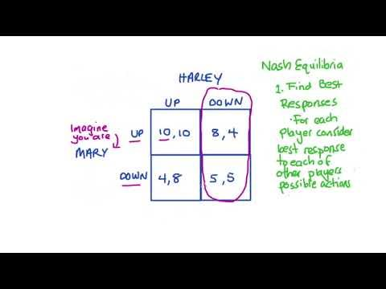

Game theory, a mathematical framework for analyzing competitive situations where the outcomes depend on the actions of multiple agents, plays a crucial role in financial markets. In the context of algorithmic trading, it provides valuable insights into market dynamics, enabling traders and developers to devise strategies that anticipate and respond effectively to the behavior of other market participants. The application of game theory in financial markets is particularly prominent in the construction of trading algorithms, where understanding strategic interactions can lead to a significant competitive advantage.

Central to game theory are the concepts of dominant strategy and Nash equilibrium. A dominant strategy is one that yields the best outcome for a player, regardless of the strategies chosen by others. In trading, identifying a dominant strategy can significantly simplify decision-making amid complex and unpredictable market conditions. On the other hand, Nash equilibrium occurs when players in a game reach a state where no participant can benefit by unilaterally changing their strategy. This concept is vital in financial markets as it predicts stable states where traders’ expectations are aligned, leading to balanced market conditions.

Trading algorithms leverage these game theory principles to optimize decision-making and predict market movements. By incorporating dominant strategies, algorithms can consistently achieve favorable outcomes even in competitive environments. Similarly, understanding Nash equilibrium allows traders to anticipate market shifts and adjust strategies accordingly, ensuring that their actions remain aligned with expected market trends.

For traders and market analysts, a strong grasp of game theory is indispensable. It enhances their ability to model and interpret complex interactions in the market, providing a foundation for developing more sophisticated trading strategies. These concepts aid in deciphering the nuanced behaviors of other market participants, refining predictive models, and ultimately improving the efficacy of trading algorithms.

This article will explore the fundamental principles of game theory and their application in algorithmic trading. Readers can expect to gain insights into the basic components of game theory, the significance of dominant strategies and Nash equilibrium, and how these concepts are integrated into trading algorithms. Moreover, the discussion will cover the challenges, limitations, and future trends in applying game theory to financial markets, equipping traders and analysts with a comprehensive understanding of these critical theories.

## Table of Contents

## Understanding Game Theory

Game theory is a branch of mathematics and economics that focuses on understanding strategic interactions, where the outcomes for each participant depend not only on their own decisions but also on the decisions of others. The origin of game theory is rooted in the early 20th century, with seminal contributions from mathematician John von Neumann and economist Oskar Morgenstern, who formalized its concepts in their groundbreaking work, "Theory of Games and Economic Behavior" in 1944. Their work provided a systematic framework for analyzing competitive situations, laying the foundation for its disciplinary recognition.

A central aspect of game theory involves defining the main components of a game: players, strategies, and payoffs. Players are the decision-makers in a given game, each with their own set of possible strategies or courses of action. Strategies are the plans or actions available to each player that determine their outcomes. Finally, payoffs refer to the results or rewards that a player receives based on the chosen strategies. The interplay between these components allows for the analysis of various outcomes and the prediction of strategic behavior.

Game theory holds substantial relevance in competitive environments such as financial markets, where traders and institutions need to anticipate the actions of others to optimize their own outcomes. By modeling trading scenarios as games, participants can devise strategies that maximize their gains or minimize losses in reaction to others' moves. For instance, in stock markets, where multiple players are buying and selling assets, game-theoretical models can aid in predicting price movements based on collective investor behavior.

Beyond trading, game theory has a wide range of applications that underscore its versatility. In politics, game theory is used to assess the strategic interactions during elections or diplomatic negotiations. Another notable example is in biological systems, where game-theoretical models explain the evolution of certain animal behaviors by considering strategic interactions among species.

In conclusion, game theory's foundational structure allows for a comprehensive analysis of strategic decision-making in various competitive domains. Its robust framework not only facilitates understanding in financial markets but also extends its applicability to diverse fields, reinforcing its role as a pivotal tool in analyzing complex strategic situations.

## Dominant Strategy in Game Theory

In game theory, a dominant strategy is a strategy that results in the highest payoff for a player, regardless of what strategies other players choose. This concept plays a crucial role in simplifying decision-making processes, especially in complex environments where multiple players with conflicting interests interact.

The identification of a dominant strategy allows decision-makers to focus solely on choices that consistently yield the best outcome. In simple terms, if a player has a dominant strategy, they can disregard all other strategic options, as no alternative yields a better result. This simplifies the strategic analysis as it reduces the complexity of evaluating multiple scenario-specific strategies. 

In real-world scenarios, dominant strategies are evident in various decision-making contexts. One classic example is the "Prisoner's Dilemma," where each prisoner has a dominant strategy to betray the other, leading to suboptimal outcomes for both. In this scenario, the dominant strategy simplifies the decision-making process by providing a clear direction, even if the resulting equilibrium is not the most favorable in terms of collective welfare.

In financial markets, traders leverage the concept of dominant strategies to develop robust trading strategies. For instance, if a particular investment consistently yields higher returns regardless of market fluctuations or competitors' actions, it can be considered a dominant strategy. Algorithmic trading systems often employ such strategies to capitalize on short-term market inefficiencies. These systems analyze historical data and market trends to identify strategies that, over time, manifest as dominant compared to others.

The ability to recognize and act on dominant strategies can lead to optimal trading outcomes by ensuring that players (or traders) are not unnecessarily exposed to less favorable strategies. In [algorithmic trading](/wiki/algorithmic-trading), the integration of [machine learning](/wiki/machine-learning) techniques aids in identifying dominant strategies by processing vast amounts of market data. This allows algorithms to adapt to changing market conditions and consistently choose the highest payoffs, thus optimizing the trading results.

Mathematically, if we denote a strategy set for player $i$ as $S_i$, and any strategy within it as $s_i$, then a strategy $s_i^*$ is dominant if for every possible strategy $s_{-i}$ of the other players, the payoff $u_i(s_i^*, s_{-i}) \geq u_i(s_i, s_{-i})$ for all $s_i \in S_i$. This succinctly encapsulates the concept that a dominant strategy is optimal irrespective of the opponents' actions.

In conclusion, understanding dominant strategies equips traders with a tool to navigate complex strategic interactions within financial markets efficiently. By relying on strategies that consistently perform well, traders can make more informed decisions, ultimately contributing to enhanced performance and profitability in competitive trading environments.

## Nash Equilibrium and Its Importance

Nash equilibrium, a fundamental concept in game theory, is a situation in a strategic interaction where no player can benefit by unilaterally changing their strategy if the strategies of others remain unchanged. This equilibrium represents a state of mutual best responses: each player's strategy is optimal given the strategies chosen by all other players. In mathematical terms, for a game with $n$ players, a Nash equilibrium can be represented as a strategy profile $(s_1^*, s_2^*, \ldots, s_n^*)$, where $s_i^*$ is the optimal strategy for player $i$. The condition for Nash equilibrium is:

$$
u_i(s_i^*, s_{-i}^*) \geq u_i(s_i, s_{-i}^*)
$$

for all strategies $s_i$ and for all players $i$, where $u_i$ is the payoff function for player $i$, and $s_{-i}^*$ represents the strategy profile of all players except $i$.

Nash equilibrium can arise under several conditions. It is particularly relevant in settings where players have incomplete information or face strategic uncertainty about others' actions. In these scenarios, Nash equilibrium provides a stable state where expectations are met, and no player finds it beneficial to deviate from their current strategy.

The importance of Nash equilibrium in predicting behavior in financial markets is significant. It helps in understanding how traders might act under various market conditions, assuming rational behavior and strategic interaction. For instance, in an auction setting, Nash equilibrium can predict the bidding strategy of participants, guiding traders on how to position themselves to maximize returns. 

In the context of algorithmic trading, Nash equilibrium provides a framework for developing strategies that anticipate the actions of competing algorithms. Consider a high-frequency trading scenario where multiple algorithms are executing trades simultaneously. Each algorithm aims to optimize its performance relative to others. By identifying Nash equilibria, developers can program algorithms to follow strategies that are robust to the expected strategies of rival algorithms, mitigating risks of suboptimal performance due to unforeseen actions by competitors.

Practical examples of Nash equilibrium in financial markets include oligopolistic competition, where firms strategically set prices. In algorithmic trading, market-making strategies often involve Nash equilibria, where algorithms adjust bid-ask spreads based on anticipated movements by other participants.

Understanding Nash equilibrium enables traders and market analysts to devise strategies that account for the interdependent decision-making process typical in financial markets, leading to more informed and effective trading decisions.

## Integration of Game Theory in Algorithmic Trading

Algorithmic traders have increasingly turned to game theory to design robust trading algorithms that can navigate the complexities of financial markets. Game theory provides a structured framework for analyzing strategic interactions, enabling traders to model and predict the behavior of different market participants. By incorporating concepts such as dominant strategies and Nash equilibrium, traders aim to optimize their algorithms, achieve better market outcomes, and ultimately gain a competitive edge.

Dominant strategies simplify decision-making in the face of uncertainty by identifying choices that yield better or equivalent outcomes regardless of the actions of others. In algorithmic trading, these strategies can be hardcoded into trading systems to ensure consistent performance in dynamic environments. For example, a high-frequency trading ([HFT](/wiki/high-frequency-trading-strategies)) algorithm might employ a dominant strategy by adhering to predetermined rules for buying or selling assets when specific criteria are met, minimizing reaction time and maximizing profits.

Nash equilibrium plays a critical role in predicting how market participants are likely to behave when each one takes into account the strategies of others. In algorithmic trading, finding a Nash equilibrium can help traders anticipate price movements and adjust their strategies accordingly. For instance, algorithms might be programmed to identify equilibrium points at which no trader has the incentive to deviate from their current strategy, providing insight into stable price levels.

Machine learning enhances the application of game theory in trading algorithms by offering tools for more sophisticated data analysis and pattern recognition. Through machine learning models, algorithms can adapt to market changes and refine their strategies over time. For example, [reinforcement learning](/wiki/reinforcement-learning)—a subset of machine learning—can be used to identify evolving dominant strategies and Nash equilibria based on historical and real-time data, allowing traders to update their approaches in response to newly emerging patterns.

Several case studies highlight the impact of game theory on algorithmic trading. One example is the use of cooperative game theory to optimize [liquidity](/wiki/liquidity-risk-premium) provision in electronic markets. By modeling interactions between market makers and liquidity seekers, traders can develop algorithms that balance their own profit motives with the need to maintain market stability, ultimately enhancing market efficiency. On the other hand, competitive game theoretical models have been exploited in scenarios involving predatory trading, where algorithms strategically place orders to capitalize on other traders' weaknesses, illustrating both the power and potential ethical concerns of game theory in finance.

In conclusion, integrating game theory into algorithmic trading algorithms enhances their ability to make informed decisions by leveraging strategic insights derived from understanding market dynamics. This synergy of abstract theoretical models with practical algorithmic implementation offers traders a formidable toolkit—especially when augmented by machine learning—opening new paths for innovation and efficiency in financial markets.

## Challenges and Limitations

Applying game theory in algorithmic trading presents several challenges that stem from the complexity and dynamic nature of financial markets. These challenges can impact the effectiveness of game theory concepts such as dominant strategy and Nash equilibrium. Understanding these limitations and risks is crucial for traders and analysts aiming to leverage game theory in trading strategies.

One primary challenge is the assumption of rationality inherent in game theory. Traditional game theory models assume that all participants, or 'players', in the market act rationally and have complete information. However, financial markets are often characterized by irrational behavior, incomplete information, and noise, which can lead to deviations from predicted outcomes.

Dominant strategy, a central concept in game theory, assumes a strategy is optimal regardless of what opponents choose. While this can simplify decision-making, its application is limited in dynamic markets where strategies must adapt to constantly changing conditions. Moreover, financial markets rarely exhibit a clear dominant strategy, as they are influenced by a myriad of unpredictable factors, including geopolitical events, economic shifts, and market sentiment.

Nash equilibrium, another pivotal concept, represents a situation where no player can benefit by unilaterally changing their strategy if the strategies of others remain unchanged. While this provides a predictive insight into strategic interactions, achieving Nash equilibrium in real-world trading scenarios is challenging due to the fluctuating nature of market conditions and the diversity of participant behaviors. Moreover, multiple equilibria can exist, complicating the identification of the most relevant scenario for a given market context.

Over-reliance on these theoretical models can pose significant risks. The assumption that these strategies will perform optimally in all market conditions may lead to unexpected losses when market dynamics shift unexpectedly. For instance, algorithmic trading models based heavily on game theory may fail to react appropriately to sudden market crashes or booms, which are often driven by factors outside the scope of traditional game theory models.

Additionally, the calibration of game-theoretic models requires accurate data and substantial computational resources, potentially limiting their accessibility and practicality in fast-paced trading environments. The complexity of these models can also lead to difficulties in interpreting and implementing the results, especially when integrating them with existing trading systems.

In conclusion, while game theory offers valuable frameworks for strategic decision-making in algorithmic trading, practitioners must remain aware of its limitations and the dynamic nature of markets. A balanced approach that integrates game theory insights with empirical data analysis and adaptive strategies is essential to mitigate the inherent risks and enhance the robustness of trading algorithms.

## Future Trends and Advancements

Emerging trends in the integration of game theory in finance and trading highlight the increasing sophistication and automation of financial markets. One notable trend is the application of algorithmic trading systems that leverage game-theoretical concepts to optimize trade execution and strategy formulation. Algorithms increasingly incorporate elements like dominant strategies and Nash equilibrium to predict competitor behavior and adjust trading tactics accordingly, enhancing their accuracy and efficiency.

Advancements in technology, particularly in machine learning and [artificial intelligence](/wiki/ai-artificial-intelligence), significantly enhance the application of game theory in trading. Machine learning algorithms can process vast amounts of market data to identify patterns and predict outcomes with greater precision. They can also dynamically adjust trading strategies based on real-time inputs, making them an invaluable asset for implementing game-theoretical models. For example, reinforcement learning, a type of machine learning, is being used to recognize and exploit dominant strategies by simulating numerous market scenarios and learning the optimal actions to maximize returns.

Furthermore, the deployment of high-performance computing and cloud-based platforms allows traders to run complex models and simulations at unprecedented speeds. This computational power enables the real-time application of game-theoretical strategies, making them more practical for everyday trading.

Regulatory changes are also poised to influence the use of game-theoretical approaches in trading. As algorithmic trading becomes more prevalent, regulatory bodies worldwide are considering new frameworks to ensure market stability and prevent manipulative practices. Regulations may impose stricter requirements for transparency, risk management, and algorithm testing. These could affect how traders use game-theoretical models, potentially requiring them to include compliance protocols directly within the algorithms. Traders must adapt game-theoretical models to meet these evolving regulatory standards while maintaining their competitive edge.

In summary, the future landscape of trading strategies influenced by game theory will be shaped by technological innovations and regulatory developments. As systems become more sophisticated, the ability to integrate advanced game-theoretical approaches may provide significant advantages, paving the way for more strategic and efficient trading operations.

## Conclusion

Game theory, with its core concepts of dominant strategy and Nash equilibrium, offers profound insights into the strategic decision-making processes vital for success in algorithmic trading. These foundational ideas enable traders and analysts to better predict the actions of other market participants, effectively build robust trading algorithms, and achieve optimal trading outcomes. By understanding dominant strategies, traders can simplify decision-making, as these strategies guide their actions irrespective of the opponents' strategies. This clarity is invaluable in complex financial markets where rapid and decisive actions can confer significant advantages.

Nash equilibrium, on the other hand, provides a means to understand and anticipate stable states of interaction where no player has anything to gain by changing only their own strategy. Such insights are critical in predicting the behavior of various stakeholders in the market, helping traders craft strategies resilient to competitive market dynamics.

The competitive edge offered by these concepts lies in their ability to model interactions in financial markets accurately. As algorithmic trading becomes increasingly sophisticated, integrating these strategic frameworks can lead to better algorithm designs that are adaptive, predictive, and resilient to adversarial conditions.

For those engaged in trading and financial market analysis, exploring game theory further can provide valuable new perspectives and strategies. There are abundant resources and courses available that delve deeper into these topics, enhancing one's ability to apply theoretical insights to practical, real-world trading challenges.

As the landscape of trading continues to evolve, fueled by technological advancements and regulatory changes, game theory's application will likely become more integrated and sophisticated. Continuous innovations in machine learning and artificial intelligence will further refine the application of game theory in developing predictive and adaptive trading models. It is imperative for traders and analysts to stay abreast of these developments to maintain and extend their competitive advantage. Game theory will assuredly remain a cornerstone of strategic financial analysis in the algorithmic trading sphere.

## References & Further Reading

[1]: von Neumann, J., & Morgenstern, O. (1944). "Theory of Games and Economic Behavior." Princeton University Press.

[2]: Osborne, M. J., & Rubinstein, A. (1994). "A Course in Game Theory." MIT Press.

[3]: Nash, J. (1951). ["Non-cooperative Games."](https://www.archive.org/download/non-cooperative-games-nash/Non-cooperative%20games%20-%20nash_text.pdf) Annals of Mathematics.

[4]: Fudenberg, D., & Tirole, J. (1991). "Game Theory." MIT Press.

[5]: Lopez de Prado, M. (2018). ["Advances in Financial Machine Learning."](https://www.amazon.com/Advances-Financial-Machine-Learning-Marcos/dp/1119482089) Wiley.

[6]: Chan, E. P. (2009). ["Quantitative Trading: How to Build Your Own Algorithmic Trading Business."](https://github.com/ftvision/quant_trading_echan_book) Wiley.

[7]: Jansen, S. (2018). ["Machine Learning for Algorithmic Trading."](https://www.scribd.com/document/780358821/Stefan-Jansen-Hands-on-Machine-Learning-for-Algorithmic-Trading-Packt-2018) Packt Publishing.