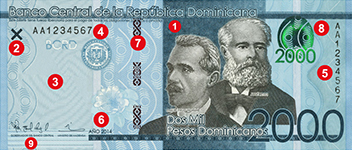

## Table of Contents

## What is the Dominican Peso?

The Dominican Peso is the official currency of the Dominican Republic, a country located in the Caribbean. It is abbreviated with the symbol "RD$" and the international code "DOP." People use the Dominican Peso to buy things like food, clothes, and other goods and services within the country.

The Dominican Peso was first introduced in 1844, replacing the Haitian Gourde after the Dominican Republic gained independence from Haiti. Over the years, the value of the peso has changed because of different economic situations. Today, you can exchange Dominican Pesos for other currencies like the US Dollar or the Euro, which helps people from other countries to visit and do business in the Dominican Republic.

## When was the Dominican Peso first introduced?

The Dominican Peso was first introduced in 1844. This happened when the Dominican Republic became independent from Haiti. Before that, people in the Dominican Republic used the Haitian Gourde. The new currency was a big change and helped the country start fresh as an independent nation.

Over time, the value of the Dominican Peso has gone up and down because of different economic situations. Today, it is still the official money used in the Dominican Republic. People use it to buy things they need every day, like food and clothes. It can also be exchanged for other currencies, like the US Dollar or the Euro, which is helpful for tourists and businesses from other countries.

## What is the symbol and currency code for the Dominican Peso?

The symbol for the Dominican Peso is "RD$". This symbol is used every day by people in the Dominican Republic when they buy things like food or clothes.

The currency code for the Dominican Peso is "DOP". This code is used around the world to know which currency is being talked about. It helps when people from different countries want to exchange money or do business.

## How is the Dominican Peso abbreviated?

The Dominican Peso is abbreviated with the symbol "RD$". This symbol is used by people in the Dominican Republic every day when they buy things like food or clothes.

The international currency code for the Dominican Peso is "DOP". This code is used around the world to identify the currency. It helps when people from different countries need to exchange money or do business.

## What are the denominations of the Dominican Peso in circulation?

The Dominican Peso comes in different sizes of money, called denominations. For coins, you can find 1 peso, 5 pesos, 10 pesos, and 25 pesos. These coins are used for smaller amounts of money, like buying a candy or a bus ticket. People use them every day to pay for little things.

For paper money, or banknotes, there are bigger amounts. You can find banknotes of 50 pesos, 100 pesos, 200 pesos, 500 pesos, 1000 pesos, and 2000 pesos. These are used for buying more expensive things, like groceries or paying bills. The different sizes help people to easily [carry](/wiki/carry-trading) and use the right amount of money for what they need to buy.

## What is the history of the Dominican Peso since its introduction?

The Dominican Peso was first introduced in 1844 when the Dominican Republic gained independence from Haiti. Before that, people used the Haitian Gourde. The new currency was a big change and helped the country start fresh as an independent nation. Over the years, the value of the Dominican Peso has gone up and down because of different economic situations. The country went through times of war, political changes, and economic growth, all of which affected the money's value.

In the early 1900s, the Dominican Peso was linked to the US Dollar, which helped to stabilize its value. This link lasted until 1985 when the Dominican Peso was allowed to float freely on the market. Since then, the value of the Dominican Peso has been influenced by the country's economy and international trade. Today, the Dominican Peso is the official currency of the Dominican Republic, and people use it every day to buy things they need, like food and clothes. It can also be exchanged for other currencies, like the US Dollar or the Euro, which helps tourists and businesses from other countries.

## How has the value of the Dominican Peso changed over time?

Since it was first introduced in 1844, the value of the Dominican Peso has changed a lot because of different things happening in the country and around the world. In the early years, the Dominican Republic went through wars, changes in who was in charge, and times when the economy grew. All these things made the value of the Dominican Peso go up and down. For example, during times of war or political trouble, the value of the money often went down because people were not sure about the future.

In the early 1900s, the Dominican Peso was linked to the US Dollar, which helped to make its value more stable. This link lasted until 1985, when the Dominican Peso was allowed to float freely on the market. Since then, the value of the Dominican Peso has been influenced by how well the country's economy is doing and by international trade. Today, the Dominican Peso is still the official money used in the Dominican Republic, and its value keeps changing based on what is happening in the economy.

## What factors influence the exchange rate of the Dominican Peso?

The exchange rate of the Dominican Peso changes because of many things. One big thing is how well the country's economy is doing. If the economy is growing and people are making more money, the value of the Dominican Peso might go up. But if the economy is not doing well, the value might go down. Another thing that affects the exchange rate is what other countries think about the Dominican Republic's economy. If they think it's doing well, they might want to buy more Dominican Pesos, which makes the currency stronger.

Also, things happening around the world can change the value of the Dominican Peso. For example, if the price of things the Dominican Republic sells to other countries, like sugar or tobacco, goes up, the Dominican Peso might get stronger. But if those prices go down, the currency might get weaker. Interest rates set by the Dominican Republic's central bank can also make a difference. If they raise interest rates, it might make the Dominican Peso more attractive to people from other countries, which could make it stronger.

## How does the Dominican Peso compare to other currencies in the Caribbean region?

The Dominican Peso is one of the many currencies used in the Caribbean region. It is different from other currencies like the Jamaican Dollar, the Trinidad and Tobago Dollar, and the Eastern Caribbean Dollar. Each of these currencies has its own value and is used in different countries. For example, the Jamaican Dollar is used in Jamaica, while the Eastern Caribbean Dollar is used in several smaller islands like Antigua and Barbuda. The value of the Dominican Peso compared to these other currencies can change every day because of things like how well each country's economy is doing or what is happening in the world.

The Dominican Peso often has a lower value than some other Caribbean currencies, like the Eastern Caribbean Dollar, which is used in countries that are part of a special group called the Eastern Caribbean Currency Union. This group helps keep their currency stable. But the Dominican Peso can be stronger than other currencies like the Haitian Gourde, which is used in Haiti. The value of the Dominican Peso can go up or down compared to these other currencies because of things like how much people want to buy or sell the currency, how well the country's economy is doing, and what is happening with the prices of things the country sells to other places.

## What are the monetary policies that affect the Dominican Peso?

The Dominican Peso's value is affected by the country's monetary policies, which are decisions made by the central bank. One important policy is setting interest rates. When the central bank raises interest rates, it can make the Dominican Peso more attractive to people from other countries because they can earn more money by saving or investing in the Dominican Republic. This can make the value of the Dominican Peso go up. But if the central bank lowers interest rates, it might make the currency less attractive, and its value could go down.

Another policy that affects the Dominican Peso is how the central bank manages the amount of money in the economy. If the central bank decides to put more money into the economy, it can lead to inflation, which means prices go up. This can make the Dominican Peso weaker. On the other hand, if the central bank takes money out of the economy, it can help keep prices stable and make the Dominican Peso stronger. These policies are used to help the country's economy grow and keep the value of the Dominican Peso steady.

## What role does the Central Bank of the Dominican Republic play in managing the Peso?

The Central Bank of the Dominican Republic is very important for taking care of the Dominican Peso. It does this by making rules about how much money should be in the country. If there is too much money, it can make prices go up, which is called inflation. The Central Bank tries to keep the right amount of money so that prices stay stable. It also decides on interest rates, which is how much it costs to borrow money. If the Central Bank makes interest rates higher, it can make the Dominican Peso stronger because people from other countries might want to save or invest their money in the Dominican Republic to earn more.

The Central Bank also watches how the Dominican Peso is doing compared to other countries' money. It can buy or sell Dominican Pesos to help keep its value steady. This is called managing the exchange rate. If the Central Bank thinks the Dominican Peso is getting too weak, it might sell some of its other currencies and buy back Dominican Pesos to make it stronger. On the other hand, if the Dominican Peso is getting too strong, the Central Bank might do the opposite. All these actions help the Central Bank make sure the Dominican Peso stays useful and stable for people in the Dominican Republic.

## How do international economic conditions impact the Dominican Peso?

International economic conditions can have a big impact on the value of the Dominican Peso. If the world economy is doing well, it can help the Dominican Peso get stronger. For example, if countries that buy things like sugar and tobacco from the Dominican Republic are doing well, they might buy more, which can make the Dominican Peso more valuable. But if the world economy is not doing well, it can make the Dominican Peso weaker. If other countries are not buying as much, the Dominican Republic might not make as much money, and the value of the Dominican Peso can go down.

Another way international conditions affect the Dominican Peso is through changes in the value of other big currencies like the US Dollar or the Euro. If the US Dollar gets stronger, it can make the Dominican Peso weaker because people might want to use US Dollars instead. Also, if there are big problems in the world, like a financial crisis, it can make people unsure about the future, and they might not want to keep their money in Dominican Pesos. This can make the value of the Dominican Peso go down. So, what happens in the world economy can really change how strong or weak the Dominican Peso is.

## References & Further Reading

[1]: ["The Dominican Republic Reader: History, Culture, Politics"](https://www.dukeupress.edu/the-dominican-republic-reader) edited by Eric Paul Roorda, Lauren Derby, and Raymundo González

[2]: Guzmán, J. D., & Tejeda, R. (2008). ["The evolution of Central Banking in the Dominican Republic."](https://pmc.ncbi.nlm.nih.gov/articles/PMC9786418/) Central Bank of the Dominican Republic.

[3]: ["Algorithmic Trading and DMA: An introduction to direct access trading strategies"](https://www.amazon.com/Algorithmic-Trading-DMA-introduction-strategies/dp/0956399207) by Barry Johnson

[4]: Medina, J.P., & Garriga, A. (2013). ["Monetary Policy and Central Banking in the Dominican Republic"](https://www.scribd.com/document/584534464/Medina-J-2013-Epistemology-of-Resistance). Banco Central de la República Dominicana Working Papers.

[5]: ["Machine Trading: Deploying Computer Algorithms to Conquer the Markets"](https://www.amazon.com/Machine-Trading-Deploying-Computer-Algorithms/dp/1119219604) by Ernest P. Chan