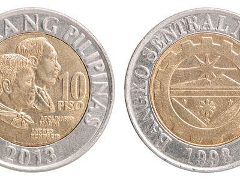

The Dominican Peso (DOP) serves as the official currency of the Dominican Republic, a nation with a vibrant economic history. The evolution of the Dominican Peso is marked by numerous economic events that have shaped its development. Since the Dominican Republic gained independence in 1844, the currency underwent significant transformations, reflective of the country's dynamic political and economic landscape. Initially issued as legal tender, the peso has been influenced by political instability, foreign debt, and changes in governance, contributing to its complex monetary history.

Recent advancements in financial technology, notably algorithmic trading, have transformed how currencies like the Dominican Peso are traded. Algorithmic trading, often referred to as algo trading, employs sophisticated computer programs to execute high-speed trading strategies that analyze large datasets to make informed trading decisions. This modern approach has not only improved efficiency in currency trading but also provided more robust risk management and greater market liquidity.



By examining the historical trajectory of the Dominican Peso alongside the rise of algorithmic trading, we offer a comprehensive perspective on the currency market. Investors and economic enthusiasts can appreciate the significance of historical context while acknowledging the potential of modern trading techniques to enhance trading strategies. This overview provides a thorough understanding for those looking to engage with the currency markets, highlighting how both historical and contemporary factors influence the Dominican Peso's role on both local and international stages. As we trace the journey of the Dominican Peso, we also examine the dynamics introduced by algorithmic trading in current currency trading practices.

## Table of Contents

## DOP: An Overview of Dominican Peso

The Dominican Peso (DOP) is the official currency of the Dominican Republic, a Caribbean nation known for its rich culture and diverse economy. In the foreign exchange market, the DOP is abbreviated as RD$ or simply $ when referring to domestic transactions. The currency is sub-divided into 100 centavos, facilitating a range of monetary transactions at various scales.

The Dominican Peso comes in various denominations, both in coins and banknotes, which makes it accessible for different transactional needs and consumer preferences. Coins typically come in denominations of 1, 5, 10, and 25 pesos, while banknotes are available in denominations of 50, 100, 200, 500, 1000, and 2000 pesos. This variety ensures ease of use across different aspects of the Dominican economy, from everyday purchases to larger financial transactions.

Historically, the Dominican Peso was linked to gold, utilizing the gold standard as a basis for its value. This connection to gold provided a consistent measure of value during a time when the international monetary system relied heavily on precious metals as a source of currency valuation. However, in 1963, the Dominican Peso evolved into a free-floating fiat currency, a significant shift reflecting broader changes in global economic structures. As a fiat currency, its value is not tied to physical commodities but instead is determined by various economic factors, supply and demand dynamics, and monetary policy set by the Central Bank of the Dominican Republic.

This transition to a fiat currency represents substantial monetary evolution, allowing greater flexibility in economic policy and currency management. It also aligns with global trends as many countries have moved away from commodity-backed currencies to a system where currency values are determined by market mechanisms and governmental regulation.

## Historical Context of the Dominican Peso

Upon the Dominican Republic's successful independence from Haiti in 1844, the Dominican Peso was established as the official legal tender of the newly sovereign nation. This marked the beginning of a complex monetary history shaped by a variety of political and economic factors.

In the decades following independence, the Dominican Republic experienced significant political instability and economic challenges. These included foreign debt, internal revolts, and frequent changes in government, all of which heavily influenced currency management strategies. Such instability often led to periods of inflation and fluctuating confidence in the currency, impacting its value and reliability.

During the early 20th century, a major shift occurred when the Dominican Republic came under a period of U.S. protectorate status, starting in 1905. During this time, the Dominican Peso was replaced by the U.S. dollar as the official currency. This substitution was part of a broader plan to stabilize the country's financial system and handle foreign debts, leading to a temporary suspension of the DOP.

However, the Dominican Peso made a significant return in 1937 when it was reintroduced as the "peso oro." This reintroduction was part of a monetary reform aimed at asserting economic sovereignty and restoring national identity post-U.S. involvement. The peso oro established the baseline for today's modern Dominican Peso.

Throughout the 20th century and into the present day, the DOP has continued to reflect the broader economic and political changes faced by the Dominican Republic. Economic fluctuations, ranging from agricultural booms and busts to geopolitical events, have all left their imprint on the currency's stability and evolution. Despite these challenges, the currency's adaptability and the measures implemented to stabilize it have demonstrated the resilience of the Dominican economy in navigating both domestic challenges and global pressures.

## The Role of the Central Bank

The Central Bank of the Dominican Republic plays a fundamental role in safeguarding the stability of the Dominican Peso (DOP) and ensuring the country's economic integrity. Established in 1947, this institution is pivotal in controlling inflation, supervising monetary policy, and fostering economic growth. It bears the significant responsibility of issuing and circulating the Dominican Peso, ensuring its availability and maintaining confidence in the national currency.

Beyond issuance, the bank manages the Dominican Republic's foreign exchange reserves, which are crucial for stabilizing the currency in foreign exchange markets. These reserves act as a buffer to protect against external shocks and currency depreciation, offering a measure of economic security. By adjusting interest rates and employing various monetary policy tools, the Central Bank aims to stabilize the DOP during periods of economic [volatility](/wiki/volatility-trading-strategies) and global financial pressures.

Throughout history, the Central Bank has adapted to numerous economic challenges, leveraging its capabilities to mitigate the impacts of political instability, shifts in global economic conditions, and internal financial disturbances. By aligning its policies with international best practices, the Central Bank supports the nation's continuous efforts toward sustainable economic development. As part of its strategic objectives, transparency and effective communication with the public are prioritized to ensure a clear understanding of monetary actions, thus fostering trust and stability in the financial system.

## Algorithmic Trading and Its Impact on Currency Markets

Algorithmic trading, often termed algo trading, employs sophisticated computer programs that automate the execution of trading strategies in financial markets at speeds and frequencies that a human trader cannot achieve. In currency markets, including the trading of the Dominican Peso (DOP), this technological advancement has significantly impacted trading dynamics by increasing precision and speed.

In the Dominican Republic, algo trading has emerged as a transformative force in the trading of the DOP. With the advent of high-frequency trading and automated decision-making, traders can capitalize on micro-movements in exchange rates that occur within fractions of a second. This precision allows for more efficient exploitations of price differentials and facilitates the execution of large volumes of trades without human intervention.

A notable impact of [algorithmic trading](/wiki/algorithmic-trading) is the enhancement of market [liquidity](/wiki/liquidity-risk-premium). By enabling a greater number of transactions to take place almost instantaneously, algo trading contributes to a more fluid market environment. This increased liquidity minimizes the bid-ask spread, allowing for more efficient price discovery and reducing slippage costs for investors.

Transaction costs are also significantly reduced due to the efficiency gains facilitated by algorithmic trading. By automating order execution and incorporating advanced statistical models, traders can lower operational costs associated with manual trading processes. Algorithms can quickly identify optimal entry and [exit](/wiki/exit-strategy) points, reducing the transaction time and associated costs.

Furthermore, algorithmic trading provides sophisticated risk management tools that are instrumental in navigating the volatile foreign exchange markets. Algorithms can be programmed to assess market conditions continuously and adjust trading strategies accordingly. For instance, predictive models and [machine learning](/wiki/machine-learning) techniques can forecast market trends and volatilities, allowing traders to hedge against unfavorable price movements effectively.

To illustrate the technical implementation, consider a simple Python script leveraging a machine learning library like Scikit-learn for predictive analysis:

```python
from sklearn.model_selection import train_test_split
from sklearn.ensemble import RandomForestRegressor
import pandas as pd

# Load dataset
data = pd.read_csv('currency_data.csv')

# Define features and target variable
X = data[['feature1', 'feature2', 'feature3']]
y = data['exchange_rate']

# Split the data 
X_train, X_test, y_train, y_test = train_test_split(X, y, test_size=0.2, random_state=42)

# Initialize and train the model
model = RandomForestRegressor(n_estimators=100, random_state=42)
model.fit(X_train, y_train)

# Predicting future exchange rates
predictions = model.predict(X_test)
```

This code snippet demonstrates a basic method for building a predictive model to inform trading decisions. By continuously integrating such predictive insights, algorithmic trading systems can adjust strategies in real-time to maintain profitability and mitigate risks.

In summary, algorithmic trading profoundly influences currency markets, offering enhanced precision, speed, liquidity, reduced transaction costs, and advanced risk management. For the Dominican Peso, these improvements position it favorably in both local and global financial contexts, providing a competitive edge in currency trading activities.

## DOP in the Context of Global and Local Trading

The integration of algorithmic trading in dealing with the Dominican Peso (DOP) offers investors a robust and dynamic trading experience within the global currency market. By leveraging automated systems and data-driven insights, investors are now able to optimize returns on their DOP-related investments with unprecedented precision. Algorithmic trading systems analyze vast amounts of market data, identifying patterns and executing trades with speed beyond human capability. This technical evolution facilitates the efficient management of portfolios and maximizes profit potential in the volatile foreign exchange market.

Algorithmic trading in the context of the DOP extends beyond international dealings, providing significant advantages within the local Dominican Republic market. The ability to perform real-time market analysis ensures that traders remain responsive to fluctuations in currency valuations. This rapid adaptability is critical for mitigating risks and capitalizing on short-term opportunities that arise due to market dynamics.

For instance, consider a scenario where a trader employs a Python-based algorithm to automate trading decisions. The following pseudocode illustrates a basic strategy that could be adapted for trading DOP:

```python
import pandas as pd
import numpy as np

# Load historical DOP data
data = pd.read_csv("dop_data.csv")
data['returns'] = data['price'].pct_change()

# Simple moving average strategy
data['short_mavg'] = data['price'].rolling(window=40).mean()
data['long_mavg'] = data['price'].rolling(window=100).mean()

# Generate trading signals
data['signal'] = 0
data['signal'][40:] = np.where(data['short_mavg'][40:] > data['long_mavg'][40:], 1, 0)
data['positions'] = data['signal'].diff()

# Implement trading logic here
for index, row in data.iterrows():
    if row['positions'] == 1:
        print("Buy Signal: Execute buy order for DOP")
    elif row['positions'] == -1:
        print("Sell Signal: Execute sell order for DOP")
```

This script demonstrates a basic moving average crossover strategy, where a trading signal is generated when the short-term moving average surpasses the long-term moving average, suggesting a buying opportunity. Conversely, a sell signal is generated when the opposite occurs. Implementing such strategies empowers traders to act swiftly and effectively, optimizing their engagement with the DOP.

Locally, the benefits of algorithmic trading extend to enhancing the efficiency and sophistication of market operations. Financial institutions and individual traders within the Dominican Republic benefit from these technological advancements, which streamline trading processes and improve decision-making. Ultimately, the integration of algorithmic trading maintains the DOP's competitiveness within global and local markets and ensures its relevance amidst the changing landscape of global finance.

## Conclusion

The historical trajectory of the Dominican Peso (DOP) exemplifies the flexibility and strategic economic maneuvers of the Dominican Republic. Emerging from a backdrop of political shifts and financial trials, the Dominican Peso has continually adapted, asserting its place as a crucial component of the nation's economic infrastructure. With the rise of algorithmic trading, the DOP is not only securing its role in local trading environments but is also gaining traction on international platforms, enhancing its visibility and value proposition among global investors.

Today, algorithmic trading has transformed the trading landscape, offering remarkable advantages in terms of speed and precision for currency transactions involving the DOP. This technological innovation enables improved market liquidity and reduced transaction costs, providing stakeholders and investors with a more efficient mechanism to engage with the DOP. An understanding of the historical and future dynamics of the DOP is thus invaluable, offering insights that are essential for making informed investment decisions.

As the Dominican Republic advances economically, a balanced integration of traditional currency management and cutting-edge trading technologies will remain vital. This dual focus ensures that the Dominican Peso can continue to adapt to financial trends, maintaining its relevance in both established and emerging financial markets. The evolving narrative of the DOP underscores the importance of resilience and innovation, offering lessons and opportunities for both national prosperity and participation in the global economy.

## References & Further Reading

[1]: ["The Dominican Republic Reader: History, Culture, Politics"](https://www.dukeupress.edu/the-dominican-republic-reader) edited by Eric Paul Roorda, Lauren Derby, and Raymundo González

[2]: Guzmán, J. D., & Tejeda, R. (2008). ["The evolution of Central Banking in the Dominican Republic."](https://pmc.ncbi.nlm.nih.gov/articles/PMC9786418/) Central Bank of the Dominican Republic.

[3]: ["Algorithmic Trading and DMA: An introduction to direct access trading strategies"](https://www.amazon.com/Algorithmic-Trading-DMA-introduction-strategies/dp/0956399207) by Barry Johnson

[4]: Medina, J.P., & Garriga, A. (2013). ["Monetary Policy and Central Banking in the Dominican Republic"](https://www.scribd.com/document/584534464/Medina-J-2013-Epistemology-of-Resistance). Banco Central de la República Dominicana Working Papers.

[5]: ["Machine Trading: Deploying Computer Algorithms to Conquer the Markets"](https://www.amazon.com/Machine-Trading-Deploying-Computer-Algorithms/dp/1119219604) by Ernest P. Chan