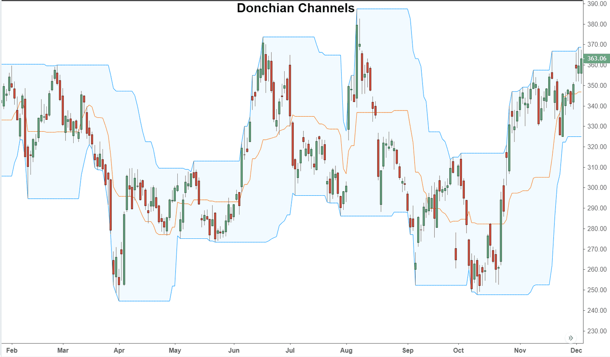

## Table of Contents

## What is a Donchian Channel and who created it?

A Donchian Channel is a tool used in trading to help people see how a stock or other thing they are trading is doing over time. It shows the highest and lowest prices of the thing being traded over a certain number of days. This helps traders see if the price is going up or down and can help them decide when to buy or sell. The channel is made up of three lines: the upper line shows the highest price in the chosen time period, the lower line shows the lowest price, and the middle line is usually the average of these two.

The Donchian Channel was created by a man named Richard Donchian. He was a trader who started using this tool in the 1930s. Richard wanted to find a simple way to see trends in the market, so he came up with the idea of using the highest and lowest prices over a set period to make his channel. His work helped a lot of other traders and is still used today to help make trading decisions.

## How does a Donchian Channel work?

A Donchian Channel works by drawing three lines on a chart of a stock or another item being traded. The top line is the highest price that the item reached over a certain number of days, like 20 days. The bottom line is the lowest price in that same time period. The middle line is often the average of the top and bottom lines, showing the middle point between the highest and lowest prices. Traders use these lines to see how the price is moving and to spot trends.

When the price of the item goes above the top line of the Donchian Channel, it might mean that the price is starting to go up, and traders might see this as a good time to buy. On the other hand, if the price drops below the bottom line, it could mean the price is going down, and traders might think it's a good time to sell. By watching how the price moves in relation to these lines, traders can make decisions based on whether the price is breaking out of the channel or staying within it.

## What is the basic formula for calculating a Donchian Channel?

To calculate a Donchian Channel, you need to look at the highest and lowest prices of an item over a certain number of days. For example, if you're using a 20-day Donchian Channel, you find the highest price that the item reached in the last 20 days. This becomes the top line of the channel. Then, you find the lowest price in those same 20 days, and that becomes the bottom line of the channel.

The middle line of the Donchian Channel is usually calculated as the average of the top and bottom lines. So, if the highest price was $50 and the lowest price was $30, the middle line would be ($50 + $30) / 2, which equals $40. By plotting these three lines on a chart, you can see how the price of the item is moving within the channel and make trading decisions based on whether the price breaks above the top line or below the bottom line.

## How do you set the period for a Donchian Channel?

Setting the period for a Donchian Channel means choosing how many days you want to look at to find the highest and lowest prices. This period can be different depending on what you want to do with the channel. Some people use a short period like 20 days to see quick changes in the price, while others might use a longer period like 50 or 100 days to see bigger trends over time.

The period you choose will affect how the Donchian Channel looks on your chart and how it can help you with trading decisions. A shorter period will make the channel more sensitive to price changes, so it might give you more signals to buy or sell. A longer period will make the channel less sensitive, showing you fewer signals but helping you see the bigger picture of where the price is going.

## What are the upper, middle, and lower bands of a Donchian Channel?

The upper band of a Donchian Channel is the highest price that a stock or other item reached over a certain number of days. If you are using a 20-day Donchian Channel, the upper band would be the highest price in the last 20 days. Traders watch this line because if the price goes above it, it might mean the price is starting to go up, and it could be a good time to buy.

The lower band is the opposite. It shows the lowest price of the item in the same time period. For a 20-day Donchian Channel, it's the lowest price in the last 20 days. If the price drops below this line, it might mean the price is going down, and it could be a good time to sell. The lower band helps traders see when the price is getting low.

The middle band is usually the average of the upper and lower bands. If the highest price was $50 and the lowest price was $30, the middle band would be $40. This line helps traders see the middle point between the highest and lowest prices. It can be useful for understanding where the price is in relation to the highs and lows over the chosen period.

## How can a Donchian Channel be used to identify breakouts?

A Donchian Channel can help traders spot breakouts by watching when the price moves outside of the channel. A [breakout](/wiki/breakout-trading) happens when the price goes above the upper band of the channel. This could mean the price is starting to go up strongly, and it might be a good time to buy. Traders look for this because it can show them that the price is breaking out of its normal range and might keep going up.

On the other hand, a breakout can also happen when the price drops below the lower band of the Donchian Channel. This might mean the price is starting to go down strongly, and it could be a good time to sell. By watching these breakouts, traders can make decisions based on whether the price is moving out of its usual range, either going up or down.

## What are some common trading strategies that use Donchian Channels?

One common trading strategy that uses Donchian Channels is the breakout strategy. In this strategy, traders buy a stock when its price goes above the upper band of the Donchian Channel. They think this means the price might keep going up. On the other hand, they sell the stock when the price drops below the lower band, thinking it might keep going down. This helps them catch big moves in the price early.

Another strategy is called the trend-following strategy. Traders using this method watch the middle band of the Donchian Channel. If the price stays above the middle band for a while, they might think there's an upward trend and buy the stock. If the price stays below the middle band, they might see it as a downward trend and sell. This way, they try to follow the trend and make money as the price keeps moving in one direction.

Some traders also use Donchian Channels to set stop-loss orders. A stop-loss order helps limit losses if the price moves against what the trader expected. For example, if a trader buys a stock when it breaks above the upper band, they might set a stop-loss order just below the lower band. This way, if the price suddenly drops, they can sell the stock and not lose too much money.

## How does the choice of period affect the sensitivity of a Donchian Channel?

The period you choose for a Donchian Channel changes how sensitive it is to price changes. If you pick a short period, like 20 days, the channel will be more sensitive. This means it will show you more signals about when the price is going up or down. Traders who want to see quick changes in the price might like using a short period because it helps them make fast decisions.

On the other hand, if you choose a longer period, like 50 or 100 days, the Donchian Channel will be less sensitive. It won't show as many signals, but it will help you see bigger trends over time. Traders who want to understand the bigger picture and follow long-term trends might prefer using a longer period. So, the period you pick depends on what kind of trading you want to do and how quickly you need to react to price changes.

## Can Donchian Channels be used in conjunction with other technical indicators?

Yes, Donchian Channels can be used with other technical indicators to help traders make better decisions. One common way is to use them with the Relative Strength Index (RSI). The RSI helps show if a stock is overbought or oversold. If the price breaks out above the upper band of the Donchian Channel and the RSI is not overbought, it might be a good time to buy. If the price drops below the lower band and the RSI is not oversold, it might be a good time to sell. This way, traders can check if the breakout is strong and likely to keep going.

Another way to use Donchian Channels with other indicators is with moving averages. A moving average smooths out price data to show the trend over time. Traders might look at a short-term moving average, like a 20-day moving average, along with the Donchian Channel. If the price breaks above the upper band and the moving average is also going up, it can confirm that the price is in an uptrend. If the price drops below the lower band and the moving average is going down, it can confirm a downtrend. Using Donchian Channels with other indicators helps traders see the bigger picture and make more confident trading decisions.

## What are the limitations and potential pitfalls of using Donchian Channels?

One big problem with using Donchian Channels is that they can give you wrong signals sometimes. This happens a lot if the market is moving up and down a lot. The price might break out of the channel, but then it goes right back inside. This can make traders buy or sell too early, and they might lose money. Also, Donchian Channels work best in markets that have clear trends. If the market is moving sideways and not going up or down much, the channels might not help you much and can make you trade when you shouldn't.

Another thing to watch out for is choosing the right time period for the channel. If you pick a short time like 20 days, you might get a lot of signals, but many of them could be wrong. If you pick a long time like 100 days, you might miss out on quick changes in the price. It's hard to know which time period is best, and it can change depending on what you're trading and what the market is doing. So, it's important to use Donchian Channels with other tools and not just rely on them alone for making trading decisions.

## How do professional traders modify Donchian Channels for more advanced strategies?

Professional traders often tweak Donchian Channels to make them work better for their strategies. One way they do this is by using different time periods for the upper and lower bands. Instead of using the same number of days for both, they might use a shorter period for the upper band and a longer one for the lower band. This can help them catch quick upward moves while giving them more time to see if a downward move is real. They might also use other tools like moving averages to confirm the signals from the Donchian Channels. For example, if the price breaks above the upper band and a short-term moving average is also going up, it can make them more sure that it's a good time to buy.

Another thing professional traders do is combine Donchian Channels with other indicators to make their strategies stronger. They might use the Relative Strength Index (RSI) to see if the price is overbought or oversold when it breaks out of the channel. If the price breaks above the upper band but the RSI shows it's overbought, they might wait before buying. Or, if the price drops below the lower band and the RSI shows it's oversold, they might wait before selling. This helps them avoid making trades based on signals that might not last long. By mixing Donchian Channels with other tools, professional traders can make smarter decisions and manage their risks better.

## What historical examples illustrate the effectiveness of Donchian Channels in trading?

One famous example of Donchian Channels working well is the Turtle Traders in the 1980s. Richard Dennis, who learned from Richard Donchian, taught a group of people how to trade using simple rules, including Donchian Channels. They made a lot of money by buying when the price went above the upper band and selling when it went below the lower band. This showed that Donchian Channels could help traders make good decisions and make money if they followed the rules carefully.

Another example is from the early 2000s when traders used Donchian Channels to spot trends in the stock market. During this time, the market had big ups and downs. Traders who used Donchian Channels with a 20-day period were able to see when the market was starting to go up or down. By watching the price break out of the channel, they could buy stocks at the start of an uptrend and sell them before a big drop. This helped them make money even when the market was hard to predict.

## References & Further Reading

[1]: Kaufman, P. J. (2013). ["Trading Systems and Methods"](https://onlinelibrary.wiley.com/doi/book/10.1002/9781119202561). Wiley.

[2]: Pring, M. J. (2002). ["Technical Analysis Explained"](https://www.amazon.com/Technical-Analysis-Explained-Fifth-Successful/dp/0071825177). McGraw-Hill Education.

[3]: Aronson, D. R. (2011). ["Evidence-Based Technical Analysis: Applying the Scientific Method and Statistical Inference to Trading Signals"](https://www.amazon.com/Evidence-Based-Technical-Analysis-Scientific-Statistical/dp/0470008741). Wiley.

[4]: Chan, E. P. (2009). ["Quantitative Trading: How to Build Your Own Algorithmic Trading Business"](https://github.com/ftvision/quant_trading_echan_book). Wiley.

[5]: Covel, M. (2009). ["Trend Following: Learn to Make Millions in Up or Down Markets"](https://www.amazon.com/Trend-Following-Updated-Millions-Markets/dp/013702018X). FT Press.

[6]: Jansen, S. (2018). ["Machine Learning for Algorithmic Trading"](https://github.com/stefan-jansen/machine-learning-for-trading). Packt Publishing.