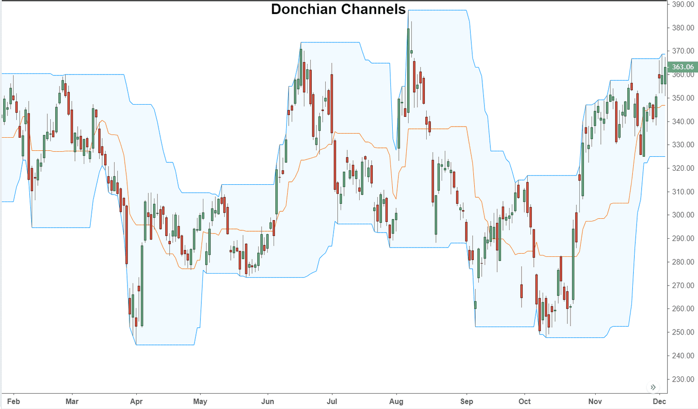

## Table of Contents

## What is a Donchian Channel?

A Donchian Channel is a type of technical indicator used in trading to help people decide when to buy or sell. It was created by a trader named Richard Donchian. The channel is made up of three lines on a price chart. The top line shows the highest price over a certain number of days, usually 20 days. The bottom line shows the lowest price over the same number of days. The middle line is the average of the top and bottom lines.

Traders use the Donchian Channel to spot trends and possible times to enter or exit trades. When the price goes above the top line, it might be a good time to buy because it could mean the price will keep going up. When the price goes below the bottom line, it might be a good time to sell because it could mean the price will keep going down. This helps traders make decisions based on clear signals from the chart.

## Who created the Donchian Channel and why?

Richard Donchian created the Donchian Channel. He was a trader who wanted to make it easier for people to see when prices were going up or down. He came up with the idea in the 1970s. The Donchian Channel is a simple tool that shows the highest and lowest prices over a certain time, usually 20 days. This helps traders see the range in which the price is moving.

Donchian wanted to give traders a clear way to know when to buy or sell. He thought that if the price went above the highest price in the last 20 days, it might keep going up. So, that could be a good time to buy. If the price went below the lowest price in the last 20 days, it might keep going down. So, that could be a good time to sell. This made it easier for traders to make decisions based on what they saw on the chart.

## How is a Donchian Channel calculated?

A Donchian Channel is calculated by looking at the highest and lowest prices over a certain number of days, usually 20 days. The top line of the channel is the highest price that happened during those 20 days. The bottom line is the lowest price that happened during those 20 days. These two lines create a channel on the price chart.

The middle line of the Donchian Channel is found by taking the average of the top and bottom lines. This middle line helps traders see the middle of the price range. Every day, the channel updates by dropping the oldest day's price and adding the newest day's price. This way, the channel always shows the highest and lowest prices from the most recent 20 days.

## What is the typical period used for a Donchian Channel?

The typical period used for a Donchian Channel is 20 days. This means that the top line of the channel shows the highest price over the last 20 days, and the bottom line shows the lowest price over the same time. Traders find this period helpful because it gives a good balance between seeing recent trends and not being too affected by short-term changes.

Using a 20-day period helps traders spot when prices might be starting a new trend. If the price goes above the highest price of the last 20 days, it could be a sign to buy. If the price goes below the lowest price of the last 20 days, it could be a sign to sell. This makes it easier for traders to make decisions based on clear signals from the chart.

## How can a Donchian Channel be used in trading?

A Donchian Channel can help traders decide when to buy or sell by showing the highest and lowest prices over the last 20 days. If the price goes above the top line of the channel, it might mean the price will keep going up. This could be a good time to buy. On the other hand, if the price goes below the bottom line of the channel, it might mean the price will keep going down. This could be a good time to sell. Traders use these signals to make decisions based on what they see on the chart.

Traders can also use the Donchian Channel to spot trends. If the price stays above the middle line of the channel for a while, it might mean the price is in an uptrend. If the price stays below the middle line, it might mean the price is in a downtrend. By watching how the price moves within the channel, traders can get a better idea of where the price might go next. This helps them plan their trades better and make more informed decisions.

## What are the key components of a Donchian Channel?

A Donchian Channel has three main parts that help traders see how prices are moving. The top part of the channel shows the highest price over the last 20 days. This line helps traders know when the price might be starting to go up a lot. The bottom part of the channel shows the lowest price over the same time. This line helps traders know when the price might be starting to go down a lot. These two lines make a channel on the price chart that shows the range where the price has been moving.

The middle part of the Donchian Channel is the average of the top and bottom lines. This middle line helps traders see the middle of the price range. By looking at how the price moves compared to this middle line, traders can tell if the price is in an uptrend or a downtrend. Every day, the channel updates by dropping the oldest day's price and adding the newest day's price. This way, the channel always shows the highest and lowest prices from the most recent 20 days, helping traders make decisions based on the latest information.

## Can you explain the breakout strategy using Donchian Channels?

The breakout strategy using Donchian Channels is a way to decide when to buy or sell based on when the price goes above or below the channel. Traders look at the top and bottom lines of the channel. If the price goes above the top line, it means the price might keep going up. This is called a breakout to the upside. When this happens, traders might decide it's a good time to buy because they think the price will keep going higher.

On the other hand, if the price goes below the bottom line, it means the price might keep going down. This is called a breakout to the downside. When this happens, traders might decide it's a good time to sell because they think the price will keep going lower. By watching for these breakouts, traders can use the Donchian Channel to make decisions about when to enter or exit trades, based on clear signals from the price chart.

## How does a Donchian Channel help in identifying trends?

A Donchian Channel helps traders see if prices are going up or down by showing the highest and lowest prices over the last 20 days. The top line of the channel is the highest price, and the bottom line is the lowest price. If the price stays above the middle line of the channel for a while, it might mean the price is in an uptrend. This means the price is going up more often than it's going down. Traders can use this to decide when to buy, thinking the price will keep going up.

If the price stays below the middle line of the channel for a while, it might mean the price is in a downtrend. This means the price is going down more often than it's going up. Traders can use this to decide when to sell, thinking the price will keep going down. By watching how the price moves within the channel, traders can get a better idea of where the price might go next. This helps them plan their trades better and make more informed decisions.

## What are the limitations of using Donchian Channels?

Donchian Channels can be really helpful, but they also have some limits. One big problem is that they can give false signals. This means the price might break out of the channel, but then it doesn't keep going in that direction. Traders might buy or sell based on the breakout, but if it's a false signal, they could lose money. Also, Donchian Channels are based on past prices, so they might not be good at predicting big changes in the market that happen suddenly.

Another limit is that Donchian Channels work best in markets that have clear trends. If the market is moving sideways and not going up or down much, the channel might not be very useful. Traders might get confused by the signals because the price keeps bouncing between the top and bottom lines without a clear direction. So, it's important for traders to use Donchian Channels along with other tools to get a better picture of what's happening in the market.

## How can Donchian Channels be combined with other indicators for better results?

Donchian Channels can be used with other tools to make trading decisions better. One way to do this is by using the Relative Strength Index (RSI). The RSI shows if a price is overbought or oversold. If the price breaks out of the Donchian Channel and the RSI also shows it's not overbought, it might be a good time to buy. If the price breaks down and the RSI is not oversold, it might be a good time to sell. Using both tools together helps traders make sure the breakout is strong and not just a false signal.

Another way to use Donchian Channels with other tools is by adding moving averages. A moving average smooths out price changes over time. If the price breaks out of the Donchian Channel and is also above a moving average, it can confirm that the price might keep going up. If the price breaks down and is below a moving average, it can confirm that the price might keep going down. By looking at both the Donchian Channel and the moving average, traders can feel more confident about their decisions because they have more information to go on.

## What are some advanced trading strategies that utilize Donchian Channels?

One advanced trading strategy that uses Donchian Channels is called the Turtle Trading System. This system was made popular by a group of traders who were trained by Richard Dennis in the 1980s. The idea is to buy when the price breaks above the top line of the Donchian Channel and to sell when the price breaks below the bottom line. But to make it more advanced, traders also use a 10-day and a 20-day Donchian Channel. If the price breaks above the 20-day channel and is also above the 10-day channel, it's a stronger signal to buy. If the price breaks below the 20-day channel and is also below the 10-day channel, it's a stronger signal to sell. This helps traders make more sure decisions.

Another advanced strategy is to use Donchian Channels with the Average True Range (ATR) to set stop-loss levels. The ATR measures how much the price moves up and down over time. Traders can use the ATR to figure out how far away to set their stop-loss orders. For example, if the price breaks out of the Donchian Channel, traders can set their stop-loss a certain number of ATRs away from the breakout point. This helps them manage risk better because they know how much the price might move before it's a false signal. By combining Donchian Channels with ATR, traders can make their trading strategy more advanced and protect their money better.

## How do different market conditions affect the effectiveness of Donchian Channels?

Donchian Channels work best when the market is moving in a clear direction, either going up or going down. In these conditions, the channels help traders see when the price breaks out of the range it's been moving in. If the price goes above the top line of the channel, it might keep going up, so traders might decide to buy. If the price goes below the bottom line, it might keep going down, so traders might decide to sell. When the market has a strong trend, Donchian Channels give clear signals that traders can use to make good decisions.

But, Donchian Channels can be less helpful when the market is moving sideways and not going up or down much. In these conditions, the price keeps bouncing between the top and bottom lines of the channel without a clear direction. This can make it hard for traders to know when to buy or sell because the signals might not be as clear. So, traders need to be careful and maybe use other tools along with Donchian Channels to get a better idea of what's happening in the market.

## How do Donchian Channels compare with other indicators?

Donchian Channels, Bollinger Bands, and Keltner Channels are key tools in technical analysis, each providing traders with unique insights into market dynamics. Despite their similarities, key differences in their calculation methods and applications can influence their usage and effectiveness in various trading scenarios.

The primary distinction between Donchian Channels and Bollinger Bands lies in the basis of their calculations. Donchian Channels are derived from the highest high and lowest low over a selected period, typically set at 20 days. The upper band represents the highest high, while the lower band shows the lowest low within this period. This simplicity allows traders to easily visualize price breakouts and reversals.

In contrast, Bollinger Bands incorporate a level of statistical analysis by employing the standard deviation of prices. The bands consist of a middle simple moving average (SMA) and two outer bands calculated as:

$$
\text{Upper Band} = \text{SMA} + k \times \text{SD}
$$

$$
\text{Lower Band} = \text{SMA} - k \times \text{SD}
$$

where $k$ is a constant (commonly set to 2). Bollinger Bands adjust dynamically to market volatility, expanding during volatile markets and contracting during less volatile periods.

Keltner Channels, meanwhile, combine elements of both Bollinger Bands and Donchian Channels, using the average true range (ATR) rather than standard deviation. The formula for the Keltner Channels is:

$$
\text{Middle Line} = \text{EMA}
$$

$$
\text{Upper Band} = \text{EMA} + k \times \text{ATR}
$$

$$
\text{Lower Band} = \text{EMA} - k \times \text{ATR}
$$

where $\text{EMA}$ is the exponential moving average and $\text{ATR}$ is the average true range. The use of ATR provides a smoothing effect that can help traders identify emerging trends with greater clarity.

Traders often exploit the complementary nature of these indicators. Using Donchian Channels alongside Bollinger Bands or Keltner Channels can provide a more comprehensive overview of market conditions. For instance, while Donchian Channels can signal potential breakout points, Bollinger Bands might help assess whether the breakout aligns with volatility expectations. Similarly, Keltner Channels can be used to gauge trend strength and support decision-making in conjunction with the other indicators. 

Incorporating these indicators into trading strategies offers traders a layered approach to market analysis, enhancing the robustness of their trading signals.

## References & Further Reading

[1]: ["Turrets Of Our Defence": Systematic Trend Following & Donchian Channels.](https://quantstrategy.io/blog/donchian-channel-strategy-identify-breakouts-and-trend-reversals/) University of Pennsylvania

[2]: "Quantitative Technical Analysis: An Integrated Approach to Trading System Development and Trading Management" by Dr. Howard B. Bandy

[3]: "Trend Following: Learn to Make Millions in Up or Down Markets" by Michael Covel

[4]: ["A Practical Guide to Algorithmic Strategies and Trading Systems" by Ernie Chan.](https://www.wiley.com/en-us/High-Frequency+Trading%3A+A+Practical+Guide+to+Algorithmic+Strategies+and+Trading+Systems%2C+2nd+Edition-p-9781118416822)

[5]: "Technical Analysis of the Financial Markets: A Comprehensive Guide to Trading Methods and Applications" by John J. Murphy