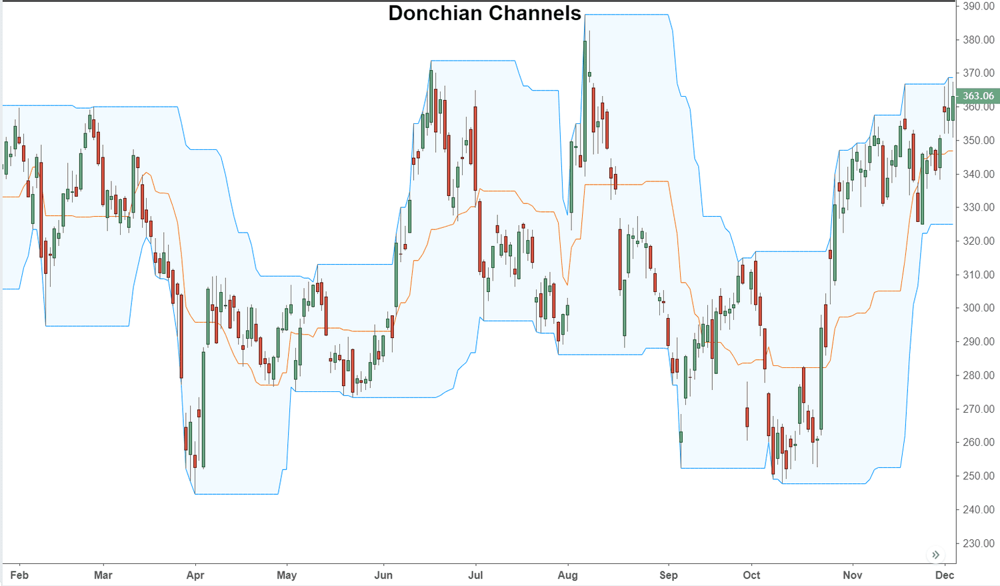

Technical analysis is a foundational practice in trading that involves evaluating securities and forecasting their future price movements based on historical price and volume data. It is primarily utilized to identify market trends and potential entry and exit points for trades. Unlike fundamental analysis, which assesses a security's intrinsic value by examining related economic and financial factors, technical analysis focuses on patterns and signals derived from price charts.

Donchian Channels are an important tool in the domain of technical analysis, used to determine market trends and volatility. Developed by Richard Donchian, a pioneer in trend following, Donchian Channels consist of three lines plotted on a price chart: the upper band, lower band, and a middle line. These bands are calculated using the highest high and the lowest low over a specified period. They provide traders with signals regarding trend continuation or reversal, breakout opportunities, and volatility expansion.



Algorithmic trading has become a significant force in modern financial markets, enabling trades to be executed with greater speed, efficiency, and precision than ever before. Algorithmic trading leverages computer programs to execute a set of instructions based on the pre-defined criteria of market data to manage trading activities. This approach minimizes human errors, enhances the speed of executing trades, and allows traders to capitalize on short-lived market opportunities at scale.

Donchian Channels can be integrated into algorithmic trading strategies to automate the analysis of market trends and the execution of trades. By setting specific rules for entry and exit points based on the Donchian Channels' signals, traders can develop algorithms that systematically implement these strategies. These algorithms can adapt swiftly to market changes, leveraging historical price data to predict potential market movements and execute trades with minimal latency.

The article aims to explore the use of Donchian Channels as a trading strategy through algorithmic methods. By analyzing how Donchian Channels can be programmed into trading algorithms, we seek to uncover the potential benefits and challenges associated with this approach. Through effective integration of these channels into automated strategies, traders can potentially enhance their decision-making processes and trading outcomes.

## Table of Contents

## Understanding Donchian Channels

Donchian Channels are a form of technical analysis tool designed to identify market trends and potential breakout opportunities. Developed by Richard Donchian, a pioneer in the field of futures trading, these channels have become a critical component for traders seeking to analyze price movements across various market conditions.

### Definition and History of Donchian Channels

Richard Donchian first introduced Donchian Channels in the mid-20th century as a way to systematize his trend-following strategies. The concept is rooted in the belief that prices tend to follow trends and that historical price data can provide insights into future price movements. Donchian Channels are employed primarily in futures markets but have since been expanded for use in equity, currency, and commodity trading.

### Components of Donchian Channels

Donchian Channels consist of three distinct lines:

1. **Upper Band**: The highest high over a specified period.
2. **Lower Band**: The lowest low over the same specified period.
3. **Middle Band**: Often calculated as the average of the Upper and Lower Bands, although this can vary depending on the trading platform or trader’s preference.

### How Donchian Channels Are Calculated

The Donchian Channel is typically constructed using historical price data over a defined number of periods. A common setting is a 20-day period, though traders may adjust this to suit their individual strategies. The formulas for computing the channels are as follows:

- Upper Band: $\text{Upper Band} = \max(\text{Highs over } n \text{ periods})$
- Lower Band: $\text{Lower Band} = \min(\text{Lows over } n \text{ periods})$
- Middle Band (optional): $\text{Middle Band} = \frac{\text{Upper Band} + \text{Lower Band}}{2}$

For a practical implementation, one might use Python to calculate these bands:

```python
import pandas as pd

def donchian_channels(highs, lows, period=20):
    upper_band = highs.rolling(window=period).max()
    lower_band = lows.rolling(window=period).min()
    middle_band = (upper_band + lower_band) / 2
    return upper_band, middle_band, lower_band

# Example usage with Pandas DataFrame containing 'High' and 'Low' columns
data = pd.read_csv('market_data.csv')  # Replace with your data source
upper_band, middle_band, lower_band = donchian_channels(data['High'], data['Low'])
```

### Usage of Donchian Channels in Identifying Market Trends

Donchian Channels are primarily used to identify [breakout](/wiki/breakout-trading) scenarios and potential trend directions. When a price crosses and closes above the Upper Band, it may signal the beginning of an upward trend, suggesting a buy signal. Conversely, when a price crosses and closes below the Lower Band, it may indicate a downtrend, suggesting a sell signal. The Middle Band can serve as a visual representation of the current market trend or equilibrium, offering potential points for profit-taking or [exit](/wiki/exit-strategy) strategies.

### Advantages of Using Donchian Channels in Trading

The utilization of Donchian Channels provides several advantages for traders:

- **Simplicity**: The calculation is straightforward, requiring only historical high and low prices over a specified period.
- **Trend Identification**: By highlighting significant highs and lows, Donchian Channels effectively help in identifying long-term market trends.
- **Versatility**: Applicable across various asset classes and markets, Donchian Channels can be adapted to different trading styles and timeframes.
- **Algorithmic Integration**: The uncomplicated nature of Donchian Channels makes them suitable for integration into automated trading systems, facilitating their use in algorithmic trading strategies.

Through these components and methods, Donchian Channels continue to be a valuable tool for traders aiming to leverage trend-following strategies for optimal market analysis and decision-making.

## Technical Analysis with Donchian Channels

Technical analysis plays a crucial role in trading strategies, enabling traders to make informed decisions based on past market data. It involves using historical price and [volume](/wiki/volume-trading-strategy) data to predict future market movements. Among the myriad of tools available for technical analysis, Donchian Channels stand out due to their simplicity and effectiveness.

**How Donchian Channels Fit into the Technical Analysis Landscape**

Donchian Channels were developed by Richard Donchian, a pioneer of [trend following](/wiki/trend-following). These channels identify potential breakouts and trends by considering the highest high and lowest low over a specific time period. This aligns them with other trend-following tools like moving averages, but they offer a unique advantage by dynamically adjusting to market [volatility](/wiki/volatility-trading-strategies).

**Technical Signals Generated by Donchian Channels**

Donchian Channels consist of three lines: an upper band indicating the highest high over a given period, a lower band indicating the lowest low, and a middle band, which is the average of the upper and lower bands. The formulae for calculating these bands are as follows:

- Upper Band: `Upper = max(High(N))`
- Lower Band: `Lower = min(Low(N))`
- Middle Band: `(Upper + Lower) / 2`

Where `N` is the period length.

Key signals from Donchian Channels include:

1. **Breakouts**: A breakout above the upper band may indicate a buying opportunity, while a breakout below the lower band may suggest a selling opportunity.
2. **Trend Reversals**: If prices consistently hover near the channel’s edges, it might signify an impending reversal.

**Examples of Trades Using Donchian Channels**

Consider a scenario where a trader uses a 20-day Donchian Channel on a stock. When the price breaks above the upper channel, a long position is initiated, signifying a bullish trend. Conversely, when the price falls below the lower channel, a short position is taken, indicating a bearish sentiment. Such trades capitalize on capturing substantial price movements following breakouts.

**Effectiveness of Donchian Channels in Different Market Conditions**

The effectiveness of Donchian Channels varies with market conditions:

- **Trending Markets**: Donchian Channels are highly effective in capturing trends. During strong upward or downward movements, breakouts from the channels tend to lead to significant profits.
- **Sideways Markets**: In markets lacking a clear trend, Donchian Channels might generate false signals. Prices frequently crossing above and below the bands without establishing a strong directional move can lead to whipsaws.

In summary, Donchian Channels serve as a robust technical analysis tool for identifying market trends and potential trade opportunities. Their integration into technical analysis strategies can offer traders a framework for making data-driven decisions, particularly in trending market environments.

## Algorithmic Trading Strategies Using Donchian Channels

Algorithmic trading has revolutionized the financial markets by employing computer algorithms to automate trading decisions. This approach offers numerous benefits, such as eliminating emotional bias, enhancing the speed of execution, and systematically analyzing large datasets. Donchian Channels, a popular trend-following technical indicator, can be seamlessly integrated into [algorithmic trading](/wiki/algorithmic-trading) strategies to capitalize on trends within the market.

A trading algorithm utilizing Donchian Channels typically focuses on the breakout methodology. Donchian Channels consist of three components: the upper band, lower band, and the middle t. The upper band is the highest high over a specific timeframe, while the lower band is the lowest low over the same period. The middle band is computed as the average of the upper and lower bands. This setup helps in identifying volatility and developing positional strategies based on market trends.

When setting up a Donchian Channel algorithm, key parameters include the look-back period, which determines the timeframe for the high and low calculations, and the position sizing that dictates the number of shares or contracts to be traded. The choice of parameters can significantly influence the performance of the strategy. Traders usually experiment with different look-back periods, like 20-day or 55-day channels, to find optimal settings for a particular financial instrument or market condition.

Backtesting is a crucial step in developing a Donchian Channel algorithmic strategy. This process involves running the strategy against historical market data to evaluate its performance. Backtesting allows traders to assess the effectiveness of different parameter settings and predict potential future performance before deploying real capital. In Python, popular libraries such as Backtrader or Zipline are often used for this purpose.

```python
import backtrader as bt

class DonchianChannelStrategy(bt.Strategy):
    params = (('period', 20),)

    def __init__(self):
        self.highest = bt.indicators.Highest(self.data.high(-1), period=self.params.period)
        self.lowest = bt.indicators.Lowest(self.data.low(-1), period=self.params.period)

    def next(self):
        if self.data.close[0] > self.highest[-1]:
            self.buy()
        elif self.data.close[0] < self.lowest[-1]:
            self.sell()

cerebro = bt.Cerebro()
data = bt.feeds.YahooFinanceData(dataname='AAPL', fromdate=datetime(2020,1,1), todate=datetime(2023,1,1))
cerebro.adddata(data)
cerebro.addstrategy(DonchianChannelStrategy)
cerebro.run()
cerebro.plot()
```

Several case studies underscore the effectiveness of Donchian Channel-based algorithms. Historically, traders such as Richard Dennis of the Turtle Traders fame used principles similar to Donchian Channels to achieve remarkable returns. More recently, hedge funds have continued to leverage Donchian strategies, enhanced by [machine learning](/wiki/machine-learning) algorithms, to refine entry and exit points and adapt to a variety of market conditions.

Incorporating Donchian Channels into algorithmic strategies enables traders to harness systematic approaches to trend identification and trade execution. By calibrating appropriate parameters, [backtesting](/wiki/backtesting) thoroughly, and learning from historical successes, traders can use Donchian Channels to potentially achieve consistent profits in varied market environments.

## Risks and Challenges

### Risks and Challenges

The utilization of Donchian Channels in trading involves several potential risks that traders must account for to enhance their trading strategies. While Donchian Channels provide insights into market trends and potential breakout points, there are inherent limitations and challenges associated with their use.

1. **Potential Risks of Using Donchian Channels in Trading**  
   The primary risk associated with Donchian Channels is their reliance on historical price data, which can lead to lagging indicators. Since Donchian Channels are typically based on prior high and low prices over a defined period, they may not respond swiftly to sudden market changes or shifts in trends, potentially resulting in delayed signals. Such lagging can cause traders to enter or exit positions at suboptimal times, leading to missed opportunities or losses. Additionally, in a sideways market, Donchian Channels may generate multiple false signals due to frequent breakouts beyond the upper and lower bands, causing traders to incur losses from whipsaw trades.

2. **Challenges in Implementing Donchian Channel Strategies Algorithmically**  
   Implementing Donchian Channel strategies algorithmically adds another layer of complexity. Setting the optimal parameters for the period length of the channels is crucial but challenging, as the effectiveness of these parameters may vary across different market conditions and asset classes. Algorithmic systems must be robust enough to adapt to changing market conditions while minimizing latency in signal processing. Moreover, ensuring the reliability of data feeds and the execution of trades without slippage are critical factors that could affect the success of an algorithmic trading strategy based on Donchian Channels.

3. **Considerations for Minimizing Risks in Algo Trading**  
   To mitigate these risks, traders should adopt a comprehensive approach that includes backtesting and forward testing strategies across various market conditions. Diversifying trading strategies by integrating complementary technical indicators can also help filter out false signals and improve decision-making. Regularly reviewing and, if necessary, recalibrating algorithm parameters ensure the strategy remains aligned with the prevailing market dynamics. Implementing risk management tools, such as stop-loss orders and position sizing techniques, can further protect against significant losses.

4. **How Market Volatility Impacts Donchian Channel Performance**  
   Market volatility plays a significant role in the performance of Donchian Channels. In highly volatile markets, the bands tend to widen, which might reduce the occurrence of false signals but could lead to delayed entry and exit points as the breakout thresholds are set farther from the current price. In contrast, low-volatility environments may narrow the bands, increasing the frequency of false signals due to price whipsaws. Traders must adjust their strategies to account for these volatility shifts, possibly by modifying the look-back period or integrating volatility-adjusted indicators.

5. **Common Pitfalls to Avoid When Using Donchian Channels**  
   One of the most common pitfalls is over-reliance on Donchian Channels without considering the broader market context. Ignoring the impact of economic news, geopolitical events, or other market fundamentals can lead to poor trading decisions. Additionally, using a fixed look-back period without accounting for changing market conditions might result in suboptimal channel settings. Traders should avoid the temptation to over-optimize algorithms based on historical data, as this can lead to curve fitting, where the strategy performs well on past data but poorly in real-time markets.

In conclusion, while Donchian Channels offer valuable insights and can be an integral part of a trading strategy, traders must be vigilant about the risks and challenges involved. By employing robust risk management practices and continuously adapting to market developments, traders can enhance the effectiveness of their strategies involving Donchian Channels.

## Conclusion

Donchian Channels offer a robust means of analyzing market trends and identifying trading opportunities. By encapsulating the highest high and lowest low of the last n periods through its established bands, the simplicity and clarity of Donchian Channels provide traders with a straightforward tool for decision-making. This aspect is particularly beneficial when integrated into algorithmic trading systems, which thrive on clear and programmable signals. The ability to automate trading strategies with Donchian Channels enables consistent and efficient market participation, reducing the emotional and cognitive biases that often impede manual trading.

Looking forward, the integration of Donchian Channels into algorithmic trading systems is set to benefit from advancements in computational finance and [artificial intelligence](/wiki/ai-artificial-intelligence). As market dynamics grow increasingly complex, the adaptability of algorithmic models incorporating Donchian Channels will likely enhance their relevance and effectiveness within both traditional financial markets and burgeoning digital asset markets. This adaptability will be crucial for developing sophisticated trading systems capable of reaping consistent benefits from volatile market conditions.

Traders are encouraged to explore algorithmic techniques leveraging Donchian Channels due to the systematic edge they provide. Algorithmic trading allows for rigorous backtesting and optimization of trading strategies, which can enhance profitability and risk management in line with specific trading goals. By employing Donchian Channels within these algorithmic frameworks, traders can systematically scout trends and reversal points with higher accuracy and less discretionary intervention.

Mastery of Donchian Channels in technical analysis involves understanding their implementation and interaction with other technical indicators. A holistic approach that incorporates various strategies and conditions can lead to more nuanced strategies that cater to individual trading styles and time horizons.

For further learning and enhanced utilization of Donchian Channels, traders may refer to resources such as "Technical Analysis of the Financial Markets" by John J. Murphy and online platforms like Investopedia and TradingView. These resources provide comprehensive material on technical indicators, including Donchian Channels, and allow traders to simulate and visualize strategies in real market conditions. Engaging with programming communities and financial forums can also provide valuable insights into new strategies and technological implementations, fostering a deeper understanding and proficiency in trading with Donchian Channels.

## References & Further Reading

[1]: Donchian, R. J. (1960). ["Commodity Trend Timing with Moving Averages,"](https://www.scribd.com/document/257492592/Donchian-s-20-Trading-Guides) Commodity Research Bureau.

[2]: Murphy, J. J. (1999). ["Technical Analysis of the Financial Markets: A Comprehensive Guide to Trading Methods and Applications,"](https://archive.org/details/technicalanalysi0000murp) New York Institute of Finance.

[3]: Schwager, J. D. (1989). ["Market Wizards: Interviews with Top Traders,"](https://www.amazon.com/Market-Wizards-Jack-D-Schwager/dp/0887306101) New York Institute of Finance.

[4]: Aronson, D. R. (2006). ["Evidence-Based Technical Analysis: Applying the Scientific Method and Statistical Inference to Trading Signals,"](https://www.amazon.com/Evidence-Based-Technical-Analysis-Scientific-Statistical/dp/0470008741) Wiley.

[5]: Lopez de Prado, M. (2018). ["Advances in Financial Machine Learning,"](https://books.google.com/books/about/Advances_in_Financial_Machine_Learning.html?id=oU9KDwAAQBAJ) Wiley.

[6]: Chan, E. P. (2008). ["Quantitative Trading: How to Build Your Own Algorithmic Trading Business,"](https://github.com/ftvision/quant_trading_echan_book) Wiley.

[7]: Jansen, S. (2020). ["Machine Learning for Algorithmic Trading,"](https://github.com/stefan-jansen/machine-learning-for-trading) Packt Publishing.