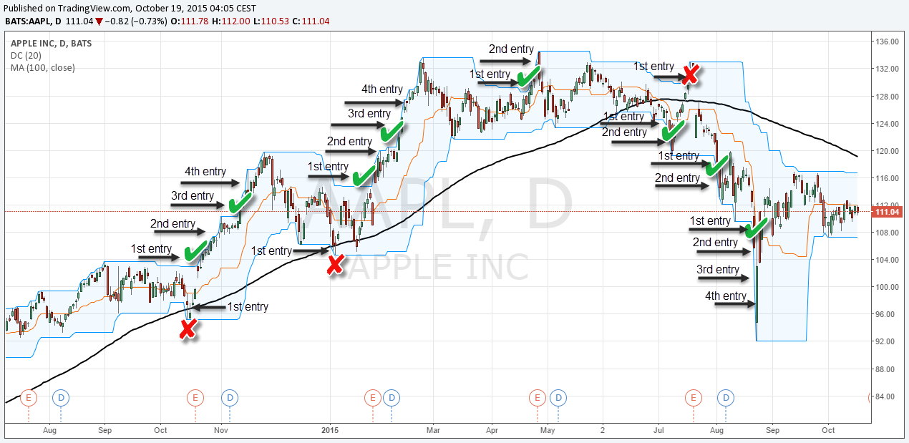

## Table of Contents

## What are Donchian Channels and how are they calculated?

Donchian Channels are a type of technical indicator used in trading to help identify potential price breakouts and trends. They are named after Richard Donchian, who developed this tool. The channels consist of three lines: the upper band, the lower band, and the middle band. The upper band is the highest price of an asset over a certain period, while the lower band is the lowest price over the same period. The middle band is typically the average of the upper and lower bands.

To calculate Donchian Channels, you first need to decide on a time period, like 20 days. For each day, you look back over the past 20 days to find the highest and lowest prices. The highest price in those 20 days becomes the upper band for that day, and the lowest price becomes the lower band. The middle band is then calculated as the average of the upper and lower bands. Traders use these channels to spot when prices break out of the range, which can signal a new trend starting.

## How can beginners use Donchian Channels to identify market trends?

Beginners can use Donchian Channels to spot market trends by watching how prices move in relation to the upper and lower bands. If the price of an asset keeps hitting the upper band and stays above it, it might mean the market is trending upwards. On the other hand, if the price keeps touching the lower band and stays below it, it could signal a downward trend. By keeping an eye on these movements, beginners can get a sense of whether the market is going up or down.

Another way beginners can use Donchian Channels is by looking for breakouts. A [breakout](/wiki/breakout-trading) happens when the price moves outside the upper or lower band. If the price breaks above the upper band, it might be a good time to buy because it could mean the start of an upward trend. If the price breaks below the lower band, it might be a signal to sell or avoid buying, as it could indicate a downward trend. By watching for these breakouts, beginners can make more informed decisions about when to enter or [exit](/wiki/exit-strategy) the market.

## What is the significance of the upper and lower bands in Donchian Channels?

The upper and lower bands in Donchian Channels are very important because they show the highest and lowest prices of an asset over a certain time. The upper band is the highest price in that time period, and the lower band is the lowest price. These bands help traders see the range in which the price is moving. If the price stays between these bands, it means the market is not moving much and is in a range.

When the price moves outside these bands, it can mean a big change is happening. If the price goes above the upper band, it might be the start of an upward trend. This can be a signal for traders to buy the asset. If the price goes below the lower band, it might mean a downward trend is starting. This can be a signal for traders to sell or avoid buying the asset. By watching these bands, traders can make better decisions about when to buy or sell.

## Can you explain the basic breakout strategy using Donchian Channels?

A basic breakout strategy using Donchian Channels involves watching the price of an asset in relation to the upper and lower bands. When the price moves above the upper band, it's called a breakout. This can mean the start of an upward trend. Traders might see this as a good time to buy the asset because they think the price will keep going up.

On the other hand, if the price falls below the lower band, it's also a breakout, but this time it can mean the start of a downward trend. Traders might see this as a sign to sell the asset or avoid buying it because they think the price will keep going down. By watching these breakouts, traders can try to make money by buying low and selling high or by avoiding bad trades.

## How do traders set the period for Donchian Channels and what impact does it have?

Traders set the period for Donchian Channels based on how long they want to look back at the price history. A common period is 20 days, but it can be shorter or longer depending on what the trader wants. A shorter period, like 10 days, will make the channels react faster to price changes. This can be good for traders who want to catch quick trends but it might also give more false signals. A longer period, like 50 days, will make the channels slower to react but might give more reliable signals because it looks at a bigger picture.

The period you choose for Donchian Channels can have a big impact on your trading. If you use a short period, you might see more breakouts, but some of them might not lead to real trends. This can make your trading more exciting but also riskier. If you use a long period, you might miss out on some quick moves in the market, but the breakouts you do see are more likely to be the start of big trends. So, choosing the right period depends on what kind of trading you like and how much risk you're willing to take.

## What are some common entry and exit signals generated by Donchian Channels?

Donchian Channels give traders signals to enter and exit trades. An entry signal happens when the price breaks out of the channels. If the price goes above the upper band, it's a sign to buy because it might mean the start of an upward trend. If the price goes below the lower band, it's a sign to sell or avoid buying because it might mean the start of a downward trend. These breakouts help traders decide when to get into a trade.

Exit signals from Donchian Channels can also be useful. One way to exit a trade is when the price goes back inside the channels after a breakout. For example, if you bought when the price broke above the upper band, you might sell when the price falls back below the upper band. Another way to exit is if the price breaks the opposite band. If you bought and the price then breaks the lower band, it might be time to sell to cut losses. These signals help traders know when to get out of a trade.

## How can Donchian Channels be combined with other indicators for more robust trading strategies?

Donchian Channels can be combined with other indicators to make trading strategies stronger. One common way is to use them with the Relative Strength Index (RSI). The RSI helps traders see if a stock is overbought or oversold. If the price breaks above the upper band of the Donchian Channel and the RSI is not overbought, it can be a strong buy signal. If the price breaks below the lower band and the RSI is not oversold, it might be a good time to sell or avoid buying. By using both indicators, traders can feel more confident about their decisions because they are looking at more than just one thing.

Another way to use Donchian Channels with other indicators is to combine them with moving averages. A moving average smooths out price data to show the trend over time. If the price breaks above the upper band of the Donchian Channel and is also above a moving average, it can confirm an upward trend. If the price breaks below the lower band and is below the moving average, it can confirm a downward trend. This combination can help traders avoid false breakouts and make their trading strategies more reliable. By using Donchian Channels with other tools, traders can get a fuller picture of the market and make better trading choices.

## What are the limitations and potential pitfalls of using Donchian Channels in trading?

Donchian Channels can help traders see when prices might be breaking out, but they have some limits. One big problem is that they can give false signals. This means the price might break out of the channel, but then it goes back inside without starting a new trend. This can trick traders into buying or selling at the wrong time. Also, Donchian Channels work best in markets that are trending, not when prices are moving up and down without a clear direction. If the market is not trending, the channels might not be very useful.

Another issue with Donchian Channels is that they can be slow to react. If you use a long period for the channels, like 50 days, it might take a while for the channels to show a breakout. This means you could miss out on some quick moves in the market. On the other hand, if you use a short period, like 10 days, the channels might react too fast and give you more false signals. Finding the right period can be hard and depends a lot on what kind of trading you do and how much risk you're willing to take.

## How can advanced traders use Donchian Channels to manage risk and position sizing?

Advanced traders can use Donchian Channels to manage risk by setting stop-loss orders based on the channels. A stop-loss order is a way to limit how much money you can lose on a trade. If a trader buys when the price breaks above the upper band, they might set a stop-loss just below the lower band. This way, if the price falls back into the channel or breaks the lower band, the trade will close automatically, helping to limit losses. By using the Donchian Channels to set these stop-loss levels, traders can better manage their risk and protect their money.

Position sizing is another way advanced traders can use Donchian Channels. Position sizing means deciding how much of an asset to buy or sell. Traders might use the width of the Donchian Channel to help them decide this. For example, if the channel is wide, it might mean the market is more volatile, so traders might choose to buy or sell less of the asset to keep their risk low. If the channel is narrow, it might mean the market is less volatile, so they might be willing to buy or sell more. By looking at the Donchian Channels, traders can adjust their position sizes to match the current market conditions and manage their risk better.

## Can you discuss a case study where Donchian Channels were effectively used in a trading strategy?

In a case study involving the trading of a popular tech stock, a trader named Sarah used Donchian Channels to spot a good time to buy. Sarah set her Donchian Channels to a 20-day period and watched the stock's price every day. One day, the stock broke above the upper band of the Donchian Channel, which Sarah saw as a strong buy signal. She bought the stock right after the breakout. Over the next few weeks, the stock kept going up, and Sarah made a nice profit when she sold it.

In another case, a [forex](/wiki/forex-system) trader named Mike used Donchian Channels to manage his trades. Mike traded the EUR/USD pair and used a 50-day period for his Donchian Channels. When the price broke below the lower band, Mike saw it as a sign to sell. He put in a sell order and also set a stop-loss just above the upper band to limit his risk. The price kept going down, and Mike's trade was successful. By using Donchian Channels, Mike was able to spot the downward trend early and manage his risk well.

## How do professional traders adapt Donchian Channels for different market conditions and asset classes?

Professional traders adapt Donchian Channels for different market conditions by changing the period of the channels. In a fast-moving market, they might use a shorter period, like 10 days, to catch quick trends. This helps them react faster to price changes. In a slower market, they might use a longer period, like 50 days, to avoid false signals and focus on bigger trends. By adjusting the period, traders can make the Donchian Channels work better for whatever market they are trading in.

For different asset classes, professional traders also tweak the Donchian Channels. Stocks might move differently from forex or commodities, so traders might use different periods for each. For example, they might use a 20-day period for stocks but a 14-day period for forex because forex markets can be more volatile. By understanding how each asset class behaves, traders can set the right period for their Donchian Channels and make better trading decisions.

## What are the latest research findings or innovations related to Donchian Channels in algorithmic trading?

Recent research in [algorithmic trading](/wiki/algorithmic-trading) has looked at ways to make Donchian Channels work better. One study found that combining Donchian Channels with [machine learning](/wiki/machine-learning) can help traders predict breakouts more accurately. The study used historical price data to train a machine learning model to spot patterns that the Donchian Channels might miss. By doing this, the model could give better signals about when to buy or sell. This could help traders make more money and avoid losses.

Another innovation is using adaptive Donchian Channels. These channels change their period based on how the market is moving. For example, if the market is very volatile, the channels might use a shorter period to react quickly. If the market is calm, they might use a longer period to avoid false signals. This can make trading strategies more flexible and better at catching trends in different market conditions. By using these adaptive channels, traders can improve their performance and make better decisions.

## How can Donchian Channels be used in trading?

Donchian Channels are a valuable tool in technical analysis for identifying trends and assessing market [volatility](/wiki/volatility-trading-strategies). By analyzing price data over a specific period, these channels provide clear visual indicators of market conditions, offering traders the ability to make informed decisions. 

Donchian Channels consist of three lines: the upper band, the lower band, and the median line. The upper band marks the highest high over a selected time frame, while the lower band shows the lowest low. The median line is computed as the average of the upper and lower bands, providing a reference point within the channel.

To calculate Donchian Channels, the following steps are performed:

1. Determine the highest high over the desired period, $n$:
$$
   \text{Upper Band} = \max(\text{High}_t) \quad \text{for} \quad t = 1 \text{ to } n

$$

2. Determine the lowest low over the same period:
$$
   \text{Lower Band} = \min(\text{Low}_t) \quad \text{for} \quad t = 1 \text{ to } n

$$

3. Calculate the median line:
$$
   \text{Median Line} = \frac{\text{Upper Band} + \text{Lower Band}}{2}

$$

### Identification of Trends and Volatility

Donchian Channels excel at trend identification, as the widening or narrowing of the channels can signal changes in market volatility. A consistent match between price movement and the direction indicated by the channels often implies a strong trend. During upward trends, prices tend to hover near or break the upper band, whereas downward trends are confirmed when prices are near or fall below the lower band.

### Detecting Breakouts and Reversals

Breakouts and reversals are significant trading opportunities identified using Donchian Channels. A breakout occurs when the price crosses above the upper band or below the lower band, suggesting a potential start of a new trend. Conversely, reversals can be anticipated when prices retreat from the extremities of the channel, moving back towards the median line.

Python pseudo-code for identifying breakouts might look like this:

```python
import pandas as pd

def detect_breakouts(prices, upper_band, lower_band):
    breakouts = []
    for i in range(1, len(prices)):
        if prices[i] > upper_band[i-1]:
            breakouts.append((i, 'Bullish Breakout'))
        elif prices[i] < lower_band[i-1]:
            breakouts.append((i, 'Bearish Breakout'))
    return breakouts

# Example usage with price data
prices = pd.Series([...])  # fill in with actual price data
upper_band = pd.Series([...])
lower_band = pd.Series([...])

breakouts = detect_breakouts(prices, upper_band, lower_band)
```

### Advantage of Visualizing Price Action

Visualizing price action through Donchian Channels provides traders with an intuitive understanding of market dynamics. Channels assist in setting stop-loss levels and identifying areas of support and resistance. This visualization reduces noise and enables traders to focus on significant price movements rather than insignificant fluctuations, offering a clear strategy for decision-making.

In summary, employing Donchian Channels in trading helps traders understand and capitalize on market trends, volatility shifts, and breakout events. The seamless visualization of price action offered by these channels makes them an indispensable tool for efficient and profitable trading strategies.

## References & Further Reading

[1]: Bok, V. (2005). ["Technical Analysis of the Financial Markets: A Comprehensive Guide to Trading Methods and Applications"](https://www.amazon.com/Technical-Analysis-Financial-Markets-Comprehensive/dp/0735200661) by John J. Murphy.

[2]: Peng, Z., & Zhang, W. (2014). ["An Empirical Study of Donchian Channel Breakout Trading Strategy in China’s Financial Futures Market"](https://www.jstor.org/stable/27292640). Procedia Computer Science.

[3]: Kaufman, P. J. (2013). ["Trading Systems and Methods"](https://onlinelibrary.wiley.com/doi/book/10.1002/9781119202561). Wiley.

[4]: Lee, C. (2009). ["Trend Following: Learn to Make Millions in Up or Down Markets"](https://books.google.com/books/about/Trend_Following.html?id=KqnfBQAAQBAJ) by Michael W. Covel.

[5]: Chan, E. P. (2017). ["Algorithmic Trading: Winning Strategies and Their Rationale"](https://github.com/ftvision/quant_trading_echan_book) by Ernie Chan.