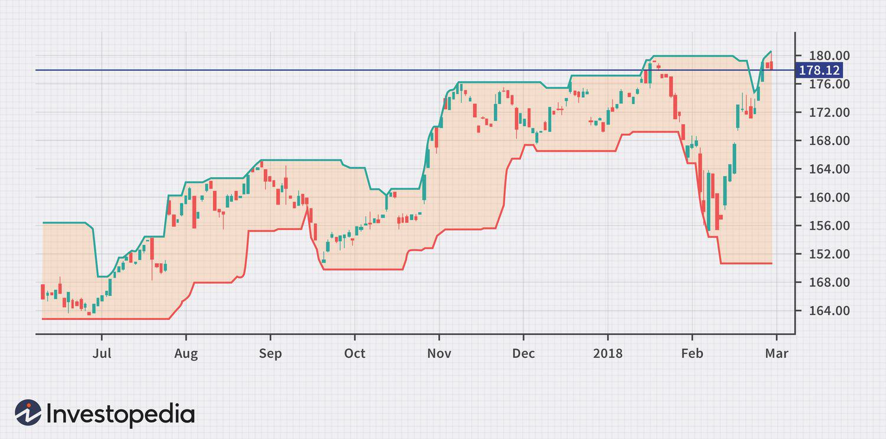

Technical analysis is a cornerstone in the trading world, offering a systematic approach to evaluating securities by analyzing statistical trends gathered from trading activity, such as price movement and volume. The significance of technical analysis lies in its ability to provide traders with tools to interpret market dynamics and predict future price movements. This predictive power is crucial as it aids traders in decision-making processes, thus potentially enhancing profitability and risk management.

One notable technical indicator within the array of tools available is the Donchian Channels, named after its creator, Richard Donchian. This indicator is instrumental in determining market trends and assessing volatility. Donchian Channels represent the highest high and the lowest low over a specified period, forming an envelope around the price. By doing so, they allow traders to identify potential buy and sell signals based on the breach of these boundaries. This ability to depict price trends makes Donchian Channels an invaluable tool in the technical analyst's toolkit.



This article intends to explore Donchian Channels with a focus on their application in algorithmic trading. Algorithmic trading involves the use of algorithms to automate trading decisions, executing orders and transactions at speeds beyond human capabilities. By integrating Donchian Channels into such automated systems, traders can potentially enhance their strategies, optimizing for trend-following or breakout systems. The discussion will extend to understanding how to leverage Donchian Channels alongside other indicators, the development of algorithmic trading strategies utilizing Donchian Channels, and the understanding of their limitations. Through this exploration, traders and investors can gain insights into maximizing the effectiveness of Donchian Channels in a systematic and algorithmic trading environment.

## Table of Contents

## What are Donchian Channels?

Donchian Channels are a type of technical analysis indicator used primarily in trading to gauge the volatility of a market and identify potential breakout points. Developed by Richard Donchian, a pioneer in the field of technical trading systems, Donchian Channels provide traders with a dynamic visualization of support and resistance levels over a specified period.

Richard Donchian, often referred to as the father of trend following, introduced these channels as part of his broader efforts to systematize trading strategies. Donchian's work laid the foundation for modern systematic trading, emphasizing the importance of rules-based trading approaches. Donchian Channels became popular as traders sought more systematic ways to identify trends and make informed trading decisions.

The construction of Donchian Channels involves three primary components: the upper band, the lower band, and a median line, typically plotted over a predetermined number of days. The calculation for Donchian Channels is straightforward. The upper band represents the highest high over a specific period, while the lower band represents the lowest low over the same period. The middle line is often calculated as the average of the upper and lower bands, although it's not fundamental to the channel itself:

- Upper Band = Highest High over n periods
- Lower Band = Lowest Low over n periods
- Middle Line (optional) = (Upper Band + Lower Band) / 2

Traders can specify the period for these calculations, commonly using a 20-day period, though this can be adjusted based on market conditions or individual trading strategies. The choice of period affects the sensitivity of the channels; a shorter period results in channels that more closely track price movements, whereas a longer period smoothens the channels' response to [volatility](/wiki/volatility-trading-strategies).

In practical terms, Donchian Channels can signal potential trade opportunities. When the price breaches the upper band, it often indicates a bullish [breakout](/wiki/breakout-trading) and may signal a potential buy opportunity. Conversely, a breach of the lower band can suggest a bearish breakout, indicating a potential sell opportunity. As such, Donchian Channels play a crucial role in identifying trends and aiding traders in making data-driven decisions.

## Using Donchian Channels in Trading

Donchian Channels are a valuable tool in technical analysis for identifying trends and assessing market volatility. By analyzing price data over a specific period, these channels provide clear visual indicators of market conditions, offering traders the ability to make informed decisions. 

Donchian Channels consist of three lines: the upper band, the lower band, and the median line. The upper band marks the highest high over a selected time frame, while the lower band shows the lowest low. The median line is computed as the average of the upper and lower bands, providing a reference point within the channel.

To calculate Donchian Channels, the following steps are performed:

1. Determine the highest high over the desired period, $n$:
$$
   \text{Upper Band} = \max(\text{High}_t) \quad \text{for} \quad t = 1 \text{ to } n

$$

2. Determine the lowest low over the same period:
$$
   \text{Lower Band} = \min(\text{Low}_t) \quad \text{for} \quad t = 1 \text{ to } n

$$

3. Calculate the median line:
$$
   \text{Median Line} = \frac{\text{Upper Band} + \text{Lower Band}}{2}

$$

### Identification of Trends and Volatility

Donchian Channels excel at trend identification, as the widening or narrowing of the channels can signal changes in market volatility. A consistent match between price movement and the direction indicated by the channels often implies a strong trend. During upward trends, prices tend to hover near or break the upper band, whereas downward trends are confirmed when prices are near or fall below the lower band.

### Detecting Breakouts and Reversals

Breakouts and reversals are significant trading opportunities identified using Donchian Channels. A breakout occurs when the price crosses above the upper band or below the lower band, suggesting a potential start of a new trend. Conversely, reversals can be anticipated when prices retreat from the extremities of the channel, moving back towards the median line.

Python pseudo-code for identifying breakouts might look like this:

```python
import pandas as pd

def detect_breakouts(prices, upper_band, lower_band):
    breakouts = []
    for i in range(1, len(prices)):
        if prices[i] > upper_band[i-1]:
            breakouts.append((i, 'Bullish Breakout'))
        elif prices[i] < lower_band[i-1]:
            breakouts.append((i, 'Bearish Breakout'))
    return breakouts

# Example usage with price data
prices = pd.Series([...])  # fill in with actual price data
upper_band = pd.Series([...])
lower_band = pd.Series([...])

breakouts = detect_breakouts(prices, upper_band, lower_band)
```

### Advantage of Visualizing Price Action

Visualizing price action through Donchian Channels provides traders with an intuitive understanding of market dynamics. Channels assist in setting stop-loss levels and identifying areas of support and resistance. This visualization reduces noise and enables traders to focus on significant price movements rather than insignificant fluctuations, offering a clear strategy for decision-making.

In summary, employing Donchian Channels in trading helps traders understand and capitalize on market trends, volatility shifts, and breakout events. The seamless visualization of price action offered by these channels makes them an indispensable tool for efficient and profitable trading strategies.

## Algorithmic Trading strategies with Donchian Channels

Algorithmic trading leverages computer programs to execute trades based on predefined rules, minimizing human intervention and emotional decision-making. This method offers several benefits, including speed, efficiency, and the ability to process complex strategies over vast datasets. By automating trading processes, it allows for testing various strategies under historical data conditions through [backtesting](/wiki/backtesting).

Donchian Channels can be seamlessly integrated into [algorithmic trading](/wiki/algorithmic-trading) systems, aiding in decision-making processes for entry and [exit](/wiki/exit-strategy) strategies. These channels, which consist of the highest high and the lowest low over a specified period, help traders identify significant market trends and potential breakout points. Their adaptability to different market conditions makes them an essential tool in algorithmic strategies.

### Integrating Donchian Channels

To incorporate Donchian Channels into an algorithmic trading system, traders typically calculate the upper channel, lower channel, and the median or central line. The channels can be defined as:

- Upper Channel: $\text{UC} = \max(\text{High}_n)$
- Lower Channel: $\text{LC} = \min(\text{Low}_n)$

where $n$ is the number of periods over which the channel is calculated.

Python is a favored language for implementing these strategies due to its vast libraries supporting financial data manipulation and analysis. A basic outline of calculating Donchian Channels using Python can be set up with libraries like `pandas`:

```python
import pandas as pd

def calculate_donchian_channel(data, period):
    data['Upper_Channel'] = data['High'].rolling(window=period).max()
    data['Lower_Channel'] = data['Low'].rolling(window=period).min()
    data['Median'] = (data['Upper_Channel'] + data['Lower_Channel']) / 2
    return data
```

### Strategies with Donchian Channels

1. **Breakout Strategy**: This strategy exploits volatile market movements by tracking price breakouts beyond the Donchian Channel. A buy signal is generated when the price closes above the upper channel, while a sell signal occurs when the price closes below the lower channel. This approach is particularly effective in volatile or trending markets. 

2. **Reversal Strategy**: This involves identifying points where the price reverts back to the mean or moves back inside the channel after exceeding it. A sell signal might be triggered when the price touches or exceeds the upper channel and then moves back down, indicating a potential end to an upward trend.

3. **Trend-Following Strategy**: This strategy focuses on entering trades in the direction of the current trend, confirmed by Donchian Channels. If the price is consistently near the upper channel, it indicates a strong uptrend, suggesting buy opportunities. Conversely, prices near the lower channel imply a downtrend, pointing towards selling opportunities.

These strategies can be integrated into more comprehensive automated trading systems, combined with additional indicators for robustness. The adaptability of Donchian Channels to different strategies makes them valuable for diverse algorithmic trading approaches. Through backtesting, traders can optimize the channels' look-back periods and refine exit strategies to align with market conditions and risk tolerance levels.

## Donchian Channels vs Other Technical Indicators

Donchian Channels are a valuable tool for traders, but it is important to understand how they compare and complement other technical indicators like Bollinger Bands and Keltner Channels.

**Donchian Channels vs. Bollinger Bands**

Donchian Channels and Bollinger Bands are both used to gauge market volatility and identify potential breakout points, yet they do so through different methodologies. Donchian Channels are established by computing the highest high and the lowest low over a set period, typically 20 days. This results in a channel that accommodates price range and market volatility. Bollinger Bands, on the other hand, consist of three lines: a simple moving average (SMA) and two standard deviation lines above and below this SMA. The core difference arises from the variability in the calculation: while Bollinger Bands incorporate price volatility directly by adjusting dynamically with the standard deviation, Donchian Channels remain more static, reacting only to changes in price highs and lows.

An advantage of Bollinger Bands is their ability to contract and widen with volatility, offering a clearer visual cue of market conditions. However, Donchian Channels can provide clearer signals for breakout strategies as they focus solely on price extremes. Traders often use Bollinger Bands to identify periods of high volatility, while Donchian Channels are more effective in trending markets.

**Donchian Channels vs. Keltner Channels**

Both Donchian Channels and Keltner Channels serve to identify trends and price breakouts, but Keltner Channels do so with a more adaptive approach. Keltner Channels consist of an exponential moving average (EMA) as the central line, with an upper and lower band derived from the Average True Range (ATR). This introduces a volatility component similar to Bollinger Bands, but with a smoother response due to the EMA.

The distinctions between these channels lie primarily in their handling of volatility. Keltner Channels adapt more responsively to short-term changes in market conditions due to the ATR, providing a more consistent range for mean reversion strategies. Conversely, Donchian Channels might offer clearer breakout signals, particularly in strongly trending markets, where the historical extremes are more indicative of underlying [momentum](/wiki/momentum).

**Complementary Use of Donchian Channels with Other Indicators**

Incorporating Donchian Channels with additional indicators can enhance trading strategies. For instance, combining them with momentum indicators such as the Relative Strength Index (RSI) or Moving Average Convergence Divergence (MACD) can enrich the data set traders rely upon. While Donchian Channels indicate breakout potential through historical price levels, momentum indicators confirm whether there is the buying or selling strength to push beyond those levels.

Furthermore, pairing Donchian Channels with trend indicators like moving averages can provide a dual confirmation approach, ensuring that breakouts align with broader market trends. This comprehensive analysis mitigates the risk of false breakouts by corroborating price movements with momentum and trends. By leveraging multiple indicators, traders can develop robust strategies that balance sensitivity and specificity in their market analysis.

## Limitations and Considerations

When using Donchian Channels in trading, it is essential to recognize that relying solely on this indicator can present certain limitations. One of the primary drawbacks is that Donchian Channels, like many trend-following indicators, may produce lagging signals due to their reliance on historical data. This lag can result in delayed entry and exit points, potentially causing traders to miss optimal trading opportunities or incur losses during rapidly changing market conditions.

The channels are constructed based on the highest high and the lowest low over a specific period, and hence, during sideways or non-trending markets, they may generate frequent whipsaw signals. Whipsaws occur when a market moves erratically around the channel boundaries, triggering false breakouts. Consequently, using Donchian Channels in isolation can lead to overtrading and increased transaction costs without yielding significant profits.

To optimize the effectiveness of Donchian Channels, it is crucial to identify market conditions under which they perform best. These channels are most effective during strongly trending markets where clear upward or downward movements are prevalent. In such scenarios, Donchian Channels can adeptly highlight breakouts and help in capturing sustained trends.

Mitigating risks associated with Donchian Channels involves integrating them with other technical indicators or trading tools. For example, combining Donchian Channels with momentum indicators like the Relative Strength Index (RSI) or Moving Average Convergence Divergence (MACD) can provide additional confirmation of trend strength and potential reversals. This complementary analysis can help filter out false signals and enhance decision-making.

Furthermore, traders can incorporate sound risk management practices such as setting appropriate stop-loss orders and position sizing to minimize potential losses. Backtesting strategies using historical data is also a prudent step to evaluate the reliability and performance of Donchian Channels under various market conditions. By analyzing past performance, traders can tweak the parameters, such as the channel period, to better align with current trading objectives and market environments.

In summary, while Donchian Channels offer valuable insights into market trends and volatility, acknowledging their limitations and employing risk mitigation strategies is key to harnessing their full potential in successful trading strategies.

## Conclusion

Donchian Channels have proved to be a significant asset in the toolkit of traders, particularly within the domain of algorithmic trading. Their primary benefit lies in their ability to effectively identify trends, volatility, and potential price breakouts. By encapsulating price movements within an upper and a lower band based on recent highs and lows, they offer a visual representation of market dynamics, which can aid traders in making informed decisions. As a result, Donchian Channels are utilized for a range of strategies, including breakout and trend-following strategies.

Testing and optimizing trading strategies through backtesting is crucial for traders employing Donchian Channels. Backtesting allows traders to simulate trades against historical data, helping to refine strategies and gain insights into their performance and potential profitability. By using tools such as Python, traders can write scripts to automate backtesting processes. For instance:

```python
import pandas as pd

def calculate_donchian_channels(data, period):
    data['Upper_Band'] = data['High'].rolling(window=period).max()
    data['Lower_Band'] = data['Low'].rolling(window=period).min()
    return data

# Load your dataset
data = pd.read_csv('market_data.csv')

# Define the period for the Donchian Channels
period = 20

# Calculate Donchian Channels
donchian_data = calculate_donchian_channels(data, period)

# Visual inspection and further analysis follow
```

Finally, Donchian Channels should not be the sole indicator in a trading strategy; they work best when complemented with other technical indicators or [fundamental analysis](/wiki/fundamental-analysis). By integrating Donchian Channels with other tools, traders can enhance their strategies' robustness and reliability.

In conclusion, incorporating Donchian Channels into trading strategies provides traders with a structural methodology to capitalize on market movements. Through diligent testing and the application of multiple layers of analysis, traders can harness the full potential of this indicator to formulate successful trading strategies.

## References & Further Reading

[1]: Bok, V. (2005). ["Technical Analysis of the Financial Markets: A Comprehensive Guide to Trading Methods and Applications"](https://www.amazon.com/Technical-Analysis-Financial-Markets-Comprehensive/dp/0735200661) by John J. Murphy.

[2]: Peng, Z., & Zhang, W. (2014). ["An Empirical Study of Donchian Channel Breakout Trading Strategy in China’s Financial Futures Market"](https://www.jstor.org/stable/27292640). Procedia Computer Science.

[3]: Kaufman, P. J. (2013). ["Trading Systems and Methods"](https://onlinelibrary.wiley.com/doi/book/10.1002/9781119202561). Wiley.

[4]: Lee, C. (2009). ["Trend Following: Learn to Make Millions in Up or Down Markets"](https://books.google.com/books/about/Trend_Following.html?id=KqnfBQAAQBAJ) by Michael W. Covel.

[5]: Chan, E. P. (2017). ["Algorithmic Trading: Winning Strategies and Their Rationale"](https://github.com/ftvision/quant_trading_echan_book) by Ernie Chan.