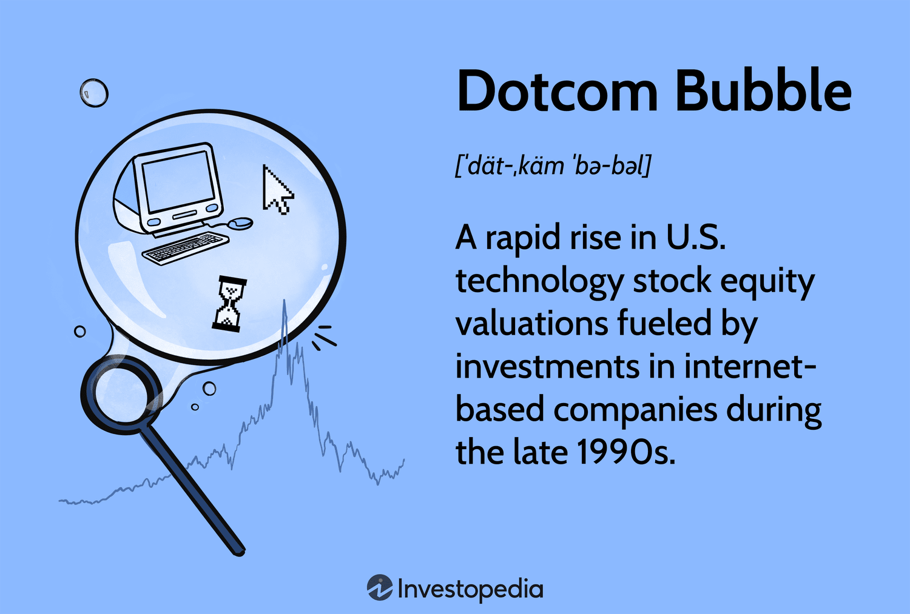

The landscapes of technology, finance, and investing have undergone significant transformations over the past few decades. These fields have become increasingly intertwined due to the confluence of rapid technological advancements, speculative investment behavior, and modern trading mechanisms. This intersection has given rise to notable historical events, such as the dotcom bubble, the internet boom, and the emergence of algorithmic trading, which have each left a lasting impact on markets worldwide.

The dotcom bubble, which emerged in the mid-1990s and burst in the early 2000s, marked an era of unprecedented speculation around internet-based companies. Investors were driven by the potential of new technologies without adequate focus on sound business models or profitability. When the bubble burst, it led to significant financial losses and reshaped perceptions of value in the technology sector. Despite the crash, the subsequent internet boom paved the way for technological evolution, heralding a new era of digital economies that fundamentally altered global commerce and connectivity.



In recent years, the rise of algorithmic trading has further transformed financial markets. Utilizing complex algorithms and vast computational power, this modern strategy enables traders to execute large volumes of trades swiftly and with precision. It underscores the increasing reliance on technology in the financial sector, introducing significant benefits while also posing new risks to market stability.

This article explores how these phenomena have shaped current markets, examining the causes and effects of the early 2000s tech crash, the internet-fueled economic growth that followed, and the sophisticated strategies employed in today's algorithmic trading. By understanding these elements, we gain insights into the continually evolving nature of the technology market, offering valuable lessons for navigating future challenges.

## Table of Contents

## The Dotcom Bubble: A Cautionary Tale

The dotcom bubble, spanning from the mid-1990s to the early 2000s, serves as a pivotal period in the history of financial markets, highlighting the exuberance and pitfalls of speculative investing. This era was marked by an unprecedented rise in the equity valuations of internet-based companies, fueled largely by speculative investment behavior and an influx of venture capital with little regard for the traditional financial metrics of profitability and cash flow.

During this period, companies that appended '.com' to their names experienced stock price surges without having established viable or sustainable business models. The optimism surrounding the transformative potential of the internet led investors to overlook fundamental business realities. Many firms promised future profits, leveraging the massive hype around the internet, yet lacked coherent strategies to achieve profitability.

One of the central drivers of the dotcom bubble was speculative investing, where investors placed bets on future growth rather than present earnings. This speculation was largely based on the belief that internet companies could redefine traditional business practices, attract vast digital audiences, and, consequently, generate significant revenue streams. This sentiment was reinforced by the abundant availability of venture capital. Investors sought to capitalize on the perceived endless potential of online markets, often providing substantial capital infusions to startups without clear paths to monetization.

The bubble's eventual burst resulted in substantial financial losses and the dissolution of many startups. As market realities set in, there was a dramatic revaluation of tech stocks, leading to sharp declines in stock prices and the collapse of numerous internet ventures. High-profile failures during this period included notable companies such as Pets.com and Webvan, whose unsustainable business models could not survive the scrutiny of investors seeking tangible returns.

In retrospect, the dotcom bubble yields several critical insights for modern investors and businesses. One of the most valuable takeaways is the necessity of conducting thorough due diligence before investing in speculative ventures. A focus on developing sustainable business practices and generating long-term value is crucial, as short-term speculative gains can often be misleading. Companies that survived and thrived post-bubble, such as Amazon, demonstrated the importance of adaptability and a clear focus on achieving profitability and scale. The lessons learned from this cautionary tale stress the importance of balancing innovation with fiscal responsibility and strategic planning to mitigate future speculative risks.

## The Internet Boom: A New Era of Growth

Despite the financial upheaval sparked by the dotcom crash, the [momentum](/wiki/momentum) of the internet revolution persisted, ushering in a transformative era for the digital economy. Companies such as Amazon and eBay not only survived the turmoil but also evolved, setting the foundation for the global tech giants we recognize today. Their resilience during this period laid the groundwork for innovations that would reshape traditional business models and consumer interactions.

The advent of the internet brought profound changes to how businesses operate, altering consumer behavior on a global scale. Before this era, commercial transactions and communications were confined to more conventional, slower methods. However, the internet introduced unprecedented levels of connectivity and efficiency. This innovation was not limited to merely speeding up existing processes; it fundamentally altered the nature of global commerce and business strategies.

In the aftermath of the dotcom bubble burst, there was a significant shift in focus towards genuine technology adoption and innovation, as well as the development of scalable business models. Firms began prioritizing sustainable growth and profitability over speculative ventures. This redirection led to the rise of e-commerce, demonstrating how digital platforms could effectively serve consumers' needs, thus dominating the retail landscape.

Notably, digital advertising emerged as a powerful tool, leveraging data analytics to better target consumer interests and behaviors. Companies could now engage directly with their audiences more effectively, optimizing marketing strategies and reducing overhead costs associated with traditional advertising mediums. This shift signified a pivotal moment in the evolution of advertising and established the framework for data-driven marketing seen today.

The lessons learned from the failures of the dotcom bubble were instrumental. Businesses began focusing on building robust, innovative structures that emphasized profitability and adaptation. These strategies paved the way for the emergence of sectors such as fintech and cloud computing, which have revolutionized financial services and information technology infrastructures. Fintech, for instance, has introduced new financial products and services, enhancing accessibility and reducing transaction costs through technologies like blockchain and peer-to-peer lending.

Similarly, cloud computing has become a cornerstone of modern IT solutions, allowing businesses to deploy applications more rapidly and efficiently, while also providing scalable storage solutions. This technology underpins many of today’s digital transformations, driving efficiencies and fostering innovation across various sectors.

In summary, the Internet Boom heralded a significant shift towards an innovative, interconnected digital economy. The focus on scalability, innovation, and profitability post-bubble has laid a solid foundation for contemporary technological advancements, shaping the tech industry into its current form. This period not only facilitated the rise of digital commerce and advertising but also established new paradigms in technology development and adoption, ensuring continuous growth and evolution in the tech landscape.

## Algorithmic Trading: The Technological Edge

Algorithmic trading has revolutionized the financial markets, leveraging technology to transform trading practices with unmatched speed and efficiency. This evolution finds its roots in the development of complex algorithms and high-speed data analysis, enabling traders to execute extensive volumes of trades rapidly and with precision. The integration of [algorithmic trading](/wiki/algorithmic-trading) into financial markets has been so profound that it now accounts for a significant portion of trading volumes on major exchanges worldwide.

The foundation of algorithmic trading lies in its ability to utilize mathematical models to make trading decisions, often based on real-time market data. The goal is to identify profitable opportunities and execute trades faster than human traders can. A typical algorithmic strategy might involve the implementation of mean-reversion, [arbitrage](/wiki/arbitrage) opportunities, or trend-following models to capture market inefficiencies. For instance, a simple moving average crossover strategy could be coded in Python as follows:

```python
def moving_average_strategy(prices, short_window=10, long_window=50):
    short_ma = prices.rolling(window=short_window, min_periods=1).mean()
    long_ma = prices.rolling(window=long_window, min_periods=1).mean()

    buy_signals = (short_ma > long_ma).astype(int)
    sell_signals = (short_ma < long_ma).astype(int)

    return buy_signals, sell_signals
```

This strategy generates buy and sell signals based on the intersection of moving averages of different durations, enabling algorithmic traders to optimize entry and [exit](/wiki/exit-strategy) points.

Advancements in [artificial intelligence](/wiki/ai-artificial-intelligence) (AI) and [machine learning](/wiki/machine-learning) (ML) have further propelled the capabilities of trading algorithms. These technologies provide robust predictive analytics, enhancing the ability to forecast stock movements and automate decision-making processes. Machine learning algorithms can analyze vast datasets to detect patterns and trends, adjusting trading strategies dynamically.

Despite the advantages, algorithmic trading introduces new challenges and risks. Flash crashes, such as the event on May 6, 2010, illustrate the potential [volatility](/wiki/volatility-trading-strategies) induced by algorithms executing trades en masse in fractions of a second. Additionally, ethical concerns regarding market manipulation have emerged, with instances of spoofing—where traders place orders they intend to cancel to influence market prices—resulting in tighter regulatory scrutiny.

In conclusion, while algorithmic trading has delivered substantial benefits, such as increased market efficiency and [liquidity](/wiki/liquidity-risk-premium), it necessitates a balanced approach to regulation and oversight to mitigate risks and ensure market integrity. As technology progresses, ongoing adaptation will be essential in harnessing the full potential of algorithmic trading while safeguarding against its inherent challenges.

## The Lessons Learned and Future Implications

The history of the dotcom bubble provides critical lessons for contemporary investors, particularly in emerging technology markets such as artificial intelligence (AI) and cryptocurrencies. The early 2000s tech crash underscored the dangers of speculative investment behavior, highlighting the importance of prudent investing practices and a focus on company fundamentals. 

For instance, due diligence and a comprehensive understanding of a company's business model, financial health, and growth prospects are imperative to avoid overvaluation based solely on market hype. Learning from past mistakes, investors today are urged to prioritize sustainable business practices and long-term value creation over short-term speculative gains. This shift in focus can help prevent future bubbles, particularly in volatile sectors like AI and crypto, where market dynamics and underlying technologies are rapidly evolving.

Risk management also plays a pivotal role in this context. By employing strategies such as diversification, hedging, and stop-loss orders, investors can mitigate potential losses in unstable markets. This approach aligns with the post-dotcom growth model, which emphasizes the importance of sustainability. Investor education and robust regulatory frameworks further support this model, ensuring that both individual and institutional investors make informed decisions while navigating complex market environments.

The rise of algorithmic trading presents new challenges and opportunities for modern financial markets. As these technologies become integral to trading operations, regulatory bodies must evolve to address associated risks, such as flash crashes and potential market manipulation. Ensuring that regulations keep pace with technological advancements is crucial to maintaining market integrity and protecting investors.

Ultimately, the future of technology investments will hinge on a balanced approach that marries innovation with caution. Embracing cutting-edge technologies while maintaining a vigilant eye on financial fundamentals will be key to achieving long-term growth and stability. By integrating the lessons of the past with an adaptable investment strategy, stakeholders can better navigate the risks and rewards associated with the ever-changing technology landscape.

## Conclusion

The technology sector's history is marked by its remarkable resilience, despite facing significant disruptions such as the tech crashes of the early 2000s. The transition from these events to today's advancements exemplifies the sector's adaptability and enduring innovation. The interplay between historical events like the dotcom bubble and the internet boom with contemporary trading technologies like algorithmic trading highlights the dynamic nature of market evolution and future potential.

Entrepreneurs, investors, and policymakers have essential roles in navigating these changes. Entrepreneurs are at the forefront, driving innovation and creating new business models that reflect lessons learned from past challenges. Investors are tasked with the prudent allocation of capital, informed by a deep understanding of market fundamentals and historical trends. Meanwhile, policymakers must craft regulatory frameworks that balance encouragement of innovation with the protection of market integrity, ensuring that new technologies do not repeat past errors.

As the sector advances, integrating past lessons with modern technology becomes crucial. Learning from events such as the dotcom bubble teaches the importance of sustainable business practices, robust risk management, and careful speculation. This integration will be key to fostering sustainable growth, balancing the excitement of new technologies against the need for caution to avoid speculative bubbles. Thus, a tech-driven future promises continuous evolution, with a focus on long-term stability and growth.

## References & Further Reading

[1]: Cassidy, J. (2002). ["Dot.con: The Greatest Story Ever Sold"](https://archive.org/details/dotcongreatestst0000cass) HarperCollins.

[2]: Shiller, R. J. (2000). ["Irrational Exuberance"](https://press.princeton.edu/books/paperback/9780691173122/irrational-exuberance) Princeton University Press.

[3]: McMillan, R. (2015). ["The Man Who “Invented” the Internet"](https://www.wired.com/2012/01/computer-password/) Wired.

[4]: Lewis, M. (2014). ["Flash Boys: A Wall Street Revolt"](https://en.wikipedia.org/wiki/Flash_Boys) W. W. Norton & Company.

[5]: Aldridge, I. (2013). ["High-Frequency Trading: A Practical Guide to Algorithmic Strategies and Trading Systems"](https://www.amazon.com/High-Frequency-Trading-Practical-Algorithmic-Strategies/dp/1118343506) Wiley.