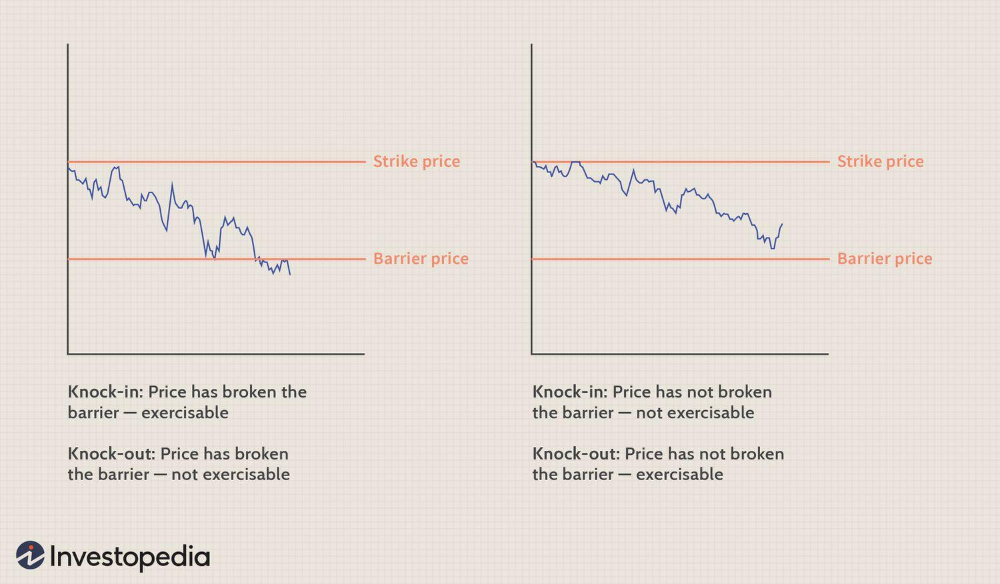

In the world of finance, derivatives are essential tools for creating flexible and personalized investment strategies. Options, a popular type of financial derivative, grant investors the right, but not the obligation, to buy or sell an underlying asset at a predetermined price. Among the different types of options, double barrier options stand out as a captivating category within exotic options. These financial instruments are unique due to their dual trigger points, referred to as barriers, which dictate their activation or deactivation.

Double barrier options are gaining attention for their potential in advanced trading strategies, particularly within algorithmic trading. Algorithmic trading involves the use of computer algorithms to execute trades based on predefined criteria, offering efficiency and precision that can be difficult to achieve manually. This article aims to unravel the complexities associated with double barrier options and examine how they can be effectively traded using sophisticated algorithmic techniques.



The intersection of financial derivatives, options trading, and algorithmic strategies provides both opportunities and challenges for traders. As the financial markets become increasingly complex and data-driven, leveraging these tools can offer significant advantages. However, investors must navigate these complexities wisely, understanding both the opportunities for profit and the risks associated with these advanced financial instruments.

## Table of Contents

## Understanding Financial Derivatives and Options

Financial derivatives are financial instruments whose value is contingent upon an underlying asset, index, or rate. Among these, options represent one of the most prominently used categories. An option provides the investor with the right, though not the mandatory obligation, to purchase (call option) or sell (put option) an underlying asset at a predetermined price, known as the strike price, within a specified time period. This characteristic endows options with the flexibility to serve as both tools for hedging against potential losses and speculative instruments for leveraging expected price movements.

Options can thus be effectively utilized to mitigate risk by locking in prices for purchasing assets, or to capitalize on market volatility by predicting market shifts without committing to asset acquisition unless the market conditions are favorable. This dual function enhances their appeal across various trading strategies in the financial markets.

Double barrier options classify as a sophisticated version of barrier options, which themselves are a subset of options where the payoff depends on whether or not the underlying asset's price reaches a certain level or barrier. Double barrier options involve two critical price levels: an upper barrier and a lower barrier. These barriers dictate the activation (knock-in) or deactivation (knock-out) of the option depending on the price movements of the underlying asset relative to the barriers during the option's life cycle.

The double barrier setup offers a more nuanced payoff structure compared to standard options, effectively influencing the option's validity when the asset price reaches or breaches these defined levels. Traders often resort to double barrier options in scenarios where significant price movement is anticipated within the barrier range or when it is expected that the asset will stay confined within a narrow price band. Such strategic positioning is particularly advantageous in volatile markets where the precision of entry and [exit](/wiki/exit-strategy) points can lead to substantial trading gains.

Grasping the fundamentals of these complex instruments is essential for any trader aiming to enhance their toolkit. Understanding how barriers interact with the option's lifecycle not only aids in selecting the appropriate strategy but also in optimizing potential payoffs while managing risks effectively. Thus, incorporating barrier options into one's trading strategy requires a thorough comprehension of both their mechanical aspects and the market dynamics that influence their behavior.

## What Are Double Barrier Options?

Double barrier options are a sophisticated form of financial derivatives featuring two critical price levels, commonly referred to as barriers. These barriers play a pivotal role in determining the activation status of the option—specifically, whether it will be activated, known as a "knock-in," or deactivated, labeled as a "knock-out." In essence, for a knock-in option to become active, the price of the underlying asset must breach one of the designated barriers during the option's lifespan. Conversely, a knock-out option will become void if the asset's price crosses any of these barriers.

Unlike standard options that may include a single barrier, double barrier options are characterized by a more complex payoff structure. This complexity arises from the dual barriers that set a specified price range, thereby introducing more dynamic conditions that influence the option’s validity. The payoff for these options can be organized mathematically as follows:

If a double barrier option is a call option (and similarly for put options), the payoff can be expressed mathematically:

$$
\text{Payoff} = \max(S_t - K, 0)
$$

provided that both barriers have not been breached; $S_t$ represents the underlying asset price at expiration, and $K$ stands for the strike price. If an upper barrier ( $B_u$ ) or a lower barrier ( $B_l$ ) is breached:

$$
S_t > B_u \quad \text{or} \quad S_t < B_l
$$

the option would accordingly either become activated or deactivated based on its specific premise of knock-in or knock-out.

This distinct nature of double barrier options renders them particularly advantageous in scenarios where traders predict substantial price movements of the underlying asset within two price limits or, inversely, relative stability within the specified range. Thus, traders can apply these options as strategic instruments to exploit market fluctuations or maintain positions during periods of high [volatility](/wiki/volatility-trading-strategies).

In summary, grasping the unique features of double barrier options can offer traders nuanced mechanisms to tailor their trading strategies effectively, maximizing potential returns while intelligently managing associated risks.

## Algorithmic Trading in Options Markets

Algorithmic trading employs computer programs to automate the execution of trades, relying on predefined sets of rules to optimize speed and efficiency in the process. In the landscape of options markets, [algorithmic trading](/wiki/algorithmic-trading) techniques are particularly valuable for managing complex strategies, including volatility [arbitrage](/wiki/arbitrage) and dynamic hedging, which require rapid adaptation to market fluctuations.

Volatility arbitrage involves capturing profits from discrepancies between the implied volatility of options and the actual market volatility. Algorithms can utilize statistical models to predict volatility trends and execute trades that capitalize on these differences. By doing so, traders can systematically exploit market inefficiencies and achieve superior returns compared to traditional trading methods.

Dynamic hedging is another complex strategy that benefits significantly from algorithmic execution. This approach requires continuous adjustment of positions in response to changes in option pricing variables, such as delta, gamma, and theta. By utilizing algorithms, traders can hedge their portfolios with precision, maintaining desired exposure levels without the need for constant manual intervention. This enhances efficiency, minimizes the risk of human error, and allows for prompt reaction to market shifts.

Algorithms offer capabilities for real-time market analysis and order execution, enabling traders to respond swiftly to emerging opportunities and threats. This adaptability is crucial in ensuring that trading strategies are consistent with the latest market conditions. By processing vast amounts of data and executing trades at high speed, algorithmic trading facilitates timely and informed decision-making, crucial for optimizing trading outcomes.

The incorporation of algorithmic trading in options markets also streamlines the investment process, contributing to more consistent and objective decision-making. It reduces the influence of human biases and operational errors, which often lead to suboptimal trading results. By utilizing quantitative models and a disciplined approach, algorithmic trading fosters an environment where investment decisions are driven by empirical data and rigorous analysis rather than intuition or emotion.

Understanding the role of algorithmic trading in options markets allows traders to enhance their investment processes significantly. The potential for improved trading outcomes is considerable, as algorithms can help traders more effectively manage risk and maximize returns. As financial technology continues to advance, the strategic use of algorithmic trading techniques will likely remain a key differentiator for successful market participants.

## The Synergy Between Double Barrier Options and Algo Trading

Double barrier options present a unique opportunity for traders who employ algorithmic strategies. Their intricate payoff structures, which depend on the asset price crossing one or both barrier levels, are ideally suited for algorithm-driven trading systems. With algorithms, traders can dynamically adjust positions to respond in real-time to the occurrence or non-occurrence of barrier events. This dynamism is critical in taking advantage of market volatility and price movements, which are central to the double barrier option's payoff mechanism.

Algorithms can be programmed to optimize several parameters such as barrier placement, strike price, and expiration dates. For instance, a Python-based algorithm could assess historical price data to determine optimal barrier levels that maximize the option's potential payoff under given market conditions. This optimization can be expressed as a parameter tuning problem, often solved using [machine learning](/wiki/machine-learning) techniques or optimization algorithms like grid search or genetic algorithms.

```python
import numpy as np
from scipy.optimize import minimize

def option_payoff(S, barriers, strike_price):
    # Example simplistic payoff function
    if barriers[0] < S < barriers[1]:
        return max(S - strike_price, 0)
    else:
        return 0

def optimize_barriers(price_data, strike_price, initial_guess):
    # Objective function to minimize (negative of payoff in this case)
    def objective(barriers):
        payoffs = [option_payoff(price, barriers, strike_price) for price in price_data]
        return -np.mean(payoffs)

    # Optimize using initial guesses for barriers
    result = minimize(objective, initial_guess, bounds=[(min(price_data), max(price_data)), (min(price_data), max(price_data))])
    return result.x
```

The automatic adjustments permitted by algorithmic trading provide significant advantages, including the ability to manage multiple trades across various markets simultaneously. This ability is crucial as it enables traders to maintain an efficient and well-diversified portfolio without the limitations of manual trading. The automation also allows traders to execute complex strategies such as adjusting positions in anticipation of market events that may trigger the barrier conditions. 

Harnessing algorithms with double barrier options can lead to sophisticated hedging strategies. For instance, a strategy might involve creating a portfolio of double barrier options and utilizing algorithms to continuously rebalance it according to market signals, thereby protecting against adverse movements while capitalizing on favorable conditions.

Furthermore, algorithmic trading reduces human biases and errors, ensuring that strategies are executed as planned without deviation due to emotional decision-making. This characteristic is especially important when dealing with exotic options like double barriers, where miscalculations or delays can lead to significant financial impact.

In conclusion, the synergy between double barrier options and algorithmic trading offers a powerful combination for advanced trading strategies. By leveraging technological solutions, traders can navigate the complexities of exotic derivatives with precision and confidence, ultimately enhancing their ability to hedge risks and seek speculative opportunities in the market.

## Risk Management in Algo Trading of Double Barrier Options

Trading double barrier options involves significant risk, primarily due to the exotic nature of these derivatives. Managing these risks effectively is crucial for traders, especially when these options are part of algorithmic trading strategies. Double barrier options possess unique characteristics that require sophisticated risk management strategies to mitigate potential losses and ensure adherence to pre-defined risk criteria.

Algorithmic safeguards play a pivotal role in managing these risks. Algorithms can automate various aspects of risk management, offering precise control over trading decisions. By implementing stop-loss limits, traders can ensure that positions are automatically exited once a certain loss threshold is reached, thereby protecting the portfolio from larger, unexpected downturns. Dynamic hedging strategies further enhance risk management by adjusting positions in response to market movements, maintaining a balanced exposure that aligns with the trader’s risk tolerance.

Back-testing algorithms under historical market conditions is a fundamental strategy in risk management. This approach allows traders to evaluate the potential performance of their algorithms across different market scenarios, identifying weaknesses and fine-tuning strategies before deploying them in live markets. By replicating past market environments, traders can gain insights into how their algorithms might perform during similar future conditions.

Simulated trading environments, often referred to as paper trading, are invaluable in testing and refining strategies without financial risk. These platforms provide a risk-free space for traders to experiment with different parameters and scenarios, enabling them to perfect their strategies and improve their algorithm's robustness before going live.

Volatility adjustments are another critical aspect of risk management in the trading of double barrier options. Options are inherently sensitive to volatility changes, and sudden spikes or drops in volatility can significantly impact their value. Algorithms can be designed to monitor real-time market volatility and adjust trading strategies accordingly. This proactive approach helps in maintaining the anticipated risk-return profile and avoiding unexpected portfolio fluctuations.

Here's an example of a simple algorithm in Python that demonstrates the use of stop-loss limits and dynamic hedging for double barrier options:

```python
import numpy as np

# Parameters
initial_position = 100
stop_loss_limit = -0.05  # 5% loss
vol_threshold = 0.2  # Historical volatility threshold

# Simulated market data
price_changes = np.random.randn(1000) * 0.01  # Normal distribution of price changes

position = initial_position
for price_change in price_changes:
    # Adjust position based on volatility
    current_volatility = np.std(price_changes)
    if current_volatility > vol_threshold:
        position *= 0.9  # Reduce exposure by 10%

    # Calculate new portfolio value
    position += position * price_change

    # Implement stop-loss
    if position < initial_position * (1 + stop_loss_limit):
        print(f"Stop-loss triggered. Exiting position at {position}")
        break

print(f"Final position value: {position}")
```

In this code, the algorithm starts with an initial position and adjusts it based on real-time volatility. If the portfolio value drops below a certain threshold (triggering the stop-loss), the position is exited to prevent further losses.

Being proactive about risk management is essential in options trading. By leveraging algorithmic tools and methodologies, traders can safeguard against catastrophic losses while fully embracing the potential benefits of trading double barrier options. Understanding these principles and intelligently applying them in algorithmic strategies allows for a more resilient and successful trading approach.

## Conclusion

The dynamic fields of financial derivatives, option trading, and algorithmic trading are increasingly interconnected, creating innovative opportunities within the financial markets. Among these, double barrier options stand out as a promising tool for traders seeking to exploit inefficiencies and optimize investment outcomes. By defining two distinct price levels, or barriers, these exotic options add complexity to the trading process, offering unique payoff structures that can be advantageous when leveraged correctly.

The integration of algorithmic techniques is pivotal in harnessing the potential of double barrier options. Algorithms can be employed to systematically monitor and respond to market conditions, adjusting trading strategies in real-time to align with pre-set objectives. This advanced approach not only enhances the precision of option trading strategies but also offers a higher degree of scalability and efficiency. Traders can automate processes such as barrier placement, strike price selection, and expiration timing, allowing them to efficiently manage multiple transactions across diverse markets.

An essential aspect of a robust trading framework is risk management. Given the intricate nature of double barrier options, careful consideration of risk and meticulous back-testing are critical. Back-testing involves simulating trading strategies against historical data to understand potential outcomes and refine approaches. This helps in establishing safeguards that curb potential losses while maintaining engagement with the dynamic opportunities available. Incorporating tools like stop-loss limits and volatility adjustments further strengthens risk management efforts, assisting traders in avoiding substantial losses.

As the financial landscape evolves, staying ahead of technological advancements in trading practices is crucial. Embracing cutting-edge tools and methodologies will be key for traders aiming to achieve sustained success. By leveraging the synergy between double barrier options and algorithmic trading, market participants can not only navigate but also capitalize on the complexities and opportunities presented by modern financial markets.

## References & Further Reading

[1]: Bergstra, J., Bardenet, R., Bengio, Y., & Kégl, B. (2011). ["Algorithms for Hyper-Parameter Optimization."](https://dl.acm.org/doi/10.5555/2986459.2986743) Advances in Neural Information Processing Systems 24.

[2]: ["Advances in Financial Machine Learning"](https://www.amazon.com/Advances-Financial-Machine-Learning-Marcos/dp/1119482089) by Marcos Lopez de Prado

[3]: ["Evidence-Based Technical Analysis: Applying the Scientific Method and Statistical Inference to Trading Signals"](https://www.amazon.com/Evidence-Based-Technical-Analysis-Scientific-Statistical/dp/0470008741) by David Aronson

[4]: ["Machine Learning for Algorithmic Trading"](https://github.com/stefan-jansen/machine-learning-for-trading) by Stefan Jansen

[5]: ["Quantitative Trading: How to Build Your Own Algorithmic Trading Business"](https://www.amazon.com/Quantitative-Trading-Build-Algorithmic-Business/dp/1119800064) by Ernest P. Chan