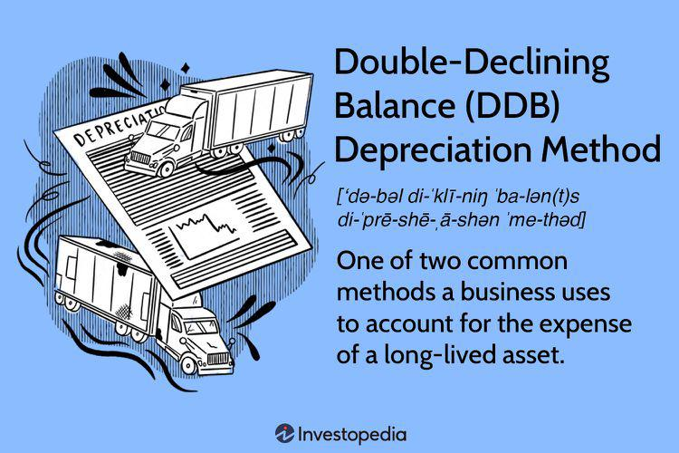

The Double-Declining Balance (DDB) depreciation method is an accelerated depreciation technique widely used in accounting. It is especially advantageous for businesses that aim to recognize higher depreciation expenses in the initial years of an asset's useful life. This approach allows companies to align depreciation expenses more closely with the asset's actual value consumption, offering a more precise reflection of its financial wear and tear. The DDB method is distinct for its rapid depreciation rate, typically twice as fast as that of traditional straight-line methods. 

The primary formula for calculating DDB depreciation is:



$$
\text{Depreciation} = 2 \times (\text{Straight-Line Depreciation Rate}) \times \text{Book Value}
$$

This formula underscores the accelerated nature of the DDB approach by applying a rate that effectively doubles the percentage used in straight-line depreciation, facilitating a steeper depreciation curve.

In addition to its accounting applications, DDB has implications for financial reporting and asset management strategies, particularly in fast-evolving sectors like technology. The ability to account for the swift depreciation of assets proves beneficial for tax purposes, as it can lead to reduced taxable income during the initial years of an asset's operation. Additionally, the method provides a more realistic matching of revenues and expenses, improving financial statement accuracy across reporting periods.

The application of the DDB method also extends to fields like algorithmic trading, where it plays a role in assessing the depreciation of trading assets such as software and hardware. The accelerated depreciation aligns with the rapid technological changes and obsolescence risks inherent in this industry.

As this article will explore, the significance of the double-declining balance method in financial reporting and strategic asset management cannot be overstated, particularly as businesses continue to adopt agile financial practices and technologies.

## Table of Contents

## Understanding the Double-Declining Balance Depreciation Method

The Double-Declining Balance (DDB) depreciation method applies a consistent depreciation rate to an asset's declining book value each year. This technique is particularly beneficial for assets that experience rapid depreciation or become obsolete quickly, allowing for more significant depreciation deductions in the early years. The mathematical formula for calculating DDB depreciation is:

$$
\text{Depreciation} = 2 \times (\text{Straight-Line Depreciation Percent}) \times \text{Book Value}
$$

This approach is preferred in accounting scenarios where a rapid decrease in an asset's value is expected. By emphasizing accelerated depreciation, businesses can align depreciation expenses with the asset's actual consumption and utility over time. This method ensures that the financial representation of assets aligns with their diminishing value, offering an advantageous strategy for managing assets whose utility declines swiftly.

## DDB Formula and its Calculation

The Double-Declining Balance (DDB) depreciation method utilizes a straightforward formula, effectively doubling the straight-line depreciation rate to achieve a more accelerated reduction in an asset's book value. This approach is grounded in applying a consistent depreciation rate to the asset's diminishing book value annually, emphasizing the accelerated nature of DDB.

The DDB formula can be expressed as:

$$
\text{Depreciation Expense} = 2 \times \left( \frac{1}{\text{Useful Life of Asset}} \right) \times \text{Book Value at Beginning of Year}
$$

In this formula, the straight-line depreciation rate is essentially doubled. Depending on the requirements, the multiplier can be adjusted to 150%, 200% (the standard double), or 250% of the straight-line rate to further hasten the depreciation process.

To calculate DDB depreciation, follow these steps:

1. **Determine the Straight-Line Depreciation Rate:**
   The initial straight-line rate is calculated by taking the reciprocal of the asset’s useful life. For example, a 5-year useful life results in a 20% straight-line rate.

2. **Double the Straight-Line Rate:**
   If using the standard double rate, multiply the straight-line rate by 2. For example, a 20% rate becomes 40% when doubled.

3. **Apply the Rate to the Book Value:**
   Each year, apply the doubled rate to the asset's book value at the start of the year. This results in the annual depreciation expense.

Consider a practical example: for an asset with an initial book value of $10,000, a useful life of 5 years, and no salvage value. Applying the DDB method, you initially calculate a straight-line rate of 20% (or 0.2), double it to 40% (or 0.4), and apply it as follows:

```python
initial_value = 10000
depreciation_rate = 0.4  # 40%
book_value = initial_value

for year in range(1, 6):  # For each year
    depreciation = depreciation_rate * book_value
    book_value -= depreciation
    print(f"Year {year}: Depreciation: {depreciation}, Book Value: {book_value:.2f}")
```

This ensures the asset's book value decreases swiftly, potentially larger in earlier years, aligning with how assets like technology and machinery experience rapid depreciation. This method maintains decreasing depreciation expenses over time, continuing until the book value meets its estimated salvage value.

## Application of DDB in Algo Trading

Algorithmic trading, a key component in modern financial markets, often relies on rapid decision-making and precise accounting to maintain competitiveness. The Double-Declining Balance (DDB) depreciation method plays a pivotal role in managing the depreciation of tangible and intangible assets such as trading software and hardware, aligning with the high-speed nature of [algorithmic trading](/wiki/algorithmic-trading) environments. 

Utilizing the DDB method in algorithmic trading helps ensure that the depreciation of trading infrastructure is accurately aligned with the utility and functionality of these assets over time. This approach is particularly beneficial as trading software and equipment can quickly become obsolete due to technological advancements and market demands. By applying a higher depreciation rate in the early years of an asset's life, firms can reflect the rapid decline in asset utility more accurately on their financial statements.

For instance, if a piece of trading software has a useful life of five years and an initial value of $100,000, the straight-line depreciation rate would be 20% per annum. The DDB rate, at 200% of the straight-line, would thus be 40%. Calculating depreciation with this method ensures a faster cost recovery, as shown below:

```python
def calculate_ddb_depreciation(initial_value, life_years, rate=2):
    useful_life_rate = 1 / life_years
    ddb_rate = rate * useful_life_rate
    book_value = initial_value
    depreciation_schedule = []

    for year in range(1, life_years + 1):
        depreciation_expense = book_value * ddb_rate
        book_value -= depreciation_expense
        depreciation_schedule.append(depreciation_expense)

    return depreciation_schedule

# Example use
initial_value = 100000
life_years = 5
depreciation_schedule = calculate_ddb_depreciation(initial_value, life_years)
print(depreciation_schedule)
```

This script calculates the depreciation expense year by year, showing a higher initial deduction that decreases over time. This rapid cost realization benefits algorithmic trading strategies by enabling more informed financial and operational decision-making. If the asset value decreases significantly in the early years—as is common with tech-driven assets—this accounting approach supports prudent financial management and aligns with strategic needs.

Furthermore, the application of DDB within algo trading ensures compliance with fiscal policies, fulfilling regulatory requirements for asset depreciation. Accounting for the depreciation in such a precise manner aids firms in constructing financial statements that truthfully depict economic events, fostering transparency and aiding in regulatory audits. This alignment of depreciation with actual asset utility is crucial in an industry where timely and accurate financial data translates directly into competitive advantage and operational efficiency.

## Benefits of Using the Double-Declining Balance Method

The Double-Declining Balance (DDB) method offers several advantages for businesses looking to align depreciation with the actual consumption of an asset's value over time. One of its primary benefits is in tax management, where it front-loads depreciation expenses. By recognizing higher expenses in the initial years of an asset's life, companies can potentially reduce taxable income during those years, leading to tax savings and improved cash flow.

In industries characterized by rapid technological advancements, the DDB method provides a more accurate reflection of an asset's diminishing value and utility. This is particularly true for technology-related assets that may become obsolete relatively quickly. The accelerated depreciation aligns with the actual pace at which these assets lose value, offering a truer depiction of their financial impact.

Moreover, the DDB method enhances the accuracy of financial reporting by matching expenses with revenues generated over specific periods. This alignment ensures that financial statements accurately reflect the usage and benefit derived from assets, fostering better period-to-period comparability and financial transparency.

Additionally, the DDB method is especially beneficial for assets with high obsolescence risk, such as computer hardware and other technological equipment. By rapidly depreciating these assets, companies can better manage the financial risks associated with technological obsolescence, ensuring that their accounting practices reflect the fast-paced nature of asset utility in such sectors.

Overall, the Double-Declining Balance method serves as an effective tool in various aspects of asset management, tax strategy, and financial reporting, providing businesses with the flexibility to adapt to changing market and technological conditions.

## Conclusion

The Double-Declining Balance (DDB) method serves as an essential tool for businesses that seek accelerated depreciation to meet specific financial goals. Its utility extends far beyond routine accounting tasks, significantly influencing tax strategy by allowing companies to recognize higher depreciation expenses in the early years of an asset's life. This leads to potentially lower taxable income initially, providing strategic tax advantages. Moreover, DDB facilitates robust asset management by aligning depreciation expenses with the actual consumption of an asset's value, thereby delivering clear insights into the asset's utility over time.

In domains such as algorithmic trading, DDB plays a crucial role by offering precise depreciation tracking of software and technology infrastructure. This meticulous tracking bolsters strategic planning, ensuring that the value reduction of assets is mirrored accurately in financial records, which, in turn, assists in compliance with fiscal policies. Such precise tracking can be crucial in fast-paced environments where technological assets rapidly lose value or become obsolete.

As financial environments continue to evolve, grasping the nuances of DDB and its formula will be necessary for making informed financial decisions. This method's accelerated approach, encapsulated in the formula $\text{Depreciation} = 2 \times (\text{Straight-Line Depreciation Percent}) \times \text{Book Value}$, enables businesses to stay agile by reflecting true asset depreciation swiftly. Future trends may witness greater integration of DDB in automated accounting systems and advanced financial technologies, which would facilitate seamless asset management and compliance. Businesses armed with effective strategies for utilizing the DDB method will be better positioned to navigate the complexities of modern financial landscapes.

## References & Further Reading

[1]: ["Accounting for Fixed Assets"](https://finquery.com/blog/fixed-assets-in-accounting-explained-examples/) by Raymond H. Morris

[2]: ["Intermediate Accounting"](https://accountingtestprep.com/intermediate-accounting-2/) by Donald E. Kieso, Jerry J. Weygandt, and Terry D. Warfield

[3]: ["Depreciation: Concepts and Techniques"](https://www.investopedia.com/terms/d/depreciation.asp) by AccountingNotes.net

[4]: ["The Theory and Measurement of Economic Depreciation"](https://www.econ.umd.edu/publication/measurement-economic-depreciation) by John R. Hines Jr. at Journal of Economic Perspectives

[5]: ["Algorithmic Trading and DMA: An introduction to direct access trading strategies"](https://www.amazon.com/Algorithmic-Trading-DMA-introduction-strategies/dp/0956399207) by Barry Johnson

[6]: ["International Accounting Standards"](https://www.iasplus.com/en/standards/ias) by IFRS Foundation

