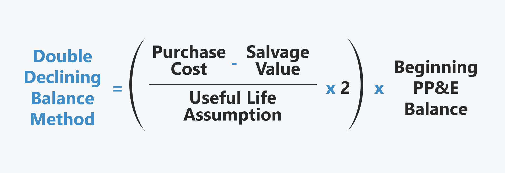

## Table of Contents

## What is the Double-Declining Balance Depreciation Method?

The Double-Declining Balance Depreciation Method is a way to figure out how much an asset loses value over time. It's faster than some other methods because it takes bigger chunks of value away in the early years. You start by finding out what the asset's life is supposed to be. Then, you double the rate you would use in the straight-line method. For example, if an asset's life is 5 years, you'd use a 40% rate instead of the 20% you'd use in the straight-line method.

After you know the rate, you apply it to the asset's remaining value each year, not counting any salvage value until the end. So, if you bought a machine for $10,000 with no salvage value and a 5-year life, you'd take away 40% of $10,000 the first year, which is $4,000. The next year, you'd take 40% of the new value, which is $6,000, so that's $2,400. You keep doing this until the asset's value is down to its salvage value or zero. This method is good for things that lose value quickly at first, like computers or cars.

## How does the Double-Declining Balance Method differ from the Straight-Line Method?

The Double-Declining Balance Method and the Straight-Line Method are two ways to figure out how much an asset loses value over time, but they do it differently. With the Straight-Line Method, you take the same amount of value away from the asset every year until it reaches its salvage value. It's simple and spreads the cost evenly over the asset's life. For example, if you buy a machine for $10,000 with a $1,000 salvage value and a 5-year life, you'd take away $1,800 each year (($10,000 - $1,000) / 5).

On the other hand, the Double-Declining Balance Method takes bigger chunks of value away in the early years and smaller chunks later on. It's based on a rate that's double what you'd use in the Straight-Line Method, but you apply it to the asset's remaining value each year, not counting the salvage value until the end. So, using the same $10,000 machine with a 5-year life, you'd start with a 40% rate (double the 20% you'd use in the Straight-Line Method). The first year, you'd take away $4,000 (40% of $10,000), the second year $2,400 (40% of the new $6,000 value), and so on, until you reach the salvage value or zero. This method is better for things that lose value quickly at first.

## What are the steps to calculate depreciation using the Double-Declining Balance Method?

To calculate depreciation using the Double-Declining Balance Method, you first need to know the asset's cost, its useful life, and its salvage value. The useful life is how long the asset is expected to last, and the salvage value is what the asset will be worth at the end of its life. Start by figuring out the straight-line depreciation rate, which is 1 divided by the useful life. For example, if the useful life is 5 years, the straight-line rate is 1/5 or 20%. Then, double this rate to get the double-declining rate. So, for a 5-year life, the double-declining rate is 40%.

Next, apply the double-declining rate to the asset's book value at the beginning of each year, but don't subtract the salvage value until the end. The book value is the cost of the asset minus any depreciation you've already taken. For the first year, you multiply the asset's cost by the double-declining rate. In the following years, you multiply the remaining book value by the same rate. Keep doing this until the book value is equal to or less than the salvage value. At that point, you stop taking depreciation, or you take just enough to bring the book value down to the salvage value. This method lets you take more depreciation in the early years and less in the later years, which can be good for assets that lose value quickly at first.

## Why might a company choose to use the Double-Declining Balance Method over other methods?

A company might choose the Double-Declining Balance Method because it lets them take more depreciation in the early years of an asset's life. This can be good for things like computers or cars that lose value fast at first. By taking bigger chunks of depreciation early on, a company can lower its taxable income more in the early years, which can save them money on taxes. This method also matches the expense of the asset more closely with the benefits it gives the company, which can make the company's financial statements more accurate.

Another reason a company might pick the Double-Declining Balance Method is that it can help with cash flow. Since the company is paying less in taxes in the early years, it has more cash to use for other things, like growing the business or paying off debts. This can be really helpful for companies that are just starting out or that need to put a lot of money into new projects. So, even though the Double-Declining Balance Method might be a bit harder to figure out than the Straight-Line Method, it can be worth it for the tax savings and better cash flow it can bring.

## What is the formula for the Double-Declining Balance Method?

The formula for the Double-Declining Balance Method is pretty simple once you know the basics. First, you figure out the straight-line depreciation rate, which is just 1 divided by the number of years the asset is supposed to last. For example, if an asset is going to last 5 years, the straight-line rate is 1/5 or 20%. Then, you double that rate to get the double-declining rate. So, for a 5-year life, the double-declining rate is 40%.

Next, you use the double-declining rate to figure out how much the asset loses value each year. You start with the full cost of the asset and multiply it by the double-declining rate for the first year. After that, you keep using the same rate but apply it to the asset's new, lower value each year. You keep doing this until the asset's value is down to its salvage value or zero. The salvage value is what the asset will be worth at the end of its life, and you don't subtract it until the end.

## How do you determine the salvage value when using the Double-Declining Balance Method?

When you use the Double-Declining Balance Method, the salvage value is what you think the asset will be worth at the end of its life. You don't subtract this value from the asset's cost right away. Instead, you keep track of it and make sure the asset's value doesn't go below the salvage value when you're figuring out depreciation each year.

You start by calculating depreciation without thinking about the salvage value. You keep taking away bigger chunks of value each year until the asset's value gets close to the salvage value. Once the asset's value is the same as or less than the salvage value, you stop taking depreciation, or you take just enough to bring the value down to the salvage value. This way, you make sure the asset's value doesn't go below what it's supposed to be worth at the end.

## Can you explain the concept of 'book value' in the context of the Double-Declining Balance Method?

In the Double-Declining Balance Method, 'book value' is what the asset is worth on the company's [books](/wiki/algo-trading-books) after you take away depreciation. At the start, the book value is the same as what you paid for the asset. But every year, you take away some of the value as depreciation, so the book value goes down. You figure out how much to take away by using the double-declining rate, which is double the rate you'd use in the straight-line method.

You keep track of the book value each year because you use it to figure out the next year's depreciation. You take the double-declining rate and multiply it by the book value at the start of the year. This way, you take away more value in the early years and less in the later years. You keep doing this until the book value is the same as or less than the salvage value, which is what you think the asset will be worth at the end of its life.

## What are the tax implications of using the Double-Declining Balance Method?

Using the Double-Declining Balance Method can help a company save money on taxes, especially in the early years of an asset's life. This method lets the company take more depreciation in the beginning, which means they can lower their taxable income more in those early years. When a company has less taxable income, they pay less in taxes. This can be really helpful for businesses that need to save money or that want to put more cash into growing their business or paying off debts.

However, it's important to think about the long-term effects too. While the company saves on taxes early on, they'll end up paying more in taxes later because the depreciation amounts get smaller each year. This means their taxable income will be higher in the later years of the asset's life. So, while the Double-Declining Balance Method can help with cash flow and tax savings at first, it might not be the best choice for every company, especially if they need steady tax savings over a long time.

## How does the Double-Declining Balance Method affect a company's financial statements?

When a company uses the Double-Declining Balance Method, it affects their financial statements by showing more depreciation expense in the early years of an asset's life. This means the company's net income will be lower in those early years because depreciation is subtracted from revenue to figure out net income. On the balance sheet, the asset's value, or book value, will go down faster at first, which can make the company's total assets look smaller. This method can also make the company's cash flow look better in the early years because they're paying less in taxes due to the higher depreciation expense.

In the later years, the effect on the financial statements changes. The depreciation expense gets smaller each year, so the company's net income will start to go up. This means the company will pay more in taxes in the later years because their taxable income will be higher. On the balance sheet, the asset's book value will keep going down, but at a slower rate. This can make the company's total assets look more stable in the later years. Overall, the Double-Declining Balance Method can help a company manage its cash flow and tax payments, but it also means their financial statements will show bigger changes in the early years of an asset's life.

## What are the limitations or drawbacks of using the Double-Declining Balance Method?

Using the Double-Declining Balance Method can have some downsides. One big problem is that it can make a company's financial statements hard to understand. Since this method takes away more value from an asset in the early years, the company's net income will be lower at first. This can make it look like the company is doing worse than it really is. Also, because the asset's value goes down fast at first, it can make the company's total assets look smaller on the balance sheet. This might worry investors or lenders who want to see a stable and growing company.

Another drawback is that this method can mess up a company's tax planning. While it lets the company pay less in taxes early on, it means they'll pay more in taxes later. This can be a problem if the company needs steady tax savings over a long time. It can also make it hard for the company to plan for the future because their tax bill will change a lot from year to year. So, even though the Double-Declining Balance Method can help with cash flow at first, it might not be the best choice for every company, especially if they want their financial statements and tax planning to be simple and predictable.

## How can the Double-Declining Balance Method be adjusted for partial-year depreciation?

When you use the Double-Declining Balance Method, you might need to figure out depreciation for part of a year. This happens when you buy an asset in the middle of the year or sell it before the year is over. To do this, you first find out how many months the asset was in use during that year. Then, you take the double-declining rate and divide it by 12 to get the monthly rate. After that, you multiply the monthly rate by the number of months the asset was used. This gives you the depreciation for that part of the year.

For example, if you buy a machine in June and it has a 5-year life, you would start with a 40% double-declining rate. Since the machine was used for 7 months in the first year, you would take 40% divided by 12 to get a monthly rate of about 3.33%. Then, you multiply 3.33% by 7 months to get a depreciation of about 23.33% for the first year. This way, you can make sure you're taking the right amount of depreciation even if you don't use the asset for a full year.

## In what scenarios would the Double-Declining Balance Method be most advantageous for a business?

The Double-Declining Balance Method would be most advantageous for a business when they buy assets that lose value quickly at first, like computers or cars. By using this method, the business can take bigger chunks of depreciation in the early years. This means they can lower their taxable income more in those early years, which can save them money on taxes. This can be really helpful for a business that is just starting out or that needs to save money to grow or pay off debts.

Another good scenario for using the Double-Declining Balance Method is when a business wants to match the cost of an asset more closely with the benefits it gives them. Since this method takes more depreciation early on, it can make the business's financial statements show the cost of the asset when it's most useful. This can make the financial statements more accurate and help the business plan better. So, even though this method might be a bit harder to figure out, it can be worth it for the tax savings and better financial planning it can bring.

## What is the Double-Declining Balance Depreciation Method and how does it work?

The Double-Declining Balance (DDB) depreciation method applies a consistent depreciation rate to an asset's declining book value each year. This technique is particularly beneficial for assets that experience rapid depreciation or become obsolete quickly, allowing for more significant depreciation deductions in the early years. The mathematical formula for calculating DDB depreciation is:

$$
\text{Depreciation} = 2 \times (\text{Straight-Line Depreciation Percent}) \times \text{Book Value}
$$

This approach is preferred in accounting scenarios where a rapid decrease in an asset's value is expected. By emphasizing accelerated depreciation, businesses can align depreciation expenses with the asset's actual consumption and utility over time. This method ensures that the financial representation of assets aligns with their diminishing value, offering an advantageous strategy for managing assets whose utility declines swiftly.

## What is the DDB Formula and How is it Calculated?

The Double-Declining Balance (DDB) depreciation method utilizes a straightforward formula, effectively doubling the straight-line depreciation rate to achieve a more accelerated reduction in an asset's book value. This approach is grounded in applying a consistent depreciation rate to the asset's diminishing book value annually, emphasizing the accelerated nature of DDB.

The DDB formula can be expressed as:

$$
\text{Depreciation Expense} = 2 \times \left( \frac{1}{\text{Useful Life of Asset}} \right) \times \text{Book Value at Beginning of Year}
$$

In this formula, the straight-line depreciation rate is essentially doubled. Depending on the requirements, the multiplier can be adjusted to 150%, 200% (the standard double), or 250% of the straight-line rate to further hasten the depreciation process.

To calculate DDB depreciation, follow these steps:

1. **Determine the Straight-Line Depreciation Rate:**
   The initial straight-line rate is calculated by taking the reciprocal of the asset’s useful life. For example, a 5-year useful life results in a 20% straight-line rate.

2. **Double the Straight-Line Rate:**
   If using the standard double rate, multiply the straight-line rate by 2. For example, a 20% rate becomes 40% when doubled.

3. **Apply the Rate to the Book Value:**
   Each year, apply the doubled rate to the asset's book value at the start of the year. This results in the annual depreciation expense.

Consider a practical example: for an asset with an initial book value of $10,000, a useful life of 5 years, and no salvage value. Applying the DDB method, you initially calculate a straight-line rate of 20% (or 0.2), double it to 40% (or 0.4), and apply it as follows:

```python
initial_value = 10000
depreciation_rate = 0.4  # 40%
book_value = initial_value

for year in range(1, 6):  # For each year
    depreciation = depreciation_rate * book_value
    book_value -= depreciation
    print(f"Year {year}: Depreciation: {depreciation}, Book Value: {book_value:.2f}")
```

This ensures the asset's book value decreases swiftly, potentially larger in earlier years, aligning with how assets like technology and machinery experience rapid depreciation. This method maintains decreasing depreciation expenses over time, continuing until the book value meets its estimated salvage value.

## References & Further Reading

[1]: ["Accounting for Fixed Assets"](https://finquery.com/blog/fixed-assets-in-accounting-explained-examples/) by Raymond H. Morris

[2]: ["Intermediate Accounting"](https://accountingtestprep.com/intermediate-accounting-2/) by Donald E. Kieso, Jerry J. Weygandt, and Terry D. Warfield

[3]: ["Depreciation: Concepts and Techniques"](https://www.investopedia.com/terms/d/depreciation.asp) by AccountingNotes.net

[4]: ["The Theory and Measurement of Economic Depreciation"](https://www.econ.umd.edu/publication/measurement-economic-depreciation) by John R. Hines Jr. at Journal of Economic Perspectives

[5]: ["Algorithmic Trading and DMA: An introduction to direct access trading strategies"](https://www.amazon.com/Algorithmic-Trading-DMA-introduction-strategies/dp/0956399207) by Barry Johnson

[6]: ["International Accounting Standards"](https://www.iasplus.com/en/standards/ias) by IFRS Foundation

