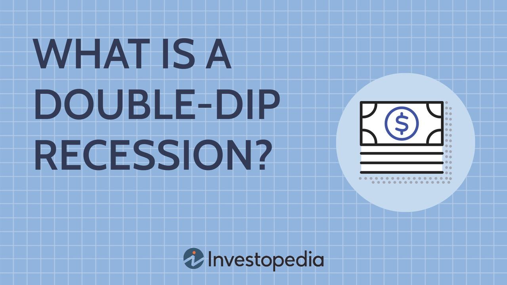

## Table of Contents

## What is a double-dip recession?

A double-dip recession happens when an economy starts to recover from a recession but then falls back into another recession before it fully recovers. It's like taking two steps forward and then two steps back. This can be really tough on people and businesses because just when they think things are getting better, they have to face more economic hardship.

The first recession might be caused by things like a big drop in spending or a financial crisis. If the recovery isn't strong enough, new problems can push the economy back into a recession. These new problems could be things like rising prices, higher interest rates, or even new global events. A double-dip recession can make people lose confidence in the economy, which makes it even harder to recover.

## How does a double-dip recession differ from a regular recession?

A regular recession is when the economy shrinks for a while, usually at least two quarters in a row. During a regular recession, people might lose jobs, businesses might struggle, and spending goes down. It's tough, but once it's over, the economy starts to grow again.

A double-dip recession is different because it's like having two recessions back-to-back. The economy starts to get better after the first recession, but then it falls back into another one before it's fully recovered. This makes things even harder because just when people and businesses start to feel a bit better, they have to go through another rough patch. It can shake people's confidence and make the recovery take even longer.

## What are the economic indicators of a double-dip recession?

Economic indicators of a double-dip recession are signs that show the economy is getting worse again after starting to get better. These signs include a drop in the Gross Domestic Product (GDP), which means the total value of everything produced in the country is going down again. Another sign is when unemployment starts to go up again after it had been going down. If people are losing jobs again, it's a big hint that the economy might be heading back into a recession.

Also, if you see that people are spending less money again, that's another warning sign. When people feel unsure about the future, they tend to save their money instead of spending it, which can slow down the economy even more. Businesses might also start to see their profits drop again, which can lead them to cut back on investments and hiring. All these signs together can tell us that a double-dip recession might be on the way.

## Can you provide historical examples of double-dip recessions?

One famous example of a double-dip recession happened in the United States in the early 1980s. The first recession started in January 1980 and lasted until July 1980. Things started to get a bit better, but then the economy fell back into another recession from July 1981 to November 1982. This second dip was even worse than the first one. High interest rates and tight money policies by the Federal Reserve to fight inflation were big reasons why the economy struggled so much during this time.

Another example is the UK in the early 1970s. The first recession hit in 1973 and lasted until 1975. The economy started to recover, but then it dipped again in 1979 and lasted until 1981. The oil crisis in the 1970s played a big role in causing these economic troubles. High oil prices made everything more expensive and slowed down the economy. Both of these examples show how tough it can be for an economy to fully recover after a double-dip recession.

## What were the causes of the double-dip recession in the early 1980s in the United States?

The double-dip recession in the early 1980s in the United States was mainly caused by the Federal Reserve's tight money policies. In the late 1970s, inflation was very high, and the Federal Reserve, led by Paul Volcker, decided to raise interest rates a lot to fight it. High interest rates made borrowing money more expensive, which slowed down the economy. This led to the first recession from January 1980 to July 1980. When the economy started to recover, the Federal Reserve kept interest rates high to make sure inflation stayed under control, which made it hard for the recovery to gain strength.

The second dip of the recession started in July 1981 and lasted until November 1982. The continued high interest rates were a big reason for this second dip. Businesses found it hard to borrow money to invest and grow, and people were less likely to buy big things like houses and cars because loans were so expensive. This slowdown in spending and investment caused the economy to shrink again. The tight money policy was tough but helped bring inflation down in the long run, setting the stage for a stronger recovery later in the 1980s.

## How did the double-dip recession of the early 1980s affect global economies?

The double-dip recession in the early 1980s in the United States had a big impact on other countries around the world. Because the U.S. is a big economy, when it struggles, it can affect other countries that trade with it. Many countries saw their exports to the U.S. drop because Americans were buying less. This hurt economies in places like Europe and Japan, which relied a lot on selling things to the U.S. Also, the high interest rates in the U.S. made it more expensive for other countries to borrow money in dollars, which made their own economic problems worse.

The effects were felt differently in different parts of the world. In Latin America, the high U.S. interest rates led to a big debt crisis. Many countries there had borrowed a lot of money in dollars, and now they had to pay back more because of the high interest rates. This caused a lot of economic trouble and even led to some countries defaulting on their debts. In Europe, countries like the UK also went through their own double-dip recessions around the same time, partly because of the global economic slowdown. Overall, the U.S. double-dip recession made the early 1980s a tough time for many economies around the world.

## What policies were implemented to combat the double-dip recession in the early 1980s?

To fight the double-dip recession in the early 1980s, the U.S. government and the Federal Reserve used a mix of policies. The Federal Reserve, led by Paul Volcker, kept interest rates high to fight inflation, even though it made the recession worse at first. They believed that getting inflation under control was important for long-term economic health. The government also tried to help by cutting taxes and increasing spending in some areas. President Ronald Reagan's administration passed the Economic Recovery Tax Act of 1981, which lowered taxes for individuals and businesses. This was meant to encourage people to spend and invest more, helping the economy grow.

Later, as the second dip of the recession hit, the Federal Reserve started to lower interest rates. They saw that inflation was coming down and wanted to help the economy recover. By late 1982, interest rates were much lower than they had been at the start of the recession. The government also continued to support the economy through other measures, like increasing military spending, which created jobs and boosted economic activity. These combined efforts helped the U.S. economy start to recover by the mid-1980s, even though it took time for the effects to be felt.

## How effective were these policies in ending the double-dip recession?

The policies used to fight the double-dip recession in the early 1980s had mixed results at first, but they eventually helped the U.S. economy recover. The Federal Reserve's decision to keep interest rates high to fight inflation made the recession worse at the start. It was hard for businesses to borrow money and for people to buy big things like houses. But this tough policy did help bring inflation down, which was good for the economy in the long run. The government's tax cuts and increased spending, like the Economic Recovery Tax Act of 1981, were meant to encourage spending and investment. These measures took time to work, but they started to help the economy grow again.

By late 1982, the Federal Reserve began to lower interest rates as inflation was under control. This made borrowing cheaper, which helped businesses and people spend more. The government's continued support, including increased military spending, created jobs and boosted economic activity. These combined efforts helped the U.S. economy start to recover by the mid-1980s. Even though it was a slow process, the policies did play a big role in ending the double-dip recession and setting the stage for a stronger economy later on.

## What are the long-term economic impacts of a double-dip recession?

A double-dip recession can have big effects on an economy that last for a long time. When the economy goes through two recessions back-to-back, it can take a long time to recover fully. People might lose their jobs and have a hard time finding new ones, which can make them feel less confident about spending money. Businesses might be scared to invest in new projects because they're not sure if the economy will get better. This can slow down growth for years. Also, the government might have to spend more money to help people and businesses, which can lead to higher debts that need to be paid back later.

Over time, a double-dip recession can change how people and businesses think about the economy. If people go through two rough patches, they might be more careful with their money even after things start to get better. This can make the recovery slower than it would be after a regular recession. But, if the government and the central bank handle the situation well, they can help the economy get back on track. For example, after the double-dip recession in the early 1980s, the U.S. economy did recover and even had a strong period of growth later in the decade. The key is to learn from the experience and use it to make better policies for the future.

## How can governments and financial institutions predict and prevent a double-dip recession?

Governments and financial institutions can predict a double-dip recession by keeping a close eye on economic indicators like unemployment rates, GDP growth, and consumer spending. If these indicators start to go down again after a period of recovery, it might be a sign that another recession is coming. They can use data and computer models to look for patterns that have led to double-dip recessions in the past. By watching these signs carefully, they can get an early warning and take action before things get too bad.

To prevent a double-dip recession, governments can use different tools. They might cut taxes or increase spending to help people and businesses feel more confident about the economy. This can encourage more spending and investment, which can help keep the economy growing. Financial institutions, like central banks, can also help by adjusting interest rates. If they see that the economy is slowing down, they might lower interest rates to make borrowing cheaper. This can help businesses grow and people buy things they need, which can stop the economy from falling back into a recession. By working together and using these tools wisely, governments and financial institutions can help avoid a double-dip recession.

## What role do consumer confidence and business investment play in a double-dip recession?

Consumer confidence is really important when it comes to a double-dip recession. If people feel good about the economy, they are more likely to spend money on things like cars, houses, and going out to eat. This spending helps keep the economy growing. But if people go through a double-dip recession, they might lose trust in the economy. They could start saving their money instead of spending it because they're worried about the future. When people spend less, businesses make less money, which can make the economy shrink again and lead to another recession.

Business investment also plays a big role. When businesses feel good about the economy, they are more likely to invest in new projects, like building new factories or buying new equipment. This investment creates jobs and helps the economy grow. But if businesses go through a double-dip recession, they might be scared to invest. They might think the economy will get worse again, so they hold onto their money instead of spending it on new projects. When businesses invest less, it can slow down the economy and make it harder to recover from a double-dip recession.

## What are the current economic theories and models used to study double-dip recessions?

Economists use different theories and models to study double-dip recessions. One important theory is the business cycle theory, which looks at how economies go through ups and downs over time. This theory helps economists understand why an economy might start to recover but then fall back into a recession. They look at things like how much people are spending, how many people are working, and how much businesses are investing. By studying these patterns, economists can try to predict when a double-dip recession might happen and what might cause it.

Another useful model is the Keynesian model, which focuses on how spending by consumers, businesses, and the government can affect the economy. According to this model, if people and businesses cut back on spending after the first recession, it can lead to another downturn. Economists using this model might suggest that the government should increase its spending or cut taxes to help boost the economy and prevent a second dip. These theories and models help economists understand the complex reasons behind double-dip recessions and come up with ways to avoid them.

## How can one prepare for economic challenges?

Preparing for economic challenges involves adopting strategies that enable individuals and businesses to withstand financial turbulence. Economic downturns, marked by reduced market confidence and declining financial metrics, necessitate a proactive approach. Key strategies include diversification, maintaining [liquidity](/wiki/liquidity-risk-premium), and employing algorithmic trading, which can collectively bolster resilience.

Diversification involves spreading investments across different asset classes, industries, or geographical markets to reduce risk. The principle of diversification is rooted in the concept that a varied portfolio is less likely to be severely impacted by market volatility in any single sector. For instance, during an economic downturn affecting the technology sector, investments in more stable sectors like utilities or consumer staples might provide balance and mitigate overall portfolio losses. Mathematically, diversification can be viewed in the context of portfolio variance, which is calculated as:

$$

\sigma^2_p = \sum_{i=1}^{n} w_i^2 \sigma_i^2 + \sum_{i=1}^{n} \sum_{j=1, i \neq j}^{n} w_i w_j \sigma_i \sigma_j \rho_{ij} 
$$

where $\sigma^2_p$ is the portfolio variance, $w_i$ is the weight of the i-th asset, $\sigma_i$ is the standard deviation of asset i, and $\rho_{ij}$ is the correlation coefficient between assets i and j. By optimizing these parameters, investors can minimize risk while maintaining returns.

Maintaining liquidity is another critical strategy for weathering economic downturns. Liquidity ensures that businesses and investors have ready access to cash or easily convertible assets to meet immediate obligations without selling off valuable assets at depressed prices. This financial flexibility is crucial during periods of economic instability, where external funding may be constrained, and market conditions may force the liquidation of assets at unfavorable terms. Companies often keep a portion of their capital in short-term, highly liquid securities to safeguard against unpredictable financial needs.

Algorithmic trading, which uses computer programs to execute trades based on predefined criteria, presents modern solutions for navigating volatile markets. During downturns, algorithmic trading systems can be programmed to quickly adapt to changing market conditions, execute trades at optimal prices, and manage risk effectively. The speed and precision of algorithmic trading can allow for better exploitation of transient market inefficiencies. For example, algorithms can be programmed in Python using libraries such as `pandas` for efficient data handling and `numpy` for numerical computations. A basic Python code snippet for algorithmic trading might look like:

```python
import numpy as np
import pandas as pd

# Example moving average strategy
def moving_average_strategy(prices, short_window, long_window):
    signals = pd.DataFrame(index=prices.index)
    signals['signal'] = 0.0

    signals['short_mavg'] = prices.rolling(window=short_window, min_periods=1).mean()
    signals['long_mavg'] = prices.rolling(window=long_window, min_periods=1).mean()

    signals['signal'][short_window:] = np.where(
        signals['short_mavg'][short_window:] > signals['long_mavg'][short_window:], 1.0, 0.0
    )   

    signals['positions'] = signals['signal'].diff()

    return signals
```

In this example, the strategy is to buy when the short-term moving average crosses above the long-term moving average and to sell when the opposite occurs.

Collectively, these strategies enable preparedness and response capability, enhancing both individual and corporate resilience to economic adversities. Diversification reduces exposure risk, liquidity preserves operational stability under financial stress, and algorithmic trading leverages technology for strategic gain during market fluctuations. By implementing these measures, businesses and investors are better positioned to withstand and possibly leverage economic downturns for long-term growth.

## References & Further Reading

[1]: Blinder, A. S. (2013). ["After the Music Stopped: The Financial Crisis, the Response, and the Work Ahead."](https://www.tandfonline.com/doi/full/10.1080/14697688.2014.949836) Penguin Books.

[2]: Aït-Sahalia, Y., & Lo, A. W. (1998). ["Nonparametric Estimation of State-Price Densities Implicit in Financial Asset Prices."](https://www.princeton.edu/~yacine/aslo.pdf) Journal of Finance, 53(2), 499-547. 

[3]: Fox, J. (2009). ["The Myth of the Rational Market: A History of Risk, Reward, and Delusion on Wall Street."](https://www.amazon.com/Myth-Rational-Market-History-Delusion/dp/0060599030) Harper Business.

[4]: Easley, D., & O'Hara, M. (2010). ["Microstructure and Ambiguity."](https://www.jstor.org/stable/40864988) The Review of Financial Studies, 23(4), 1325-1360.

[5]: Mandelbrot, B. B. (2001). ["The (Mis)Behavior of Markets: A Fractal View of Risk, Ruin, and Reward."](https://archive.org/details/misbehaviorofmar00beno) Basic Books.