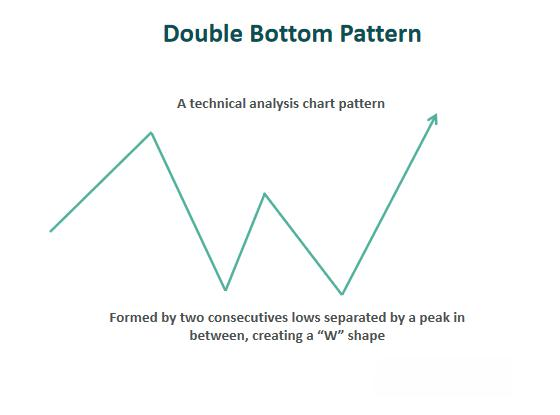

## Table of Contents

## What is the Double Down trading strategy?

The Double Down trading strategy is a method used by some traders to try to recover losses from a losing trade. When a trader's position starts losing money, instead of selling and accepting the loss, they buy more of the same asset at the lower price. The idea is that if the price eventually goes back up, the trader will not only recover their initial loss but also make a profit. This strategy is also known as averaging down or pyramiding.

However, the Double Down strategy is very risky and can lead to big losses. If the price keeps going down after doubling down, the trader's losses will get bigger and bigger. It requires a lot of money to keep buying more of the asset, and there's no guarantee that the price will ever go back up. Many experts advise against using this strategy because it can lead to a dangerous cycle of trying to recover losses by risking even more money.

## How does the Double Down strategy work?

The Double Down strategy is when a trader buys more of an asset after its price has gone down. Let's say you bought a stock for $100, but now it's only worth $90. Instead of selling and losing money, you buy more of the stock at $90. You're hoping that the price will go back up. If it does, you'll make money on both the original shares and the new ones you bought at the lower price.

But this strategy is risky. If the price keeps falling, you'll lose even more money because you bought more of the stock. You need a lot of money to keep buying more shares, and there's no promise that the price will ever go back up. Many people think this is a bad idea because it can make your losses bigger instead of helping you recover them.

## What are the basic principles behind the Double Down strategy?

The Double Down strategy is about buying more of something when its price drops. If you bought a stock and it goes down, instead of selling it and losing money, you buy more of it at the lower price. The idea is that if the price goes back up later, you will make money on all the shares you bought, both the first ones and the new ones at the lower price. This can help you recover your losses and even make a profit if everything goes well.

However, this strategy is very risky. If the price keeps going down after you buy more, you will lose even more money because you have more shares now. You need a lot of money to keep buying more shares, and there's no guarantee that the price will ever go back up. Many people think this is a dangerous way to trade because it can make your losses bigger instead of helping you recover them.

## What are the potential risks associated with the Double Down strategy?

The Double Down strategy can lead to big losses. If you buy more of something after its price goes down, and the price keeps falling, you will lose even more money because you have more of it now. It's like betting more money on a losing horse, hoping it will win the next race. If it doesn't, you lose everything you bet.

You also need a lot of money to keep buying more shares or assets. If you don't have enough money, you can't keep doubling down, and you might have to sell at a loss anyway. Plus, there's no promise that the price will ever go back up. It's a risky move because you're hoping for something that might not happen, and it can make your losses much bigger than they were at first.

## Can you provide a simple example of how to apply the Double Down strategy?

Let's say you bought 100 shares of a company's stock for $10 each, so you spent $1,000. A few days later, the stock price drops to $8 per share. Instead of selling your shares and losing money, you decide to buy 100 more shares at the lower price of $8 each, spending another $800. Now you have 200 shares, and your average cost per share is $9 (($1,000 + $800) / 200 shares).

If the stock price goes back up to $10 or higher, you'll start making money. For example, if the stock goes back to $10, your 200 shares will be worth $2,000, and you'll have made a profit of $200 ($2,000 - $1,800 you spent). But if the stock keeps going down, say to $6 per share, your 200 shares will only be worth $1,200, and you'll have lost $600 ($1,800 - $1,200). This shows how the Double Down strategy can be risky because it might make your losses bigger if the price doesn't go back up.

## What are the key indicators to look for when using the Double Down strategy?

When using the Double Down strategy, you should look at the stock's price trend. If the stock has been going down slowly over a long time, it might be risky to buy more because it could keep falling. But if the stock usually goes up and down a lot, and it's just having a short dip, it might be safer to buy more. You should also check if anything big happened that made the price drop, like bad news about the company. If it's just a short-term problem, the price might go back up soon.

Another thing to watch is how much money you have. You need enough money to buy more shares without putting yourself in a tight spot. Also, look at how much the stock's price changes every day. If it moves a lot, you might get a chance to buy more at a lower price. But remember, even with these signs, there's no sure way to know if the price will go back up, so be careful.

## How does the Double Down strategy differ from other trading strategies?

The Double Down strategy is different from other trading strategies because it focuses on buying more of an asset when its price goes down. Most other strategies, like the buy-and-hold strategy, involve buying an asset and keeping it for a long time, hoping its value will grow over time. Another common strategy is the stop-loss strategy, where a trader sells an asset when its price drops to a certain level to limit their losses. In contrast, the Double Down strategy aims to recover losses by buying more at a lower price, betting that the price will eventually go back up.

This approach is riskier than many other strategies because it increases the amount of money at stake if the price keeps falling. For example, the dollar-cost averaging strategy involves investing a fixed amount of money at regular intervals, which spreads out the risk over time. The Double Down strategy, on the other hand, concentrates the risk in one asset at a lower price point. While some traders might use the Double Down strategy to try and turn a losing position into a winning one, it's generally seen as a high-risk move that can lead to bigger losses if the market doesn't recover.

## What are the psychological challenges of implementing the Double Down strategy?

Using the Double Down strategy can be hard on your mind. When you see the price of something you bought go down, it's scary to buy more of it. You might feel like you're throwing good money after bad, and it can make you really nervous. This fear can make it hard to decide if you should keep going with the strategy or stop. If the price keeps going down, you might start to doubt yourself a lot, and that can be stressful.

Another challenge is dealing with hope and greed. When you double down, you're hoping the price will go back up so you can make money. But if it doesn't, you might get greedy and keep buying more, thinking it will eventually work out. This can lead to a cycle where you keep risking more money, hoping to fix your losses. It's tough to stay calm and make smart choices when you're feeling these strong emotions.

## How can risk management be effectively incorporated into the Double Down strategy?

To manage risk effectively when using the Double Down strategy, you need to set clear limits on how much you're willing to lose. Before you start doubling down, decide on a maximum amount of money you can afford to lose. Stick to this limit no matter what happens. This way, you won't lose more than you can handle. It's also important to only use money you can afford to lose, so you don't end up in a bad financial situation if things go wrong.

Another way to manage risk is to use stop-loss orders. A stop-loss order is a tool that automatically sells your shares if the price drops to a certain level. This can help you avoid bigger losses if the price keeps going down after you've doubled down. You should also keep an eye on the market and be ready to change your plan if something big happens that could affect the price. By setting these limits and using tools like stop-loss orders, you can try to keep your risk under control while using the Double Down strategy.

## What are some advanced techniques for optimizing the Double Down strategy?

One way to make the Double Down strategy better is to use technical analysis. This means looking at charts and patterns to guess where the price might go next. If you see signs that the price might go back up soon, it could be a good time to buy more. You can also use something called a moving average to help you decide when to double down. If the price drops but stays above the moving average, it might be safer to buy more because the price could go back up.

Another advanced technique is to spread out your risk by doubling down on different assets. Instead of putting all your money into one stock, you can buy more of a few different stocks. This way, if one stock keeps going down, you might still make money on the others. It's also smart to keep some money aside for emergencies. That way, if the price keeps falling and you need to stop, you'll still have money to use for other things. By using these techniques, you can try to make the Double Down strategy work better for you.

## How has the Double Down strategy performed historically in various market conditions?

The Double Down strategy has had mixed results in different market conditions. In bull markets, where prices generally go up over time, the strategy can work well if the price dips are short and the market quickly recovers. Traders who doubled down during these dips could see their investments rise in value, helping them recover their losses and even make a profit. However, this approach requires good timing and a bit of luck, as it's hard to predict when the market will bounce back.

In bear markets, where prices are falling, the Double Down strategy can lead to big losses. If a trader keeps buying more of a stock as its price drops, and the price keeps going down, they end up losing more and more money. Historical data shows that many traders who used this strategy during long bear markets, like the 2008 financial crisis, ended up losing a lot because the market took a long time to recover. This shows that while the Double Down strategy can be rewarding in the right conditions, it's very risky and can lead to serious financial trouble if the market doesn't turn around quickly.

## What are expert opinions on the sustainability and effectiveness of the Double Down strategy?

Many experts think the Double Down strategy is not a good idea for the long run. They say it's too risky because it makes your losses bigger if the price keeps going down. Instead of helping you recover your money, it can make things worse. Experts often suggest using safer ways to invest, like buying different kinds of stocks or using a stop-loss to limit how much you can lose. They believe that trying to make up for losses by buying more of the same thing is not a smart way to invest.

Some experts also say that the Double Down strategy can work in certain situations, but it's hard to tell when those times are. If the market is going up and the price drop is just a short dip, doubling down might help you make money. But it's tough to know if the price will go back up, and most experts think it's better to have a plan that doesn't rely on guessing the market. They advise against using the Double Down strategy as a main way to invest because it's too risky and can lead to big problems if things don't go as planned.

## What is the Double Down Strategy and how can it be understood?

The double down strategy is a financial approach used by traders to manage losses by increasing their investment in a declining asset. Unlike traditional trading methods that might suggest cutting losses, this strategy aims to lower the average entry price of a position. By purchasing additional shares at a depreciated price, traders hope to reduce the breakeven point, thus requiring a smaller price increase for the position to become profitable.

Mathematically, if an initial investment involves purchasing $n_1$ shares at price $P_1$, and the price declines to $P_2$, purchasing $n_2$ additional shares results in an average price $\bar{P}$ given by:

$$
\bar{P} = \frac{n_1 \cdot P_1 + n_2 \cdot P_2}{n_1 + n_2}
$$

This strategy inherently involves a higher risk exposure, as increasing the position size also increases the potential for greater losses if the market trend continues unfavorably. 

The double down strategy shares similarities with the Martingale approach, prevalent in gambling, where the stake is doubled following each loss. The central difference lies in the application domain and risk tolerance. In trading, doubling down on investments significantly amplifies risk since the market's upward reversal is uncertain, unlike the theoretically equal probability of wins and losses in gambling.

A practical example illustrates this strategy's application: Assume a trader initially buys 100 shares of a company at $50 per share. If the stock price falls to $40, the trader might purchase an additional 100 shares to average the cost. The new average price is calculated as follows:

$$
\bar{P} = \frac{100 \cdot 50 + 100 \cdot 40}{200} = \$45
$$

Here, the trader initially breaks even at $50, but now requires the price to rise to only $45 to break even. However, this assumption presumes that the stock will not continue to fall, reinforcing the necessity for risk management and market analysis before deploying this strategy.

## References & Further Reading

[1]: Bergstra, J., Bardenet, R., Bengio, Y., & Kégl, B. (2011). ["Algorithms for Hyper-Parameter Optimization."](https://proceedings.neurips.cc/paper/2011/file/86e8f7ab32cfd12577bc2619bc635690-Paper.pdf) Advances in Neural Information Processing Systems 24.

[2]: ["Advances in Financial Machine Learning"](https://www.amazon.com/Advances-Financial-Machine-Learning-Marcos/dp/1119482089) by Marcos Lopez de Prado

[3]: ["Evidence-Based Technical Analysis: Applying the Scientific Method and Statistical Inference to Trading Signals"](https://www.amazon.com/Evidence-Based-Technical-Analysis-Scientific-Statistical/dp/0470008741) by David Aronson

[4]: ["Machine Learning for Algorithmic Trading"](https://github.com/PacktPublishing/Machine-Learning-for-Algorithmic-Trading-Second-Edition) by Stefan Jansen

[5]: ["Quantitative Trading: How to Build Your Own Algorithmic Trading Business"](https://books.google.com/books/about/Quantitative_Trading.html?id=j70yEAAAQBAJ) by Ernest P. Chan