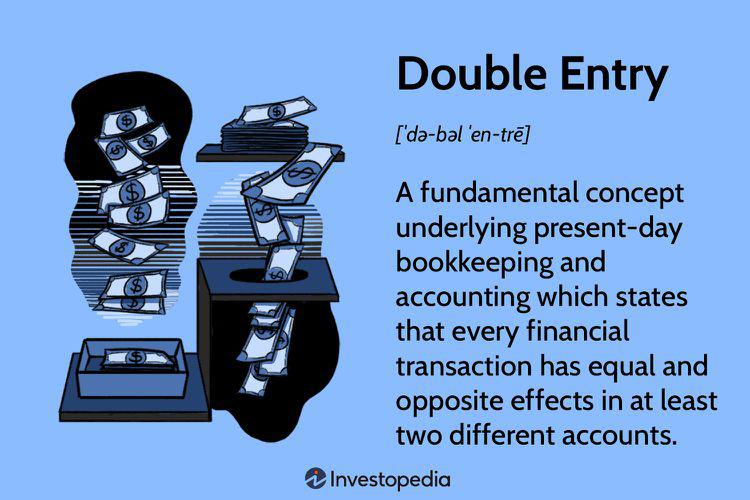

Accurate financial management is essential for businesses of every scale. It provides the foundation for maintaining fiscal health, ensuring regulatory compliance, and supporting strategic decision-making. Key components of effective financial management include accounting, bookkeeping, the double-entry system, and algorithmic trading. Each of these elements contributes uniquely to establishing a seamless and scalable financial infrastructure.

Accounting serves as the backbone of financial management, involving the systematic recording, reporting, and analysis of financial transactions. Its counterpart, bookkeeping, handles the day-to-day recording of these transactions, ensuring accuracy and completeness. The integration of both practices is crucial for maintaining precise financial records, which are vital for forecasting and strategic planning.

Central to accounting is the double-entry system, a method that records the dual impact of each transaction through debits and credits. This system is underpinned by the accounting equation: Assets = Liabilities + Equity. This methodology not only ensures accuracy but also facilitates error detection, reinforcing the credibility of financial statements.

Algorithmic trading, or algo trading, represents a modern advancement in trading practices. It utilizes computer programs to execute trades at speeds and frequencies unimaginable to human traders, based on predetermined criteria. By leveraging speed and precision, algo trading enables businesses to analyze multiple markets simultaneously and make informed, rapid trading decisions.

These systems are interconnected and together form an essential toolkit for financial strategists. An integrated approach allows for improved decision-making and responsiveness to shifting market dynamics. For any modern financial strategist, understanding and utilizing these tools is indispensable for achieving financial stability and growth. As businesses continue to evolve, embracing and integrating these financial systems becomes increasingly crucial, highlighting their importance in strategic financial management.

## Table of Contents

## Accounting and Bookkeeping Basics

Accounting is the comprehensive process of systematically recording, reporting, and analyzing financial transactions. This practice involves summarizing, interpreting, and communicating financial data, which is essential for decision-making and strategic planning in any organization. One of its primary functions is to provide stakeholders, such as management, investors, and regulatory agencies, with an insightful view of an entity's financial status.

Bookkeeping, a key component of the accounting process, is the meticulous task of capturing and recording day-to-day financial transactions within an organization. These transactions include sales, purchases, receipts, and payments. Such detailed record-keeping is foundational to maintain accurate financial records, which ensures that a business remains compliant with financial regulations and tax obligations.

The tasks involved in bookkeeping and accounting are varied yet interconnected. They encompass recording sales, tracking expenses, and reconciling accounts. For instance, reconciling accounts involves matching the balances in an entity’s accounting records for a cash account to the corresponding information on a bank statement. Any discrepancies must be investigated and corrected to ensure precise financial records.

Key to both accounting and bookkeeping is the use of standardized methods to ensure accuracy and consistency. Software applications often assist in automating these tasks, increasing efficiency, and reducing the likelihood of human error. By maintaining accurate records, organizations can perform necessary financial analysis, preparing statements like the balance sheet, income statement, and cash flow statement, which inform various strategic decisions.

Accurate financial management through diligent accounting and bookkeeping allows businesses to monitor financial health, forecast future financial performance, and streamline operations effectively.

## The Double Entry System

The double-entry system is a cornerstone of modern accounting practices, ensuring that every financial transaction is accurately recorded and balanced. This system requires that each transaction be entered twice, as a debit in one account and a corresponding credit in another, maintaining the equilibrium of the accounting equation: 

$$
\text{Assets} = \text{Liabilities} + \text{Equity}
$$

This equation is fundamental, as it provides a clear framework within which financial data is organized and verified. By mandating that total debits and credits always match, the double-entry system helps prevent errors and inconsistencies in financial records. This rigorous structure enhances the reliability of financial statements and supports error detection, offering a self-checking mechanism that highlights discrepancies automatically. 

Historically, the double-entry system has been pivotal in the evolution of accounting. Its origins trace back to the Renaissance, with the first documented description found in Luca Pacioli's 1494 work, "Summa de Arithmetica, Geometria, Proportioni et Proportionalità." This system's introduction revolutionized the way businesses tracked their financial activities, laying the foundation for modern accounting principles.

A fundamental aspect of the double-entry system is the ledger, where all debits and credits are recorded. The ledger is divided into different accounts, each representing a specific aspect of the business, such as cash, inventory, and accounts payable. This categorization helps in understanding the financial position and performance of a business by providing detailed insights into each component of the accounting equation.

Implementing the double-entry system requires a disciplined approach to data entry, as accuracy in recording each transaction affects the overall integrity of the financial statements. Errors in this system typically manifest as imbalances in the accounting records, signaling the need for review and correction.

In practice, this system not only aids in maintaining financial accuracy but also strengthens decision-making processes by offering a clear and comprehensive view of the organization's financial health. With the advent of technology, accounting software now automates many aspects of this system, enhancing efficiency while preserving the rigorous standards of double-entry bookkeeping.

 to Algo Trading

Algorithmic trading, commonly referred to as algo trading, involves the use of computer programs to execute trades in financial markets based on a set of pre-defined rules or algorithms. This technology-driven approach has revolutionized the trading landscape, offering significant advantages in terms of speed, precision, and the ability to process vast amounts of data.

At its core, algo trading works by feeding algorithms with market data, such as price, [volume](/wiki/volume-trading-strategy), and timing, and using this information to determine when and what trades to execute. These algorithms can range from simple strategies based on technical indicators to complex [machine learning](/wiki/machine-learning) models that predict market movements. The primary benefits of algo trading lie in its capacity to handle multiple variables simultaneously, allowing traders to analyze and act on numerous markets at once. This capability surpasses human traders, who are naturally limited in their ability to process diverse and concurrent information streams.

The speed of execution is a hallmark of algo trading. Algorithms can initiate transactions in fractions of a second, well before human reflexes could respond to the same data. This speed is particularly advantageous in markets where prices can change rapidly within moments, enabling traders to capitalize on fleeting opportunities. Furthermore, the precision of these algorithms reduces the likelihood of human error, ensuring that trades are executed exactly as intended under the specified conditions.

Algo trading has exhibited a profound influence on modern financial markets, contributing to increased market [liquidity](/wiki/liquidity-risk-premium) and tighter spreads. High-frequency trading ([HFT](/wiki/high-frequency-trading-strategies)), a subset of algo trading, exemplifies this impact as it involves executing a large number of orders at extremely fast speeds. Though profitable, HFT and other algo trading strategies have also been associated with certain risks, including increased market [volatility](/wiki/volatility-trading-strategies) and the potential for systemic issues, as demonstrated by occurrences like the 2010 Flash Crash.

Despite these challenges, the advantages and efficiency brought by algo trading continue to encourage its growth. Financial institutions and individual traders alike are increasingly adopting algorithmic strategies to stay competitive. The integration of [artificial intelligence](/wiki/ai-artificial-intelligence) and machine learning techniques has further expanded the possibilities, allowing for more sophisticated predictive models that can adapt to changing market conditions.

In conclusion, [algorithmic trading](/wiki/algorithmic-trading) represents a cutting-edge approach to trading, characterized by technological sophistication and strategic precision. Its capacity to enhance execution speed, accuracy, and market analysis renders it an invaluable tool for modern financial practitioners seeking to optimize their trading operations. As technology continues to progress, the influence and utilization of algo trading within the financial sector are poised to grow even further.

## Integrating Financial Systems

Integrating bookkeeping, a double-entry system, and algorithmic trading constitutes a powerful financial framework that enhances organizational efficiency. This integration facilitates informed strategic decision-making by offering a comprehensive view of financial standing, ultimately serving as a critical asset in the fast-paced business environment.

Modern financial systems necessitate real-time processing and analysis of large datasets, a task well suited to the integration of bookkeeping and algo trading. Bookkeeping, which handles the diligent recording of financial transactions, when integrated with a double-entry system, ensures high accuracy through its method of recording transactions as debits in one account and credits in another. This method is consistent with the accounting equation: 

$$
\text{Assets} = \text{Liabilities} + \text{Equity}
$$

In conjunction, algo trading introduces automation and speed, analyzing market conditions and executing trades with precision. This amalgamation of traditional and emerging financial methodologies offers businesses unparalleled capacity to handle real-time transaction data while remaining adaptive to evolving market trends.

Several technological tools facilitate the seamless integration of these components. Enterprise Resource Planning (ERP) systems are at the forefront of this transformation, offering modules specifically designed for accounting and financial management that ensure data consistency across organizational functions. These integrated systems support real-time data synchronization and provide a unified platform for financial reporting and analysis. 

Moreover, API (Application Programming Interface) integrations enable different financial tools and software to communicate effectively, allowing for automated data transfer and analysis. This connectivity ensures that bookkeeping data can be directly fed into algo trading systems, optimizing the decision-making processes. With the increasing adoption of cloud computing, businesses can leverage these technologies with increased accessibility and reduced infrastructural costs, while also ensuring data security and compliance through advanced encryption methods and regular system updates.

In summary, integrating bookkeeping, a double-entry system, and algorithmic trading presents substantial advantages by enhancing financial visibility and operational agility. This fusion empowers businesses to not only keep pace with real-time transaction demands but also adapt swiftly to market fluctuations, cementing it as an essential strategy for modern financial management.

## Challenges and Considerations

Adopting integrated financial systems combining accounting, bookkeeping, double-entry systems, and algorithmic trading is a sophisticated endeavor. It requires careful consideration of several challenges to ensure effective implementation. This section examines the critical considerations and strategies required to navigate the complexities of adopting these systems.

The transition to integrated financial systems necessitates significant investment in both technology and training. Implementing advanced technologies often involves initial costs for software acquisition, hardware upgrades, and continuous development. Furthermore, staff must be proficient in these systems, requiring comprehensive training programs. Training should cover the technical aspects of using financial software and understanding the principles of double-entry bookkeeping and algorithmic trading. Enhanced skill sets among personnel ensure a smooth transition and efficient use of resources, ultimately contributing to the system's success.

Accuracy in data entry is paramount. Financial systems are built on precise data input; thus, the integrity of financial records hinges on the meticulous entry of information. Errors in data entry can propagate through financial statements, leading to incorrect analyses and potentially costly decisions. To mitigate this risk, businesses should implement stringent data verification procedures, regular audits, and use error-checking algorithms. Utilizing modern data entry tools that include validation features can also minimize human errors.

Security and data privacy are paramount, particularly in algorithmic trading environments where sensitive financial information is processed. Businesses must ensure their systems are fortified against cyber threats. This involves using secure encryption protocols, establishing strong access controls, and continuously monitoring system vulnerabilities. Regular security audits and employee training on best practices in data security are also crucial. Additionally, compliance with legal frameworks such as the General Data Protection Regulation (GDPR) and other relevant data protection laws is vital to avoid legal repercussions.

To manage these challenges effectively, businesses should adopt a strategic approach:

1. **Invest in Scalable Technology**: Choose technology solutions that are scalable, allowing for future expansion without substantial re-investment. Open-source solutions can offer flexibility and cost-effectiveness.

2. **Continuous Training and Development**: Implement ongoing training programs to keep staff updated on system functionalities and emerging trends in financial management. Cross-training can also enhance team versatility.

3. **Robust Security Measures**: Regularly update security protocols and software to guard against evolving cyber threats. Employ cybersecurity specialists to stay ahead of potential breaches.

4. **Data Governance Framework**: Establish a comprehensive data governance policy ensuring data quality, consistency, and accountability across the organization.

5. **Automation in Data Entry**: Leverage automation tools or AI to assist with data entry, thus reducing the likelihood of human error and enhancing efficiency.

By addressing these challenges with a comprehensive strategy, organizations can leverage the benefits of integrated financial systems to gain better accuracy, efficiency, and insights into their financial operations.

## Conclusion

The synergy between accounting, bookkeeping, double-entry, and algorithmic trading forms a powerful combination that can significantly enhance the financial management capabilities of businesses. Each system plays its role: accounting provides a comprehensive framework for analyzing financial health, bookkeeping captures the transactional data necessary for precise financial tracking, the double-entry system ensures balance and accountability, and algorithmic trading introduces efficiency and speed in market transactions. By integrating these systems, businesses can achieve higher levels of accuracy, streamline operations, and gain valuable insights, making data-driven decision-making more effective.

The integration of these processes is essential for companies seeking to grow and remain competitive. As markets become increasingly dynamic, the ability to maintain real-time financial oversight becomes crucial. These systems, when effectively combined, provide a cohesive financial infrastructure that not only supports but also propels business strategy. This infrastructure facilitates the capture of granular financial data, improving both tactical and strategic responses to market changes.

The future landscape of financial systems is likely to see further integration and technological advancement. Emerging technologies such as artificial intelligence and machine learning are expected to enhance algorithmic trading, providing deeper insights and predictive capabilities. Automation will further streamline accounting and bookkeeping tasks, reducing the potential for human error and allowing financial professionals to focus on higher-value activities. This evolution will push businesses to adapt and adopt innovative financial practices to maintain their competitive edge.

In conclusion, adopting an integrated approach to financial systems is not merely advantageous but imperative for modern businesses. Such integration promises not only operational enhancements but also a strategic advantage in effectively navigating the complexities of today's financial environments. As technology continues to progress, businesses that embrace these advancements may benefit from improved financial transparency, predictive insights, and overall enhanced performance in their financial operations.

## References & Further Reading

[1]: Luca Pacioli (1494). ["Summa de Arithmetica, Geometria, Proportioni et Proportionalità."](https://archive.org/details/summa-de-arithmetica-geometria-proportioni-et-proportionalita) 

[2]: Appel, Gerald (2005). ["Technical Analysis: Power Tools for Active Investors"](https://www.amazon.com/Technical-Analysis-Power-Active-Investors/dp/0132930048) by Gerald Appel.

[3]: Murphy, John J. (1999). ["Technical Analysis of the Financial Markets: A Comprehensive Guide to Trading Methods and Applications"](https://archive.org/details/technicalanalysi0000murp) by John J. Murphy.

[4]: Hull, John C. (2018). ["Options, Futures, and Other Derivatives"](https://www-2.rotman.utoronto.ca/~hull/ofod/index.html) by John C. Hull.

[5]: Patterson, Scott (2010). ["The Quants: How a New Breed of Math Whizzes Conquered Wall Street and Nearly Destroyed It"](https://link.springer.com/content/pdf/10.1057/be.2010.20.pdf) by Scott Patterson.

[6]: Chan, Ernest P. (2009). ["Quantitative Trading: How to Build Your Own Algorithmic Trading Business"](https://github.com/ftvision/quant_trading_echan_book) by Ernest P. Chan.

[7]: Lopez de Prado, Marcos (2018). ["Advances in Financial Machine Learning"](https://www.amazon.com/Advances-Financial-Machine-Learning-Marcos/dp/1119482089) by Marcos Lopez de Prado.

[8]: Jansen, Stefan (2020). ["Machine Learning for Algorithmic Trading"](https://github.com/stefan-jansen/machine-learning-for-trading) by Stefan Jansen.