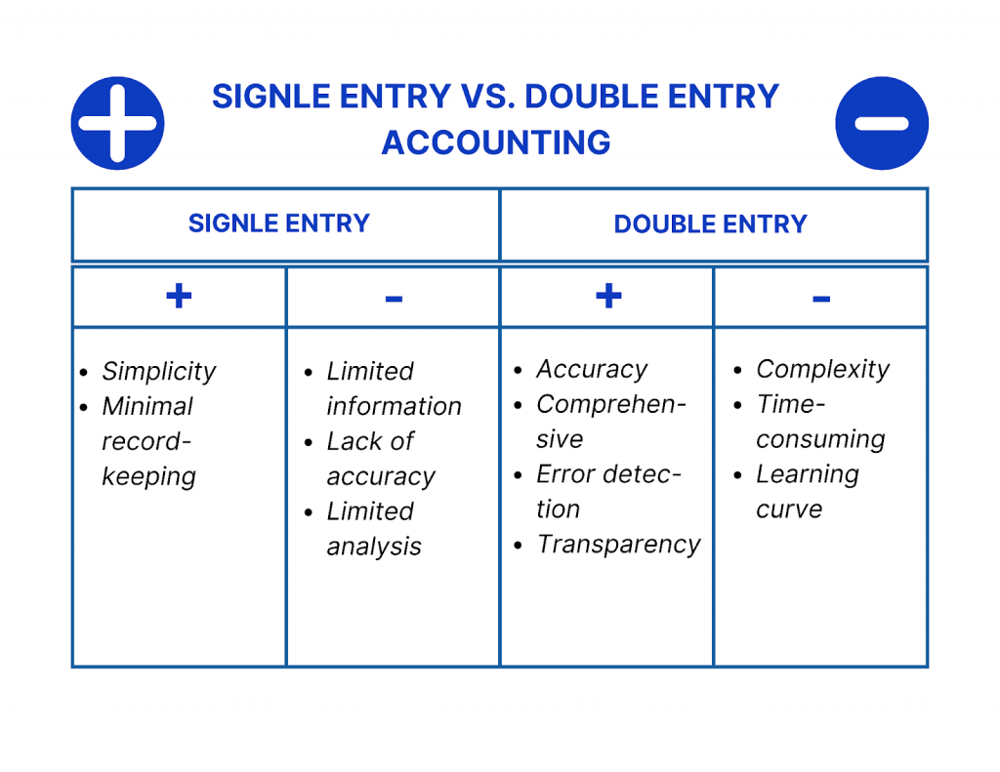

## Table of Contents

## What is double entry accounting?

Double entry accounting is a way of keeping track of money in a business. It means that every time money moves, you write it down in two places. If you spend money, you take it away from one account and add it to another. This helps make sure all the numbers add up correctly. It's like a balance scale, where one side goes down and the other goes up.

This system helps businesses see where their money is coming from and where it's going. It makes it easier to find mistakes because if the two sides don't match, you know something is wrong. It's used by many businesses because it gives a clear picture of their money situation. By using double entry accounting, businesses can keep better control of their finances and make smarter decisions.

## Why is double entry accounting important?

Double entry accounting is important because it helps businesses keep their money records accurate. When you use this system, every transaction is recorded in two places. This means if you buy something, you take money out of your cash account and put it into an expense account. This way, the total amount of money stays the same, but it moves from one place to another. It's like a check and balance system that makes sure all the numbers add up correctly. If they don't, it's a sign that there might be a mistake somewhere.

This system also gives businesses a clear picture of where their money is coming from and where it's going. It helps them see if they are making money or losing it. By looking at the accounts, business owners can make better decisions about how to spend their money and plan for the future. It's like having a map that shows you the financial health of your business. Without double entry accounting, it would be much harder to understand and manage your finances properly.

## How does double entry accounting work?

Double entry accounting works by recording every financial transaction in two different accounts. When you do something with money, like buying supplies, you take money out of one account, like your cash account, and put it into another account, like your supplies expense account. This means that for every transaction, one account goes down and another goes up by the same amount. It's like a seesaw where one side goes down and the other goes up, keeping everything balanced.

This system helps keep your financial records accurate because if the two sides don't match, you know there's a mistake somewhere. It's like having a built-in check to make sure all your numbers are correct. By using double entry accounting, you can see where your money is coming from and where it's going. This helps you understand if your business is making money or losing it, and it makes it easier to plan for the future.

## What are the basic principles of double entry accounting?

Double entry accounting follows a few basic principles to keep money records accurate. The first principle is that every financial transaction affects at least two accounts. If you buy something, you take money out of one account, like your cash account, and put it into another account, like your expenses account. This means that one account goes down and the other goes up by the same amount, keeping everything balanced.

Another principle is that the total amount of money in all the accounts should always be the same. If you add up all the money in all the accounts, it should equal zero because for every amount you take away from one account, you add to another. This helps you find mistakes because if the totals don't match, you know something is wrong.

These principles help businesses see where their money is coming from and where it's going. By using double entry accounting, business owners can make better decisions about how to spend their money and plan for the future. It's like having a map that shows you the financial health of your business.

## Can you explain the concept of debits and credits in double entry accounting?

In double entry accounting, debits and credits are like the two sides of a seesaw. When you make a transaction, one account gets a debit and another gets a credit. A debit means you add money to an account, and a credit means you take money away from an account. For example, if you buy supplies, you would debit your supplies expense account because you're adding to it, and credit your cash account because you're taking money away from it. The trick is that the amount you debit must always equal the amount you credit, keeping everything balanced.

Debits and credits work differently depending on the type of account. For accounts like assets and expenses, a debit increases the account and a credit decreases it. For example, if you buy a new computer, you would debit your computer asset account and credit your cash account. On the other hand, for accounts like liabilities, equity, and revenue, a credit increases the account and a debit decreases it. If you take out a loan, you would credit your loan liability account and debit your cash account. Understanding how debits and credits work with different accounts helps you keep your financial records accurate and see the flow of money in your business.

## What are the common accounts used in double entry accounting?

In double entry accounting, there are several common types of accounts that businesses use to keep track of their money. These include asset accounts, which hold things the business owns, like cash, inventory, and equipment. Liability accounts show what the business owes, such as loans and accounts payable. Equity accounts represent the owner's stake in the business, including investments and retained earnings. Revenue accounts track the money the business earns from sales or services, and expense accounts record the costs of running the business, like rent and utilities.

When using double entry accounting, you record transactions in these different accounts. For example, if you buy a new piece of equipment, you would increase (debit) your equipment asset account and decrease (credit) your cash asset account. If you take out a loan, you would increase (credit) your loan liability account and increase (debit) your cash asset account. By keeping track of these common accounts, businesses can see where their money is coming from and where it's going, helping them understand their financial health and make better decisions.

## How do you record transactions using double entry accounting?

When you record transactions using double entry accounting, you need to write down every money move in two places. If you buy something, you take money out of one account and put it into another. For example, if you spend $100 on office supplies, you take $100 out of your cash account and put $100 into your office supplies expense account. This means one account goes down and the other goes up by the same amount, keeping everything balanced. You use debits and credits to do this: a debit adds to an account, and a credit takes away from it. So, you would debit your office supplies expense account and credit your cash account.

This way of recording helps you keep track of where your money is going and where it's coming from. If you make a sale, you would increase your cash account and also increase your sales revenue account. For example, if you sell a product for $200, you would add $200 to your cash account and $200 to your sales revenue account. You do this by debiting your cash account and crediting your sales revenue account. By making sure that the total amount of debits equals the total amount of credits, you can find mistakes easily. If they don't match, you know something is wrong, and you can fix it to keep your financial records accurate.

## What are the advantages of using double entry accounting over single entry?

Double entry accounting is better than single entry because it gives a clearer picture of where money is coming from and where it's going. When you use double entry, every transaction gets recorded in two places, so if you spend money, you take it away from one account and add it to another. This helps you see the full story of your money, like how much you're spending on different things and how much you're making. With single entry, you only write down one side of the transaction, which makes it harder to understand your business's financial health. Double entry also makes it easier to find mistakes because if the two sides don't match, you know something is wrong.

Another advantage of double entry accounting is that it helps you keep your financial records accurate and up to date. Because every transaction is recorded in two places, it's like having a built-in check to make sure all your numbers add up correctly. This is important for making good business decisions because you need to know exactly where you stand financially. Single entry doesn't give you this level of detail and accuracy, which can lead to problems down the road. By using double entry, you can manage your money better and plan for the future with more confidence.

## How does double entry accounting help in detecting errors and fraud?

Double entry accounting helps in detecting errors and fraud by making sure every transaction is recorded in two places. If you buy something, you take money out of one account and put it into another. This means if you make a mistake or someone tries to do something wrong, it's easier to spot because the numbers won't match up. For example, if you spend $100 on supplies, you take $100 out of your cash account and add $100 to your supplies expense account. If these two amounts don't balance, you know something is wrong and can check your records to find the mistake or fraud.

This system also helps because it keeps a clear record of where money is coming from and where it's going. If someone tries to hide money or take it for themselves, it's harder to do without leaving a trace. For example, if an employee tries to steal cash, they would need to change two accounts to cover it up, which makes it more likely that someone will notice. By using double entry accounting, businesses can keep their financial records accurate and be more confident that they can catch any errors or fraud quickly.

## What are some real-world examples of double entry accounting in businesses?

A small bakery might use double entry accounting to keep track of its money. When the bakery buys flour for $50, it takes $50 out of its cash account and adds $50 to its supplies expense account. If the bakery sells a cake for $30, it adds $30 to its cash account and $30 to its sales revenue account. By doing this, the bakery can see exactly where its money is going and coming from, helping it know if it's making a profit or not. If the numbers don't match up, the bakery owner knows to check for mistakes or possible fraud.

A tech startup might use double entry accounting when it gets a loan for $10,000. It adds $10,000 to its cash account and $10,000 to its loan liability account. When the startup pays back $2,000 of the loan, it takes $2,000 out of its cash account and $2,000 out of its loan liability account. This helps the startup keep track of its debts and make sure it has enough money to pay them back. By using double entry accounting, the startup can manage its finances better and plan for future growth.

## How has double entry accounting evolved with modern accounting software?

Double entry accounting has changed a lot with modern accounting software. Before, people used to write everything down in big books by hand. Now, with computers, you can use programs like QuickBooks or Xero to keep track of your money. These programs do the double entry for you automatically. When you enter a transaction, the software puts the numbers in the right places, so you don't have to worry about making mistakes. It also makes it easier to see all your accounts at once and find any problems quickly.

These software tools also help businesses do more than just keep records. They can make reports that show you how your business is doing, like how much money you're making or spending. You can also connect them to your bank account, so your transactions show up in the software right away. This makes it easier to keep everything up to date and helps you see the big picture of your money. With these tools, businesses can manage their finances better and make smarter decisions.

## What are the challenges and limitations of implementing double entry accounting in complex organizations?

In big and complicated businesses, using double entry accounting can be hard. One challenge is that there are a lot of transactions to keep track of. When you have many different parts of the business, like different stores or departments, it can be tough to make sure all the numbers are right. You need good systems and people who know what they're doing to handle all the details. If you don't, you might miss mistakes or not catch fraud quickly.

Another problem is that the rules for accounting can be different in different countries or industries. This makes it hard to use the same system everywhere in a big company. You might need special software or people who understand these different rules. Also, keeping everything up to date can be a lot of work. If you don't do it right, it can be hard to make good decisions about the business because you won't have the right information.

## What is the Double Entry System?

The double-entry system is a cornerstone of modern accounting practices, ensuring that every financial transaction is accurately recorded and balanced. This system requires that each transaction be entered twice, as a debit in one account and a corresponding credit in another, maintaining the equilibrium of the accounting equation: 

$$
\text{Assets} = \text{Liabilities} + \text{Equity}
$$

This equation is fundamental, as it provides a clear framework within which financial data is organized and verified. By mandating that total debits and credits always match, the double-entry system helps prevent errors and inconsistencies in financial records. This rigorous structure enhances the reliability of financial statements and supports error detection, offering a self-checking mechanism that highlights discrepancies automatically. 

Historically, the double-entry system has been pivotal in the evolution of accounting. Its origins trace back to the Renaissance, with the first documented description found in Luca Pacioli's 1494 work, "Summa de Arithmetica, Geometria, Proportioni et Proportionalità." This system's introduction revolutionized the way businesses tracked their financial activities, laying the foundation for modern accounting principles.

A fundamental aspect of the double-entry system is the ledger, where all debits and credits are recorded. The ledger is divided into different accounts, each representing a specific aspect of the business, such as cash, inventory, and accounts payable. This categorization helps in understanding the financial position and performance of a business by providing detailed insights into each component of the accounting equation.

Implementing the double-entry system requires a disciplined approach to data entry, as accuracy in recording each transaction affects the overall integrity of the financial statements. Errors in this system typically manifest as imbalances in the accounting records, signaling the need for review and correction.

In practice, this system not only aids in maintaining financial accuracy but also strengthens decision-making processes by offering a clear and comprehensive view of the organization's financial health. With the advent of technology, accounting software now automates many aspects of this system, enhancing efficiency while preserving the rigorous standards of double-entry bookkeeping.

 to Algo Trading

Algorithmic trading, commonly referred to as algo trading, involves the use of computer programs to execute trades in financial markets based on a set of pre-defined rules or algorithms. This technology-driven approach has revolutionized the trading landscape, offering significant advantages in terms of speed, precision, and the ability to process vast amounts of data.

At its core, algo trading works by feeding algorithms with market data, such as price, [volume](/wiki/volume-trading-strategy), and timing, and using this information to determine when and what trades to execute. These algorithms can range from simple strategies based on technical indicators to complex [machine learning](/wiki/machine-learning) models that predict market movements. The primary benefits of algo trading lie in its capacity to handle multiple variables simultaneously, allowing traders to analyze and act on numerous markets at once. This capability surpasses human traders, who are naturally limited in their ability to process diverse and concurrent information streams.

The speed of execution is a hallmark of algo trading. Algorithms can initiate transactions in fractions of a second, well before human reflexes could respond to the same data. This speed is particularly advantageous in markets where prices can change rapidly within moments, enabling traders to capitalize on fleeting opportunities. Furthermore, the precision of these algorithms reduces the likelihood of human error, ensuring that trades are executed exactly as intended under the specified conditions.

Algo trading has exhibited a profound influence on modern financial markets, contributing to increased market [liquidity](/wiki/liquidity-risk-premium) and tighter spreads. High-frequency trading ([HFT](/wiki/high-frequency-trading-strategies)), a subset of algo trading, exemplifies this impact as it involves executing a large number of orders at extremely fast speeds. Though profitable, HFT and other algo trading strategies have also been associated with certain risks, including increased market [volatility](/wiki/volatility-trading-strategies) and the potential for systemic issues, as demonstrated by occurrences like the 2010 Flash Crash.

Despite these challenges, the advantages and efficiency brought by algo trading continue to encourage its growth. Financial institutions and individual traders alike are increasingly adopting algorithmic strategies to stay competitive. The integration of [artificial intelligence](/wiki/ai-artificial-intelligence) and machine learning techniques has further expanded the possibilities, allowing for more sophisticated predictive models that can adapt to changing market conditions.

In conclusion, [algorithmic trading](/wiki/algorithmic-trading) represents a cutting-edge approach to trading, characterized by technological sophistication and strategic precision. Its capacity to enhance execution speed, accuracy, and market analysis renders it an invaluable tool for modern financial practitioners seeking to optimize their trading operations. As technology continues to progress, the influence and utilization of algo trading within the financial sector are poised to grow even further.

## How can we integrate financial systems?

Integrating bookkeeping, a double-entry system, and algorithmic trading constitutes a powerful financial framework that enhances organizational efficiency. This integration facilitates informed strategic decision-making by offering a comprehensive view of financial standing, ultimately serving as a critical asset in the fast-paced business environment.

Modern financial systems necessitate real-time processing and analysis of large datasets, a task well suited to the integration of bookkeeping and algo trading. Bookkeeping, which handles the diligent recording of financial transactions, when integrated with a double-entry system, ensures high accuracy through its method of recording transactions as debits in one account and credits in another. This method is consistent with the accounting equation: 

$$
\text{Assets} = \text{Liabilities} + \text{Equity}
$$

In conjunction, algo trading introduces automation and speed, analyzing market conditions and executing trades with precision. This amalgamation of traditional and emerging financial methodologies offers businesses unparalleled capacity to handle real-time transaction data while remaining adaptive to evolving market trends.

Several technological tools facilitate the seamless integration of these components. Enterprise Resource Planning (ERP) systems are at the forefront of this transformation, offering modules specifically designed for accounting and financial management that ensure data consistency across organizational functions. These integrated systems support real-time data synchronization and provide a unified platform for financial reporting and analysis. 

Moreover, API (Application Programming Interface) integrations enable different financial tools and software to communicate effectively, allowing for automated data transfer and analysis. This connectivity ensures that bookkeeping data can be directly fed into algo trading systems, optimizing the decision-making processes. With the increasing adoption of cloud computing, businesses can leverage these technologies with increased accessibility and reduced infrastructural costs, while also ensuring data security and compliance through advanced encryption methods and regular system updates.

In summary, integrating bookkeeping, a double-entry system, and algorithmic trading presents substantial advantages by enhancing financial visibility and operational agility. This fusion empowers businesses to not only keep pace with real-time transaction demands but also adapt swiftly to market fluctuations, cementing it as an essential strategy for modern financial management.

## References & Further Reading

[1]: Luca Pacioli (1494). ["Summa de Arithmetica, Geometria, Proportioni et Proportionalità."](https://archive.org/details/summa-de-arithmetica-geometria-proportioni-et-proportionalita) 

[2]: Appel, Gerald (2005). ["Technical Analysis: Power Tools for Active Investors"](https://www.amazon.com/Technical-Analysis-Power-Active-Investors/dp/0132930048) by Gerald Appel.

[3]: Murphy, John J. (1999). ["Technical Analysis of the Financial Markets: A Comprehensive Guide to Trading Methods and Applications"](https://archive.org/details/technicalanalysi0000murp) by John J. Murphy.

[4]: Hull, John C. (2018). ["Options, Futures, and Other Derivatives"](https://www-2.rotman.utoronto.ca/~hull/ofod/index.html) by John C. Hull.

[5]: Patterson, Scott (2010). ["The Quants: How a New Breed of Math Whizzes Conquered Wall Street and Nearly Destroyed It"](https://link.springer.com/content/pdf/10.1057/be.2010.20.pdf) by Scott Patterson.

[6]: Chan, Ernest P. (2009). ["Quantitative Trading: How to Build Your Own Algorithmic Trading Business"](https://github.com/ftvision/quant_trading_echan_book) by Ernest P. Chan.

[7]: Lopez de Prado, Marcos (2018). ["Advances in Financial Machine Learning"](https://www.amazon.com/Advances-Financial-Machine-Learning-Marcos/dp/1119482089) by Marcos Lopez de Prado.

[8]: Jansen, Stefan (2020). ["Machine Learning for Algorithmic Trading"](https://github.com/stefan-jansen/machine-learning-for-trading) by Stefan Jansen.