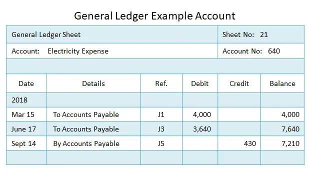

## Table of Contents

## What is double-entry bookkeeping?

Double-entry bookkeeping is a way to keep track of money in a business. It works by making sure every transaction is recorded twice, once as a debit and once as a credit. This means if you spend money, you record it as a debit in one account and a credit in another account. This system helps make sure all the money is accounted for and helps find mistakes easily.

The main idea behind double-entry bookkeeping is that the total amount of debits must always equal the total amount of credits. This balance helps keep the books accurate. For example, if you buy a new computer for your business, you would debit your equipment account because you now own more equipment, and credit your cash account because you spent money. This way, the total value of what your business owns stays the same, just in different forms.

## How does double-entry bookkeeping differ from single-entry bookkeeping?

Double-entry bookkeeping and single-entry bookkeeping are two different ways to keep track of money in a business. Double-entry bookkeeping records every transaction twice, as a debit in one account and a credit in another. This means if you buy something, you record it as a debit in the asset account and a credit in the cash account. This system helps make sure all the money is accounted for and makes it easier to find mistakes because the total debits must equal the total credits.

Single-entry bookkeeping, on the other hand, is much simpler. It only records transactions once, usually in a cash book. For example, if you buy something, you just write down that you spent money. This method is easier to use but doesn't give a full picture of the business's financial health. It's harder to track where the money is going and to find errors because there's no balancing of debits and credits.

In summary, double-entry bookkeeping provides a more complete and accurate view of a business's finances by recording each transaction in two places. Single-entry bookkeeping is simpler and quicker but lacks the detail and accuracy needed for a thorough financial analysis. Businesses often choose double-entry bookkeeping for its ability to maintain balanced and detailed records.

## What is a general ledger and how does it relate to double-entry bookkeeping?

A general ledger is like a big notebook where a business keeps track of all its money. It has different sections, called accounts, for things like cash, sales, and expenses. Each account in the general ledger shows how much money is coming in and going out for that specific part of the business. The general ledger is important because it gives a complete picture of the business's finances all in one place.

In double-entry bookkeeping, every time money moves, it gets recorded twice in the general ledger. For example, if you buy a computer, you would record it as a debit in the equipment account because you now have more equipment, and a credit in the cash account because you spent money. This way, the general ledger keeps everything balanced. The total amount of debits must always equal the total amount of credits, which helps make sure all the money is accounted for and makes it easier to find mistakes. So, the general ledger is where you can see all these double entries happening, making it a key part of double-entry bookkeeping.

## Can you explain the basic principle of double-entry bookkeeping?

Double-entry bookkeeping is a way to keep track of money in a business. The basic principle is that every time money moves, you write it down twice. If you spend money, you record it as a debit in one account and a credit in another account. This means if you buy something, you add it to the account for what you bought and take it away from your cash account. This system makes sure all the money is accounted for because the total amount of debits must always equal the total amount of credits.

This balance helps keep the books accurate and makes it easier to find mistakes. For example, if you buy a new computer, you would debit your equipment account because you now own more equipment, and credit your cash account because you spent money. This way, the total value of what your business owns stays the same, just in different forms. Double-entry bookkeeping gives a clear picture of where the money is going and coming from, which is important for understanding the financial health of a business.

## What are the key components of a general ledger entry in double-entry bookkeeping?

In double-entry bookkeeping, a general ledger entry has two main parts: a debit and a credit. When you make a transaction, you record it in two different accounts. One account gets a debit, which means you add money or value to it. The other account gets a credit, which means you take money or value away from it. For example, if you buy office supplies, you would debit the office supplies account because you now have more supplies, and credit the cash account because you spent money.

The date of the transaction is also an important part of a general ledger entry. You write down when the transaction happened so you can keep track of everything in order. Along with the date, you need to write a description of what the transaction was about. This helps you remember why the money moved and makes it easier to find information later. Together, the debit, credit, date, and description make up a complete general ledger entry in double-entry bookkeeping.

## How do debits and credits work in double-entry bookkeeping?

In double-entry bookkeeping, every time money moves, you record it twice. One part of the record is called a debit, and the other part is called a credit. A debit means you add money or value to an account. For example, if you buy a new computer, you would debit the equipment account because you now own more equipment. A credit means you take money or value away from an account. In the same example, you would credit the cash account because you spent money.

The key thing to remember is that debits and credits must always balance out. If you debit one account, you must credit another account by the same amount. This balance helps make sure all the money is accounted for and makes it easier to find mistakes. So, if you spend $1,000 on a computer, you would debit equipment by $1,000 and credit cash by $1,000. This way, the total value of what your business owns stays the same, just in different forms.

## What are some common accounts used in the general ledger?

In a general ledger, businesses use different accounts to keep track of their money. Some common accounts include the cash account, which shows how much money the business has in hand or in the bank. The accounts receivable account keeps track of money that customers owe the business. The inventory account shows the value of products the business has for sale. The equipment account records the value of things like computers and machines that the business owns.

There are also accounts for things the business owes, like the accounts payable account, which tracks money the business owes to suppliers. The loans payable account keeps track of money the business has borrowed. For income, the sales revenue account records money coming in from selling products or services. On the expense side, the rent expense account tracks money spent on rent, and the utilities expense account keeps track of costs for things like electricity and water. All these accounts help give a clear picture of the business's financial health.

## How do you record transactions in the general ledger using double-entry bookkeeping?

When you record transactions in the general ledger using double-entry bookkeeping, you need to remember that every transaction affects two accounts. If you buy something, you add it to one account as a debit and take it away from another account as a credit. For example, if you buy a new computer for your business, you would debit the equipment account because you now have more equipment. At the same time, you would credit the cash account because you spent money. This way, the total value of what your business owns stays the same, but it's just in different forms.

To make a general ledger entry, you start by writing down the date of the transaction. Then, you write a description of what the transaction was about, like "Purchased new computer." Next, you record the debit and the credit. In our example, you would write "Debit Equipment $1,000" and "Credit Cash $1,000." This makes sure that the total amount of debits equals the total amount of credits, which is the key to double-entry bookkeeping. By doing this for every transaction, you keep your books balanced and can easily track where your money is going and coming from.

## What are the benefits of using double-entry bookkeeping in the general ledger?

Double-entry bookkeeping in the general ledger helps businesses keep their money records accurate. By recording every transaction twice, as a debit in one account and a credit in another, it makes sure all the money is accounted for. If you buy something, you add it to one account and take it away from another. This system helps find mistakes easily because the total amount of debits must always equal the total amount of credits. If they don't match, you know something is wrong and can fix it.

Using double-entry bookkeeping also gives a clear picture of where the money is going and coming from. This helps business owners understand their financial health better. They can see how much they own, how much they owe, and how much they are making or spending. This detailed view is important for making good decisions about the business. It's like having a map that shows you exactly where you are financially, which can help you plan for the future and grow your business.

## How can errors be identified and corrected in a double-entry bookkeeping system?

In a double-entry bookkeeping system, errors can be identified by checking if the total debits equal the total credits. If they don't match, there's a mistake somewhere. You can also look at each account to see if the numbers make sense. For example, if your cash account shows you have more money than you actually do, you know something is wrong. Another way to find errors is by using a trial balance, which is a list of all the accounts and their balances. If the trial balance doesn't balance, you need to find and fix the error.

To correct errors, you need to find out what went wrong. If you find a mistake, you can make a correcting entry. For example, if you accidentally debited the wrong account, you would make a new entry to credit the wrong account and debit the right one. Sometimes, errors are just simple math mistakes, and you can fix them by going back and doing the math again. Keeping good records and checking your work often can help you catch and fix errors before they cause big problems.

## What advanced techniques can be used to enhance double-entry bookkeeping in the general ledger?

One advanced technique to enhance double-entry bookkeeping in the general ledger is using accounting software. This software can automatically record transactions as debits and credits, making it easier to keep everything balanced. It also helps by doing the math for you and catching mistakes quickly. With accounting software, you can also make reports that show you how your business is doing financially, which helps you make better decisions. It's like having a smart helper that keeps your books neat and accurate.

Another technique is using sub-ledgers. Sub-ledgers are like smaller notebooks that keep track of specific parts of your business, like sales or inventory. They feed into the general ledger, making it easier to manage detailed information. For example, a sales sub-ledger can track every sale you make, and then that information goes into the general ledger. This way, you can see the big picture in the general ledger and the details in the sub-ledgers. It helps keep your records organized and makes it easier to find information when you need it.

## How does double-entry bookkeeping integrate with modern accounting software and systems?

Double-entry bookkeeping works well with modern accounting software because the software can do the recording for you. When you enter a transaction, the software automatically makes a debit in one account and a credit in another. This helps keep everything balanced and makes it easier to find mistakes. The software also does the math for you, so you don't have to worry about adding up numbers wrong. It's like having a smart helper that keeps your books neat and accurate.

Using accounting software also makes it easier to make reports that show how your business is doing financially. These reports can help you see where your money is going and coming from, which is important for making good decisions about your business. The software can also connect with other systems, like your bank or your inventory management, so all your financial information is in one place. This makes it easier to keep track of everything and helps you run your business more smoothly.

## What is Double-Entry Bookkeeping and How Does it Work?

Double-entry bookkeeping is a foundational accounting method that requires each financial transaction to be recorded twice: once as a debit in one account and once as a credit in another. This dual-entry system is instrumental in maintaining the accounting equation, which is expressed as:

$$
\text{Assets} = \text{Liabilities} + \text{Equity}
$$

By ensuring that the sum of debits equals the sum of credits, double-entry bookkeeping significantly reduces the risk of errors and enhances financial transparency. This practice helps in spotting discrepancies that might indicate accounting errors or fraud, thereby promoting rigorous financial standards.

The system of double-entry bookkeeping can be traced back to the Renaissance period, largely credited to the work of Italian mathematician and Franciscan friar Luca Pacioli. His treatise "Summa de Arithmetica, Geometria, Proportioni et Proportionalità", published in 1494, provided one of the first comprehensive descriptions of this method. Pacioli's bookkeeping methodology laid the groundwork for current standardized accounting practices and remains a critical tool for accountants in ensuring accurate and reliable financial records.

In today's business environment, double-entry bookkeeping is central to corporate financial reporting and compliance with international accounting standards. It supports the preparation of financial statements, such as the balance sheet and income statement, which are pivotal for informed decision-making by management and stakeholders. The method's enduring relevance is evidenced by its ability to adapt to technological advancements in accounting software, further enhancing its accuracy and efficiency in financial management.

## What is the Role of the General Ledger?

The general ledger serves as the central repository for a company's financial transactions, systematically organizing data to ensure comprehensive financial tracking. Functioning as the backbone of the accounting system, it records debits and credits for every transaction, thereby maintaining the integrity of the accounting equation:

$$
\text{Assets} = \text{Liabilities} + \text{Equity}
$$

This equation is crucial for verifying the accuracy of a company's financial statements and providing a clear financial overview. By logging all transactional entries, the general ledger enables precision in tracking assets, liabilities, and equity. Each account within the ledger corresponds to a distinct type of financial activity, such as sales, expenses, assets, or liabilities, ensuring detailed categorization.

The organized structure of the general ledger aids in preparing essential financial statements, such as the balance sheet and income statement, by summarizing detailed financial transactions. It ensures that all credits and debits are meticulously balanced, which is vital for transparent financial reporting. This balance is achieved through the double-entry bookkeeping system, which requires each transaction to be recorded in at least two different accounts—one as a debit and the other as a credit. This system reduces the likelihood of errors and fraud by providing a self-checking mechanism.

Moreover, the general ledger supports strategic financial planning by offering insights that facilitate the analysis of financial health. Businesses can leverage this information to make informed decisions, anticipate future financial scenarios, and ensure compliance with financial standards and regulations.

In summary, the general ledger is indispensable for maintaining accurate and reliable financial records, balancing accounts, and offering insights necessary for strategic financial management.

## How can one integrate algorithmic trading?

Algorithmic trading (or algo trading) employs sophisticated computer algorithms to automate trade execution based on well-defined parameters such as time, price, and [volume](/wiki/volume-trading-strategy). The primary advantage of this approach lies in its ability to provide speed and precision that far exceed human capabilities, enabling traders to capitalize on market opportunities almost instantaneously.

Integrating [algorithmic trading](/wiki/algorithmic-trading) with traditional accounting systems, such as double-entry bookkeeping and the general ledger, yields significant benefits both in trading activities and financial health transparency. By combining these frameworks, businesses can maintain a consistent and comprehensive view of their financial data in real time.

Double-entry bookkeeping ensures that each financial transaction is recorded as two corresponding entries in the accounting records, maintaining the equilibrium in the accounting equation: 

$$
\text{Assets} = \text{Liabilities} + \text{Equity}
$$

By feeding trading data from algorithmic systems into a company's general ledger, firms can seamlessly update their financial records to reflect market activities. For instance, upon executing a trade, the corresponding increase in assets (e.g., securities purchased) and decrease in cash (funds expended) can automatically update the general ledger, ensuring immediate reconciliation of accounts.

This synchronization fosters an environment ripe for strategic automated trading decisions, enabling companies to monitor their real-time financial position accurately. Such integration facilitates rapid analysis, aiding in [liquidity](/wiki/liquidity-risk-premium) management, risk assessment, and compliance with financial reporting standards. 

Consider the following Python script as an example of how algorithmic trading data can be integrated into an accounting system to automate updates to a general ledger following each trade:

```python
# Example Python script for integrating algo trading with accounting

def update_ledger(trade_data, ledger):
    # Assuming trade_data is a dictionary with trade details
    # and ledger is a simple representation of the general ledger

    trade_id = trade_data['trade_id']
    asset_type = trade_data['asset']
    quantity = trade_data['quantity']
    price = trade_data['price_per_unit']
    total_value = quantity * price

    # Determine entries for the double-entry bookkeeping
    cash_entry = {
        'description': f'Cash outflow for trade {trade_id}',
        'debit': 0,
        'credit': total_value
    }

    asset_entry = {
        'description': f'Asset acquisition for trade {trade_id}',
        'debit': total_value,
        'credit': 0
    }

    # Update ledger
    ledger['cash'].append(cash_entry)
    ledger[asset_type].append(asset_entry)

# Example usage
ledger = {
    'cash': [],
    'stocks': []
}

trade_data = {
    'trade_id': 'T001',
    'asset': 'stocks',
    'quantity': 100,
    'price_per_unit': 50
}

update_ledger(trade_data, ledger)
```

By integrating algorithmic trading systems with double-entry bookkeeping and the general ledger in such a manner, businesses can enhance their financial monitoring and capitalize on emergent market strategies with unprecedented efficiency.

## References & Further Reading

Investopedia is a well-regarded resource that provides detailed explanations and articles on a wide array of accounting and financial terms and concepts. Its comprehensive library makes it an ideal starting point for anyone looking to gain a practical understanding of financial topics such as double-entry bookkeeping and the use of general ledgers.

Luca Pacioli's work, "Summa de Arithmetica," is noted for documenting the earliest descriptions of double-entry bookkeeping. Pacioli's treatise laid the foundation for modern accounting practices and remains a critical reference for understanding the evolution of bookkeeping methods.

For those interested in algorithmic trading and modern financial systems, several [books](/wiki/algo-trading-books) offer insights into the strategies and technological advancements shaping this field. "Quantitative Trading" provides a detailed overview of data-driven trading strategies, while "Machine Learning for Algorithmic Trading" explores how [machine learning](/wiki/machine-learning) techniques can be applied to develop advanced trading algorithms. These resources are invaluable for practitioners seeking to integrate algorithmic trading with financial record-keeping systems to enhance decision-making and operational efficiency.

Together, these references offer a rich repository of knowledge that supports the integration of traditional accounting practices with the innovative strategies employed in algorithmic trading, providing a holistic view of modern financial management.

