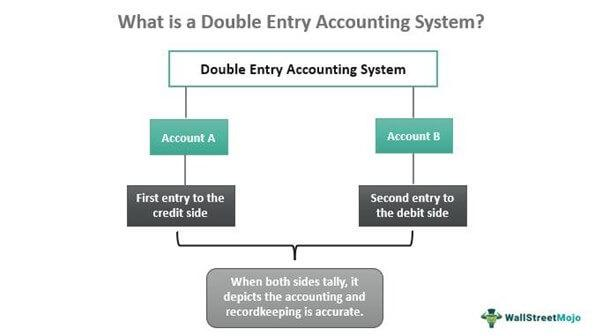

In the rapidly evolving financial landscape, understanding key accounting methods is essential for effective financial management. As financial markets and business operations become increasingly complex, robust accounting practices stand as the backbone of accurate financial decision-making. This article explores the intricacies of double-entry bookkeeping, the role of the general ledger, and examines how these foundational accounting principles intersect with the cutting-edge world of algorithmic trading.

Double-entry bookkeeping is a crucial element that ensures each financial transaction is recorded in two corresponding accounts, maintaining the balance of the basic accounting equation, assets = liabilities + equity. This dual recording system reduces errors and enhances transparency, allowing businesses to maintain a consistent representation of their financial status. The general ledger, on the other hand, serves as the core database for all financial data, from expenses and revenues to assets and liabilities, providing a comprehensive view of a company’s accounts.



In recent years, the integration of algorithmic trading into financial systems has marked a transformative leap. Algorithmic trading employs algorithms to execute trades swiftly and accurately, surpassing human capabilities in speed and precision. By incorporating these algorithms with traditional accounting methods such as double-entry bookkeeping and using a general ledger, businesses can achieve comprehensive, real-time insights into trading activities and financial health.

The intersection of these systems equips businesses with the tools for not only maintaining compliance and accuracy but also fostering efficiency and strategic decision-making. As a result, integrating traditional accounting practices with modern innovations like algorithmic trading offers businesses a powerful framework for precision and strategic market engagement, propelling growth and ensuring stability in a dynamically changing financial environment.

## Table of Contents

## Understanding Double-Entry Bookkeeping

Double-entry bookkeeping is a foundational accounting method that requires each financial transaction to be recorded twice: once as a debit in one account and once as a credit in another. This dual-entry system is instrumental in maintaining the accounting equation, which is expressed as:

$$
\text{Assets} = \text{Liabilities} + \text{Equity}
$$

By ensuring that the sum of debits equals the sum of credits, double-entry bookkeeping significantly reduces the risk of errors and enhances financial transparency. This practice helps in spotting discrepancies that might indicate accounting errors or fraud, thereby promoting rigorous financial standards.

The system of double-entry bookkeeping can be traced back to the Renaissance period, largely credited to the work of Italian mathematician and Franciscan friar Luca Pacioli. His treatise "Summa de Arithmetica, Geometria, Proportioni et Proportionalità", published in 1494, provided one of the first comprehensive descriptions of this method. Pacioli's bookkeeping methodology laid the groundwork for current standardized accounting practices and remains a critical tool for accountants in ensuring accurate and reliable financial records.

In today's business environment, double-entry bookkeeping is central to corporate financial reporting and compliance with international accounting standards. It supports the preparation of financial statements, such as the balance sheet and income statement, which are pivotal for informed decision-making by management and stakeholders. The method's enduring relevance is evidenced by its ability to adapt to technological advancements in accounting software, further enhancing its accuracy and efficiency in financial management.

## The Role of the General Ledger

The general ledger serves as the central repository for a company's financial transactions, systematically organizing data to ensure comprehensive financial tracking. Functioning as the backbone of the accounting system, it records debits and credits for every transaction, thereby maintaining the integrity of the accounting equation:

$$
\text{Assets} = \text{Liabilities} + \text{Equity}
$$

This equation is crucial for verifying the accuracy of a company's financial statements and providing a clear financial overview. By logging all transactional entries, the general ledger enables precision in tracking assets, liabilities, and equity. Each account within the ledger corresponds to a distinct type of financial activity, such as sales, expenses, assets, or liabilities, ensuring detailed categorization.

The organized structure of the general ledger aids in preparing essential financial statements, such as the balance sheet and income statement, by summarizing detailed financial transactions. It ensures that all credits and debits are meticulously balanced, which is vital for transparent financial reporting. This balance is achieved through the double-entry bookkeeping system, which requires each transaction to be recorded in at least two different accounts—one as a debit and the other as a credit. This system reduces the likelihood of errors and fraud by providing a self-checking mechanism.

Moreover, the general ledger supports strategic financial planning by offering insights that facilitate the analysis of financial health. Businesses can leverage this information to make informed decisions, anticipate future financial scenarios, and ensure compliance with financial standards and regulations.

In summary, the general ledger is indispensable for maintaining accurate and reliable financial records, balancing accounts, and offering insights necessary for strategic financial management.

## Integrating Algorithmic Trading

Algorithmic trading (or algo trading) employs sophisticated computer algorithms to automate trade execution based on well-defined parameters such as time, price, and [volume](/wiki/volume-trading-strategy). The primary advantage of this approach lies in its ability to provide speed and precision that far exceed human capabilities, enabling traders to capitalize on market opportunities almost instantaneously.

Integrating [algorithmic trading](/wiki/algorithmic-trading) with traditional accounting systems, such as double-entry bookkeeping and the general ledger, yields significant benefits both in trading activities and financial health transparency. By combining these frameworks, businesses can maintain a consistent and comprehensive view of their financial data in real time.

Double-entry bookkeeping ensures that each financial transaction is recorded as two corresponding entries in the accounting records, maintaining the equilibrium in the accounting equation: 

$$
\text{Assets} = \text{Liabilities} + \text{Equity}
$$

By feeding trading data from algorithmic systems into a company's general ledger, firms can seamlessly update their financial records to reflect market activities. For instance, upon executing a trade, the corresponding increase in assets (e.g., securities purchased) and decrease in cash (funds expended) can automatically update the general ledger, ensuring immediate reconciliation of accounts.

This synchronization fosters an environment ripe for strategic automated trading decisions, enabling companies to monitor their real-time financial position accurately. Such integration facilitates rapid analysis, aiding in [liquidity](/wiki/liquidity-risk-premium) management, risk assessment, and compliance with financial reporting standards. 

Consider the following Python script as an example of how algorithmic trading data can be integrated into an accounting system to automate updates to a general ledger following each trade:

```python
# Example Python script for integrating algo trading with accounting

def update_ledger(trade_data, ledger):
    # Assuming trade_data is a dictionary with trade details
    # and ledger is a simple representation of the general ledger

    trade_id = trade_data['trade_id']
    asset_type = trade_data['asset']
    quantity = trade_data['quantity']
    price = trade_data['price_per_unit']
    total_value = quantity * price

    # Determine entries for the double-entry bookkeeping
    cash_entry = {
        'description': f'Cash outflow for trade {trade_id}',
        'debit': 0,
        'credit': total_value
    }

    asset_entry = {
        'description': f'Asset acquisition for trade {trade_id}',
        'debit': total_value,
        'credit': 0
    }

    # Update ledger
    ledger['cash'].append(cash_entry)
    ledger[asset_type].append(asset_entry)

# Example usage
ledger = {
    'cash': [],
    'stocks': []
}

trade_data = {
    'trade_id': 'T001',
    'asset': 'stocks',
    'quantity': 100,
    'price_per_unit': 50
}

update_ledger(trade_data, ledger)
```

By integrating algorithmic trading systems with double-entry bookkeeping and the general ledger in such a manner, businesses can enhance their financial monitoring and capitalize on emergent market strategies with unprecedented efficiency.

## Benefits and Challenges

Integrating double-entry bookkeeping, the general ledger, and algorithmic trading systems yields significant benefits for financial management. The accuracy inherent in double-entry bookkeeping minimizes errors in transaction processing, ensuring that assets, liabilities, and equity are consistently balanced. This precision is critical in maintaining financial transparency and compliance with accounting standards. When aligned with algorithmic trading, businesses can leverage sophisticated data analysis to gain strategic insights from financial transactions and market behaviors. The capability to execute trades with speed and accuracy surpasses human limitations, offering a competitive edge in financial markets.

However, certain challenges accompany the integration of these systems. Initiating such an integration involves substantial initial costs, including the development and deployment of the necessary technological infrastructure. Organizations must also invest in robust cybersecurity measures to protect sensitive financial data from potential breaches. These measures are essential to safeguard against the increasing sophistication of cyber threats targeting financial systems. Furthermore, ongoing maintenance is crucial to ensure system integrity and compliance with evolving financial regulations. 

To overcome these challenges and optimize the integration of financial systems, businesses must adopt strategic approaches. This involves careful planning and resource allocation to balance technology costs with expected benefits. Additionally, implementing rigorous cybersecurity protocols, such as encryption and multi-[factor](/wiki/factor-investing) authentication, can mitigate the risk of data breaches. Finally, continuous monitoring and updating of the system will maintain its integrity, ensuring it adapts to regulatory changes and technological advancements. By effectively navigating these challenges, organizations can fully realize the advantages of integrated financial systems, such as improved decision-making capabilities and enhanced market competitiveness.

## Conclusion

The integration of double-entry bookkeeping, the general ledger, and algorithmic trading systems offers a substantial advancement in modern financial management techniques. This integration builds a comprehensive framework that not only supports adherence to traditional accounting standards but also empowers businesses to engage more strategically in dynamic market environments. By merging these systems, organizations can achieve improved clarity and accuracy in their financial data management, enabling real-time insights that are crucial for making informed decisions swiftly.

As the pace of business operations accelerates, the ability to maintain up-to-date and precise financial records becomes essential. Double-entry bookkeeping ensures that financial transactions are recorded with integrity, maintaining the balance of the accounting equation. Utilizing the general ledger as the central repository of these records guarantees that all transactions are consistently verified against both debits and credits, enhancing the overall reliability of financial statements.

The strategic application of algorithmic trading further complements traditional accounting methods. By harnessing algorithms in trade execution, businesses gain a competitive edge through the ability to react to market changes with speed and precision that far exceeds manual capacities. This system allows for the seamless synchronization of financial and trading activities, providing a holistic view of a company’s financial health and trading position in near real-time.

Navigating the complexities of these integrated systems presents challenges, including the initial investment and the necessity for continuous system updates and cybersecurity measures. However, the benefits of enhanced accuracy, efficiency, and strategic market engagement far outweigh these challenges. As businesses seek to thrive in ever-evolving market conditions, embracing this interconnected approach will be an integral catalyst for sustained growth and stability. Organizations that leverage these integrated methodologies are better equipped to handle the pressures of modern financial environments and maximize opportunities for expansion and success.

## References & Further Reading

Investopedia is a well-regarded resource that provides detailed explanations and articles on a wide array of accounting and financial terms and concepts. Its comprehensive library makes it an ideal starting point for anyone looking to gain a practical understanding of financial topics such as double-entry bookkeeping and the use of general ledgers.

Luca Pacioli's work, "Summa de Arithmetica," is noted for documenting the earliest descriptions of double-entry bookkeeping. Pacioli's treatise laid the foundation for modern accounting practices and remains a critical reference for understanding the evolution of bookkeeping methods.

For those interested in algorithmic trading and modern financial systems, several [books](/wiki/algo-trading-books) offer insights into the strategies and technological advancements shaping this field. "Quantitative Trading" provides a detailed overview of data-driven trading strategies, while "Machine Learning for Algorithmic Trading" explores how [machine learning](/wiki/machine-learning) techniques can be applied to develop advanced trading algorithms. These resources are invaluable for practitioners seeking to integrate algorithmic trading with financial record-keeping systems to enhance decision-making and operational efficiency.

Together, these references offer a rich repository of knowledge that supports the integration of traditional accounting practices with the innovative strategies employed in algorithmic trading, providing a holistic view of modern financial management.

