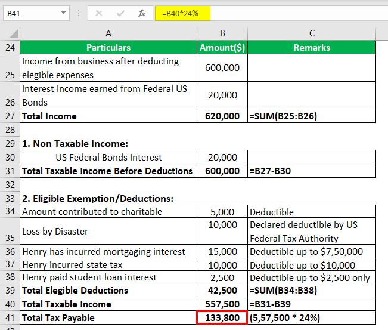

The financial arena is complex, encompassing a multitude of terms and statuses that significantly affect investors and traders. A thorough understanding of these concepts is essential for making well-informed financial decisions. In this article, we focus on four critical areas: 'tax status', 'financial terminology', 'double exemption', and the growing trend of 'algorithmic trading'. Each of these elements is pivotal in determining how securities are bought, sold, and taxed, offering numerous potential benefits and challenges. This article aims to provide insights into effectively maneuvering through the financial landscape to optimize benefits and minimize liabilities.

## Table of Contents

## Understanding Tax Status in Financial Markets

Tax status is a pivotal concept in financial markets, influencing the taxation level applied to returns from securities, impacting both individual investors and traders. These taxes can substantially affect net earnings and shape investment strategies. Therefore, understanding tax-related obligations is critical.

Various tax statuses are applicable depending on the type of trading or investment activity conducted. For active traders, one of the beneficial classifications is the Trader Tax Status (TTS). This status offers significant advantages, including the ability to treat trading as a business, thereby allowing for the deduction of certain business expenses. Moreover, it provides the facility to offset trading losses against other income, potentially reducing overall taxable income.

To qualify for the TTS, traders must meet specific criteria. These criteria typically involve maintaining a substantial, regular, and frequent trading activity. Such activity often requires that trading occupies a considerable part of the trader's time and effort, reflecting a business-like intent rather than sporadic or hobbyist engagement. The Internal Revenue Service (IRS) does not specify exact benchmarks; however, guidelines often suggest that traders should engage in numerous trades on a daily or weekly basis, held for short durations.

Consider, for instance, a trader executing an average of four trades daily over 250 days in a year. With the Trader Tax Status, this person can deduct related office expenses, educational expenses, and even software costs utilized for trading. These deductions can significantly influence the net earnings from trading activities, aligning taxable income with business-like operations.

Understanding these distinctions in tax obligations and benefits is essential for effective financial planning. It allows investors and traders to optimize their investment strategies, reducing tax liabilities and enhancing overall financial outcomes. Additionally, staying informed about potential changes in tax regulations is important to maintain compliance and maximize tax-efficiency.

## Financial Terminology Essential for Investors and Traders

Navigating the financial markets requires a solid grasp of key financial terms that form the backbone of investment and trading activities. Understanding these terms is critical for making informed decisions and optimizing financial outcomes. Below are some essential terms every investor and trader should be familiar with:

**Gross Income**: This is the total income earned by an individual or business before any deductions, taxes, or expenses are subtracted. For individuals, gross income includes wages, dividends, rents, and any other earnings. Accurate calculation of gross income is vital for determining taxable income and subsequently, the amount of taxes owed.

**Capital Gains**: These are the profits realized from the sale of assets or investments, such as stocks, bonds, or real estate, that have appreciated in value. Capital gains are categorized into short-term and long-term gains, depending on the holding period of the asset, with different tax implications for each. Understanding these differences is important for tax planning and maximizing investment returns.

**Municipal Bonds**: These are debt securities issued by local and state governments to finance public projects. Municipal bonds typically offer tax advantages, as the interest income is often exempt from federal income taxes, and in some cases, state and local taxes if the investor resides in the state where the bond is issued. This tax-exempt status makes them an attractive investment for individuals in higher tax brackets seeking stable, tax-efficient income.

**Federal Income Taxes**: This is the tax levied by the government on an individual's or corporation's income. Understanding federal income tax is crucial as it affects net returns on investments and overall financial planning. Tax rates can vary based on income levels, and knowledge of deductions, credits, and tax brackets is essential for minimizing tax liability.

Knowledge of how these financial instruments and terms operate, along with their implications on investments, is foundational for effective financial planning. For example, by understanding the tax implications of municipal bonds or capital gains, investors can make more informed decisions that suit their financial goals.

In a constantly evolving market landscape, staying updated on financial terminologies is essential for success. This knowledge not only aids in comprehending market reports and investment strategies but also helps in navigating the complexities of financial instruments. As new financial products and regulations emerge, continuous learning and adaptation are critical for maintaining a competitive edge in the financial markets.

## Exploring Double Exemption in Bond Investments

Double exemption in bond investments is a pivotal concept for investors seeking tax-efficient strategies. Primarily associated with municipal bonds, double exemption offers tax benefits by freeing interest income from federal and state income taxes, potentially maximizing after-tax returns. This tax advantage enhances the attractiveness of municipal bonds, particularly for investors in higher tax brackets aiming to reduce their taxable income.

Municipal bonds, issued by states, cities, or other local government entities, are typically used to fund public projects like schools, highways, and hospitals. The interest earned on these bonds is generally exempt from federal income taxes and, if the bondholder resides in the state where the bond is issued, state taxes as well. This dual-level tax relief can make municipal bonds particularly appealing compared to taxable bonds, despite often yielding lower interest rates. The financial benefit is evident when adjusting for tax-equivalent yield, which can make the effective return on municipal bonds more competitive with taxable alternatives.

Investors must consider the computation of the tax-equivalent yield, which adjusts the yield on a tax-exempt bond to a taxable equivalent, allowing comparison with taxable securities. The formula is:

$$
\text{Tax-Equivalent Yield} = \frac{\text{Tax-Exempt Yield}}{1 - \text{Tax Rate}}
$$

For example, if a municipal bond offers a 3% yield and the investor is in a 35% tax bracket, the tax-equivalent yield is calculated as follows:

$$
\text{Tax-Equivalent Yield} = \frac{0.03}{1 - 0.35} = 0.0462 \text{ or } 4.62\%
$$

This calculation demonstrates how, despite a lower nominal yield, the tax savings can make municipal bonds financially advantageous.

However, double exemption and municipal bonds are not without limitations. One key consideration is the Alternative Minimum Tax (AMT), designed to prevent high-income earners from paying minimal taxes. Some municipal bonds, known as private activity bonds, may be subject to AMT, thereby reducing the appeal of their tax exemption. Furthermore, investors looking to purchase out-of-state municipal bonds may find that these bonds do not qualify for state tax exemption, potentially reducing their overall tax advantage.

Understanding these nuances is critical for effective portfolio diversification and tax planning. Investors might use a mix of tax-exempt municipal bonds alongside taxable securities to balance risk and optimize returns tailored to their tax situation. Each investor's unique circumstances, such as tax bracket and income level, will influence the optimal balance of these investments, necessitating careful analysis or consultation with financial advisors.

In conclusion, double exemption offers a substantial benefit in bond investment strategies, especially for those in high tax brackets. While limited by factors like AMT and out-of-state bond restrictions, the potential tax savings make municipal bonds a worthwhile component of a diversified investment portfolio. Investors need to navigate these tax intricacies to fully leverage the opportunities offered by double exemption in bolstering their financial positions.

## The Rise of Algorithmic Trading

Algorithmic trading, commonly referred to as algo trading, involves the use of computer algorithms to execute trading strategies with detailed precision and speed. These algorithms are developed to make decisions about the timing, pricing, and quantity of orders, and can operate at speeds considerably faster than human capability, often leading to a significant competitive advantage in financial markets.

Algo trading optimizes trading efficiency by analyzing extensive datasets, leveraging statistical and [machine learning](/wiki/machine-learning) models to make data-driven decisions aimed at maximizing profits while minimizing risks. It is particularly beneficial in high-frequency trading scenarios, where milliseconds can make a substantial difference in trading outcomes. By utilizing historical data, these algorithms detect patterns and predict market movements, executing trades based on predefined criteria without the need for human intervention.

The growing popularity of algo trading can be attributed to its ability to process large volumes of orders quickly and accurately. This automation reduces transaction costs and the likelihood of human error, providing more consistent and reliable trading outcomes. Additionally, algorithmic strategies can be backtested using historical data to evaluate their performance under different market conditions, offering insights into their robustness and adaptability.

However, effective utilization of [algorithmic trading](/wiki/algorithmic-trading) requires a comprehensive understanding of its mechanisms and the dynamics of the financial markets. An in-depth knowledge of trading strategies, statistical methods, and programming is essential to develop robust algorithms capable of adapting to volatile market conditions. Furthermore, as these algorithms can influence market behavior, it is crucial to consider the potential for market disruptions and regulatory constraints.

As technology continues to advance, the role of algorithms in trading is expected to expand further, presenting new opportunities and challenges for market participants. The integration of [artificial intelligence](/wiki/ai-artificial-intelligence) and machine learning into algo trading systems has the potential to refine decision-making processes and enhance predictive capabilities, though it also raises concerns about market stability and ethical considerations. Consequently, as the landscape of algorithmic trading evolves, traders and investors must remain vigilant, ensuring they harness these technologies responsibly and strategically to maintain a competitive edge in dynamic financial markets.

## Conclusion

Mastering the interplay of tax statuses, financial terminologies, double exemptions, and algorithmic trading can lead to significant financial advantages for investors and traders. A thorough understanding and strategic application of these elements are crucial for optimizing returns and managing risks effectively. 

The financial market is inherently dynamic, requiring investors and traders to stay informed and adaptable. Understanding the nuances of tax statuses can directly affect net earnings by allowing for efficient tax planning, which can include leveraging Trader Tax Status or benefiting from double exemptions on specific securities like municipal bonds. This knowledge is vital to maintain a competitive edge in the market and make informed decisions about portfolio diversification and optimization.

Further, as algorithmic trading becomes increasingly prevalent, having a comprehensive grasp of this technology can significantly enhance trading efficiency. By embracing advanced trading technologies, such as algorithms designed to handle large datasets and high-frequency trades, market participants can maximize profits and minimize risks. This necessitates a solid understanding of market dynamics and technological capabilities to fully exploit the opportunities algo trading presents.

Given the complexities involved in tax implications and modern trading strategies, seeking professional financial advice is advisable. Such expertise can provide guidance in navigating the intricacies of tax laws and the strategic implementation of algorithmic trading techniques. Ultimately, integrating a well-rounded understanding of these critical financial elements into a cohesive strategy can greatly enhance overall market success, empowering investors to achieve a more profitable and resilient financial standing.

## References & Further Reading

[1]: ["Taxpayer Advocate Service - Qualifying for Trader Tax Status."](https://andersonadvisors.com/blog/trader-tax-status/) (IRS official website)

[2]: Bodie, Z., Kane, A., & Marcus, A. J. (2013). ["Investments and Portfolio Management."](https://www.amazon.com/Investments-Portfolio-Management-Zvi-Bodie/dp/0071289143) McGraw-Hill Education.

[3]: Fabozzi, F. J. (2005). ["The Handbook of Fixed Income Securities."](https://www.amazon.com/Handbook-Fixed-Income-Securities-Ninth/dp/1260473899) McGraw-Hill.

[4]: Aldridge, I. (2013). ["High-Frequency Trading: A Practical Guide to Algorithmic Strategies and Trading Systems."](https://www.amazon.com/High-Frequency-Trading-Practical-Algorithmic-Strategies/dp/1118343506) Wiley Finance.

[5]: Campbell, J. Y., Lo, A. W., & MacKinlay, A. C. (1997). ["The Econometrics of Financial Markets."](https://press.princeton.edu/books/hardcover/9780691043012/the-econometrics-of-financial-markets) Princeton University Press.

[6]: White, L. H. (2014). ["The Alternative Minimum Tax: Assault on the Middle Class."](https://www.policyarchive.org/handle/10207/20986) American Bar Association.

[7]: Kissell, R. (2013). ["The Science of Algorithmic Trading and Portfolio Management."](https://www.sciencedirect.com/book/9780124016897/the-science-of-algorithmic-trading-and-portfolio-management) Academic Press.