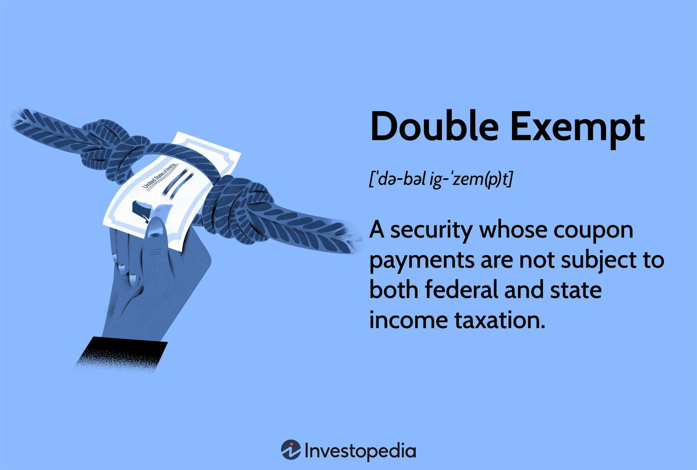

## Table of Contents

## What is a double exemption?

A double exemption is when someone does not have to pay taxes on two different things. This can happen when a person or a business qualifies for two separate tax exemptions at the same time. For example, a charity might not have to pay taxes on its income and also not have to pay sales tax on things it buys.

These exemptions can make a big difference in how much money someone keeps. Governments set up these exemptions to help certain groups or to encourage certain activities. It's important for people to know about these exemptions so they can use them if they qualify.

## How does a double exemption work?

A double exemption means you don't have to pay taxes on two different things at the same time. For example, if you run a charity, you might not have to pay taxes on the money you earn. At the same time, you might also not have to pay sales tax when you buy things for your charity. This is like getting two special deals at once.

These exemptions are set up by the government to help certain people or groups. They want to make it easier for charities, schools, or other important organizations to do their work without worrying about taxes. If you think you might qualify for a double exemption, it's a good idea to check with a tax expert to make sure you're doing everything right and taking advantage of all the help you can get.

## What are the eligibility criteria for a double exemption?

To get a double exemption, you usually need to meet the rules for both exemptions at the same time. For example, if you run a charity, you might not have to pay taxes on the money you earn because charities are often exempt from income tax. At the same time, you might also not have to pay sales tax on things you buy for your charity, because some states or countries give tax exemptions on purchases made by non-profit organizations.

The exact rules can be different depending on where you live and what kind of organization you are. You might need to fill out special forms or apply for the exemptions. It's important to check with your local tax office or a tax expert to make sure you meet all the requirements and follow the right steps to get both exemptions.

## Can you provide examples of situations where a double exemption applies?

Imagine you run a small non-profit organization that helps people find jobs. You don't have to pay taxes on the money you earn from donations because the government wants to help non-profits do their important work. At the same time, when you buy computers and office supplies to help run your organization, you also don't have to pay sales tax on these items. This is because many states and countries give tax exemptions on purchases made by non-profit organizations.

Another example is if you are a student at a university. You might not have to pay taxes on the scholarships you receive because the government wants to encourage education. At the same time, if you buy textbooks or other school supplies, you might also be exempt from paying sales tax on these items in some places. This double exemption helps make it easier for students to focus on their studies without worrying about taxes.

## What are the benefits of claiming a double exemption?

Claiming a double exemption can save you a lot of money. When you don't have to pay taxes on two different things, it means more money stays in your pocket or your organization's bank account. For example, if you run a charity, not paying taxes on your income and also not paying sales tax on things you buy means you have more money to help people. This can make a big difference in how much good work you can do.

It also makes things simpler. Instead of worrying about paying taxes on different things, you can focus on what's important, like running your charity or studying at school. Governments set up these exemptions to help certain groups do their work better. So, if you qualify for a double exemption, it's like getting extra help to do what you need to do without the tax burden.

## What are the potential drawbacks or limitations of a double exemption?

One big problem with a double exemption is that it can be hard to understand and use. The rules can be very complicated, and you might need to fill out a lot of forms or talk to a tax expert to make sure you're doing everything right. If you make a mistake, you could end up paying more in taxes or even getting in trouble with the tax office.

Another issue is that not everyone can get a double exemption. You have to meet very specific rules for both exemptions at the same time. This means that only certain people or organizations can take advantage of it. If you don't meet all the requirements, you won't be able to claim the double exemption, even if you really need the help.

Lastly, even if you qualify for a double exemption, it might not cover everything. There could be other taxes or fees you still have to pay. So, while a double exemption can save you money, it's important to know that it might not solve all your tax problems.

## How does one apply for a double exemption?

To apply for a double exemption, you need to meet the rules for both exemptions at the same time. This means you have to fill out the right forms and follow the rules for both exemptions. For example, if you run a charity, you might need to apply for an income tax exemption from the government. At the same time, you might need to get a sales tax exemption certificate from your state or local tax office. You'll need to provide information about your organization, like its mission and how it helps people.

It's a good idea to talk to a tax expert or lawyer who knows about exemptions. They can help you understand the rules and make sure you do everything right. Sometimes, you might need to send in different forms to different places, like the federal government and your state government. It can take some time, but if you qualify for a double exemption, it can save your organization a lot of money in the long run.

## What documentation is required to support a double exemption claim?

To support a double exemption claim, you need to provide documents that show you meet the rules for both exemptions. For example, if you run a charity and want to be exempt from income tax and sales tax, you'll need to show the government that your organization is a real charity. This might include your organization's mission statement, financial records, and proof that you help people. You'll also need to fill out forms for both exemptions, like an application for income tax exemption from the federal government and a sales tax exemption certificate from your state.

It's important to keep good records of everything. This means keeping copies of all your forms, any letters or emails from the government, and receipts for things you buy without paying sales tax. If the government ever asks questions about your exemptions, you'll need these documents to show that you qualify for both. Talking to a tax expert can help make sure you have all the right paperwork and that you're doing everything the right way.

## How does the double exemption interact with other tax laws or exemptions?

A double exemption means you don't have to pay taxes on two different things at the same time. But, this can get tricky because there are a lot of other tax laws and exemptions out there. Sometimes, these other laws can affect how much you save with your double exemption. For example, if you run a charity and get a double exemption on income and sales tax, there might be other taxes like property tax that you still have to pay. So, it's important to know all the tax rules that apply to you.

Talking to a tax expert can help you understand how a double exemption works with other tax laws. They can tell you if there are any other exemptions you might qualify for, or if there are any rules that might limit how much you can save. Knowing all the details can help you make the most of your double exemption and avoid any surprises when it comes time to pay your taxes.

## What are the recent changes or updates to the rules governing double exemptions?

Recently, there have been some changes to the rules about double exemptions. Governments sometimes update these rules to make them clearer or to help more people. For example, some places have made it easier for charities to get both income tax and sales tax exemptions by simplifying the application process. They might also have changed the rules about what kinds of organizations can qualify for these exemptions.

It's important to keep up with these changes because they can affect whether you can still claim a double exemption. If you run a charity or any organization that benefits from these exemptions, you should check with your local tax office or a tax expert to see if there are any new rules you need to follow. Staying informed can help you make sure you're doing everything right and taking advantage of all the help you can get.

## How do different countries or jurisdictions handle double exemptions?

Different countries or places have their own rules about double exemptions. Some countries might let charities not pay taxes on their income and also not pay sales tax on things they buy. But other places might have different rules. For example, one country might make it easy for schools to get a double exemption, while another country might not let schools get this kind of help at all. It's important to know the rules where you live or work because they can be very different from one place to another.

In some places, getting a double exemption can be hard because you have to fill out a lot of forms and follow strict rules. Other places might make it simpler and let you apply for both exemptions at the same time. Sometimes, countries work together to make sure their tax rules are fair, but they still have their own ways of doing things. If you're not sure about the rules in your country or area, it's a good idea to talk to someone who knows about taxes there.

## What advanced strategies can be used to maximize the benefits of a double exemption?

To get the most out of a double exemption, it's important to keep good records and stay organized. This means keeping all your forms, receipts, and any letters from the government in one place. If you run a charity, you should make sure your financial records are clear and show how you're using your money to help people. This can make it easier to prove that you qualify for both exemptions. Also, talking to a tax expert can help you find other ways to save money. They might know about other exemptions or tax breaks that you can use along with your double exemption.

Another good strategy is to stay up to date with any changes to the rules about double exemptions. Governments can change these rules, and knowing about new updates can help you keep your exemptions. You can do this by checking the government's website or signing up for newsletters from tax offices. If you're part of a group like a charity or a school, you might also want to join a network or association that shares information about tax rules. This way, you can make sure you're always following the latest rules and taking advantage of all the help you can get.

## What is Exploring Double Exemption in Bond Investments?

Double exemption in bond investments is a pivotal concept for investors seeking tax-efficient strategies. Primarily associated with municipal bonds, double exemption offers tax benefits by freeing interest income from federal and state income taxes, potentially maximizing after-tax returns. This tax advantage enhances the attractiveness of municipal bonds, particularly for investors in higher tax brackets aiming to reduce their taxable income.

Municipal bonds, issued by states, cities, or other local government entities, are typically used to fund public projects like schools, highways, and hospitals. The interest earned on these bonds is generally exempt from federal income taxes and, if the bondholder resides in the state where the bond is issued, state taxes as well. This dual-level tax relief can make municipal bonds particularly appealing compared to taxable bonds, despite often yielding lower interest rates. The financial benefit is evident when adjusting for tax-equivalent yield, which can make the effective return on municipal bonds more competitive with taxable alternatives.

Investors must consider the computation of the tax-equivalent yield, which adjusts the yield on a tax-exempt bond to a taxable equivalent, allowing comparison with taxable securities. The formula is:

$$
\text{Tax-Equivalent Yield} = \frac{\text{Tax-Exempt Yield}}{1 - \text{Tax Rate}}
$$

For example, if a municipal bond offers a 3% yield and the investor is in a 35% tax bracket, the tax-equivalent yield is calculated as follows:

$$
\text{Tax-Equivalent Yield} = \frac{0.03}{1 - 0.35} = 0.0462 \text{ or } 4.62\%
$$

This calculation demonstrates how, despite a lower nominal yield, the tax savings can make municipal bonds financially advantageous.

However, double exemption and municipal bonds are not without limitations. One key consideration is the Alternative Minimum Tax (AMT), designed to prevent high-income earners from paying minimal taxes. Some municipal bonds, known as private activity bonds, may be subject to AMT, thereby reducing the appeal of their tax exemption. Furthermore, investors looking to purchase out-of-state municipal bonds may find that these bonds do not qualify for state tax exemption, potentially reducing their overall tax advantage.

Understanding these nuances is critical for effective portfolio diversification and tax planning. Investors might use a mix of tax-exempt municipal bonds alongside taxable securities to balance risk and optimize returns tailored to their tax situation. Each investor's unique circumstances, such as tax bracket and income level, will influence the optimal balance of these investments, necessitating careful analysis or consultation with financial advisors.

In conclusion, double exemption offers a substantial benefit in bond investment strategies, especially for those in high tax brackets. While limited by factors like AMT and out-of-state bond restrictions, the potential tax savings make municipal bonds a worthwhile component of a diversified investment portfolio. Investors need to navigate these tax intricacies to fully leverage the opportunities offered by double exemption in bolstering their financial positions.

## References & Further Reading

[1]: ["Taxpayer Advocate Service - Qualifying for Trader Tax Status."](https://andersonadvisors.com/blog/trader-tax-status/) (IRS official website)

[2]: Bodie, Z., Kane, A., & Marcus, A. J. (2013). ["Investments and Portfolio Management."](https://www.amazon.com/Investments-Portfolio-Management-Zvi-Bodie/dp/0071289143) McGraw-Hill Education.

[3]: Fabozzi, F. J. (2005). ["The Handbook of Fixed Income Securities."](https://www.amazon.com/Handbook-Fixed-Income-Securities-Ninth/dp/1260473899) McGraw-Hill.

[4]: Aldridge, I. (2013). ["High-Frequency Trading: A Practical Guide to Algorithmic Strategies and Trading Systems."](https://www.amazon.com/High-Frequency-Trading-Practical-Algorithmic-Strategies/dp/1118343506) Wiley Finance.

[5]: Campbell, J. Y., Lo, A. W., & MacKinlay, A. C. (1997). ["The Econometrics of Financial Markets."](https://press.princeton.edu/books/hardcover/9780691043012/the-econometrics-of-financial-markets) Princeton University Press.

[6]: White, L. H. (2014). ["The Alternative Minimum Tax: Assault on the Middle Class."](https://www.policyarchive.org/handle/10207/20986) American Bar Association.

[7]: Kissell, R. (2013). ["The Science of Algorithmic Trading and Portfolio Management."](https://www.sciencedirect.com/book/9780124016897/the-science-of-algorithmic-trading-and-portfolio-management) Academic Press.