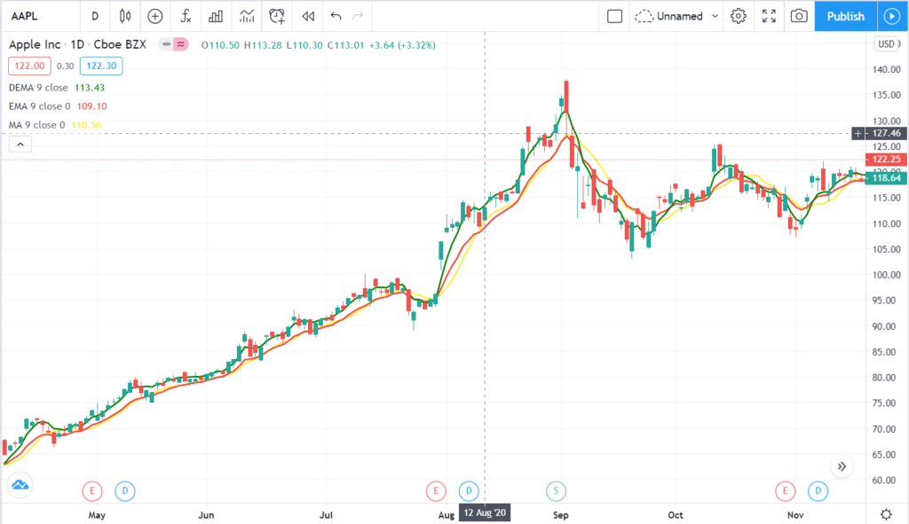

## Table of Contents

## What is a Double Exponential Moving Average (DEMA)?

A Double Exponential Moving Average (DEMA) is a type of moving average that helps traders and investors see the direction of a stock or other financial asset more clearly. It is called "double" because it uses two exponential moving averages (EMAs) to create a smoother and faster reacting line than a regular moving average. This can be useful for spotting trends earlier and making quicker decisions in the fast-paced world of trading.

The way DEMA works is by taking a regular EMA and then subtracting another EMA of the first EMA. This second subtraction helps to reduce the lag that is often seen in traditional moving averages. By doing this, DEMA can provide a more accurate picture of the current market trend, which can be especially helpful in markets that move quickly. Traders often use DEMA to help them decide when to buy or sell, based on where the DEMA line is heading.

## How does DEMA differ from a Simple Moving Average (SMA)?

A Double Exponential Moving Average (DEMA) and a Simple Moving Average (SMA) are both tools used by traders to understand market trends, but they work differently. An SMA is calculated by adding up the closing prices of a stock over a certain number of days and then dividing by that number of days. This gives you an average price that smooths out the ups and downs of the stock's price over time. However, because it uses all the data equally, it can be slower to react to new price changes.

On the other hand, a DEMA is designed to be more responsive to recent price changes. It uses two Exponential Moving Averages (EMAs), which give more weight to recent prices than to older ones. This means a DEMA can catch new trends faster than an SMA. Additionally, DEMA involves subtracting a second EMA from the first one, which helps to reduce the lag even further. This makes DEMA a good choice for traders who need to make quick decisions based on the latest market movements.

## What is the formula for calculating DEMA?

To calculate a Double Exponential Moving Average (DEMA), you first need to calculate an Exponential Moving Average (EMA). An EMA gives more weight to recent prices. You pick a time period, like 20 days, and then use a formula to figure out the EMA. The formula for the first EMA is: EMA1 = (Price today x K) + (EMA1 yesterday x (1 - K)), where K is a smoothing [factor](/wiki/factor-investing) calculated as 2 / (Time period + 1). So, for a 20-day EMA, K would be 2 / (20 + 1) = 0.0952.

Next, you calculate a second EMA using the same time period and smoothing factor, but this time you use the first EMA's values instead of the actual prices. This second EMA is called EMA2. The formula for EMA2 is the same as for EMA1, but you use EMA1 values instead of prices. Finally, to get the DEMA, you subtract EMA2 from twice the value of EMA1. The formula is: DEMA = (2 x EMA1) - EMA2. This helps the DEMA react faster to price changes than a regular moving average.

## Why was DEMA developed and what problem does it solve?

DEMA was created to help traders and investors see the direction of a stock's price more clearly and quickly. Regular moving averages, like the Simple Moving Average, can be slow to react to new price changes because they treat all the data the same. This can make it hard to spot new trends early. DEMA solves this problem by using two Exponential Moving Averages, which give more weight to recent prices. This makes DEMA faster at [picking](/wiki/asset-class-picking) up on new trends, helping traders make quicker decisions.

By using two EMAs, DEMA can smooth out the price data even more than a single EMA. The first EMA captures the overall trend, and the second EMA helps reduce the lag that can still be present in the first EMA. This double smoothing makes DEMA a useful tool for traders who need to react quickly to market changes. In fast-moving markets, having a tool like DEMA can make a big difference in spotting opportunities and managing risks.

## How can DEMA be used in trading strategies?

DEMA can be a helpful tool in trading strategies because it can show the direction of a stock's price more quickly than other moving averages. Traders often use DEMA to spot trends early. For example, if the DEMA line starts going up, it might be a sign that the stock's price is starting to rise. This can tell a trader it might be a good time to buy the stock. On the other hand, if the DEMA line starts going down, it could mean the stock's price is falling, and it might be a good time to sell.

Another way traders use DEMA is by looking for crossovers. This means watching when the stock's price crosses above or below the DEMA line. If the price goes above the DEMA, it could be a buy signal, suggesting the stock might keep going up. If the price drops below the DEMA, it could be a sell signal, suggesting the stock might keep going down. By using these signals, traders can make decisions about when to buy or sell stocks based on the DEMA's fast reactions to price changes.

## What are the advantages of using DEMA over other moving averages?

DEMA is better than other moving averages because it reacts faster to changes in a stock's price. It uses two special kinds of moving averages called Exponential Moving Averages (EMAs). These EMAs give more importance to recent prices, so the DEMA can spot new trends earlier than a Simple Moving Average (SMA). This is really helpful for traders who need to make quick decisions in fast-moving markets. If a stock's price starts to go up or down, DEMA can show this change more quickly, helping traders decide when to buy or sell.

Another advantage of DEMA is that it helps to reduce the lag that can be a problem with other moving averages. By using two EMAs, DEMA can smooth out the price data more effectively. This means it can give a clearer picture of the stock's trend without being slowed down by older price data. Traders can use this clearer, faster signal to spot good times to buy or sell a stock, making their trading strategies more effective.

## Can you explain the concept of lag in moving averages and how DEMA addresses it?

Lag in moving averages is when the moving average line doesn't show changes in a stock's price right away. It's like the moving average is a bit slow and takes some time to catch up with what's happening now. This can be a problem for traders because they might miss out on good times to buy or sell if the moving average is too slow. A Simple Moving Average (SMA) has a lot of lag because it treats all the price data the same, no matter how old it is.

DEMA helps fix this problem by using two Exponential Moving Averages (EMAs). EMAs give more importance to recent prices, so they can show changes in the stock's price faster than an SMA. DEMA takes this one step further by using two EMAs. The first EMA catches the overall trend, and the second EMA helps to reduce the lag that's still in the first EMA. By subtracting the second EMA from the first one, DEMA can show what's happening in the market more quickly, helping traders make better and faster decisions.

## How does DEMA perform in different market conditions?

DEMA can be really helpful in markets that move quickly. Because it reacts faster to changes in a stock's price, it can spot new trends earlier than other moving averages. This means traders can make decisions about buying or selling faster. In a fast market, this can be a big advantage because things can change quickly, and you don't want to miss out on good opportunities. DEMA's quick reaction helps traders stay on top of what's happening and make the most of it.

In slower markets, DEMA might not be as useful because there aren't as many quick changes to react to. In these markets, the fast reaction of DEMA might make it seem like there are trends that aren't really there. This can lead to false signals, where the DEMA suggests buying or selling when it might not be the best time. So, in slower markets, traders might want to use other tools that don't react as quickly and can give a clearer picture of the longer-term trends.

## What are the potential drawbacks or limitations of using DEMA?

Using DEMA can have some downsides. One big problem is that it can give false signals, especially in markets that move slowly. Because DEMA reacts quickly to price changes, it might show a trend that isn't really there. This can trick traders into buying or selling at the wrong time, which could lead to losses. In a slow market, it's better to use tools that don't react as quickly and can give a clearer picture of what's happening over a longer time.

Another limitation is that DEMA can be hard to understand and use for people who are new to trading. It involves using two Exponential Moving Averages and a special formula, which can be confusing. If you don't know how to set up and use DEMA correctly, you might not get the right signals. This means you need to spend time learning about it and practicing before you can use it well in your trading strategy.

## How can DEMA be combined with other technical indicators for better results?

DEMA can be a powerful tool when used with other technical indicators to make better trading decisions. One way to do this is by combining DEMA with the Relative Strength Index (RSI). RSI helps show if a stock is overbought or oversold. If the DEMA line starts going up and the RSI is low, it could be a good time to buy because the stock might be starting a new upward trend and isn't overbought yet. On the other hand, if the DEMA line starts going down and the RSI is high, it might be a good time to sell because the stock could be starting a downward trend and is overbought.

Another useful combination is using DEMA with the Moving Average Convergence Divergence (MACD). MACD helps spot changes in a stock's trend by showing when two moving averages are getting closer together or moving apart. If the DEMA line and the MACD line both start going up, it's a strong sign that the stock's price is likely to keep going up. If both lines start going down, it's a strong sign that the price might keep falling. By looking at both DEMA and MACD, traders can get a clearer picture of what's happening in the market and make smarter decisions about when to buy or sell.

## What are some practical examples of DEMA application in real trading scenarios?

Imagine a trader named Sarah who uses DEMA to spot trends in the stock market. She's watching a stock that she thinks might go up in price. She sets up a 20-day DEMA on her trading chart. One day, she notices the stock's price starts to rise, and the DEMA line quickly follows, moving upwards too. This tells Sarah that a new upward trend might be starting. She decides to buy the stock because the DEMA is showing her that the price could keep going up. A few days later, the stock's price does indeed keep rising, and Sarah is happy she used the DEMA to make her decision.

Now think about another trader, Mike, who uses DEMA along with the RSI to make his trading choices. He's watching a stock that he thinks might be overbought. He sees that the DEMA line is starting to go down, suggesting the stock's price might start falling soon. At the same time, he checks the RSI and sees it's very high, meaning the stock is overbought. Mike decides to sell the stock because both the DEMA and RSI are telling him it's a good time to do so. A few days later, the stock's price does start to fall, and Mike is glad he used these tools together to guide his decision.

## How can one optimize the parameters of DEMA for specific trading instruments?

To optimize the parameters of DEMA for specific trading instruments, you need to find the right time period that works best for the stock or asset you're trading. Different stocks move at different speeds, so what works for one might not work for another. You can start by trying different time periods, like 10 days, 20 days, or 50 days, and see which one gives you the best results. You can do this by looking at past data and seeing how well the DEMA would have worked if you had used it to make trading decisions. This is called [backtesting](/wiki/backtesting), and it helps you figure out the best settings for your DEMA.

Once you've found a time period that seems to work well, you can keep an eye on how the DEMA is doing in real time. If the market changes or the stock starts moving differently, you might need to adjust the time period again. It's a good idea to keep testing and tweaking the DEMA settings to make sure they stay useful for your trading. By doing this, you can make the DEMA work better for the specific stock or asset you're trading, helping you make smarter decisions about when to buy or sell.

## What is Understanding Double Moving Averages?

A moving average is a fundamental technical indicator used by traders to smooth out price data, presenting a clearer trend direction by averaging past prices. It continuously updates, providing a more refined view of price movements over time. The double moving average crossover strategy employs two distinct moving averages to pinpoint potential buy and sell signals within a trading framework. 

The strategy typically involves a shorter-term moving average and a longer-term moving average. The short-term moving average reacts more quickly to recent price changes due to its smaller data set, while the longer-term moving average responds more gradually, providing a broader view of the trend. 

When the short-term moving average crosses above the longer-term moving average, it generates a buy signal. This upward crossover suggests a shift in [momentum](/wiki/momentum) as recent prices rise quicker than historical prices, indicating a potential upward trend. Mathematically, this can be represented as:

$$
\text{Buy Signal:} \quad \text{SMA}_\text{short}(t) > \text{SMA}_\text{long}(t)
$$

Conversely, when the short-term moving average crosses below the longer-term moving average, it signals a sell opportunity. This downward crossover indicates a potential downward trend, as recent prices start to fall compared to the past, suggesting diminishing momentum. This can be mathematically defined as:

$$
\text{Sell Signal:} \quad \text{SMA}_\text{short}(t) < \text{SMA}_\text{long}(t)
$$

In these equations, $\text{SMA}_\text{short}(t)$ and $\text{SMA}_\text{long}(t)$ represent the values of the short-term and long-term simple moving averages at time $t$, respectively.

To illustrate how these principles might be implemented programmatically, consider the following simplified Python example using the `pandas` library:

```python
import pandas as pd

# Example DataFrame 'df' with datetime index and column 'price'
df['SMA_short'] = df['price'].rolling(window=5).mean()
df['SMA_long'] = df['price'].rolling(window=20).mean()

# Generate signals
df['buy_signal'] = (df['SMA_short'] > df['SMA_long']).astype(int)
df['sell_signal'] = (df['SMA_short'] < df['SMA_long']).astype(int)
```

This code calculates 5-day and 20-day simple moving averages for a given price series, issuing buy and sell signals as the moving averages cross each other. Traders can adjust the periods based on specific needs and market condition considerations to enhance their strategy's effectiveness.

## References & Further Reading

[1]: Bergstra, J., Bardenet, R., Bengio, Y., & Kégl, B. (2011). ["Algorithms for Hyper-Parameter Optimization."](https://dl.acm.org/doi/10.5555/2986459.2986743) Advances in Neural Information Processing Systems 24.

[2]: ["Advances in Financial Machine Learning"](https://www.amazon.com/Advances-Financial-Machine-Learning-Marcos/dp/1119482089) by Marcos Lopez de Prado

[3]: ["Evidence-Based Technical Analysis: Applying the Scientific Method and Statistical Inference to Trading Signals"](https://www.amazon.com/Evidence-Based-Technical-Analysis-Scientific-Statistical/dp/0470008741) by David Aronson

[4]: ["Machine Learning for Algorithmic Trading"](https://github.com/stefan-jansen/machine-learning-for-trading) by Stefan Jansen

[5]: ["Quantitative Trading: How to Build Your Own Algorithmic Trading Business"](https://books.google.com/books/about/Quantitative_Trading.html?id=j70yEAAAQBAJ) by Ernest P. Chan