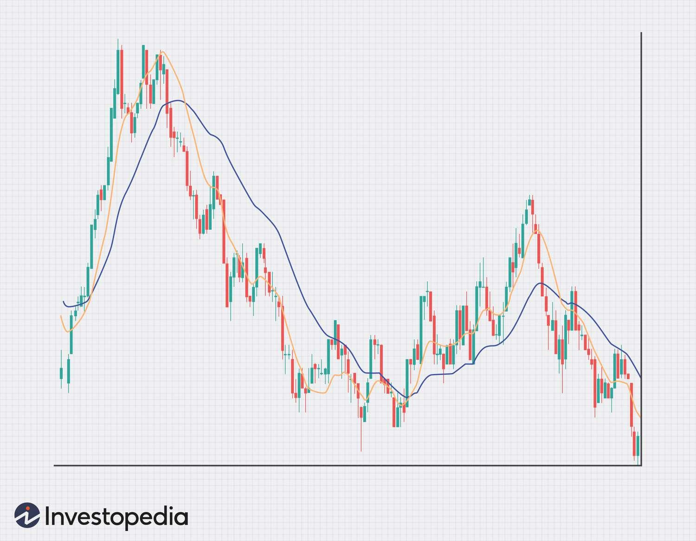

The double moving average crossover strategy is a widely used technique in algorithmic trading, leveraging two distinct moving averages to pinpoint potential buy and sell signals effectively. This strategy relies on a harmonious relationship between a shorter-term and a longer-term moving average, offering insights into market trends. By analyzing the crossover points where these averages intersect, traders can discern shifts in market momentum, providing opportunities for entering or exiting trades.

Understanding and implementing the double moving average crossover involves several key components. This article will uncover the different aspects of the strategy, its core principles, and how it can be integrated into various trading systems. A thorough discussion on selecting appropriate moving average periods will be presented, aiming to underline the importance of aligning them with trading objectives and market conditions to enhance the strategy's effectiveness.



The double moving average crossover strategy is often celebrated for its simplicity, making it accessible to both novice and experienced traders. This method not only aids in filtering out the noise of insignificant price fluctuations but also assists in identifying nascent market trends. However, it is crucial to acknowledge the strategy's limitations and risks, such as the potential for false signals in flat markets and the inherent lag due to reliance on historical data.

For both new and seasoned traders, comprehending the operational dynamics of the double moving average crossover can add significant value to a trading plan. Through this article, readers will gain a comprehensive understanding of its utility in algorithmic trading, especially when combined with robust risk management practices and ongoing optimization efforts.

## Table of Contents

## Understanding Double Moving Averages

A moving average is a fundamental technical indicator used by traders to smooth out price data, presenting a clearer trend direction by averaging past prices. It continuously updates, providing a more refined view of price movements over time. The double moving average crossover strategy employs two distinct moving averages to pinpoint potential buy and sell signals within a trading framework. 

The strategy typically involves a shorter-term moving average and a longer-term moving average. The short-term moving average reacts more quickly to recent price changes due to its smaller data set, while the longer-term moving average responds more gradually, providing a broader view of the trend. 

When the short-term moving average crosses above the longer-term moving average, it generates a buy signal. This upward crossover suggests a shift in [momentum](/wiki/momentum) as recent prices rise quicker than historical prices, indicating a potential upward trend. Mathematically, this can be represented as:

$$
\text{Buy Signal:} \quad \text{SMA}_\text{short}(t) > \text{SMA}_\text{long}(t)
$$

Conversely, when the short-term moving average crosses below the longer-term moving average, it signals a sell opportunity. This downward crossover indicates a potential downward trend, as recent prices start to fall compared to the past, suggesting diminishing momentum. This can be mathematically defined as:

$$
\text{Sell Signal:} \quad \text{SMA}_\text{short}(t) < \text{SMA}_\text{long}(t)
$$

In these equations, $\text{SMA}_\text{short}(t)$ and $\text{SMA}_\text{long}(t)$ represent the values of the short-term and long-term simple moving averages at time $t$, respectively.

To illustrate how these principles might be implemented programmatically, consider the following simplified Python example using the `pandas` library:

```python
import pandas as pd

# Example DataFrame 'df' with datetime index and column 'price'
df['SMA_short'] = df['price'].rolling(window=5).mean()
df['SMA_long'] = df['price'].rolling(window=20).mean()

# Generate signals
df['buy_signal'] = (df['SMA_short'] > df['SMA_long']).astype(int)
df['sell_signal'] = (df['SMA_short'] < df['SMA_long']).astype(int)
```

This code calculates 5-day and 20-day simple moving averages for a given price series, issuing buy and sell signals as the moving averages cross each other. Traders can adjust the periods based on specific needs and market condition considerations to enhance their strategy's effectiveness.

## How to Implement the Double Moving Average Crossover Strategy

To effectively implement the double moving average crossover strategy, the initial step involves selecting suitable moving average periods. These periods should align with your trading goals and current market conditions. For traders focusing on short-term trends, common combinations like the 5-period and 15-period moving averages are prevalent. These numbers reflect shorter time frames, offering a quicker response to market changes, which is crucial for short-term trading strategies.

Once you have decided on the specific moving periods, establish the moving averages on your price chart. This is typically accomplished using trading software or platforms that allow for technical analysis. The task here is to monitor the chart for crossover events. A crossover event occurs when the short-term moving average intersects the long-term moving average. Specifically, a buy signal is generated when the short-term moving average crosses above the long-term moving average, indicating a potential upward trend. Conversely, a sell signal emerges when the short-term moving average crosses below the long-term average, suggesting a potential downtrend.

To implement this strategy programmatically, you can use Python with the `pandas` and `numpy` libraries. Here is an example of how this can be coded:

```python
import pandas as pd

# Assuming 'data' is a pandas DataFrame with a 'Close' column for closing prices
def moving_average(data, window):
    return data['Close'].rolling(window=window).mean()

# Calculate moving averages
data['MA_short'] = moving_average(data, 5)
data['MA_long'] = moving_average(data, 15)

# Identify buy and sell signals
data['Signal'] = 0
data.loc[data['MA_short'] > data['MA_long'], 'Signal'] = 1  # Buy
data.loc[data['MA_short'] < data['MA_long'], 'Signal'] = -1  # Sell
```

Following the identification of signals, it is crucial to implement [backtesting](/wiki/backtesting). Backtesting involves applying the crossover strategy to historical data to evaluate its performance under various market conditions. This process helps in understanding the robustness of the chosen moving average periods and in potentially refining them for better future performance.

Backtesting can be facilitated with Python using libraries like `[backtrader](/wiki/backtrader)` to simulate how the strategy would have performed in the past:

```python
import backtrader as bt

class CrossoverStrategy(bt.Strategy):
    def __init__(self):
        self.ma_short = bt.indicators.SMA(period=5)
        self.ma_long = bt.indicators.SMA(period=15)

    def next(self):
        if self.ma_short > self.ma_long:
            self.buy()
        elif self.ma_short < self.ma_long:
            self.sell()

# Load historical data to a Backtrader Cerebro engine and add the strategy
cerebro = bt.Cerebro()
cerebro.addstrategy(CrossoverStrategy)
cerebro.run()
```

By using backtesting, traders can validate whether their specific crossover strategy holds up against historical price movements and further optimize their approach. This holistic process not only provides a structured path to implement the double moving average crossover strategy but also ensures that it is adjusted for maximum efficacy in executing trades in real-world scenarios.

## Advantages of the Double Moving Average Crossover

The double moving average crossover strategy offers several advantages, making it a favored choice among both novice and experienced traders. Its simplicity lies in the utilization of two moving averages to generate trading signals, which can be easily understood and implemented without extensive financial expertise. The strategy primarily aims to identify emerging trends by smoothing out minor price fluctuations that can often lead to confusion in more complex trading systems. Through this method, traders can make more informed decisions based on visible trend patterns.

Moreover, when combined with effective risk management techniques, the double moving average crossover strategy provides a structured approach to making trading decisions. Risk management strategies, such as setting stop-loss orders or position-sizing rules, can be incorporated into the strategy to mitigate potential losses, thus enhancing its overall reliability.

One of the significant advantages of this strategy is its compatibility with [algorithmic trading](/wiki/algorithmic-trading) systems. By automating the crossover signals, traders can execute trades in real-time, free from the emotional biases and impulses that often plague manual trading. This aspect is particularly beneficial in fast-moving markets where timely decision-making is crucial. The strategy's straightforward nature lends itself well to programming, allowing for the development of trading algorithms and bots that can consistently react to crossover events.

Incorporating a moving average crossover strategy can be as simple as implementing the following Python code to automate trade actions based on crossover signals:

```python
import pandas as pd
import numpy as np

def moving_average_crossover_strategy(data, short_window=50, long_window=200):
    signals = pd.DataFrame(index=data.index)
    signals['price'] = data['Close']
    # Create short and long simple moving averages
    signals['short_mavg'] = data['Close'].rolling(window=short_window, min_periods=1, center=False).mean()
    signals['long_mavg'] = data['Close'].rolling(window=long_window, min_periods=1, center=False).mean()

    # Create signals
    signals['signal'] = 0
    signals['signal'][short_window:] = np.where(signals['short_mavg'][short_window:] > signals['long_mavg'][short_window:], 1.0, 0.0)

    # Generate trading orders
    signals['positions'] = signals['signal'].diff()

    return signals

# Example usage
# data is a DataFrame containing the price data with a 'Close' column
signals = moving_average_crossover_strategy(data)

# Eventual use of the signals DataFrame to execute trades or additional analysis
```

This provided Python code demonstrates a basic framework for implementing a moving average crossover strategy, equipping traders with the tools to automate their trading processes effectively. Overall, the double moving average crossover strategy's ease of understanding, ability to filter out noise, compatibility with risk management, and suitability for automation make it a valuable component of many trading strategies.

## Risks and Limitations

The double moving average crossover strategy, while popular, comes with inherent risks and limitations. In markets that exhibit sideways or choppy behavior, this strategy can generate false signals. Such conditions may lead to frequent trades that can incur transaction costs and losses, as the crossover may not reliably indicate a strong trend. This can be particularly troublesome for traders who rely heavily on algorithmic execution without adequate confirmation from other indicators.

One significant drawback of using moving averages is the risk of lag. Moving averages are inherently reactive, as they are based on historical price data. This lag can result in delayed signals, whereby the crossover fails to capture timely market shifts. Consequently, traders might enter or [exit](/wiki/exit-strategy) positions after the optimal point, impacting potential profits.

Moreover, the strategy may not effectively identify the absolute tops and bottoms of market trends. Since moving averages smooth out price fluctuations to reveal underlying trends, they might miss extreme market conditions or reversals. Hence, traders might overlook opportunities for maximum profit extraction at these critical points.

To mitigate these limitations, traders often incorporate additional technical indicators or filters. For example, combining the double moving average crossover with momentum indicators (such as the Relative Strength Index) or [volume](/wiki/volume-trading-strategy) analysis can offer a more comprehensive market view. This approach helps reduce the risk of whipsaws—erratic signals that lead to rapid position changes with little market movement—by providing additional confirmation before executing trades.

Here is a simple Python code snippet showcasing how additional filters might be implemented in conjunction with a moving average crossover strategy:

```python
import pandas as pd

# Example DataFrame with price data
data = pd.DataFrame({'close': [/* Closing prices here */]})

# Calculate moving averages
data['short_ma'] = data['close'].rolling(window=5).mean()
data['long_ma'] = data['close'].rolling(window=15).mean()

# Example additional filter: RSI implementation
def calculate_rsi(data, period=14):
    delta = data.diff()
    gain = (delta.where(delta > 0, 0)).rolling(window=period).mean()
    loss = (-delta.where(delta < 0, 0)).rolling(window=period).mean()
    rs = gain / loss
    rsi = 100 - (100 / (1 + rs))
    return rsi

data['rsi'] = calculate_rsi(data['close'])

# Define buy/sell signals
data['buy_signal'] = (data['short_ma'] > data['long_ma']) & (data['rsi'] < 30)
data['sell_signal'] = (data['short_ma'] < data['long_ma']) & (data['rsi'] > 70)

# Display signals
print(data[['close', 'short_ma', 'long_ma', 'rsi', 'buy_signal', 'sell_signal']])
```

By integrating such corroborative measures, traders can enhance the reliability of the double moving average crossover strategy, mitigating its risks while optimizing its effectiveness.

## Practical Applications in Algorithmic Trading

Algorithmic traders can leverage the double moving average crossover strategy to enhance their trading systems by implementing practical applications that optimize performance and execution. One of the primary methods to refine this strategy is through backtesting over historical data. Backtesting allows traders to assess the effectiveness of different moving average periods under various market conditions, providing insights into how the strategy would have performed in the past. This process can help in identifying optimal settings for the moving averages, thus tailoring the strategy to suit specific trading goals.

Employing [machine learning](/wiki/machine-learning) algorithms presents a significant opportunity for refining the double moving average crossover strategy. Machine learning models can analyze vast amounts of market data, learning patterns and correlations that may not be immediately apparent through traditional analysis. For instance, by training a model to recognize when certain market conditions are likely to lead to profitable crossovers, traders can dynamically adjust the moving average periods or even decide when the crossover signals should be trusted. This adaptability ensures that the strategy remains relevant in diverse and changing market environments.

Another practical application involves programming trading bots that execute trades automatically based on crossover signals. Trading bots can be developed using programming languages like Python, which is widely used in algorithmic trading due to its extensive libraries such as Pandas for data manipulation and backtesting. Here's a basic Python code snippet to demonstrate how a simple moving average crossover strategy might be automated:

```python
import pandas as pd

def compute_sma(data, window):
    return data['Close'].rolling(window=window).mean()

def generate_signals(data, short_window, long_window):
    data['Short_SMA'] = compute_sma(data, short_window)
    data['Long_SMA'] = compute_sma(data, long_window)

    data['Signal'] = 0
    data.loc[data['Short_SMA'] > data['Long_SMA'], 'Signal'] = 1
    data.loc[data['Short_SMA'] < data['Long_SMA'], 'Signal'] = -1
    return data

# Example usage
historical_data = pd.read_csv('historical_stock_data.csv')
signals = generate_signals(historical_data, short_window=5, long_window=15)
```

This code calculates simple moving averages (SMA) and generates buy and sell signals based on their crossover.

Lastly, integrating the double moving average crossover strategy into a larger trading system can be beneficial. By combining it with other indicators or confirmation methods, traders can filter out false signals and improve the overall accuracy of trade execution. For instance, pairing moving average crossovers with relative strength index (RSI) or [volatility](/wiki/volatility-trading-strategies) measures can provide a more comprehensive understanding of market dynamics, thereby enhancing decision-making and mitigating risks associated with false breakouts or whipsaws.

## Conclusion

The double moving average crossover is a versatile strategy that provides traders with a structured approach to identifying trading opportunities in various market conditions. At its core, the strategy leverages the intersection of short-term and long-term moving averages to signal potential buy or sell positions, offering a clear and straightforward method that can be easily understood and implemented by traders of all experience levels.

Despite its inherent simplicity, the strategy does have certain limitations, particularly in volatile or sideways markets, where it may produce false signals. This can lead to frequent trades and potential losses. However, its simplicity makes it a valuable tool, as it allows for easy integration into larger trading systems and enables traders to act swiftly on emerging trends without the emotional burden that often accompanies trading decisions.

To maximize the efficacy of the double moving average crossover strategy in algorithmic trading, it is essential to pair it with a robust risk management plan. Incorporating stop-loss orders and position-sizing techniques can mitigate potential losses from false signals. Continuous optimization, such as adjusting the moving average periods to reflect current market conditions, is crucial for maintaining its effectiveness over time. Traders can utilize backtesting to assess the strategy's performance across different historical scenarios and refine their approach accordingly. 

Furthermore, continual evaluation and adjustment ensure that the strategy remains relevant in dynamic market environments. As markets evolve, so too should the parameters and complementary tools used alongside the double moving average crossover, ensuring that traders can capitalize on its strengths while minimizing its weaknesses. This adaptability, coupled with the strategy's straightforward nature, makes it a lasting component in the repertoire of both novice and seasoned traders.

## References & Further Reading

[1]: Bergstra, J., Bardenet, R., Bengio, Y., & Kégl, B. (2011). ["Algorithms for Hyper-Parameter Optimization."](https://dl.acm.org/doi/10.5555/2986459.2986743) Advances in Neural Information Processing Systems 24.

[2]: ["Advances in Financial Machine Learning"](https://www.amazon.com/Advances-Financial-Machine-Learning-Marcos/dp/1119482089) by Marcos Lopez de Prado

[3]: ["Evidence-Based Technical Analysis: Applying the Scientific Method and Statistical Inference to Trading Signals"](https://www.amazon.com/Evidence-Based-Technical-Analysis-Scientific-Statistical/dp/0470008741) by David Aronson

[4]: ["Machine Learning for Algorithmic Trading"](https://github.com/stefan-jansen/machine-learning-for-trading) by Stefan Jansen

[5]: ["Quantitative Trading: How to Build Your Own Algorithmic Trading Business"](https://books.google.com/books/about/Quantitative_Trading.html?id=j70yEAAAQBAJ) by Ernest P. Chan