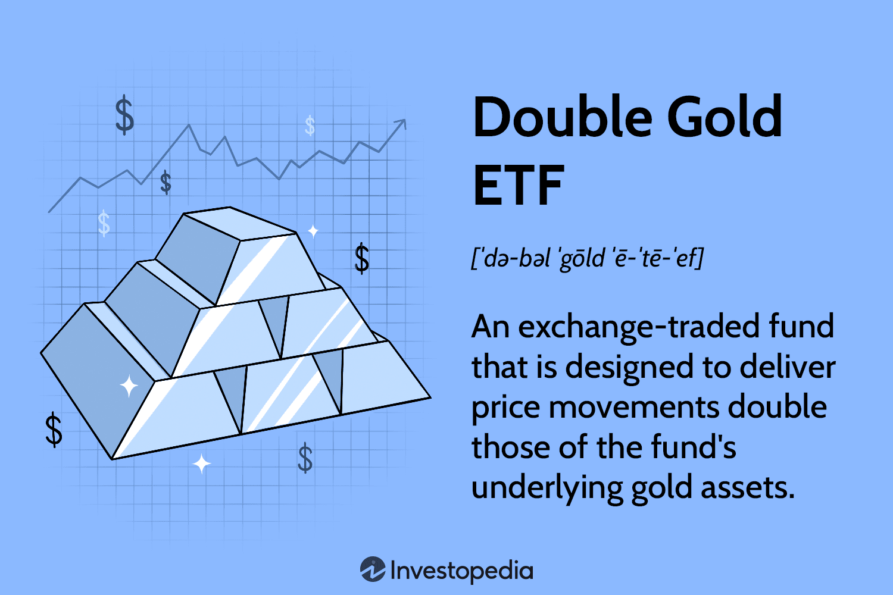

Double Gold Exchange-Traded Funds (ETFs) represent a distinct investment vehicle that attracts investors seeking heightened exposure to the gold market. By leveraging their structure to offer double the returns of gold's price movements, these funds are positioned at the intersection of high-reward and high-risk investments. The appeal of Double Gold ETFs lies in their ability to maximize potential gains when gold prices rise, making them attractive during periods of anticipated bullish trends in the gold market.

The structure of Double Gold ETFs is inherently designed to amplify returns, providing investors with twice the daily performance of gold. This leverage, however, is a double-edged sword. While it can lead to substantial profits, it equally enhances the potential for significant losses, particularly in volatile markets where prices can swing dramatically. Understanding and managing this risk-return balance is crucial for investors engaging with these financial instruments.



Algorithmic trading plays a vital role in optimizing the performance and risk management of Double Gold ETFs. By employing sophisticated algorithms, fund managers can dynamically adjust their trading strategies to respond to market conditions in real time. This approach allows for efficient risk mitigation and the potential enhancement of returns, as algorithms can swiftly process complex data and execute trades based on pre-defined criteria.

This article will explore the multifaceted nature of Double Gold ETFs, beginning with a definition and structural analysis of how these funds operate. It will detail the underlying financial mechanisms, delve into investment strategies and case studies, assess the risks and how they can be managed with technology, examine the regulatory environment, and discuss the tax implications for investors. By understanding these aspects, investors can make informed decisions and align their investment strategies with their risk tolerance levels, leveraging the potential of Double Gold ETFs while safeguarding against their inherent risks.

## Table of Contents

## What is a Double Gold ETF?

A Double Gold Exchange-Traded Fund (ETF) is a type of leveraged investment product that seeks to deliver twice the daily return of gold prices. These financial instruments are engineered to provide investors with amplified exposure to gold price movements, hence offering the potential for greater returns compared to traditional gold ETFs.

### Definition and Structure

Double Gold ETFs are designed as open-ended funds that invest in financial instruments, such as futures contracts and swaps, which provide leveraged exposure to gold. The primary aim of these ETFs is to achieve a return that is double the performance, whether gains or losses, of a specified gold index or benchmark over a given time period, typically daily. This means if the gold index increases by 1% on a particular day, the Double Gold [ETF](/wiki/etf-trading-strategies) aims to increase by 2%, and conversely, if the index decreases by 1%, the ETF would ideally decrease by 2%.

### Leveraging Gold Prices to Offer Double Returns

The mechanism by which Double Gold ETFs achieve their objective involves the use of leverage. Leverage in this context refers to the use of borrowed capital or financial derivatives to increase the potential return of an investment. These ETFs typically do not own physical gold; instead, they use derivatives such as:

- **Futures Contracts**: Agreements to buy or sell gold at a future date at an agreed price, allowing ETFs to gain exposure to gold price movements without putting up the full amount of capital needed to purchase the physical commodity.

- **Swaps**: Financial agreements where the ETFs pay or receive returns proportional to the gold price index, essentially allowing them to track gold price movements with amplified effects due to the leveraged nature of these contracts.

In a simplified financial model, the return $R$ of a Double Gold ETF can be represented as:

$$
R = 2 \times (\Delta GP)
$$

where $\Delta GP$ represents the change in the gold price index.

### Key Features Distinguishing Them from Traditional Gold ETFs

Double Gold ETFs differ from regular gold ETFs primarily through their use of leverage to magnify returns, both positive and negative. Key distinguishing features include:

1. **Amplified Risk and Return**: While traditional gold ETFs aim to mirror the performance of physical gold prices, Double Gold ETFs seek to generate twice the daily returns. This results in higher potential gains but also significantly increases the risk of losses.

2. **Tracking Methodology**: Traditional gold ETFs might hold physical gold or gold-backed securities to closely follow gold prices. In contrast, Double Gold ETFs typically use derivatives to gain leverage, which can lead to variance from the target benchmark due to factors such as daily compounding effects.

3. **Complexity and Cost**: Leveraged ETFs, like Double Gold ETFs, often have higher expense ratios due to the cost of maintaining leverage and potential for higher transaction fees from frequent trading of derivatives.

Understanding these features is essential for investors considering Double Gold ETFs, as the leveraged nature of these funds can lead to substantial price [volatility](/wiki/volatility-trading-strategies) and necessitates a keen awareness of the market conditions and investment horizons.

## Working Mechanism of Double Gold ETFs

Double Gold ETFs are structured to provide investors with twice the daily return of gold, through the use of leverage mechanisms. The primary objective is to magnify potential returns relative to traditional gold ETFs. This is achieved by utilizing financial derivatives, primarily futures and swaps, which allow these funds to gain leverage on gold price movements.

### Leverage Mechanism

The leverage in Double Gold ETFs is created by using borrowed capital to increase the amount of gold exposure without having to fully pay for it upfront. This is typically implemented through borrowing techniques, allowing more capital to be invested than what the investor initially puts in. For instance, if an investor commits $100, the ETF might leverage this to control $200 worth of gold exposure, aiming to deliver twice the return of gold's daily performance.

### Role of Financial Derivatives

Financial derivatives like futures contracts and swaps are instrumental in achieving this leveraged return. 

1. **Futures Contracts**: These are agreements to buy or sell gold at a predetermined price at a specified time in the future. By holding a significant position in gold futures, a Double Gold ETF can amplify the effects of changes in the gold price. If the price of gold rises, the futures contract becomes more valuable, hence increasing the ETF's returns by a factor of two compared to the spot gold price.

2. **Swaps**: Swaps are financial agreements to exchange cash flows. In the context of Double Gold ETFs, a total return swap might be used where the fund enters an agreement with a counterparty to receive the total return of a gold index in exchange for a fixed cash flow. This enables the ETF to achieve the desired leveraged exposure.

### Compounding Effects

One of the critical aspects of Double Gold ETFs is the compounding of returns, which can significantly impact overall investment performance. Because these ETFs are designed to provide twice the daily performance of gold, the effect of compounding is crucial.

For example, if gold increases by 1% one day, a Double Gold ETF would theoretically increase by 2%. If the next day gold decreases by 1%, the ETF would decrease by 2%. The daily reset of leverage means that returns are compounded, which can lead to substantial divergence over time from simply double the long-term return of gold. This can be expressed mathematically as follows:

$$
\text{Return}_{ETF} = (1 + 2r_1)(1 + 2r_2)\ldots(1 + 2r_n) - 1
$$

Where $r_i$ is the daily return of gold on day $i$. This compounding can result in substantial gains in trending markets but can also magnify losses during volatile or declining periods.

Thus, while Double Gold ETFs offer the potential for enhanced returns, they come with the increased complexity of leveraging via financial derivatives and the compounding effects of daily leveraged returns. Understanding these mechanisms is key for investors considering leveraging these instruments.

## Investment Examples with Double Gold ETFs

Investment in Double Gold Exchange-Traded Funds (ETFs) can be a profitable yet risky venture. These funds offer investors the opportunity to earn double the return of the underlying gold price movements, employing leverage to magnify gains. However, the use of leverage also heightens the risks, requiring strategic planning and an understanding of market dynamics.

### Case Studies of Successful Investments

One notable example of successful investment using Double Gold ETFs occurred during periods of increasing gold prices, such as the 2008 financial crisis and the economic uncertainties of 2020. Investors who anticipated a rise in gold prices and invested in Double Gold ETFs saw substantial returns. For instance, when the price of gold increased by 10%, a Double Gold ETF using 2x leverage could result in a 20% gain, excluding fees and slippage.

### Analysis of Investment Strategies and Outcomes

Successful strategies often involve market timing, where investors buy Double Gold ETFs before anticipated economic events that are likely to increase gold prices. For example, strategic buying in anticipation of central bank policy announcements or geopolitical tensions can lead to significant returns. Additionally, diversification within a portfolio, where Double Gold ETFs are used alongside other investments, can mitigate the inherent risks. 

Quantitative analysis tools can provide insights into optimal entry and [exit](/wiki/exit-strategy) points. Python code using libraries such as `pandas` and `numpy` can analyze historical gold price data to identify patterns that might indicate future price directions. For example:

```python
import pandas as pd
import numpy as np

# Load historical gold prices
gold_prices = pd.read_csv('gold_price_data.csv')

# Calculate moving averages
gold_prices['MA50'] = gold_prices['Close'].rolling(window=50).mean()
gold_prices['MA200'] = gold_prices['Close'].rolling(window=200).mean()

# Identify buy signals when MA50 crosses above MA200
buy_signals = np.where((gold_prices['MA50'] > gold_prices['MA200']), 1, 0)
```

### Insights from Market Trends and Investor Experiences

Market trends indicate that Double Gold ETFs are particularly attractive during times of high inflation or uncertainty, as gold is traditionally seen as a safe haven. Investors with experience in trading leveraged instruments emphasize the importance of risk management practices, such as setting stop-loss orders and regularly rebalancing their portfolios to avoid excessive exposure.

Investors experienced in Double Gold ETFs often suggest that beginner investors should first engage with traditional gold ETFs to understand the dynamics of the gold market, before moving on to leveraged products. They advise maintaining a disciplined approach to investment and stress testing portfolios using historical data to anticipate different market scenarios.

In summary, while Double Gold ETFs can offer significant returns, they require a nuanced understanding of leverage, market timing, and risk management to optimize investment outcomes.

## Risks Associated with Double Gold ETFs

Double Gold ETFs, being leveraged investment vehicles, come with inherently higher risks than traditional investment options. These risks primarily arise from the use of leverage, which amplifies both potential gains and potential losses. This section explores the risks associated with Double Gold ETFs, focusing on the impact of market volatility, the consequences of price swings, and why such investments can be particularly risky for novice investors.

### Impact of Market Volatility and Price Swings

Market volatility dramatically affects the performance of Double Gold ETFs. The core mechanism of these ETFs involves leveraging gold prices, meaning their value can double in response to price movements in the underlying asset. While this can lead to significant returns during periods of favorable price movement, it also means that in volatile markets, the fund's value can fluctuate dramatically. The concept of volatility here is quantified by the standard deviation of returns, $\sigma$, which measures the extent of deviation from expected returns. 

In a volatile market, this standard deviation increases, leading to an unpredictable performance of leveraged ETFs. For Double Gold ETFs, this volatility risk is particularly acute because of the multiplication [factor](/wiki/factor-investing). For instance, if a non-leveraged gold ETF experiences a 5% dip, a Double Gold ETF might see a 10% loss, reflecting its amplified risk exposure.

Python can help simulate such scenarios, giving insights into potential outcomes with varying volatility:

```python
import numpy as np

# Simulating price changes
price_changes = np.random.normal(0, 0.02, 1000)  # 2% standard deviation as an example
leveraged_changes = 2 * price_changes  # Double leverage

# Calculating potential impacts
final_value = np.cumprod(1 + leveraged_changes)[-1]  # Final value after sequential application
print(f"Final Value of Leveraged ETF: {final_value}")
```

### Examples of Potential Losses and Caution for Novices

The extreme sensitivity to market shifts poses significant loss risks. For example, during a period of declining gold prices, a Double Gold ETF could lose value at twice the rate of the underlying gold asset, rapidly depleting the investment. Consider a scenario where gold prices drop by 10%. An unleveraged gold ETF may drop equivalently, but a Double Gold ETF would fall by approximately 20%. 

Such leveraged exposure is not just a numerical amplification; it carries psychological risks for investors. The rapid swings and possibility of significant losses can lead to panic selling, crystallizing losses that might have been recoverable over a longer time horizon. 

Thus, Double Gold ETFs require careful consideration of risk appetite. Novice investors, unfamiliar with such rapid changes, may struggle with these amplified dynamics and may be better suited to less volatile investment vehicles. A crucial risk management strategy is diversification, spreading investments across a variety of assets to mitigate individual asset class volatility impacts.

## Mitigating Risks with Algorithmic Trading

Algorithmic trading is a powerful tool in managing the risks and leveraging the opportunities inherent in Double Gold ETFs. By utilizing algorithms, investors can optimize their trading strategies, achieving real-time responsiveness to market conditions which is crucial for managing leveraged instruments like Double Gold ETFs.

Automated trading strategies provide a robust framework to balance the effects of leverage embedded in Double Gold ETFs. These strategies typically involve using pre-defined rules to execute trades, reducing human intervention and emotional decision-making, which can lead to significant losses especially in volatile markets. Algorithms can be programmed to follow strategies that adjust the exposure to the underlying gold price based on statistical models, technical indicators, or a combination of both. For example, a common approach is to use moving averages to trigger buying or selling signals—when the current price crosses a certain average, the algorithm may execute a trade to adjust the portfolio's exposure accordingly.

Real-time adjustments become particularly advantageous when managing the volatility associated with Double Gold ETFs. The ability to process large volumes of data instantaneously allows algorithms to react to market changes faster than manual trading methods. This speed ensures that any potential losses due to adverse price movements are minimized, and profits are maximized when the market moves in the investor's favor. Algorithms can be designed to continually reassess market conditions, making necessary alterations to trading positions even within fractions of a second.

A practical implementation of these strategies might involve the use of Python, a popular programming language in [algorithmic trading](/wiki/algorithmic-trading) due to its simplicity and extensive libraries. Below is an example of a simple Python algorithm that triggers trades based on moving averages.

```python
import pandas as pd
import numpy as np

# Example data - replace with historical gold price data
data = {'price': [1500, 1505, 1510, 1502, 1495, 1503, 1512]}
df = pd.DataFrame(data)

# Calculate moving averages
short_window = 3
long_window = 5
df['short_mavg'] = df['price'].rolling(window=short_window, min_periods=1).mean()
df['long_mavg'] = df['price'].rolling(window=long_window, min_periods=1).mean()

# Generate buy/sell signals
df['signal'] = 0
df['signal'][short_window:] = np.where(df['short_mavg'][short_window:] > df['long_mavg'][short_window:], 1, 0)
df['positions'] = df['signal'].diff()

print(df)
```

This script calculates short and long-term moving averages of gold prices and generates signals for buying (+1) or selling (-1) based on when the short-term average crosses the long-term average. Such a mechanism can aid in maintaining optimal positions in Double Gold ETFs, reacting to changes with minimal delay.

Additionally, algorithmic trading can involve more sophisticated strategies such as statistical [arbitrage](/wiki/arbitrage), which uses complex models to exploit price differences, or [machine learning](/wiki/machine-learning) techniques that predict future price movements. These advanced strategies can further refine risk management and return optimization for investors.

Overall, algorithmic trading offers a strategic edge in maneuvering the complexities of Double Gold ETFs by mitigating risks through calculated and timely trading actions, thereby enhancing overall investment performance.

## The Regulatory Landscape for Double Gold ETFs

## The Regulatory Landscape for Double Gold ETFs

Leveraged Exchange-Traded Funds (ETFs), such as Double Gold ETFs, are complex financial products that have specific regulatory guidelines. These guidelines are primarily overseen by various financial regulatory bodies to ensure market stability and investor protection. Double Gold ETFs, which aim to deliver twice the daily performance of gold prices, necessitate a thorough regulatory framework due to their use of leverage and derivatives.

### Overview of Current Regulations

Double Gold ETFs fall under the broader category of leveraged ETFs, which are subject to stringent regulations. In the United States, these funds are regulated by the Securities and Exchange Commission (SEC) and the Financial Industry Regulatory Authority (FINRA). These institutions enforce rules on disclosure, transparency, and the operational management of such funds.

#### Key Regulatory Aspects:

1. **Prospectus Requirements**: Issuers must provide a detailed prospectus that outlines the investment objectives, risks, costs, and performance scenarios of the Double Gold ETFs. This document is crucial for informing potential investors about the nature and potential risks of investing in leveraged products.

2. **Leverage Limits**: While Double Gold ETFs aim to double the returns of gold prices, regulatory bodies monitor leverage levels to prevent excessive risk-taking that could lead to market instability. 

3. **Derivatives Usage**: These ETFs employ financial derivatives like futures and swaps to achieve their leverage. The use of derivatives is subject to regulation under the Commodity Futures Trading Commission (CFTC) and must adhere to requirements ensuring adequate liquidity and risk management.

4. **Disclosure and Reporting**: Regular reporting and transparent disclosure practices are enforced, requiring fund managers to provide updates on asset holdings, performance, and potential market risks.

### Compliance Requirements

For both investors and fund managers, compliance with regulations is critical:

- **Fund Managers**: They must maintain rigorous risk management protocols and ensure adherence to leverage limits. Fund managers are also responsible for compliance with SEC and FINRA rules regarding fair trading practices and safeguarding investors' interests.

- **Investors**: Individuals and institutions investing in Double Gold ETFs must meet specific financial requirements, often related to net worth or experience, to ensure they understand the complexities and risks involved.

### Potential Changes and Future Regulatory Focus

Regulatory bodies continually assess the impact of leveraged ETFs on market dynamics and investor safety. Potential areas of future focus include:

- **Stricter Leverage Controls**: Regulators may impose tighter restrictions on leverage, particularly in volatile market conditions, to protect against systemic risks.

- **Enhanced Transparency**: Future regulations might demand even greater transparency, requiring real-time reporting of leverage and derivatives positions.

- **Investor Education**: Given the complexities of leveraged products, regulators may enhance investor education initiatives to ensure that retail investors fully understand the risks and mechanics of Double Gold ETFs.

In conclusion, the regulatory landscape for Double Gold ETFs is evolving, with a continued emphasis on risk mitigation and investor protection. Compliance with existing regulations and adaptability to potential new rules are essential for the sustainable growth of these investment products.

## Tax Implications of Investing in Double Gold ETFs

When investing in Double Gold Exchange-Traded Funds (ETFs), it is crucial to consider the tax implications as they significantly influence overall returns. Double Gold ETFs, due to their leveraged nature, entail different taxation rules compared to standard investments. Let's analyze the tax considerations and strategies for tax-efficient investing in these funds.

### Overview of Tax Considerations for Leveraged ETFs

Leveraged ETFs, such as Double Gold ETFs, are structured to generate returns that are multiples of the daily performance of an underlying asset, in this case, gold. They achieve this through the use of financial derivatives, which invokes distinct tax considerations, especially with regard to short-term and long-term capital gains, as well as ordinary income tax.

### Comparison between Short-term and Long-term Tax Treatments

1. **Short-term Capital Gains**: Leveraged ETFs tend to be more actively traded compared to traditional ETFs due to their aim to match multiples of daily returns. Consequently, most gains are realized as short-term capital gains, subject to higher tax rates. In many jurisdictions, short-term capital gains taxes align with ordinary income tax rates, which can reach up to 37% in the United States. 

2. **Long-term Capital Gains**: If an investor holds the ETF for more than one year, any profits can qualify for long-term capital gains tax rates, which are generally lower. However, the inherent daily rebalancing of leveraged ETFs often limits long-term investment effectiveness, as the returns are best captured in short trading periods.

3. **Ordinary Income**: Leveraged ETFs may pay out dividends or interest, which will be taxed as ordinary income. This is particularly relevant because financial derivatives such as swaps and futures contracts, often used in Double Gold ETFs, can generate income subject to ordinary income tax rather than capital gains tax.

### Strategies for Tax-efficient Investing in Double Gold ETFs

1. **Time Your Trades**: Given the heavy tax burdens associated with short-term trading, investors should strategize to minimize frequent trades to benefit from lower long-term capital gains tax rates. While challenging due to the leveraged nature, careful timing can optimize tax outcomes.

2. **Tax-loss Harvesting**: Investors can offset taxable gains by strategically realizing losses. By selling losing investments to offset the gains from profitable trades, an investor can reduce the total capital gains tax liability. This can be particularly effective when engaging in short-term trading strategies.

3. **Utilize Tax-Advantaged Accounts**: Investing in Double Gold ETFs through tax-advantaged accounts such as IRAs or 401(k)s can defer or, in some cases, eliminate immediate tax liabilities. This approach optimizes compounding by reinvesting the total returns rather than paying a portion in taxes.

4. **Consult with a Tax Professional**: Given the complexities associated with the taxation of leveraged ETFs, it is prudent to consult with a tax professional who understands both the financial product and the investor's personal tax situation. They can provide tailored advice ensuring compliance while maximizing net returns.

In summary, while Double Gold ETFs present compelling opportunities for amplified returns, they simultaneously introduce significant tax challenges. Awareness of short-term and long-term tax treatments and establishing strategies to mitigate these impacts are pivotal for optimizing investment performance.

## Conclusion

In conclusion, Double Gold ETFs present a compelling investment opportunity, offering potentially enhanced returns by leveraging the price movements of gold. These instruments can double the exposure to gold's performance, making them attractive to investors seeking significant returns. However, this leverage comes with an increased risk profile, making it imperative for investors to thoroughly understand these dynamics.

The high-risk nature of Double Gold ETFs is driven by their reliance on leveraged investment strategies, often involving financial derivatives such as futures and swaps. This leverage amplifies both gains and losses, which can lead to substantial volatility and rapid changes in the value of an investment. As such, these ETFs are better suited for sophisticated investors who are comfortable with the inherent risks and volatility.

Algorithmic trading emerges as a valuable tool in mitigating some of these risks, allowing for real-time adjustments and strategic allocation to balance leverage effects. These automated strategies can enhance risk management by swiftly responding to market changes, potentially improving investment outcomes.

From a regulatory perspective, understanding the compliance framework surrounding leveraged ETFs is crucial to ensure that investments align with legal requirements. In addition, tax considerations, including the differing treatment of short-term and long-term gains, must be factored into investment strategies to optimize after-tax returns.

For investors considering Double Gold ETFs, aligning investment strategies with individual risk tolerance levels is essential. This alignment ensures that the potential benefits of enhanced returns are appropriately balanced against the elevated risk profile. Overall, while Double Gold ETFs can be a powerful component of an investment portfolio, they require careful consideration and strategic planning to effectively harness their potential benefits while managing their inherent risks.

## References & Further Reading

[1]: ["Advances in Financial Machine Learning"](https://www.quantresearch.org/Lectures.htm) by Marcos Lopez de Prado

[2]: ["Quantitative Trading: How to Build Your Own Algorithmic Trading Business"](https://www.amazon.com/Quantitative-Trading-Build-Algorithmic-Business/dp/1119800064) by Ernest P. Chan

[3]: Bergstra, J., Bardenet, R., Bengio, Y., & Kégl, B. (2011). ["Algorithms for Hyper-Parameter Optimization."](https://dl.acm.org/doi/10.5555/2986459.2986743) Advances in Neural Information Processing Systems 24.

[4]: ["Evidence-Based Technical Analysis: Applying the Scientific Method and Statistical Inference to Trading Signals"](https://www.amazon.com/Evidence-Based-Technical-Analysis-Scientific-Statistical/dp/0470008741) by David Aronson

[5]: ["Machine Learning for Algorithmic Trading"](https://github.com/stefan-jansen/machine-learning-for-trading) by Stefan Jansen