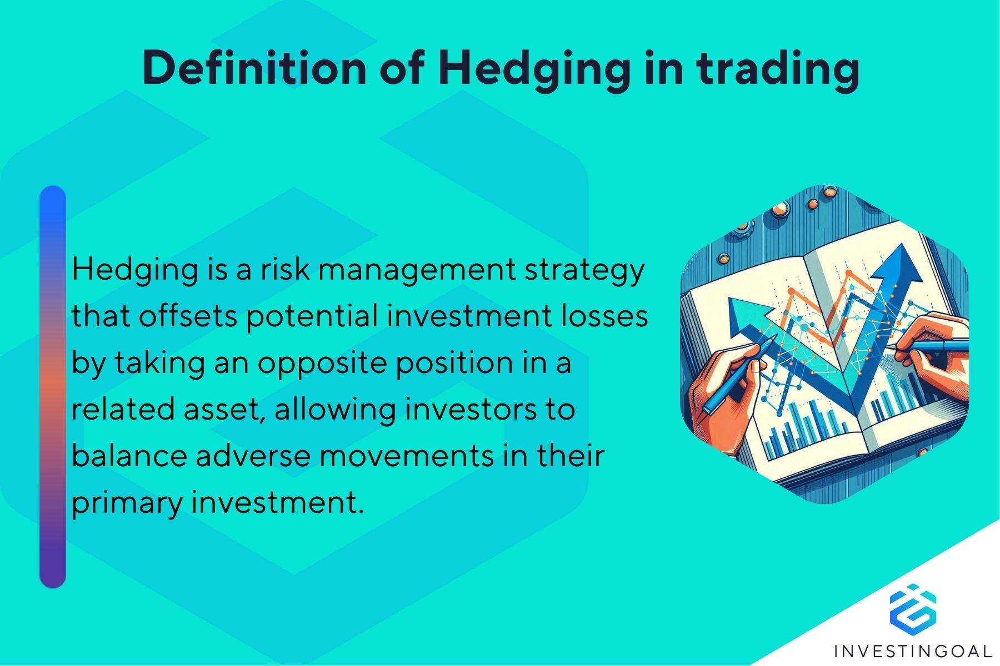

## Table of Contents

## What is double hedging?

Double hedging is a financial strategy where someone uses two different hedges to protect against risks. A hedge is like an insurance policy for investments. It helps reduce the chance of losing money if the market goes down. In double hedging, a person might use one hedge to protect against a drop in the value of their investment and another hedge to protect against other risks, like changes in interest rates or currency values.

This strategy can be useful but also has its challenges. It can be more expensive because you are paying for two hedges instead of one. Also, if the market goes up, the cost of the hedges might reduce the profits. Double hedging is often used by big investors or companies that want to be very careful with their money. They use it to make sure they are protected from different kinds of risks at the same time.

## Why is double hedging used in financial markets?

Double hedging is used in financial markets to protect against different risks at the same time. Imagine you own a stock and you're worried it might go down in value. You can use one hedge to protect against that risk. But what if you're also worried about changes in interest rates or currency values affecting your investment? That's where double hedging comes in. By using two hedges, you can cover more bases and feel safer about your investment.

However, double hedging isn't perfect. It can be more expensive because you're paying for two hedges instead of one. Also, if the market goes up, the cost of the hedges might eat into your profits. Despite these drawbacks, big investors and companies often use double hedging. They want to be extra careful and make sure they're protected from as many risks as possible. So, while it's not a perfect solution, double hedging can be a useful tool for those who can afford it and need extra protection.

## Can you explain the basic mechanism of double hedging?

Double hedging is like having two insurance policies for your money. Imagine you own a stock and you're worried it might lose value. You can buy one hedge to protect against that. But you might also be worried about other things, like changes in interest rates or currency values. So, you buy another hedge to cover those risks. By using two hedges, you're trying to make sure you're safe no matter what happens.

The way double hedging works is by using different financial tools to cover different risks. For the first hedge, you might use options or futures to protect against a drop in the stock's value. For the second hedge, you might use currency swaps or interest rate swaps to protect against changes in currency or interest rates. It's like having two layers of protection. But remember, using two hedges can be more expensive, and if the market goes up, the cost of the hedges might reduce your profits.

## What are the key components involved in a double hedging strategy?

Double hedging involves using two different financial tools to protect against different risks. The first key component is the primary hedge, which is used to protect against the main risk, like a drop in the value of a stock. This could be done using options or futures, which act like insurance policies for your investment. If the stock price falls, the hedge helps limit your losses.

The second key component is the secondary hedge, which is used to protect against another type of risk, such as changes in interest rates or currency values. This might involve using financial instruments like interest rate swaps or currency swaps. By using both hedges, you are trying to cover more bases and make sure you're protected from different kinds of risks at the same time.

However, double hedging is not without its challenges. It can be more expensive because you're paying for two hedges instead of one. Also, if the market goes up, the cost of the hedges might eat into your profits. Despite these drawbacks, big investors and companies often use double hedging because they want to be extra careful and make sure they're protected from as many risks as possible.

## How does double hedging differ from single hedging?

Double hedging and single hedging are both ways to protect your money, but they work a little differently. Single hedging is like having one insurance policy. You use one hedge to protect against one main risk, like a drop in the value of a stock. For example, if you own a stock and you're worried it might go down, you can buy an option or a future to limit your losses if that happens. It's a simple and straightforward way to protect your investment from one specific risk.

Double hedging, on the other hand, is like having two insurance policies. You use two different hedges to protect against two different risks at the same time. For instance, you might use one hedge to protect against a drop in the stock's value, and another hedge to protect against changes in interest rates or currency values. This can be more expensive because you're paying for two hedges instead of one, and if the market goes up, the cost of the hedges might reduce your profits. But big investors and companies often use double hedging because they want to be extra careful and make sure they're protected from as many risks as possible.

## What are the potential benefits of using a double hedging strategy?

Double hedging can offer more protection for your money. By using two different hedges, you can guard against more than one risk at the same time. For example, if you own a stock and you're worried it might go down, you can use one hedge to protect against that. But if you're also worried about changes in interest rates or currency values, you can use another hedge to cover those risks. This way, no matter what happens, you're more likely to be safe.

However, double hedging isn't perfect. It can be more expensive because you're paying for two hedges instead of one. Also, if the market goes up, the cost of the hedges might eat into your profits. Despite these drawbacks, big investors and companies often use double hedging because they want to be extra careful. They use it to make sure they're protected from as many risks as possible, even if it costs more.

## What are the risks associated with double hedging?

Double hedging can be more expensive than using just one hedge. When you use two hedges, you have to pay for both of them. This means you're spending more money upfront to protect your investment. If the market goes up and your investment does well, the cost of the two hedges might reduce the amount of money you make. So, while double hedging can help you feel safer, it can also eat into your profits if things go well.

Another risk is that double hedging can be complicated. Managing two different hedges at the same time can be tricky. You need to understand how each hedge works and make sure they are both doing what you want them to do. If you make a mistake, you might not be as protected as you thought. This complexity can make double hedging harder to manage, especially if you're not an experienced investor.

## Can you provide an example of a double hedging strategy in action?

Imagine you own shares in a company that makes cars in Europe, but you live in the United States. You're worried that the value of your shares might go down if the car company doesn't do well. To protect against this, you buy a put option on the stock. A put option gives you the right to sell the stock at a certain price, even if the market price drops lower. This is your first hedge, protecting you from a drop in the stock's value.

But you're also worried about another risk: changes in the exchange rate between the US dollar and the Euro. If the Euro gets weaker compared to the US dollar, the value of your shares in Euros might not mean as much when you convert it back to dollars. To protect against this, you enter into a currency swap agreement. This agreement lets you exchange your Euros for US dollars at a set rate, no matter what happens to the exchange rate. This is your second hedge, protecting you from currency risk.

By using both the put option and the currency swap, you're using a double hedging strategy. You're protecting your investment from two different risks at the same time. While this can be more expensive and complicated, it gives you more peace of mind knowing you're covered no matter what happens.

## How do regulatory environments affect double hedging practices?

Regulatory environments can have a big impact on double hedging practices. Different countries have different rules about what kinds of financial tools you can use and how you can use them. For example, some countries might limit the use of certain types of options or swaps, which are important for double hedging. If the rules are strict, it might be harder or more expensive to set up a double hedge. Also, regulators might require more reporting or transparency when you use these strategies, which can add to the complexity and cost.

Despite these challenges, regulatory environments can also help make double hedging safer. Regulators often set rules to protect investors and make sure the financial markets are fair. For example, they might require companies to have enough money set aside to cover their hedging activities. This can help make sure that double hedging is done responsibly and doesn't lead to big problems. So, while regulations can make double hedging more complicated, they can also help keep the practice safe and reliable.

## What advanced techniques can be applied to optimize a double hedging strategy?

To optimize a double hedging strategy, you can use something called dynamic hedging. This means you keep an eye on the market and adjust your hedges as things change. For example, if the stock you own starts to go up, you might decide to reduce your put option hedge a bit. Or if the exchange rate between the US dollar and the Euro starts to move a lot, you might adjust your currency swap. By being flexible and making changes as needed, you can make sure your double hedge is always working as well as it can.

Another advanced technique is using correlation analysis. This means you look at how different risks are related to each other. For example, if you find that changes in interest rates often happen at the same time as changes in stock prices, you can use this information to make your hedges work better together. By understanding these relationships, you can set up your double hedge in a way that covers more risks without costing too much extra. This can help you get the most protection for your money.

## How can one measure the effectiveness of a double hedging strategy?

Measuring the effectiveness of a double hedging strategy can be done by looking at how well it protects your money. You can compare the value of your investment with and without the hedges. If the market goes down, but your losses are smaller because of the hedges, then they are working well. You can also look at how much the hedges cost you. If the cost of the hedges is less than the money they save you from losses, then they are effective. It's like checking if the insurance you bought is worth the price.

Another way to measure the effectiveness is by looking at how the hedges perform over time. You can keep track of how often the hedges help you and how often they don't. If the hedges are helping you more often than not, then they are effective. Also, you can compare your results with other investors who are using different strategies. If your double hedging strategy is doing better than theirs, then it's working well. It's all about making sure the hedges are doing their job and protecting your money without costing too much.

## What are the current trends and future prospects for double hedging in global markets?

Double hedging is becoming more popular as global markets get more complicated. More investors are using it because they want to protect their money from different risks at the same time. For example, with trade wars and changes in currency values, investors are using double hedging to feel safer. Also, new technology and financial tools are making it easier to set up and manage double hedges. This means more people can use double hedging, even if they are not big investors.

In the future, double hedging is likely to keep growing. As the world gets more connected, there will be more risks to worry about. This means more investors will want to use double hedging to protect their money. Also, as financial markets become more open and rules change, double hedging might become easier to use in more places. But it's important to remember that double hedging can be expensive and hard to manage, so it's not right for everyone. Still, for those who need extra protection, double hedging will likely be a useful tool in the years to come.

## What is Double Hedging and How Does it Work?

Double hedging is a robust risk management strategy aimed at mitigating potential losses by taking offsetting positions in two separate markets. It typically involves the concurrent use of futures contracts and options to hedge an investment against adverse price movements, thereby reducing the risk associated with unpredictable market fluctuations.

The essence of double hedging lies in its ability to balance exposure through derivatives. Futures contracts are agreements to buy or sell an asset at a predetermined price at a future date, effectively locking in prices and mitigating the risk of unfavorable market shifts. On the other hand, options provide the right, but not the obligation, to buy or sell an asset at a specific price before a certain date, offering additional flexibility.

### Practical Example of Double Hedging

Consider an investor who holds a substantial position in a portfolio of technology stocks and wants to protect against potential declines in the tech sector. To execute a double hedge:

1. **Futures Hedge**: The investor could sell index futures related to a technology stock index. If the tech sector declines, the losses in the stock portfolio could be offset by gains in the short futures position.

2. **Options Hedge**: Simultaneously, the investor could purchase put options on the individual stocks within the portfolio or on the tech index itself. These put options provide the right to sell the stocks at a set price, offering a safety net against sharp declines.

The combination of these positions creates a double layer of protection. The short futures position benefits from a declining market, while the purchased put options cap potential losses. With both tools in place, the investor is better shielded from market [volatility](/wiki/volatility-trading-strategies).

### Mathematical Representation

Mathematically, if $S$ is the current stock price, $F$ is the futures contract price, and $P$ is the premium paid for the put option with a strike price of $K$, the payoff for the hedged position can be represented as:

- **Futures Payoff**: $P_f = (F_0 - F)$, if the investor is short on futures.
- **Options Payoff**: $P_o = \max(0, K - S) - P$.

The total payoff from the hedged position would thus be:

$$
P_{\text{total}} = P_f + P_o
$$

This equation highlights that while the futures payoff protects against declines through locking futures prices, the options payoff caps losses with the premium serving as the cost of this protection. Together, these instruments provide a comprehensive risk mitigation strategy through double hedging.

By implementing double hedging, investors can tailor their risk management strategy to their specific portfolio needs, balancing the cost of hedging with the level of protection desired. This nuanced approach offers a strategic means to navigate market uncertainties effectively.

## How can you implement double hedging in your trading strategy?

Successful implementation of double hedging within a trading strategy necessitates meticulous planning, astute market analysis, and precise risk management. This strategy involves holding offsetting positions in two markets, typically through the use of futures and options, to mitigate investment risk effectively. Here's a step-by-step guide on integrating double hedging into your trading strategy:

### 1. Assess Market Conditions
The first step involves a thorough analysis of the current market conditions. Traders need to identify prevailing trends, volatility levels, and potential market-moving events that could impact their investments. Utilizing tools like technical analysis, economic indicators, and sentiment analysis can provide valuable insights. 

For example, consider the potential impact of an impending [interest rate](/wiki/interest-rate-trading-strategies) decision, which could lead to increased volatility in currency markets. By accurately assessing these factors, traders can better determine the necessity and timing for implementing a double hedge.

### 2. Select Appropriate Hedging Instruments
Once market conditions are assessed, traders must choose suitable hedging instruments. This typically involves selecting a combination of futures contracts and options that align with the underlying investment's characteristics and risk exposure. 

- **Futures Contracts**: These are standardized agreements to buy or sell an asset at a predetermined price and date in the future, providing a straightforward way to hedge against price changes.

- **Options**: Options grant the trader the right, but not the obligation, to buy or sell an asset at a specified price within a set timeframe. They offer more flexibility compared to futures.

### 3. Calculate Hedge Ratios
Determining the hedge ratio is crucial for effective double hedging. The hedge ratio defines the proportion of the position that needs to be hedged to minimize risk. It can be calculated using the formula:

$$
\text{Hedge Ratio} = \frac{\text{Value of Hedging Instrument}}{\text{Value of Position Being Hedged}}
$$

A perfect hedge would have a ratio of 1, indicating complete risk neutralization. However, traders may adjust this ratio based on risk tolerance and market outlook.

### 4. Manage Hedge Positions Effectively
Effective management of hedge positions involves continuous monitoring and adjustment as market conditions evolve. Traders should be prepared to rebalance their hedges to maintain the desired level of risk protection. This might involve altering the quantity of futures or options held or replacing them with new contracts as they approach expiration.

### 5. Evaluate Performance
Regularly evaluating the performance of the double hedging strategy is crucial. Traders need to compare the actual outcomes against the expected results to gauge the effectiveness of their hedging efforts. This evaluation can be facilitated using performance metrics such as the Sharpe ratio or Value at Risk (VaR).

### Practical Example
Consider a portfolio manager seeking to protect a large stock position from adverse price movements leading up to an earnings announcement. The manager may purchase put options to guard against downside risk while selling index futures to offset potential negative moves in the broader market. By managing these positions dynamically, the manager can effectively reduce the portfolio's exposure to sudden price changes.

### Conclusion
Integrating double hedging into a trading strategy requires a sound understanding of financial instruments and market dynamics. By carefully planning, selecting appropriate instruments, and managing positions effectively, traders can enhance their risk management capabilities, safeguarding their investments against volatile market conditions.

## References & Further Reading

[1]: Hull, J. (2018). ["Options, Futures, and Other Derivatives"](https://www.amazon.com/Options-Futures-Other-Derivatives-10th/dp/013447208X) (10th Edition). Pearson.

[2]: Black, F., & Scholes, M. (1973). ["The Pricing of Options and Corporate Liabilities."](https://www.cs.princeton.edu/courses/archive/fall09/cos323/papers/black_scholes73.pdf) Journal of Political Economy, 81(3), 637-654.

[3]: Lopez de Prado, M. (2018). ["Advances in Financial Machine Learning."](https://www.amazon.com/Advances-Financial-Machine-Learning-Marcos/dp/1119482089) Wiley.

[4]: Jarrow, R., & Turnbull, S. (1996). ["Derivative Securities."](https://archive.org/details/derivativesecuri0000jarr) South-Western College Publishing.

[5]: Chan, E. P. (2009). ["Quantitative Trading: How to Build Your Own Algorithmic Trading Business."](https://github.com/ftvision/quant_trading_echan_book) Wiley.