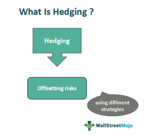

In the intricate landscape of financial markets, effectively managing risk is paramount for traders and investors. One advanced technique that offers a comprehensive approach to risk mitigation is "double hedging." Double hedging involves holding offsetting positions in different markets to protect investments against adverse price movements, thus acting as a robust mechanism for preserving capital.

This article explores the concept of double hedging within the context of financial risk management and the role algorithmic trading plays in implementing these strategies. Algorithmic trading, by leveraging automation and complex computations, enhances the precision and speed of executing double hedging strategies. This synergy between advanced hedging techniques and technological tools helps investors navigate market uncertainties with greater confidence and efficiency.



In addition, we will examine the variety of benefits and challenges associated with double hedging, as well as practical implementations of these strategies in today's fast-evolving markets. By understanding both the advantages and obstacles of double hedging, traders and investors can make informed decisions that bolster their risk management strategies, offering a significant competitive edge in financial markets.

## Table of Contents

## Understanding Double Hedging

Double hedging is a robust risk management strategy aimed at mitigating potential losses by taking offsetting positions in two separate markets. It typically involves the concurrent use of futures contracts and options to hedge an investment against adverse price movements, thereby reducing the risk associated with unpredictable market fluctuations.

The essence of double hedging lies in its ability to balance exposure through derivatives. Futures contracts are agreements to buy or sell an asset at a predetermined price at a future date, effectively locking in prices and mitigating the risk of unfavorable market shifts. On the other hand, options provide the right, but not the obligation, to buy or sell an asset at a specific price before a certain date, offering additional flexibility.

### Practical Example of Double Hedging

Consider an investor who holds a substantial position in a portfolio of technology stocks and wants to protect against potential declines in the tech sector. To execute a double hedge:

1. **Futures Hedge**: The investor could sell index futures related to a technology stock index. If the tech sector declines, the losses in the stock portfolio could be offset by gains in the short futures position.

2. **Options Hedge**: Simultaneously, the investor could purchase put options on the individual stocks within the portfolio or on the tech index itself. These put options provide the right to sell the stocks at a set price, offering a safety net against sharp declines.

The combination of these positions creates a double layer of protection. The short futures position benefits from a declining market, while the purchased put options cap potential losses. With both tools in place, the investor is better shielded from market [volatility](/wiki/volatility-trading-strategies).

### Mathematical Representation

Mathematically, if $S$ is the current stock price, $F$ is the futures contract price, and $P$ is the premium paid for the put option with a strike price of $K$, the payoff for the hedged position can be represented as:

- **Futures Payoff**: $P_f = (F_0 - F)$, if the investor is short on futures.
- **Options Payoff**: $P_o = \max(0, K - S) - P$.

The total payoff from the hedged position would thus be:

$$
P_{\text{total}} = P_f + P_o
$$

This equation highlights that while the futures payoff protects against declines through locking futures prices, the options payoff caps losses with the premium serving as the cost of this protection. Together, these instruments provide a comprehensive risk mitigation strategy through double hedging.

By implementing double hedging, investors can tailor their risk management strategy to their specific portfolio needs, balancing the cost of hedging with the level of protection desired. This nuanced approach offers a strategic means to navigate market uncertainties effectively.

## Mechanics of Double Hedging

Double hedging utilizes a strategic approach to risk management by leveraging the complementary properties of futures contracts and options. This dual-faceted strategy is designed to offset potential losses in an investment portfolio, thereby neutralizing exposure to adverse market movements. Here, we break down the key elements of double hedging and how this technique functions in practical scenarios.

A central component of double hedging is the integration of futures and options. Futures contracts obligate the parties involved to buy or sell an asset at a predetermined future date and price, thus providing a straightforward hedge against price fluctuations. Meanwhile, options offer more flexibility. A put option, for example, gives the holder the right, but not the obligation, to sell an asset at a specified price within a certain timeframe, serving as a safeguard against declining asset prices.

Consider an investor with a substantial equity portfolio, concerned about potential market downturns. This investor might implement a double hedging strategy by purchasing put options on individual stocks within the portfolio. Simultaneously, the investor might sell index futures, like S&P 500 futures, to protect against broader market declines. This dual-action creates a buffer. If the market falls, the gains from the put options and the short index futures can offset the losses from the portfolio’s decreased value.

The mechanics of this strategy can be better understood with an example. Suppose an investor holds $100,000 worth of a diversified stock portfolio. They anticipate a market downturn and decide to adopt a double hedging strategy. First, they buy put options on key stocks representing $50,000 of their portfolio. Each put option has a strike price close to the current market value, ensuring that the investor is protected if those stocks lose value.

Simultaneously, the investor sells index futures contracts equivalent to $100,000. This tactic covers the entire portfolio's exposure and benefits from any decline in the wider market index. The loss from the stock portfolio can thus be counterbalanced by gains from both the put options and the future positions. 

The effective implementation of double hedging requires precise timing and accurate market predictions. Traders must carefully determine the amounts of futures and options to incorporate, analyze the costs involved, and continually monitor market conditions to adjust their positions as necessary.

By combining the deterministic payoff structure of futures with the probabilistic nature of options, double hedging provides a comprehensive risk management framework. However, it is crucial to consider transaction costs, the potential for basis risk arising from imperfect correlation between index futures and the underlying portfolio, and the dynamic nature of option premiums when volatility changes.

This strategic blend of futures and options in double hedging not only helps protect against unwanted financial exposure but also enhances the investor’s ability to navigate varying market conditions effectively.

## Benefits and Challenges of Double Hedging

Double hedging significantly enhances risk mitigation through its dual-layered approach, allowing investors to protect their portfolios against adverse price movements in a more robust manner. By diversifying the protective instruments, such as using both futures and options, investors can cushion the expected losses in one asset with gains in another. This increased protection flexibility adds a vital layer of security, especially in highly volatile or uncertain market conditions. Furthermore, double hedging offers flexibility by allowing investors to tailor their strategies to specific risk preferences and market conditions, potentially maximizing returns.

Despite these benefits, double hedging presents several challenges. The complexity of this strategy can be daunting, requiring comprehensive knowledge of financial instruments and meticulous planning. Each component of the strategy—futures and options—comes with its own set of market dynamics and pricing mechanisms that traders must understand in depth. Missteps in the execution of hedging instruments may lead to inadequate protection or even magnified losses.

Additionally, the costs associated with double hedging may be substantial. Each transaction, whether it involves buying options or futures contracts, incurs fees. Frequent adjustments to hedge positions, especially in response to fluctuating market conditions, can further contribute to transaction costs. Overreliance on double hedging without a clear strategy and proper cost-benefit analysis might diminish the expected returns.

Moreover, the dynamic nature of markets means that hedging strategies must be continuously monitored and adjusted. Market correlations can change unpredictably, potentially altering the effectiveness of a previously optimized double hedging strategy. This ongoing maintenance demands substantial time and resources, posing a challenge for traders who may lack the infrastructure or knowledge to refine their strategies efficiently.

In summary, while double hedging offers significant advantages in risk management by providing enhanced protection and flexibility, it is imperative for traders and investors to weigh these benefits against the inherent challenges of complexity, cost, and resource intensity. A successful double hedging strategy demands not only a deep understanding of financial instruments but also a commitment to frequent reassessment and technical proficiency.

## Algorithmic Trading and Hedging Strategies

Algorithmic trading, a technological advancement in the financial markets, has significantly reshaped hedging strategies, including double hedging. By leveraging computer systems to execute trades at high speeds and with precision, [algorithmic trading](/wiki/algorithmic-trading) minimizes human error and emotional distraction, which are common in manual trading approaches. This technology allows for the precise enactment of double hedging strategies, thereby increasing their overall effectiveness.

The core advantage of algorithmic trading in double hedging is its ability to process vast amounts of market data at incredible speeds. Algorithms can swiftly evaluate market conditions, detect [arbitrage](/wiki/arbitrage) opportunities, and execute trades within milliseconds. This rapid processing capability is crucial in double hedging, where timing is essential to ensure positions are accurately offset.

An example to illustrate this involves an algorithm programmed to maintain a hedge ratio — the number of future or option contracts required to hedge a position in the underlying asset. By continuously analyzing market data, the algorithm can adjust the hedge ratio dynamically, optimizing the hedge as market conditions fluctuate. In mathematical terms, if we denote the hedge ratio as $H$, the algorithm calculates $H = \frac{\Delta S}{\Delta F}$, where $\Delta S$ is the change in the spot price of the asset and $\Delta F$ is the change in the futures price.

Python serves as a robust tool for implementing such algorithmic strategies. A simplified Python code snippet for initiating a threshold-based hedging strategy could look like this:

```python
def hedge_position(current_price, threshold, portfolio):
    if abs(current_price - portfolio['hedge_level']) > threshold:
        adjust_hedge(portfolio)

def adjust_hedge(portfolio):
    # Logic to adjust the hedge, such as buying/selling futures or options
    pass

# Example usage
portfolio = {'hedge_level': 100}
current_price = get_current_market_price()
hedge_position(current_price, 5, portfolio)
```

This example illustrates how an automated system can monitor price changes and modify hedge positions promptly when specific criteria — such as a breach of a predefined price threshold — are met.

Another profound impact of algorithmic trading on double hedging is its capacity for [backtesting](/wiki/backtesting) strategies. Traders can assess the performance of their hedging strategies against historical data, ensuring robustness before deployment in live markets. This testing process allows for refinements and provides insights into the potential risks and returns of a strategy under various market conditions.

In conclusion, algorithmic trading enhances the efficiency and precision of double hedging strategies, offering an advanced method for traders and investors to manage risk effectively. By automating the hedging process, traders can achieve greater flexibility and responsiveness in their risk management strategies, staying competitive in increasingly fast-paced financial markets.

## Implementing Double Hedging in Your Trading Strategy

Successful implementation of double hedging within a trading strategy necessitates meticulous planning, astute market analysis, and precise risk management. This strategy involves holding offsetting positions in two markets, typically through the use of futures and options, to mitigate investment risk effectively. Here's a step-by-step guide on integrating double hedging into your trading strategy:

### 1. Assess Market Conditions
The first step involves a thorough analysis of the current market conditions. Traders need to identify prevailing trends, volatility levels, and potential market-moving events that could impact their investments. Utilizing tools like technical analysis, economic indicators, and sentiment analysis can provide valuable insights. 

For example, consider the potential impact of an impending [interest rate](/wiki/interest-rate-trading-strategies) decision, which could lead to increased volatility in currency markets. By accurately assessing these factors, traders can better determine the necessity and timing for implementing a double hedge.

### 2. Select Appropriate Hedging Instruments
Once market conditions are assessed, traders must choose suitable hedging instruments. This typically involves selecting a combination of futures contracts and options that align with the underlying investment's characteristics and risk exposure. 

- **Futures Contracts**: These are standardized agreements to buy or sell an asset at a predetermined price and date in the future, providing a straightforward way to hedge against price changes.

- **Options**: Options grant the trader the right, but not the obligation, to buy or sell an asset at a specified price within a set timeframe. They offer more flexibility compared to futures.

### 3. Calculate Hedge Ratios
Determining the hedge ratio is crucial for effective double hedging. The hedge ratio defines the proportion of the position that needs to be hedged to minimize risk. It can be calculated using the formula:

$$
\text{Hedge Ratio} = \frac{\text{Value of Hedging Instrument}}{\text{Value of Position Being Hedged}}
$$

A perfect hedge would have a ratio of 1, indicating complete risk neutralization. However, traders may adjust this ratio based on risk tolerance and market outlook.

### 4. Manage Hedge Positions Effectively
Effective management of hedge positions involves continuous monitoring and adjustment as market conditions evolve. Traders should be prepared to rebalance their hedges to maintain the desired level of risk protection. This might involve altering the quantity of futures or options held or replacing them with new contracts as they approach expiration.

### 5. Evaluate Performance
Regularly evaluating the performance of the double hedging strategy is crucial. Traders need to compare the actual outcomes against the expected results to gauge the effectiveness of their hedging efforts. This evaluation can be facilitated using performance metrics such as the Sharpe ratio or Value at Risk (VaR).

### Practical Example
Consider a portfolio manager seeking to protect a large stock position from adverse price movements leading up to an earnings announcement. The manager may purchase put options to guard against downside risk while selling index futures to offset potential negative moves in the broader market. By managing these positions dynamically, the manager can effectively reduce the portfolio's exposure to sudden price changes.

### Conclusion
Integrating double hedging into a trading strategy requires a sound understanding of financial instruments and market dynamics. By carefully planning, selecting appropriate instruments, and managing positions effectively, traders can enhance their risk management capabilities, safeguarding their investments against volatile market conditions.

## Case Studies and Practical Examples

Double hedging has been implemented in various financial markets to manage risk effectively, with notable success in different scenarios. Let us explore some examples that highlight the practical applications of this strategy.

### Example 1: Commodity Markets

In the commodity markets, double hedging is often used by producers to protect against fluctuations in raw material prices. For instance, consider a coffee producer concerned about future price declines. To hedge against this risk, the producer implements a double hedge by entering a short position in coffee futures and purchasing put options on coffee. The futures contract provides immediate price protection, while the put options offer additional coverage against any unexpected downward price movement beyond the futures price.

This combination allows the producer to maintain flexibility while securing their expected revenue. The futures contract locks in a minimum price, and the put options offer the potential to benefit if prices drop significantly, mitigating the risk of adverse price movements effectively.

### Example 2: Equity Markets

In equity markets, investors often use double hedging to secure their stock portfolios. An institutional investor holding a diversified equity portfolio may fear an imminent market downturn. To hedge this risk, they might buy put options on a stock index that closely correlates with their portfolio while selling futures on the same index.

This strategy gives the investor downside protection via the put options, accommodating sharp declines during market volatility, and generates income from the futures contracts. Thus, if the market moves unfavorably, the gains from either the futures market or options can offset the portfolio losses, demonstrating a balanced hedging approach.

### Example 3: Foreign Exchange Markets

Corporate treasurers managing significant transactions in foreign exchange (Forex) markets can also benefit from double hedging. Consider a multinational company with a major transaction pending in euros but with revenues primarily in US dollars. The company can sell euro futures contracts to mitigate the risk of euro depreciation and simultaneously purchase euro put options for additional security.

By combining these financial instruments, the company secures a better exchange rate for the pending transaction, protecting against adverse currency movements while maintaining the opportunity to capitalize on favorable fluctuations.

### Analytical Insights

Examining these examples shows that double hedging effectively mitigates risk by covering multiple scenarios and instruments. The strategy requires a deep understanding of market dynamics and the proper selection of hedging instruments. Through precise planning and execution, investors and traders can harness double hedging to enhance their risk management frameworks.

For traders and investors seeking to apply double hedging in their portfolios, these case studies demonstrate not only the mechanics of successful implementation but also the rich potential for managing risk across diverse market conditions.

## Conclusion

Double hedging, when used alongside algorithmic trading, provides traders with a strong defense against the unpredictable nature of financial markets. This strategy involves a complex interplay of financial instruments such as futures and options, which necessitates a deep understanding of both market dynamics and regulatory frameworks. For traders who can navigate the intricacies of double hedging, the rewards include significantly enhanced risk management capabilities, allowing for more stable investment outcomes even during periods of heightened volatility.

However, the complexity of double hedging strategies mandates continuous education and adaptation. The fast-paced evolution of financial markets and technologies means that successful traders are those who remain vigilant and proactive in refining their strategies. Regular analysis of market conditions, ongoing investment in learning, and the agile adjustment of hedging tactics are essential practices for maintaining a competitive advantage.

Moreover, the integration of algorithmic trading into double hedging strategies allows for increased efficiency in trade execution. Algorithms can swiftly process vast amounts of market data, enabling traders to bypass the human errors and biases associated with manual trading. This technological edge provides precision in executing hedges and exploiting market opportunities with minimal delay.

As financial markets continue to evolve, the ability to efficiently implement and adapt double hedging strategies will remain a critical skill. Traders poised to embrace this complexity will be the ones best positioned to safeguard their investments and capitalize on market movements in a continually shifting global financial landscape.

## References & Further Reading

[1]: Hull, J. (2018). ["Options, Futures, and Other Derivatives"](https://www.amazon.com/Options-Futures-Other-Derivatives-10th/dp/013447208X) (10th Edition). Pearson.

[2]: Black, F., & Scholes, M. (1973). ["The Pricing of Options and Corporate Liabilities."](https://www.cs.princeton.edu/courses/archive/fall09/cos323/papers/black_scholes73.pdf) Journal of Political Economy, 81(3), 637-654.

[3]: Lopez de Prado, M. (2018). ["Advances in Financial Machine Learning."](https://www.amazon.com/Advances-Financial-Machine-Learning-Marcos/dp/1119482089) Wiley.

[4]: Jarrow, R., & Turnbull, S. (1996). ["Derivative Securities."](https://archive.org/details/derivativesecuri0000jarr) South-Western College Publishing.

[5]: Chan, E. P. (2009). ["Quantitative Trading: How to Build Your Own Algorithmic Trading Business."](https://github.com/ftvision/quant_trading_echan_book) Wiley.