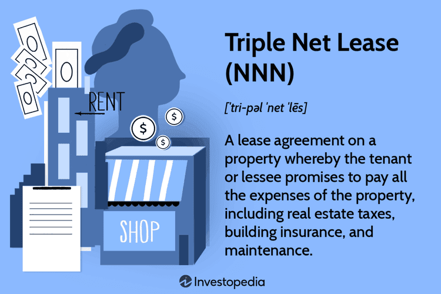

In the ever-evolving world of commercial real estate, understanding the nuances of various lease types is crucial for investors and tenants alike. Commercial leasing involves different agreements that can significantly impact the financial dynamics between landlords and tenants. Among these, the double net lease and the triple net lease are predominant. Each of these lease structures offers distinct benefits and challenges, influencing investment strategies and operational responsibilities.

A double net lease, often abbreviated as NN lease, requires tenants to cover property taxes and insurance premiums in addition to the base rent. This arrangement reduces the landlord's burden of managing tax and insurance payments, while tenants benefit from potentially lower rent rates compared to more comprehensive lease agreements.



Conversely, a triple net lease (NNN lease) extends tenant obligations further to encompass maintenance costs, alongside property taxes and insurance. This comprehensive transfer of financial responsibility makes triple net leases attractive to landlords seeking stable, predictable income streams with minimal involvement in property management. However, the additional financial load on tenants can lead to higher turnover, necessitating careful tenant vetting to ensure financial stability.

Beyond these traditional considerations, the rise of technology and data analytics has introduced new paradigms in commercial real estate management. Algorithmic trading, once predominantly associated with financial markets, now plays an increasingly influential role in real estate investment. By employing sophisticated algorithms, investors can analyze market trends, forecast economic shifts, and optimize lease agreements to maximize profitability and mitigate risks. This technological integration reshapes how investors assess commercial real estate opportunities, paving the way for more informed and strategic decision-making processes.

This article will explore these lease types in detail and investigate the impact of algorithmic trading on the commercial real estate market. Understanding these intersections of financial strategy and technological advancement is essential for stakeholders looking to navigate the complexities of modern real estate investment successfully.

## Table of Contents

## Understanding Double Net Lease and Triple Net Lease

A double net lease, commonly referred to as a "NN lease," shifts some financial obligations beyond the base rent to the tenant. In this lease structure, tenants are responsible for paying property taxes and insurance premiums. This arrangement reduces the landlord's financial burden, as they no longer cover these costs, allowing for potentially lower rental rates compared to more comprehensive lease types. The structure is favored in properties where tenants desire some control over operating expenses like taxes and insurance but do not wish to manage maintenance duties. 

On the other hand, a triple net lease, or "NNN lease," places further financial responsibilities on the tenant. In addition to property taxes and insurance, the tenant must also cover maintenance expenses. This model significantly shifts the financial responsibility from the landlord to the tenant, making it an attractive option for investors seeking stable, low-maintenance income streams. The triple net lease is particularly prevalent in commercial real estate sectors involving single-tenant properties, such as retail outlets, where tenants prefer control over property maintenance.

Both lease types influence investment strategies by altering cash flow profiles. Double net leases generally attract investors seeking a balance between control and cost savings, while triple net leases appeal to investors prioritizing predictable revenue streams with minimal landlord responsibilities. Understanding these lease structures enables investors and tenants to align their financial and operational goals, ensuring a mutually beneficial lease arrangement. This knowledge is crucial for effectively navigating commercial real estate landscapes, where strategic financial allocation determines success.

## Advantages and Challenges of Double and Triple Net Leases

Double net leases (NN) and triple net leases (NNN) are common lease agreements in commercial real estate, each with distinct advantages and challenges based on their allocation of financial responsibility between landlords and tenants.

Double net leases offer a compromise between the responsibilities of tenants and landlords. In a double net lease scenario, tenants are responsible for paying property taxes and insurance premiums in addition to the base rent. This framework allows for a degree of shared responsibility, often leading to relatively lower rent payments compared to triple net leases. Investors and tenants find this lease type attractive as it balances costs while maintaining shared interest in the property's upkeep. The reduced financial burden can appeal to tenants who wish to avoid the comprehensive obligations seen in triple net leases.

Triple net leases are characterized by tenants covering property taxes, insurance, and maintenance costs, on top of the base rent. This setup provides landlords with more predictable income streams, as they are insulated from the [volatility](/wiki/volatility-trading-strategies) of these expenses. In these agreements, the onus is on the tenant to manage most of the property-related financial responsibilities, making tenant selection crucial. Landlords must evaluate the financial health of potential tenants to ensure they can meet these obligations. While landlords favor triple net leases to limit their involvement in operational expenses, this financial setup can lead to tenant turnover due to the heavier financial load, which is a significant challenge.

Both lease types fit varying commercial properties and investment strategies. Double net leases suit properties where landlords retain some operational control and involvement, thus appealing to more cautious investors desiring control over certain aspects. Conversely, triple net leases attract investors seeking minimal operational involvement and steady cash flow, provided they carefully vet tenants to mitigate the risks associated with tenant defaults.

Each lease type, therefore, provides specific advantages depending on the investor's strategy and the tenant's capacity to handle associated costs, impacting property selection and management approaches.

## How Commercial Real Estate Benefits from Algorithmic Trading

Algorithmic trading has drastically transformed various financial markets due to its ability to utilize vast amounts of data in a fraction of the time it would take humans. In commercial real estate, this innovation is making significant inroads by enhancing the decision-making processes around lease agreements and property investments. The key here is the use of big data and predictive analytics.

In practice, [algorithmic trading](/wiki/algorithmic-trading) systems exploit large datasets to uncover patterns and trends that can influence real estate market dynamics. For instance, predictive models can be developed to forecast market fluctuations and economic developments, allowing investors to optimize lease terms and refine investment strategies. Using historical data, [machine learning](/wiki/machine-learning) algorithms can predict future property values, rental rates, and even tenant behaviors with high accuracy. 

A key element of algorithmic trading's application in real estate is the use of predictive analytics. Predictive models employ a variety of statistical techniques such as regression analysis, time series analysis, and machine learning to predict future events based on historical data. For example, regression might be used to model the relationship between lease prices and various market indicators, helping investors determine optimal lease pricing strategies.

```python
import numpy as np
from sklearn.linear_model import LinearRegression

# Sample data: square footage of properties and their lease prices
square_footage = np.array([[1000], [1500], [2000], [2500], [3000]])
lease_prices = np.array([4000, 6000, 8000, 10000, 12000])

# Create a linear regression model
model = LinearRegression()
model.fit(square_footage, lease_prices)

# Predict lease price for a new property
new_property_sqft = np.array([[3500]])
predicted_price = model.predict(new_property_sqft)
print(f"Predicted lease price for 3500 sqft: ${predicted_price[0]}")
```

Additionally, algorithmic systems can process real-time data inputs, like economic indicators, social sentiment, and transaction volumes, to refine projections dynamically. This enables investors to act swiftly in mitigating risks and capitalizing on opportunities. The ability to model risk more effectively and anticipate potential downturns or booms in the market confers a considerable competitive advantage.

Moreover, algorithmic trading systems provide a means to automate portfolio management, enabling faster and more efficient transaction processing. This is crucial in commercial real estate, where large transactions can be complex and time-consuming. Automating these processes can lead to more streamlined operations, lower costs, and reduced human error.

In summary, the merging of algorithmic trading technologies with commercial real estate investing offers a suite of tools that empowers investors to maximize profits while minimizing risks. By capitalizing on the latest advancements in big data and predictive analytics, stakeholders can significantly enhance their decision-making capabilities in a dynamic market environment.

## The Synergy of Lease Structures and Algorithmic Trading in Investment Strategies

Integrating algorithmic trading with real estate lease management allows investors to dynamically adjust their portfolios in response to market conditions. This powerful combination is rooted in utilizing sophisticated algorithms to analyze vast amounts of data, enabling more precise forecasting of property values and lease performance.

The ability to process and interpret complex datasets equips investors with data-driven insights, allowing for robust projections and informed decision-making. For instance, algorithmic systems can identify trends and patterns that may not be immediately apparent through traditional analysis. By employing these insights, investors can anticipate market fluctuations, optimize lease terms, and enhance their overall asset management strategy.

One of the key advantages of algorithmic trading in this context is its capacity to provide real-time analysis. This capability enables landlords to modify lease agreements swiftly in volatile markets, a crucial [factor](/wiki/factor-investing) in maintaining a competitive edge. By adjusting lease structures based on algorithmic predictions, landlords can better align rental rates with current market conditions, thus minimizing vacancies and enhancing revenue stability.

An effective synergy between lease structures and algorithmic trading not only aids in maximizing returns but also plays a critical role in risk management. Investors can leverage predictive analytics to evaluate the potential impact of economic variables on real estate investments, allowing them to devise contingency plans proactively. Such predictive capabilities are invaluable in periods of economic uncertainty, offering a path to sustainable growth.

To illustrate this process, consider a Python script employing linear regression to predict future rental prices based on historical data and market indicators. Such a model might use libraries like NumPy and scikit-learn to achieve accurate forecasts:

```python
import numpy as np
from sklearn.linear_model import LinearRegression

# Example historical data
rents = np.array([1500, 1550, 1600, 1650, 1700])
market_index = np.array([100, 105, 110, 115, 120]).reshape(-1, 1)

# Create a linear regression model
model = LinearRegression()
model.fit(market_index, rents)

# Predict future rent
future_market_index = np.array([125]).reshape(-1, 1)
predicted_rent = model.predict(future_market_index)

print(f"Predicted future rent: ${predicted_rent[0]:.2f}")
```

In this script, historical rental data and a market index are used to build a regression model that predicts future rental prices. By integrating such tools, investors can make data-backed decisions, aligning their strategies with emergent market dynamics.

Understanding this synergy between lease structures and algorithmic trading is essential for modern real estate investors aiming to maximize their return on investment. As technology progresses, the implementation of these sophisticated techniques will likely become a standard practice, offering innovative pathways to navigate the complexities of commercial real estate markets.

## Conclusion

Both double net and triple net leases offer distinct advantages and challenges, requiring a nuanced understanding from both investors and tenants. Double net leases offer a balance of shared costs, while triple net leases provide predictable income with a greater transfer of financial responsibilities to tenants. Navigating these opportunities demands strategic decision-making.

The emergence of algorithmic trading significantly transforms the commercial real estate landscape. By utilizing vast datasets and predictive analytics, investors can optimize lease agreements and enhance property investment strategies. This technological integration allows for more accurate forecasting of property values and lease performance, providing investors with a decisive competitive edge.

As technological advancements continue to reshape the industry, investing strategies in commercial real estate will also evolve. Investors who leverage these advanced tools and embrace change will likely excel, positioning themselves at the forefront of this fast-paced market. The synergy between modern technology and traditional real estate practices presents unprecedented opportunities for growth and innovation, ensuring that those who adapt will thrive in the complex domain of commercial real estate.

## References & Further Reading

[1]: ["The Real Estate Investor's Guide to Lease Structures: Mastering Triple Net and More"](https://rockstep.com/blog/guide-to-commercial-leases) by John Smith

[2]: ["Commercial Real Estate Leases: An Overview"](https://www.squarefoot.com/leasopedia/different-types-of-commercial-leases/) by University of Hong Kong Urban and Rural Planning Department

[3]: Geltner, D., Miller, N.G., Clayton, J., & Eichholtz, P. (2013). ["Commercial Real Estate Analysis and Investments,"](https://www.researchgate.net/publication/245702364_Commercial_Real_Estate_Analysis_and_Investments) South-Western, Mason, OH.

[4]: Lopez de Prado, M. (2018). ["Advances in Financial Machine Learning,"](https://www.amazon.com/Advances-Financial-Machine-Learning-Marcos/dp/1119482089) John Wiley & Sons.

[5]: Chan, E.P. (2009). ["Quantitative Trading: How to Build Your Own Algorithmic Trading Business,"](https://github.com/ftvision/quant_trading_echan_book) John Wiley & Sons.

[6]: ["Algorithm Trading of Real Estate Markets: An Analytical Perspective"](https://paperswithbacktest.com/wiki/real-estate-alternative-data) published in the European Journal of Management Studies.

[7]: Aronson, D. (2006). ["Evidence-Based Technical Analysis: Applying the Scientific Method and Statistical Inference to Trading Signals,"](https://www.amazon.com/Evidence-Based-Technical-Analysis-Scientific-Statistical/dp/0470008741) John Wiley & Sons.