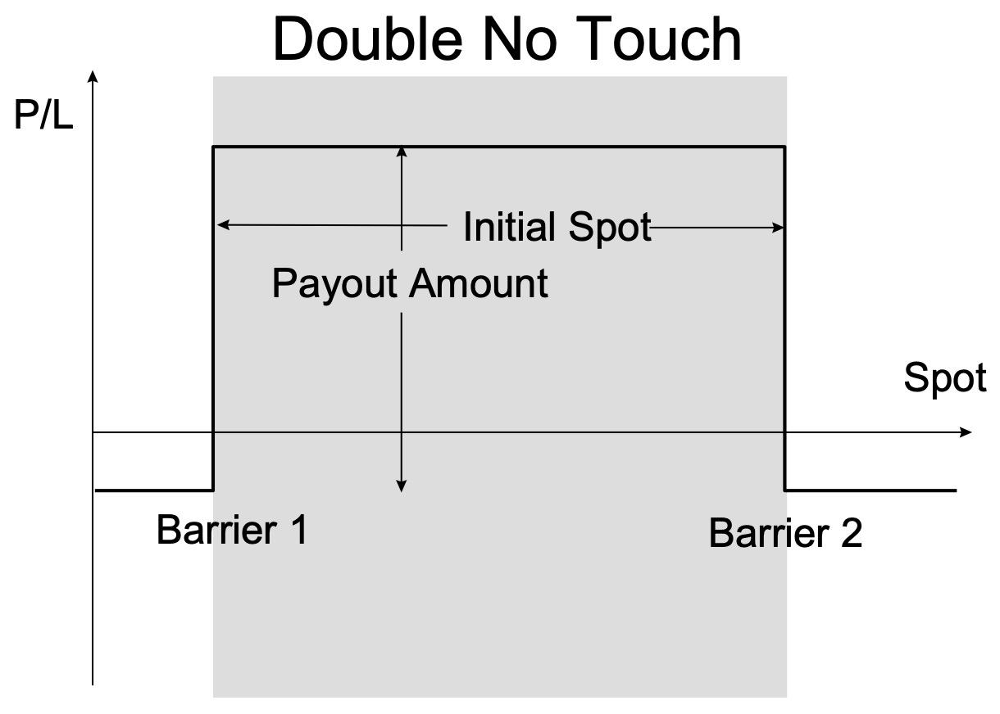

Financial derivatives, like options and futures, are indispensable instruments in modern trading. They serve multiple purposes, allowing investors to either speculate on future price movements or hedge against potential losses related to underlying assets. These instruments derive their value from underlying entities such as stocks, currencies, or commodities, making them versatile tools in a trader's arsenal.

Double no-touch options, a category of exotic options, have garnered attention for their unique pay-off structures. Unlike traditional options, which offer returns based on price movement beyond specific thresholds, double no-touch options pay a fixed amount only if the asset's price remains confined within preset upper and lower boundaries throughout the option's life. This feature makes them particularly appealing for traders looking to capitalize on expected periods of low volatility or stable market conditions.



Algorithmic trading has revolutionized financial markets by employing computer software to execute trades at speeds and frequencies beyond human capability. This technology-driven approach offers significant advantages by using data to systematically implement complex trading strategies, including those involving derivatives like double no-touch options. Algorithms can swiftly adapt to ever-changing market conditions, making them powerful tools for exploiting precise trading opportunities while managing risk effectively.

This article will explore these elements, highlighting how they interconnect and offering insights into their strategic applications, advantages, and challenges. Understanding these concepts is essential for anyone looking to enhance their trading capabilities through sophisticated means. The synergy between algorithmic trading and exotic options like double no-touch options can significantly extend the possibilities available to modern traders, providing structured risk and reward opportunities tailored to specific market environments.

## Table of Contents

## What Are Financial Derivatives?

Financial derivatives are financial instruments whose value is contingent upon the price movements of an underlying asset. These underlying assets can range across various categories, including stocks, commodities, currencies, interest rates, or market indices. The primary function of derivatives is to facilitate hedging and speculation in financial markets, enabling participants to manage risk or capitalize on price fluctuations.

### Types of Financial Derivatives

1. **Futures Contracts**: A futures contract obligates the buyer to purchase, and the seller to sell, an asset at a predetermined price and a specified future date. These contracts are standardized and traded on exchanges, making them accessible and liquid instruments for traders looking to hedge against or speculate on future price movements in commodities, currencies, or indices.

2. **Options**: Options provide the holder with the right, but not the obligation, to buy or sell an underlying asset at a specific price before a specified date. There are two primary forms of options:
   - **Call Options**: Grant the holder the right to purchase the asset.
   - **Put Options**: Allow the holder to sell the asset.  
   Options are prized for their flexibility, as they can be used to hedge potential losses or to engage in speculative strategies aimed at benefiting from market trends.

3. **Swaps**: Swaps are derivative contracts where two parties agree to exchange cash flows or financial instruments over a certain period. Common types of swaps include interest rate swaps, currency swaps, and commodity swaps. These instruments are widely used to mitigate risks associated with variable interest rates or currency fluctuations.

### Growth and Accessibility

The proliferation of financial derivatives has been fueled by advancements in technology, which have dramatically transformed the trading landscape. With sophisticated trading platforms and [algorithmic trading](/wiki/algorithmic-trading) systems, derivatives trading has become increasingly efficient and accessible to a broader array of investors. These technological advancements have facilitated the deployment of complex trading strategies that were previously difficult to execute.

Derivatives play a crucial role in risk management and price discovery in financial markets. By enabling the transfer and transformation of risk, they contribute to market efficiency and [liquidity](/wiki/liquidity-risk-premium), allowing investors to fine-tune their exposure to various financial risks and opportunities.

## Understanding Trading Options

Options are a specialized class of financial derivatives granting buyers the privilege, but not the obligation, to procure or vend an underlying asset at a specified price—termed the strike price—within a stipulated timeframe. This flexibility allows traders to capitalize on price movements without the necessity to hold the underlying asset outright, distinguishing options from other trading instruments.

The primary types of options are calls and puts. Call options empower the holder with the right to purchase the underlying asset at the strike price before the option expires. Conversely, put options confer the right to sell the asset at the strike price within the same constraints. The strategic use of these instruments aids traders in achieving diverse financial objectives, such as safeguarding portfolios or speculating on market directions.

Options serve a dual purpose in financial markets. They can function as a hedge against possible adverse price movements, thereby mitigating risk in other investments. For example, an investor holding a substantial quantity of a particular stock might purchase a put option to protect against a potential decrease in the stock's value. Alternatively, options can be employed for speculative purposes, allowing traders to bet on the future direction of an asset's price. If a trader anticipates a price increase, acquiring call options would enable them to benefit from the appreciation without purchasing the actual asset.

Option strategies often involve combining these positions to tailor risk and return profiles to specific market conditions. For instance, a "straddle" strategy involves buying both a call and a put option with the same strike price and expiration date, betting on significant price [volatility](/wiki/volatility-trading-strategies) without regard to direction. Similarly, a "spread" strategy, such as the "bull call spread," involves purchasing a call option while simultaneously selling another call option with a higher strike price, aiming to profit from a moderate price increase in the underlying asset.

These strategic uses of options reflect their versatility and the complexity of employing them effectively in financial markets. The numerous combinations and strategies available highlight options' capacity to reveal multifaceted insights into market expectations, risk management, and profit maximization.

## Focus on Exotic Options: Double No-Touch Options

Double no-touch options are a form of exotic binary options, distinct in their mechanism and payoff structure. These options settle at a fixed payout if the price of the underlying asset remains within a defined range, specified by an upper and lower boundary, throughout the option's lifespan. If the asset's price touches either boundary before expiry, the option expires worthless. This characteristic positions them as tools for traders who expect minimal volatility, making precise predictions of market movements.

Primarily deployed in foreign exchange ([FX](/wiki/fx-anomaly)) markets, double no-touch options serve traders looking to capitalize on stable currency pair behaviors. For instance, an FX trader might anticipate that the exchange rate between two currencies will remain within a narrow band over a specific period due to anticipated market stability or central bank policies. The trader sets upper and lower boundaries reflective of this expected stability. Provided no unforeseen events cause the exchange rate to breach these bounds, the trader achieves a predetermined payout at expiration.

The nature of double no-touch options inherently defines risk and reward. Traders are aware of the potential maximum loss upfront—the premium paid for the option. This makes them appealing in range-bound market conditions where volatility is perceived to be low. The clarity of risk and reward is a significant advantage, allowing traders to employ such options with precision, enhancing strategies for managing portfolios in uncertain markets.

While they offer structured payouts and risk, the profitability of double no-touch options hinges on the accurate prediction of price movements and volatility patterns within the market. These options necessitate a sophisticated understanding of market dynamics and conditions that could potentially drive prices to touch the predetermined boundaries. Consequently, their effective use requires comprehensive market analysis and monitoring.

## Algorithmic Trading and Double No-Touch Options

Algorithmic trading, commonly referred to as algo trading, leverages computer algorithms to optimize trading efficiency and precision. This approach allows traders to execute large volumes of trades with minimal manual intervention, relying on predefined criteria and mathematical models. By automating the trading process, algo trading significantly reduces human error, provides rapid execution, and enhances decision-making through real-time data analysis.

Double no-touch options represent a category of exotic options known as binary options. They are well-suited for algorithmic trading strategies, particularly in market environments characterized by limited volatility and range-bound price movements. A double no-touch option pays a fixed return if the underlying asset's price remains within a specified range, defined by an upper and lower boundary, until the option's expiration.

The integration of double no-touch options into algorithmic trading frameworks can offer distinct advantages. Algorithms can continuously monitor market conditions, identifying optimal moments for executing trades based on volatility indicators, market trends, and other critical factors. This capacity allows traders to capitalize on fleeting opportunities and execute trades with greater precision than manual trading would typically permit.

Moreover, algorithmic systems can implement data-driven insights and predetermined conditions to construct robust trading strategies. These systems can manage risk effectively by adapting to current market scenarios and adjusting trade parameters such as entry and [exit](/wiki/exit-strategy) points. Algorithms are particularly beneficial in mitigating risks associated with double no-touch options, where accurate predictions of price movements are essential to profitability.

By employing advanced analytics and automated execution, algorithmic trading can maximize potential returns from double no-touch options while maintaining stringent risk controls. Python, with its various libraries for financial analysis like NumPy, pandas, and scikit-learn, is often a preferred choice for developing such algorithmic trading systems. A simple Python example to calculate the payoff of a double no-touch option might be:

```python
def double_no_touch_payoff(current_price, upper_bound, lower_bound, payout):
    if lower_bound < current_price < upper_bound:
        return payout
    else:
        return 0

# Example usage
current_price = 100
upper_bound = 110
lower_bound = 90
payout = 10

payoff = double_no_touch_payoff(current_price, upper_bound, lower_bound, payout)
print(f"The payoff is: {payoff}")
```

Here, this function evaluates whether the current price of an asset remains within the defined boundaries and determines the payoff accordingly. Such tools demonstrate how algorithmic approaches enhance trading strategies involving double no-touch options, facilitating precise risk management and optimized returns.

## Benefits and Risks of Double No-Touch Options in Algo Trading

Double no-touch options encompass unique benefits and risks when integrated with algorithmic trading. These options, by their nature, offer a potential for high returns in markets characterized by stability and low volatility. The predefined risk exposure and fixed payoff structure make them particularly attractive for traders who aim to construct sophisticated trading strategies aligned with specific market conditions.

One of the primary benefits of double no-touch options is their ability to allow traders to tailor strategies to prevailing market conditions. In periods of low volatility, these options can be effectively leveraged to capitalize on a stable price range. This strategy involves setting specific barrier levels on both the upper and lower end of the price spectrum. The payout is contingent upon the price of the underlying asset remaining within these levels until the option expires. Here, the precision in barrier identification directly correlates with the potential return, as highlighted by the payoff formula:

$$
\text{Payoff} = 
\begin{cases} 
0, & \text{if } S_t \leq H \: \text{or} \: S_t \geq L \: \text{at any time } t \\
K, & \text{if } S_t \: \text{remains entirely within} \: (H,L) 
\end{cases}
$$

Where $S_t$ is the asset price at time $t$, $H$ and $L$ are the high and low barriers, respectively, and $K$ is the fixed payout.

Despite these advantages, the complexity of predicting precise price movements highlights significant risks associated with double no-touch options. Accurate forecasting of future price stability is challenging. Misjudging market conditions can result in the asset touching one of the barriers, rendering the option worthless. (i.e., out-of-the-money).

Algorithmic trading systems mitigate these risks by executing predefined trading strategies with precision and speed. However, this necessitates meticulous risk management practices, including constant refinement of models and vigilant monitoring of market conditions. An algorithm might incorporate [machine learning](/wiki/machine-learning) techniques to dynamically adjust barrier levels based on historical volatility or exploit a [backtesting](/wiki/backtesting) framework to simulate and optimize performance. Here's an illustrative example in Python:

```python
import numpy as np

# Simulate price movements
np.random.seed(42)
S0 = 100  # initial asset price
sigma = 0.02  # assumed low volatility
T = 252  # time horizon in days
H = 105  # upper barrier
L = 95   # lower barrier

# Simulate asset path
price_paths = S0 * np.exp(np.cumsum(np.random.normal(0, sigma, T)))

# Check if the path stays within barriers
if all(L < price < H for price in price_paths):
    print("Double no-touch option is in-the-money. Payoff granted.")
else:
    print("One of the barriers has been breached. Option expired worthless.")
```

The effective application of double no-touch options in algorithmic trading requires an advanced synthesis of strategy development, rigorous analytics, and continuous model oversight. Balancing these components can help traders maximize potential returns while mitigating inherent risks.

## Case Study: Algo Trading with Double No-Touch Options

In this case study, we explore the application of algorithmic trading strategies centered around double no-touch options, particularly focusing on the EUR/USD currency pair. The use of such options in algorithmic trading is often driven by an objective to exploit trading opportunities within range-bound markets, where the expectation is that the asset's price will oscillate within a specified range for a given period.

### System Design

A trader developed an automated trading system designed to identify and capitalize on these specific market conditions. The system leveraged various volatility indicators to determine when the EUR/USD pair was likely to remain within a predefined range. Key indicators used included Average True Range (ATR), Bollinger Bands, and implied volatility derived from options markets. The integration of these indicators allowed the algorithm to set entry points for purchasing double no-touch options under suitable conditions.

A simplified Python snippet illustrating the implementation of volatility checks might look like this:

```python
import talib
import numpy as np

# Example data
price_data = np.random.random(100)  # Replace with actual price data

# Calculate volatility indicators
atr = talib.ATR(price_data, price_data, price_data, timeperiod=14)
upper_band, middle_band, lower_band = talib.BBANDS(price_data, timeperiod=20)

# Decision to trade
def is_range_bound(atr, upper_band, lower_band):
    return (atr[-1] < 0.01) and (price_data[-1] < upper_band[-1]) and (price_data[-1] > lower_band[-1])

if is_range_bound(atr, upper_band, lower_band):
    # Execute trade logic
    print("Trade executed")
```

### Execution and Challenges

The trading system, once activated, monitored market conditions in real time. Upon identifying favorable scenarios where price volatility was low and expected to remain within the set price barriers, the system executed purchases of double no-touch options. The predefined risk/reward criteria were strictly adhered to, ensuring that each trade fit the established strategy.

One of the significant challenges encountered was dealing with unforeseen market events, such as sudden economic announcements or geopolitical developments, which could introduce unexpected volatility. These events, often difficult to predict, required the algorithm to include fail-safes to minimize losses, such as immediate position closure or dynamic hedge adjustments.

### Outcomes and Insights

Despite the intrinsic challenges, the algorithmic strategy demonstrated success by maintaining a disciplined approach to the execution of trades that met specific risk/reward parameters. The use of double no-touch options provided a clear framework for potential returns, supporting the strategy in capturing profits from stable market conditions where prices remained within the expected boundaries.

This case study highlights the potential for utilizing double no-touch options within algorithmic systems to navigate range-bound markets effectively. However, it also underscores the necessity for ongoing strategy refinement and risk management to adapt to the ever-changing market landscape and manage the inherent risks of binary options trading within an algorithmic framework.

## Conclusion

Double no-touch options offer traders a structured approach to managing risk and potential returns. By defining clear boundary conditions, these options allow traders to navigate market conditions with precision, particularly in scenarios where prices are expected to remain stable within a specified range. The integration of algorithmic trading methods enhances the use of double no-touch options, enabling traders to exploit opportunities across financial markets with improved speed and accuracy. 

Algorithmic trading continues to revolutionize the application of exotic derivatives like double no-touch options. Through the automation of trading strategies and data-driven decision-making, algorithmic trading facilitates precise execution and risk management. This synergy between double no-touch options and algorithmic methods empowers traders to optimize their strategies, particularly in range-bound markets where traditional approaches might fall short.

However, the success of these strategies hinges on rigorous research, robust risk management, and continuous adaptation. The dynamic nature of financial markets necessitates that traders remain vigilant and responsive to changing conditions. As algorithmic trading platforms evolve, coupled with advancements in data analytics and computational power, traders must consistently refine their strategies to maintain an edge in the marketplace.

Ultimately, the combination of double no-touch options and algorithmic trading presents a compelling proposition for traders aiming to enhance their trading arsenals. By leveraging structure and precision, traders can potentially achieve greater consistency and success in capturing market opportunities while mitigating risks. Despite the complexities involved, those committed to thorough preparation and ongoing strategy enhancement can find significant rewards in this innovative trading approach.

## References & Further Reading

[1]: Hull, J. C. (2017). ["Options, Futures, and Other Derivatives."](https://www.semanticscholar.org/paper/Options%2C-Futures%2C-and-Other-Derivatives-Hull/89bdee500c8623864fc9eb7a471546aa713acc44) Pearson Education.

[2]: Black, F., & Scholes, M. (1973). ["The Pricing of Options and Corporate Liabilities."](https://www.cs.princeton.edu/courses/archive/fall09/cos323/papers/black_scholes73.pdf) Journal of Political Economy, 81(3), 637-654.

[3]: Lopez de Prado, M. (2018). ["Advances in Financial Machine Learning."](https://www.amazon.com/Advances-Financial-Machine-Learning-Marcos/dp/1119482089) Wiley.

[4]: Taleb, N. N. (2010). ["Dynamic Hedging: Managing Vanilla and Exotic Options."](https://books.google.com/books/about/Dynamic_Hedging.html?id=GcG_DwAAQBAJ) Wiley.

[5]: Jansen, S. (2020). ["Machine Learning for Algorithmic Trading."](https://github.com/stefan-jansen/machine-learning-for-trading) Packt Publishing.

[6]: McMillan, L. G. (2004). ["Options as a Strategic Investment."](https://www.amazon.com/Options-Strategic-Investment-Lawrence-McMillan/dp/0735201978) New York: New York Institute of Finance.