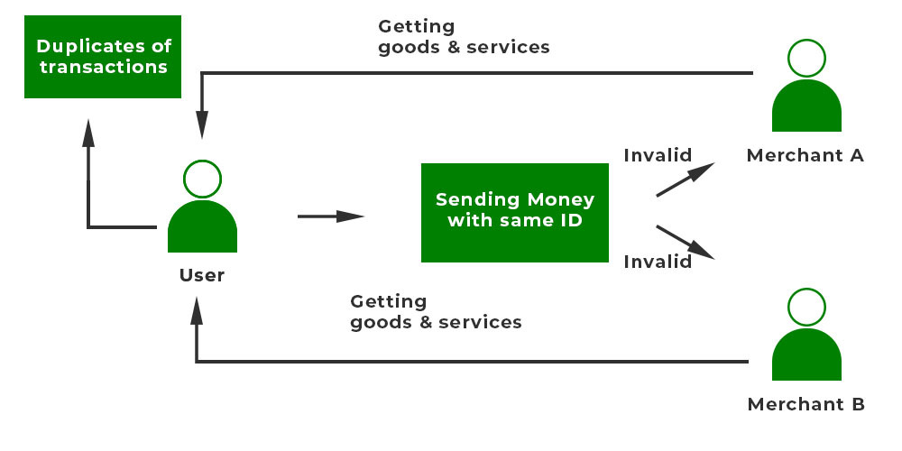

## Table of Contents

## What is double-spending?

Double-spending is when someone tries to use the same digital money twice. In the world of physical cash, this is hard to do because once you give a dollar to someone, you no longer have it. But with digital money, it's easier because you can make copies of the digital file and try to spend it in more than one place at the same time.

To prevent double-spending, digital currencies like Bitcoin use a special system called a blockchain. The blockchain keeps a record of all transactions, making sure that once a coin is spent, it can't be spent again. This way, everyone can trust that the digital money is being used fairly and honestly.

## Why is double-spending a problem in digital currencies?

Double-spending is a big problem in digital currencies because it can trick people into thinking they have received money when they haven't. Imagine you send a digital coin to buy something, but then you send that same coin to someone else to buy something else. Both people might think they got the coin, but really, only one of them should have it. This can cause a lot of confusion and unfairness.

To stop double-spending, digital currencies like Bitcoin use a system called a blockchain. The blockchain is like a big notebook that keeps track of every time a coin is spent. Once a coin is recorded as spent in the blockchain, no one can use it again. This helps make sure that digital money works fairly and everyone can trust it.

## How does double-spending work in traditional banking systems versus cryptocurrencies?

In traditional banking systems, double-spending is less of a problem because banks keep track of all transactions. When you pay with your bank account, the bank makes sure you can't use the same money twice. They do this by updating your account balance right away. If you try to spend the same money again, the bank will see that you don't have enough money left and won't let the transaction go through. This makes it hard to double-spend in traditional banking.

In cryptocurrencies like Bitcoin, double-spending is a bigger issue because there's no central bank to keep track of everything. Instead, a network of computers, called nodes, work together to make sure transactions are valid. If someone tries to double-spend, the nodes will notice and stop the transaction from going through. They use a special record called a blockchain to keep track of who owns what. If a coin is spent, it's recorded on the blockchain, and no one can use it again. This system helps prevent double-spending, but it's more complicated than traditional banking.

## What are the common methods used to attempt double-spending?

One common way people try to double-spend is called the "race attack." In a race attack, someone sends the same digital coin to two different places at the same time. They hope that one of the transactions will get confirmed before the other, letting them trick one of the people into thinking they got the coin. This method relies on being faster than the system that checks transactions.

Another method is the "Finney attack," named after a person who thought of it. In this attack, someone spends a coin and waits for the transaction to be confirmed. But before it's fully confirmed, they try to spend the same coin somewhere else. If the second transaction gets confirmed first, the person can keep the coin and trick someone. This attack needs good timing and a bit of luck to work.

A third method is the "51% attack," which is harder to pull off but can be very powerful. In a 51% attack, someone or a group controls more than half of the computers that check transactions in a [cryptocurrency](/wiki/cryptocurrency) network. With this control, they can decide which transactions get confirmed and which don't. They can then try to double-spend coins by making sure their second transaction gets confirmed instead of the first one. This attack is rare but can cause big problems if it happens.

## What is a 51% attack and how does it relate to double-spending?

A 51% attack happens when one person or a group takes control of more than half of the computers that run a cryptocurrency network. These computers are called nodes, and they work together to check and confirm transactions. If someone controls more than half of these nodes, they can decide which transactions get added to the blockchain and which ones don't. This gives them a lot of power over the network.

This kind of attack is related to double-spending because it lets the attacker try to spend the same coin twice. They can do this by sending a coin to one person and then, before that transaction is fully confirmed, sending the same coin to someone else. By controlling more than half of the nodes, they can make sure the second transaction gets confirmed instead of the first one. This way, they can keep the coin and trick someone into thinking they got it. A 51% attack is hard to pull off, but it can cause big problems if it happens.

## How do blockchain technologies prevent double-spending?

Blockchain technologies prevent double-spending by keeping a clear record of every transaction. Imagine a big notebook where every time someone spends a coin, it gets written down. Once a coin is spent, it's recorded in this notebook, and everyone can see it. This way, if someone tries to spend the same coin again, the system will check the notebook and see that the coin has already been used. It won't let the second transaction go through because it knows the coin is no longer available.

To make sure this notebook is always correct, a group of computers, called nodes, work together to check every transaction. They all have a copy of the notebook and agree on what's written in it. If someone tries to cheat by spending a coin twice, the nodes will notice and stop it. This system of checking and agreeing makes it very hard for anyone to double-spend, keeping the digital money safe and fair for everyone.

## What is the role of consensus mechanisms in preventing double-spending?

Consensus mechanisms are like a voting system that helps keep digital money safe from double-spending. In a blockchain, many computers called nodes work together to check every transaction. They all have to agree that a transaction is real before it gets added to the big notebook, or blockchain. If someone tries to spend the same coin twice, the nodes will see it and not let it happen. This voting system makes sure everyone trusts the record of transactions, so no one can cheat.

These mechanisms are important because they make sure the whole network agrees on what's true. If one person tried to change the record to double-spend a coin, most of the other nodes would disagree and stop it. By needing most of the nodes to agree, consensus mechanisms keep the blockchain honest and prevent people from using the same digital money more than once.

## Can you explain the concept of transaction confirmation and its importance in preventing double-spending?

Transaction confirmation is like getting a stamp on your digital money to say it's been used. When you spend a coin in a cryptocurrency system, the computers in the network check the transaction to make sure it's real. Once they agree it's okay, they add it to the big notebook called the blockchain. This stamp, or confirmation, tells everyone that the coin has been spent and can't be used again. It's important because it stops people from trying to spend the same coin twice.

Confirmations happen over time as more and more computers check the transaction and add new pages to the blockchain. The more confirmations a transaction gets, the harder it is for someone to change it. This makes the system more secure. If someone tries to double-spend a coin, the network will see the confirmed transaction and won't let the second one go through. This way, everyone can trust that the digital money is being used fairly and honestly.

## What are some advanced techniques used by cryptocurrencies to further secure against double-spending?

Cryptocurrencies use something called "Proof of Work" to make it really hard for someone to double-spend. In Proof of Work, computers have to solve tough puzzles to add new transactions to the blockchain. This takes a lot of time and energy, so trying to double-spend by changing the blockchain would be too hard and costly. It's like trying to undo a lot of work that many people have already done, which makes double-spending almost impossible.

Another advanced technique is "Proof of Stake." Instead of solving puzzles, people who own coins can help check transactions based on how many coins they have. If someone tries to double-spend, the people with the most coins can stop it because they have more say in what gets added to the blockchain. This makes the system fair and secure, and it's another way to make sure no one can use the same coin twice.

## How do different cryptocurrencies approach the problem of double-spending differently?

Different cryptocurrencies use different ways to stop double-spending. Bitcoin, for example, uses a method called Proof of Work. In this system, computers have to solve hard puzzles to add new transactions to the blockchain. This makes it very difficult for someone to try to spend the same coin twice because they would need to redo a lot of work that many computers have already done. It's like trying to change something that's already been set in stone, which is really hard and not worth the effort.

Another way some cryptocurrencies like Ethereum use is called Proof of Stake. Instead of solving puzzles, people who own coins can help check transactions based on how many coins they have. If someone tries to double-spend, the people with the most coins can stop it because they have more power in deciding what goes into the blockchain. This makes the system fair and secure, and it's another way to make sure no one can use the same coin twice. Each method has its own way of keeping the digital money safe and honest.

## What are the potential future developments in preventing double-spending attacks?

In the future, new ways to stop double-spending might include using even smarter computer systems. One idea is to use [artificial intelligence](/wiki/ai-artificial-intelligence) to watch over transactions and spot any funny business right away. AI could learn from past transactions and get better at catching people trying to spend the same coin twice. This would make the system even safer because it would be like having a super smart guard watching over the digital money all the time.

Another future development could be better ways of working together between different cryptocurrencies. Right now, each cryptocurrency has its own way of keeping track of transactions. But if they could share information and help each other, it would be harder for someone to double-spend across different systems. This teamwork could make the whole world of digital money safer and more trustworthy for everyone.

## What are the legal and ethical implications of double-spending and its prevention?

Double-spending is like cheating in the world of digital money. It's not fair to the people who think they got the money but didn't. If someone tries to double-spend, it can cause big problems because it breaks the trust that makes digital money work. That's why it's against the law in many places. Governments want to make sure that money, whether it's paper or digital, is used honestly. If someone gets caught double-spending, they could face serious legal trouble, like fines or even jail time.

Preventing double-spending is important for keeping the digital money system honest and fair. The technology used to stop double-spending, like blockchain and consensus mechanisms, helps make sure everyone plays by the rules. Ethically, it's the right thing to do because it protects people from being tricked. But there's also a challenge: as technology gets better, it needs to balance security with privacy. People want their money to be safe, but they also want to keep their financial information private. Finding the right balance is a big part of making sure the prevention methods are not just legal, but also ethical.

## References & Further Reading

[1]: Satoshi Nakamoto. (2008). ["Bitcoin: A Peer-to-Peer Electronic Cash System."](https://nakamotoinstitute.org/library/bitcoin/)

[2]: Ali, M., Nelson, J., Shea, R., & Freedman, M. J. (2016). ["Blockstack: A Global Naming and Storage System Secured by Blockchains."](https://www.usenix.org/system/files/conference/atc16/atc16_paper-ali.pdf)

[3]: Bonneau, J., Miller, A., Clark, J., Narayanan, A., Kroll, J. A., & Felten, E. W. (2015). ["SoK: Research Perspectives and Challenges for Bitcoin and Cryptocurrencies."](https://ieeexplore.ieee.org/document/7163021) IEEE Symposium on Security and Privacy.

[4]: Gencer, A. E., Basu, S., Eyal, I., Van Renesse, R., & Sirer, E. G. (2018). ["Decentralization in Bitcoin and Ethereum Networks."](https://arxiv.org/abs/1801.03998) Proceedings of the 22nd International Conference on Financial Cryptography and Data Security.

[5]: Tschorsch, F., & Scheuermann, B. (2016). ["Bitcoin and Beyond: A Technical Survey on Decentralized Digital Currencies."](https://ieeexplore.ieee.org/document/7423672) IEEE Communications Surveys & Tutorials, 18(3), 2084-2123.

[6]: Narayanan, A., Bonneau, J., Felten, E., Miller, A., & Goldfeder, S. (2016). ["Bitcoin and Cryptocurrency Technologies."](https://press.princeton.edu/books/hardcover/9780691171692/bitcoin-and-cryptocurrency-technologies) Princeton University Press.

[7]: Buterin, V. (2013). ["Ethereum Whitepaper: A Next-Generation Smart Contract and Decentralized Application Platform."](http://cryptoverze.s3.us-east-2.amazonaws.com/wp-content/uploads/2018/11/10012235/Ethereum-ETH-whitepaper.pdf)

[8]: Luu, L., Chu, D.-H., Olickel, H., Saxena, P., & Hobor, A. (2016). ["Making Smart Contracts Smarter."](https://dl.acm.org/doi/10.1145/2976749.2978309) Proceedings of the 2016 ACM SIGSAC Conference on Computer and Communications Security.

[9]: Böhme, R., Christin, N., Edelman, B., & Moore, T. (2015). ["Bitcoin: Economics, Technology, and Governance."](https://www.aeaweb.org/articles?id=10.1257/jep.29.2.213) Journal of Economic Perspectives, 29(2), 213-238.

[10]: Zohar, A. (2015). ["Bitcoin: Under the Hood."](https://dl.acm.org/doi/10.1145/2701411) Communications of the ACM, 58(9), 104-113.

[11]: Garay, J., Kiayias, A., & Leonardos, N. (2015). ["The Bitcoin Backbone Protocol: Analysis and Applications."](https://eprint.iacr.org/2014/765.pdf) Annual International Conference on the Theory and Applications of Cryptographic Techniques.

[12]: Rosic, A. (n.d.). ["What is Algorithmic Trading: Definition and Strategies."](https://www.investopedia.com/terms/a/algorithmictrading.asp)