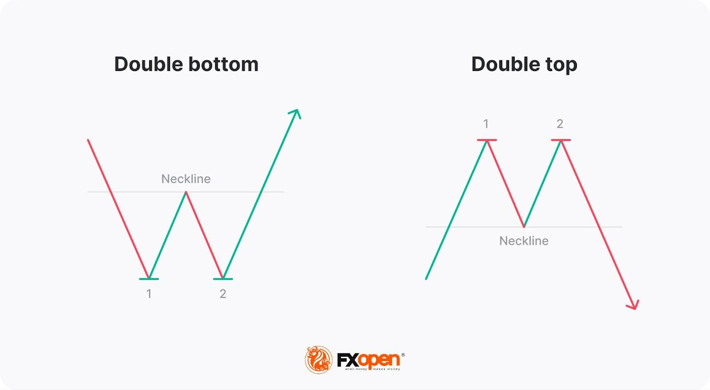

## Table of Contents

## What are double top and bottom patterns in technical analysis?

In technical analysis, a double top pattern looks like the letter "M" on a price chart. It happens when a stock's price goes up to a high point, drops down, then goes up again to about the same high point, and finally drops down again. This pattern suggests that the price might start going down more, because it shows that the stock couldn't keep going up past that high point twice. Traders often see this as a sign to sell or to get ready for a price drop.

A double bottom pattern is the opposite and looks like the letter "W" on a chart. It happens when a stock's price drops to a low point, goes up, drops again to about the same low point, and then goes up again. This pattern suggests that the price might start going up more, because it shows that the stock couldn't keep going down past that low point twice. Traders often see this as a sign to buy or to get ready for a price increase.

## How can you identify a double top pattern on a price chart?

To identify a double top pattern on a price chart, look for a shape that looks like the letter "M". The first part of the "M" happens when the price of a stock goes up to a high point, then drops down. After that drop, the price goes up again to about the same high point as before. This second peak should be close to the first one in height, but it doesn't have to be exactly the same. The key is that the price can't go higher than those two peaks.

After the second peak, the price will start to drop again. This drop after the second peak is what completes the double top pattern. To confirm that it's a double top, you should see the price fall below the lowest point it reached between the two peaks. This lowest point is called the "neckline." When the price breaks below the neckline, it's a strong sign that the pattern is complete and that the price might keep going down.

## What does a double bottom pattern look like on a chart?

A double bottom pattern on a chart looks like the letter "W." It happens when the price of a stock drops to a low point, then goes up. After going up, the price drops again to about the same low point as before. The two low points should be close to each other in height, but they don't have to be exactly the same. The important thing is that the price can't go lower than those two lows.

After the second low, the price starts to go up again. This rise after the second low is what completes the double bottom pattern. To confirm that it's a double bottom, you should see the price go above the highest point it reached between the two lows. This highest point is called the "neckline." When the price breaks above the neckline, it's a strong sign that the pattern is complete and that the price might keep going up.

## What is the significance of the neckline in double top and bottom patterns?

The neckline is a very important line in both double top and double bottom patterns. In a double top pattern, the neckline is the lowest point the price reaches between the two peaks. When the price breaks below this neckline after the second peak, it's a strong sign that the pattern is complete. This break tells traders that the price might keep going down, and it's often a signal to sell the stock or to get ready for a price drop.

In a double bottom pattern, the neckline is the highest point the price reaches between the two lows. When the price breaks above this neckline after the second low, it's a strong sign that the pattern is complete. This break tells traders that the price might keep going up, and it's often a signal to buy the stock or to get ready for a price increase. The neckline helps traders know when the pattern is confirmed and when it's time to act.

## How do double top patterns indicate a potential bearish reversal?

A double top pattern shows that a stock's price might start going down after it has been going up. It looks like the letter "M" on a chart. The first part of the "M" happens when the price reaches a high point, then drops a bit. After that drop, the price goes up again to about the same high point as before. But after hitting that high point the second time, the price starts to fall again. This shows that the stock can't keep going up past that high point, and it might be running out of strength.

The key moment in a double top pattern is when the price falls below the lowest point it reached between the two highs. This lowest point is called the neckline. When the price breaks below the neckline, it's a strong sign that the pattern is complete and that the stock's price might keep going down. Traders see this as a signal to sell the stock or to prepare for a price drop. So, the double top pattern is a warning that the upward trend might be over, and a bearish, or downward, trend could be starting.

## In what ways do double bottom patterns signal a bullish reversal?

A double bottom pattern shows that a stock's price might start going up after it has been going down. It looks like the letter "W" on a chart. The first part of the "W" happens when the price drops to a low point, then goes up a bit. After that rise, the price drops again to about the same low point as before. But after hitting that low point the second time, the price starts to go up again. This shows that the stock can't keep going down past that low point, and it might be gaining strength.

The key moment in a double bottom pattern is when the price goes above the highest point it reached between the two lows. This highest point is called the neckline. When the price breaks above the neckline, it's a strong sign that the pattern is complete and that the stock's price might keep going up. Traders see this as a signal to buy the stock or to get ready for a price increase. So, the double bottom pattern is a sign that the downward trend might be over, and a bullish, or upward, trend could be starting.

## What are the common price targets for trades based on double top and bottom breakouts?

When a double top pattern breaks out, traders often look at the distance between the highest peak and the neckline to guess where the price might go next. They measure that distance and then expect the price to drop by about the same amount below the neckline. For example, if the distance from the peak to the neckline is $10, traders might think the price could go down another $10 after it breaks the neckline. This gives them a target to aim for when they decide to sell or short the stock.

For a double bottom pattern, traders do something similar but in the opposite direction. They measure the distance from the lowest low to the neckline. Then, they expect the price to go up by about the same amount above the neckline. So, if the distance from the low to the neckline is $5, traders might think the price could go up another $5 after it breaks the neckline. This helps them set a target for where they might want to buy the stock or take profits.

## How reliable are double top and bottom patterns in predicting market movements?

Double top and bottom patterns can be helpful for guessing where the stock price might go next, but they are not always right. These patterns work best when you use them with other signs and tools to see the whole picture. The patterns show that the price might change direction, but many things can affect the market, so they don't always predict exactly what will happen.

It's important to remember that no pattern in the stock market is perfect. Sometimes, a double top might look like it's happening, but the price doesn't go down as expected. The same can happen with a double bottom, where the price doesn't go up as hoped. Traders need to be careful and use other ways to check their guesses, like looking at the bigger market trends or using other chart patterns and signs. This way, they can make better choices about when to buy or sell.

## What are the key differences between double tops and double bottoms in terms of trading strategy?

When you see a double top pattern on a chart, it's a sign that the price might start going down. This pattern looks like the letter "M" and it means the stock couldn't go higher than a certain point twice. Traders often use this as a signal to sell the stock or to get ready to bet that the price will go down. They look for the price to break below the neckline, which is the lowest point between the two peaks, to confirm the pattern. Once the price breaks the neckline, traders might set a price target by measuring the distance from the peak to the neckline and expecting the price to drop the same amount below the neckline.

On the other hand, a double bottom pattern is a sign that the price might start going up. This pattern looks like the letter "W" and it means the stock couldn't go lower than a certain point twice. Traders see this as a signal to buy the stock or to get ready for a price increase. They wait for the price to break above the neckline, which is the highest point between the two lows, to confirm the pattern. Once the price breaks the neckline, traders might set a price target by measuring the distance from the low to the neckline and expecting the price to go up the same amount above the neckline.

Both patterns need other signs and tools to help traders make better choices. While double tops suggest selling or betting on a price drop, double bottoms suggest buying or betting on a price rise. Traders need to be careful and use more than just these patterns to make sure they're making the best moves in the market.

## Can double top and bottom patterns be used effectively in different time frames?

Double top and bottom patterns can be used effectively in different time frames, like short-term, medium-term, and long-term charts. On a short-term chart, like a 5-minute or 1-hour chart, these patterns might help you see quick changes in the stock's price. They can be useful for day traders who want to make fast trades based on these quick changes. On a medium-term chart, like a daily chart, these patterns can show bigger changes that might last a few days or weeks. This can help swing traders decide when to buy or sell over a longer period.

On a long-term chart, like a weekly or monthly chart, double top and bottom patterns can show even bigger changes that might last for months or years. These patterns can be helpful for investors who want to hold onto stocks for a long time. No matter which time frame you use, it's important to check these patterns with other signs and tools to make sure you're making good choices. Using double top and bottom patterns in different time frames can help traders and investors see different kinds of price changes and plan their moves better.

## What are some common pitfalls or false signals associated with double top and bottom patterns?

One common pitfall with double top and bottom patterns is that they can give false signals. Sometimes, the price might look like it's making a double top or bottom, but then it doesn't follow through as expected. For example, after a double top, the price might drop below the neckline but then quickly go back up, not giving the big drop that traders were expecting. The same can happen with a double bottom where the price goes above the neckline but then falls back down without the big rise that was hoped for.

Another issue is that these patterns can be hard to spot correctly. The two peaks in a double top or the two lows in a double bottom don't have to be exactly the same height, but they need to be close enough to count as a pattern. If they're too far apart in time or price, it might not be a real double top or bottom. Traders also need to be careful not to jump into a trade too soon. Waiting for the price to break the neckline is important, but even then, it's good to use other signs and tools to make sure the pattern is real and not a false signal.

## How can traders enhance the accuracy of double top and bottom patterns using other technical indicators?

Traders can make double top and bottom patterns more accurate by using other technical indicators. One helpful tool is the [volume](/wiki/volume-trading-strategy) indicator. When the price breaks the neckline in a double top or bottom, it's good to see if the volume goes up. If it does, it makes the pattern more likely to be right. Another useful indicator is the Relative Strength Index (RSI). If the RSI shows that the stock is overbought when a double top forms or oversold when a double bottom forms, it can make the pattern more reliable.

Moving averages can also help. If the price breaks the neckline and then moves away from a key moving average, like the 50-day or 200-day moving average, it can confirm the pattern. Traders can also use trend lines to see if the price is following a bigger trend. If a double top or bottom happens at the same time as a trend line break, it can make the pattern more trustworthy. By using these other indicators, traders can feel more sure about their guesses and make better choices about when to buy or sell.

## References & Further Reading

[1]: Bulkowski, T. (2008). ["Encyclopedia of Chart Patterns."](https://www.wiley.com/en-us/Encyclopedia+of+Chart+Patterns,+3rd+Edition-p-9781119739685) Wiley.

[2]: Nison, S. (1991). ["Japanese Candlestick Charting Techniques: A Contemporary Guide to the Ancient Investment Techniques of the Far East."](https://archive.org/details/japanesecandlest0000niso) Prentice Hall Press.

[3]: Pring, M. (2002). ["Technical Analysis Explained: The Successful Investor's Guide to Spotting Investment Trends and Turning Points."](https://www.amazon.com/Technical-Analysis-Explained-Fifth-Successful/dp/0071825177) McGraw-Hill Education.

[4]: Schwager, J. D. (1995). ["Getting Started in Technical Analysis."](https://books.google.com/books/about/Getting_Started_in_Technical_Analysis.html?id=dm6EvSzLYNAC) Wiley.

[5]: Chan, E. (2013). ["Algorithmic Trading: Winning Strategies and Their Rationale."](https://github.com/ftvision/quant_trading_echan_book) Wiley.