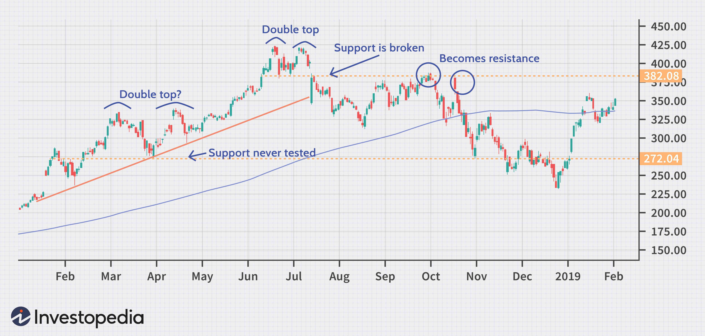

Trading patterns are fundamental components in technical analysis, providing insights into potential market trends and reversals. Among these, the double top pattern stands out as one of the most recognized formations, serving as a crucial indicator for traders anticipating market shifts. This pattern is typically characterized as a bearish reversal formation, signifying a potential transition from an uptrend to a downtrend. The double top pattern forms when a security's price reaches a peak, retraces slightly, and then rebounds to the same level as the first peak before declining again, thus resembling an "M" shape on the chart. The confirmation of this pattern occurs when the price falls below the support level, often referred to as the neckline.

In recent years, algorithmic trading has increasingly capitalized on the double top pattern by automating its detection, thereby enhancing trading precision and response time. Through the use of computational techniques, these automated systems continuously monitor real-time price movements, enabling swift identification of the characteristic peaks and subsequent price break below the neckline. Alongside detecting these formations, algorithms can corroborate signals with other technical indicators, refining the reliability of trading decisions.



This article delves into the complexities of the double top pattern, examining its pivotal role in technical analysis. We will discuss its structure, identification methods, and how it can be harnessed within algorithmic trading strategies to optimize trading outcomes. Readers will be equipped with the knowledge to identify and trade this pattern effectively, as well as learn how to combine it with other indicators to enhance predictive accuracy and mitigate risks associated with market volatility.

## Table of Contents

## What is a Double Top Pattern?

A double top pattern is a widely recognized bearish reversal chart pattern used in technical analysis to identify potential shifts from an uptrend to a downtrend. This pattern typically manifests after a strong price advance, suggesting that the upward momentum is waning and a market reversal may be imminent.

The double top pattern comprises two distinct peaks that occur at approximately the same price level. These peaks are interspersed by a moderate decline, creating a shape that resembles the letter "M." The peaks represent points of resistance that the price fails to breach, indicating a lack of upward strength.

The formation of a double top pattern can be broken down into several key stages:

1. **First Peak**: This occurs as the asset experiences a new high in an upward trend, driven by strong bullish sentiment.

2. **Decline**: After reaching the first peak, the price declines due to selling pressure or profit-taking. However, the decline is generally moderate and followed by a subsequent rally.

3. **Second Peak**: The price rallies again, reaching a level similar to the first peak. This second peak is critical as it confirms the resistance level established by the first peak. The inability to surpass the first peak indicates weakening buying interest.

4. **Neckline**: The level from which the price declined between the two peaks is known as the neckline or support level. This line serves as a critical confirmation point for the pattern.

5. **Confirmation and Breakdown**: A double top pattern is confirmed when the price falls below the neckline, signaling a bearish breakout. This breakdown suggests that sellers have gained control, and a downtrend is likely to ensue.

The double top pattern is valuable to traders and analysts as it provides a clear signal of potential market reversal and indicates opportune moments to [exit](/wiki/exit-strategy) long positions or consider entering short positions. Despite its utility, it is essential for traders to use additional technical indicators to validate the pattern's efficacy, as price action can sometimes lead to false signals.

## Identifying Double Top Patterns in Algo Trading

Algorithmic trading employs sophisticated computational methods to efficiently identify double top patterns, a process pivotal for traders seeking to automate and refine their technical analysis strategies. By continuously monitoring real-time price movements, these systems are capable of pinpointing peaks and troughs with remarkable precision, significantly reducing the likelihood of human error.

In practice, the identification of a double top pattern via [algorithmic trading](/wiki/algorithmic-trading) involves several key steps. Initially, real-time data is scanned for price levels that form two consecutive peaks. These peaks must be separated by a moderate decline, creating the characteristic "M" shape of a double top. The algorithm tracks these price fluctuations continuously, employing mathematical models to measure the relative heights of peaks and the depth of the intervening trough, ensuring they meet preset criteria.

For confirmation of a double top pattern, the price must traverse below a critical support level known as the neckline. This is the horizontal line connecting the base of the troughs between the peaks. Crossing this neckline is indicative of a bearish reversal, a signal that algorithmic systems can swiftly act upon. The precision of computational approaches allows for immediate detection and reaction, facilitating timely execution of trades.

To enhance the verification process, algorithms frequently incorporate additional technical indicators, such as [volume](/wiki/volume-trading-strategy) analysis. Volume typically increases as the price approaches the neckline, reinforcing the authenticity of the pattern. By integrating these indicators, algorithms can evaluate the robustness of the double top signal, filtering out false positives and enhancing predictive accuracy.

Moreover, advanced [machine learning](/wiki/machine-learning) algorithms may be trained using historical data to recognize double top patterns more intuitively. These algorithms adapt to evolving market conditions, learning to identify subtle variations in pattern formation that can indicate potential market reversals. This adaptability is crucial for maintaining trading efficacy in dynamic market environments.

Overall, the use of algorithmic trading to identify double top patterns exemplifies the fusion of traditional technical analysis with modern computational technology, streamlining the trading process and enhancing decision-making accuracy.

## Trading Strategies Using Double Top Patterns

Traders utilize double top patterns to implement short-selling strategies due to the bearish signals these formations typically present. The double top's structure, with its two peaks at similar price levels, suggests a weakening in upward [momentum](/wiki/momentum), prompting traders to anticipate a downtrend. A common approach involves placing sell orders when the price breaches the support level, often referred to as the neckline, following the second peak. This breach confirms the double top pattern and signals a potential downward movement.

Another tactic involves executing trades during a retest of the neckline. After the price initially breaks below the neckline, it may temporarily rise back to test this level, providing a secondary opportunity to enter a short position if the price fails to hold above the neckline.

Algorithmic trading systems can automate these strategies, enhancing execution speed and precision. Automated systems constantly monitor price movements and execute trades as soon as identified conditions are met, significantly reducing the reaction time compared to manual trading. They also incorporate risk management techniques, utilizing stop-loss orders to limit potential losses when the market moves contrary to the anticipated direction.

Incorporating algorithms, the process can be as follows in Python pseudocode:

```python
def detect_double_top(prices):
    # Assumes 'prices' is a list or array of historical price data
    peaks = find_peaks(prices)
    if len(peaks) >= 2 and prices[peaks[-2]] == prices[peaks[-1]]:
        neckline = min(prices[peaks[-1]:])
        return neckline
    return None

def execute_trade(current_price, neckline):
    if current_price < neckline:
        place_short_order()
    elif current_price >= neckline:
        apply_stop_loss()

def place_short_order():
    # Implementation of short order placement
    print("Short order placed")

def apply_stop_loss():
    # Implementation of stop-loss
    print("Stop-loss applied")

# Example usage
prices = [100, 105, 110, 100, 95, 110, 100, 90]
neckline = detect_double_top(prices)
if neckline is not None:
    current_price = get_current_market_price()
    execute_trade(current_price, neckline)
```

This algorithm demonstrates the identification of a double top pattern through peak detection, followed by automatic trade execution upon neckline breach or retest, while concurrently managing risk via stop-loss thresholds. Integrating such systems streamlines trading operations and elevates response accuracy, essential for capitalizing on short-selling opportunities presented by double top patterns.

## Benefits and Limitations of Trading Double Tops

Double top patterns are valuable tools in technical analysis, primarily due to their ability to provide clear entry and exit signals. These patterns typically indicate a bearish reversal, thereby signaling traders to prepare for a potential market downturn. The formation of two consecutive peaks near the same price level, with an intervening trough, provides an easily identifiable pattern that traders consider reliable for forecasting price movements. This inherent predictability is the primary benefit, allowing traders to execute short-selling strategies effectively as the market shifts direction.

Despite their appeal, trading double top patterns is not without limitations. One of the most significant challenges is the occurrence of false breakouts, where the price initially suggests a reversal but fails to maintain the downward trajectory and instead resumes the prior uptrend. Such false signals can lead to premature exits or unsuccessful trades. Furthermore, market [volatility](/wiki/volatility-trading-strategies) can exacerbate the difficulty in confirming a double top pattern, as rapid and unpredictable price changes may obscure the pattern’s formation or validity.

To enhance the reliability of double top patterns, traders can employ additional technical indicators. Indicators such as volume analysis, Moving Averages, the Relative Strength Index (RSI), or the Moving Average Convergence Divergence (MACD) are often used to verify the strength of a pattern. For example, a decrease in volume at each peak of the double top can confirm weakening buying pressure, supporting the bearish signal. By using these complementary tools, traders can mitigate the risks associated with false breakouts and better manage their trading decisions under volatile market conditions.

Incorporating these additional measures typically involves a more comprehensive analysis, ensuring that decision-making is not solely reliant on the double top pattern. This multi-indicator approach helps solidify the predictive capability of trading strategies, offering a more robust mechanism for navigating complex market environments.

## Integrating Double Tops with Other Indicators

Integrating the double top pattern with other technical indicators like Moving Averages (MA), Relative Strength Index (RSI), and Moving Average Convergence Divergence (MACD) can significantly enhance the predictive accuracy of trading strategies. These indicators serve as supplementary tools that help confirm the bearish signals typically implied by the double top pattern and reduce the likelihood of false signals.

**Moving Averages**: This indicator smoothens price data to identify trends over specific periods. When integrated with a double top pattern, traders often look for a downtrend confirmation when the price crosses below a moving average (e.g., the 50-day MA). For instance, if a double top forms and the price subsequently breaks below the MA, it can affirm the potential for a continued downtrend.

**Relative Strength Index (RSI)**: As an oscillator, RSI quantifies the velocity and change of price movements. It ranges from 0 to 100, with levels above 70 indicating overbought conditions and below 30 suggesting oversold conditions. A double top pattern followed by an RSI that drops below the overbought threshold can corroborate a bearish reversal. This pattern can also be used to detect divergences when the price forms a double top, but the RSI shows decreasing peaks, reinforcing the bearish sentiment.

**MACD**: This indicator consists of the MACD line, the signal line, and the histogram, which highlights the difference between the MACD and signal lines. A bearish crossover, where the MACD line crosses below the signal line in the presence of a double top pattern, can validate the anticipated market reversal.

Automated trading systems can be programmed to seamlessly integrate these indicators with the double top pattern, offering a robust trading strategy. Through algorithms, traders can automate the detection of these patterns and confirm them using these technical indicators. Here is an example of how a Python-based trading algorithm might incorporate these tools:

```python
import numpy as np
import talib

def identify_double_top(prices, period=25):
    peaks = talib.ARGMAX(prices, timeperiod=period)
    if len(peaks) >= 2 and peaks[-1] - peaks[-2] <= period:
        return True
    return False

def calculate_indicators(prices):
    ma = talib.SMA(prices, timeperiod=50)
    rsi = talib.RSI(prices, timeperiod=14)
    macd, macd_signal, _ = talib.MACD(prices, fastperiod=12, slowperiod=26, signalperiod=9)
    return ma, rsi, macd, macd_signal

def trading_signal(prices):
    if identify_double_top(prices):
        ma, rsi, macd, macd_signal = calculate_indicators(prices)
        if prices[-1] < ma[-1] and rsi[-1] > 70 and macd[-1] < macd_signal[-1]:
            return "Bearish Signal"
    return "Hold"

# Example usage:
prices = np.random.randn(100)  # Example price data
result = trading_signal(prices)
print(result)
```

By integrating these indicators programmatically, traders can ensure quick execution and increased confidence in their analysis, thereby strengthening their overall trading strategy.

## Case Studies and Backtest Results

Backtesting has emerged as an indispensable method in evaluating the historical performance of the double top pattern, providing traders with vital insights into the pattern's effectiveness and reliability. By simulating trading based on past data, [backtesting](/wiki/backtesting) allows traders to assess the potential success and limitations of employing double top formations in various market conditions.

Analysis of historical data involves identifying instances where the double top pattern appeared and measuring the outcome of trades based on these signals. This provides a quantitative assessment of the pattern's success rate, typically expressed as the percentage of profitable trades over a given period. For instance, if a backtest across S&P 500 stocks over a decade reveals that trades based on the double top pattern were profitable 65% of the time, this gives traders a statistical foundation to consider in their strategy development.

Furthermore, backtesting assists in refining strategies by presenting failure rates alongside success rates, allowing traders to understand conditions under which the double top may be less effective. For example, if a pattern shows a tendency to fail during periods of low market volatility, traders can adapt their strategies accordingly by integrating additional indicators to validate signals in such environments.

Case studies of the double top pattern in algorithmic trading elucidate its practical applications and potential enhancements through technology. Algorithmic systems can be backtested using scripts in programming languages like Python. These scripts can automate the identification of the double top pattern, trigger trades at pattern confirmation points, and assess the outcomes.

Here's a simple Python example demonstrating how a backtesting framework for double top patterns might be structured using libraries like `pandas` and `numpy`:

```python
import pandas as pd
import numpy as np

def identify_double_top(data):
    # Logic to identify double top pattern
    peaks = []
    for i in range(1, len(data)-1):
        if data[i] > data[i-1] and data[i] > data[i+1]:
            peaks.append(i)
    return peaks

def backtest_double_top(data, peaks):
    results = []
    for peak in peaks:
        try:
            neckline = min(data[peak:peak+5]) # Simple neckline estimation
            # Check if price drops below neckline for a successful double top
            if data[peak+5] < neckline:
                results.append((peak, True))
            else:
                results.append((peak, False))
        except IndexError:
            continue

    success_rate = sum([1 for _, success in results if success]) / len(results)
    return success_rate

# Sample data (replace with actual price data)
price_data = pd.Series([98, 102, 105, 103, 99, 97, 95, 101, 104, 102, 98, 97])

peaks = identify_double_top(price_data)
success_rate = backtest_double_top(price_data, peaks)
print(f"Success rate of double top pattern: {success_rate:.2%}")
```

In this example, the script identifies potential double tops based on simple peak detection and estimates a neckline by finding the lowest price after the peak. The backtest function checks if the price subsequently breaks the neckline, recording a success if it does. Success rates calculated through such scripts offer empirical evidence to guide strategy adjustments, showcasing the pattern's integration into algorithmic frameworks.

Through rigorous backtesting and the study of case studies, traders can enhance their understanding of the double top pattern's role in technical analysis, leading to the development of more robust trading strategies that leverage algorithmic capabilities.

## Conclusion

The double top pattern remains a vital tool in technical analysis for anticipating market reversals. This chart pattern is characterized by two peaks in price at roughly the same level, indicating potential bearish sentiment. When incorporated into algorithmic trading strategies, the double top pattern enhances efficiency and precision by allowing these algorithms to detect and act on market shifts quickly and accurately. Automated systems benefit from the clearly defined signals provided by double tops, such as the break of the neckline, enabling swift response to potential downtrend initiations.

However, while the double top pattern is an essential component of a trader's analytical toolkit, it is not infallible. Traders must remain aware of its limitations, such as the risk of false breakouts and the influence of market volatility, which can lead to misleading signals. These challenges necessitate the use of additional technical indicators to confirm pattern validity and strengthen the reliability of trading decisions. By integrating tools such as Moving Averages, Relative Strength Index (RSI), and Moving Average Convergence Divergence (MACD), traders can improve the predictive accuracy of the double top indication.

In conclusion, the double top pattern is highly valuable for anticipating market reversals, and its integration into algorithmic strategies maximizes its effectiveness. However, a prudent approach involves complementing it with other analytical measures to manage inherent risks and enhance overall trading outcomes.

## References & Further Reading

[1]: Kirkpatrick, C. D., & Dahlquist, J. R. (2010). ["Technical Analysis: The Complete Resource for Financial Market Technicians"](https://www.amazon.com/Technical-Analysis-Complete-Financial-Technicians/dp/0137059442). FT Press.

[2]: Pring, M. J. (2002). ["Technical Analysis Explained: The Successful Investor’s Guide to Spotting Investment Trends and Turning Points"](https://www.amazon.com/Technical-Analysis-Explained-Fifth-Successful/dp/0071825177). McGraw-Hill.

[3]: Murphy, J. J. (1999). ["Technical Analysis of the Financial Markets: A Comprehensive Guide to Trading Methods and Applications"](https://archive.org/details/technicalanalysi0000murp). New York Institute of Finance.

[4]: Lopez de Prado, M. (2018). ["Advances in Financial Machine Learning"](https://www.amazon.com/Advances-Financial-Machine-Learning-Marcos/dp/1119482089). Wiley.

[5]: Chan, E. (2008). ["Quantitative Trading: How to Build Your Own Algorithmic Trading Business"](https://github.com/ftvision/quant_trading_echan_book). Wiley.